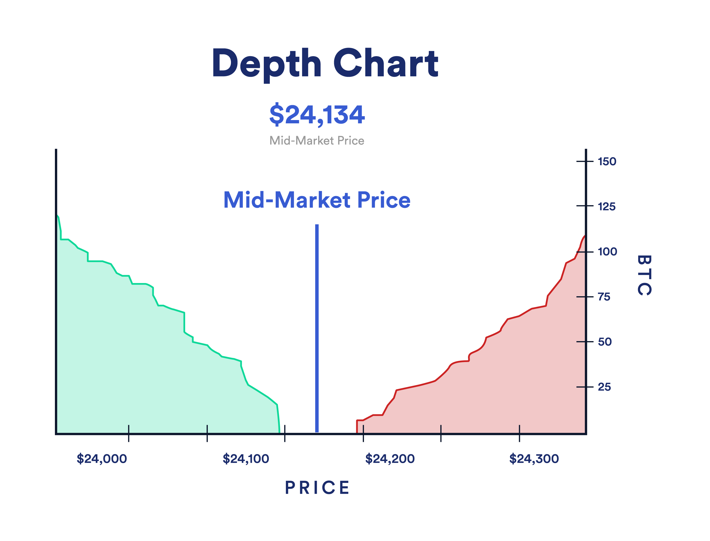

Market depth estimation is a crucial aspect of algorithmic trading that provides valuable insights into the supply and demand dynamics of financial assets. It involves the analysis of the order book to understand the liquidity and potential price movements of assets in real time. By examining the number of buy and sell orders at various price levels, traders can gauge the depth of the market, which allows them to anticipate market trends and gain a strategic advantage, especially in high-frequency trading environments.

Understanding market depth is essential for traders seeking to predict price movements and optimize their trading strategies. By analyzing market depth, traders can identify potential price levels where significant liquidity exists, indicating possible resistance or support zones. This information is critical for informed decision-making processes, enabling traders to execute trades with greater precision and reduced risk.

The significance of market depth estimation extends beyond individual trading strategies. It provides a comprehensive view of the market's interest in an asset, highlighting liquidity and volatility. This understanding is indispensable in algorithmic trading, where rapid and informed decisions can lead to optimized outcomes.

This article explores the complexities of market depth estimation, highlighting its importance in algorithmic trading and the analytical tools used to assess market conditions effectively. Readers will gain a thorough understanding of how market depth can inform trading strategies and aid in making well-informed decisions in various financial markets.

## Table of Contents

## Understanding Market Depth

Market depth is a crucial concept in financial markets, encompassing the number of buy and sell orders at various price levels for a specific asset. It is fundamentally about analyzing the order book, which is a detailed list of all pending buy and sell orders for an asset. This analysis provides insights into the available liquidity and potential price movements.

The order book contains key components necessary for market depth analysis. Bid prices represent the highest price that buyers are willing to pay, while ask prices reflect the lowest price that sellers are willing to accept. Each price level in the order book is associated with a specific quantity, indicating the volume of the asset that buyers or sellers are willing to trade at that price.

Understanding these components allows traders to gauge market interest and [liquidity](/wiki/liquidity-risk-premium) in real-time. A deeper market, characterized by a large [volume](/wiki/volume-trading-strategy) of orders at various price levels, typically indicates greater liquidity, facilitating smoother transactions with minimal price disruptions. Conversely, a shallower market may suggest potential [volatility](/wiki/volatility-trading-strategies) and price swings due to a lack of sufficient buy or sell orders.

Through this comprehensive [order book](/wiki/order-book-trading-strategies) analysis, traders can observe the trading interest for an asset, adjusting their strategies accordingly to optimize their outcomes in both stable and volatile market conditions.

## Components of Market Depth

The order book is a fundamental aspect of market depth analysis, offering a detailed view of all open buy and sell orders for a given asset organized by price levels. This allows traders to assess the supply and demand dynamics of the market in real-time. The bid-ask spread, which is the difference between the highest price a buyer is willing to pay (bid) and the lowest price a seller is willing to accept (ask), serves as a critical indicator of market liquidity. A narrower bid-ask spread generally indicates higher liquidity, suggesting that the asset can be traded more efficiently and with less price impact.

Market depth is often categorized into two levels. Level I market data provides a snapshot of the best bid and ask prices available, offering a basic view of the current market condition. In contrast, Level II market data provides a more comprehensive view by displaying multiple levels of outstanding bids and asks, revealing deeper layers of market activity that can highlight potential price movements.

Aggregated orders at various price levels form a crucial component of market depth analysis, enabling traders to quickly identify support and resistance zones. These zones, represented by clusters of large buy or sell orders, can indicate potential points where the market might halt or reverse its current trend. By examining these aggregated levels, traders can better strategize their entry and [exit](/wiki/exit-strategy) points, enhancing their ability to make informed trading decisions.

## Significance of Market Depth in Algorithmic Trading

Market depth is a vital element in [algorithmic trading](/wiki/algorithmic-trading), providing traders with critical insights into an asset's liquidity and the ease with which it can be traded without causing significant price disruptions. This is fundamentally important as liquidity directly influences the execution of trade orders and the potential slippage involved.

By analyzing market depth, traders can identify large volumes of orders at specific price levels, which often indicate potential support or resistance zones. These zones can serve as strategic points for entering or exiting trades. Recognizing such patterns helps traders make informed decisions based on the probable future movement of asset prices, increasing the efficiency and effectiveness of their trading strategies.

Algorithmic trading strategies, including [scalping](/wiki/gamma-scalping) and [arbitrage](/wiki/arbitrage), are highly dependent on real-time market depth data. Scalping involves executing numerous trades over short periods to capitalize on small price changes. For this, understanding the immediate state of the order book is essential. Similarly, arbitrage strategies, which exploit price differences across different markets or instruments, require up-to-date market depth information to ensure that trades can be executed at favorable price points quickly.

Market depth data also plays a crucial role in detecting and mitigating the risks associated with fraudulent market activities such as spoofing—a practice where traders place fake orders to manipulate the market and then cancel them before they are executed. By closely monitoring changes in market depth, traders can spot irregularities or sudden shifts in order volumes that may suggest such deceptive practices.

In summary, market depth analysis ensures that traders can assess liquidity, predict market movements through support and resistance zones, and implement strategies with precision by leveraging real-time data. The ability to detect potential market manipulation further safeguards traders against executing misguided trades, thus enhancing their potential for profitability.

## Tools for Market Depth Analysis

Several trading platforms and data sources play vital roles in facilitating market depth analysis for traders aiming to optimize their strategies and enhance decision-making. Prominent among these platforms are MetaTrader, NinjaTrader, and Thinkorswim, each offering a suite of tools that cater to varying levels of expertise and specific trading needs.

MetaTrader, well-known for its robust trading environment, provides users with a detailed view of the market via its Depth of Market (DOM) feature. This feature enables traders to assess liquidity at various price levels, which is crucial for executing high-frequency trades efficiently. MetaTrader supports automated trading strategies through its built-in scripting language, MQL, allowing for the seamless integration of custom indicators and trade algorithms that leverage market depth information.

NinjaTrader focuses on delivering advanced charting capabilities and a comprehensive range of analytical tools, including real-time market depth visualization. Its platform encourages the use of custom scripts through NinjaScript, a C# based framework. This flexibility enables traders to develop and backtest sophisticated strategies that are responsive to changes in market depth, thus allowing for targeted executions in volatile conditions.

Thinkorswim, renowned for its user-friendly interface, offers an advanced trading experience with detailed visualization of bid-ask spreads and the order book. By providing a clear depiction of market depth, traders can more accurately identify potential entry and exit points. This capability is further complemented by Thinkorswim's customizable trading strategies and its integration with real-time news and analysis.

In addition to platforms, market data providers like Bloomberg Terminal and Reuters Eikon are indispensable to professional traders seeking exhaustive insights into market depth. These platforms aggregate vast amounts of financial data, offering granular views of order flow and liquidity across multiple asset classes. Their real-time updates and historical data analysis tools enable traders to implement informed trading decisions and refine strategies to adapt to market changes swiftly.

Overall, these tools and platforms are crucial in equipping traders with the necessary data and analysis capabilities. By leveraging such technology, traders can navigate complex market environments, making informed decisions that optimize trading outcomes.

## Challenges in Market Depth Analysis

Market depth analysis faces several significant challenges, primarily originating from market manipulation and technical constraints that can distort the accuracy of insights. One of the key issues is market manipulation strategies like quote stuffing and spoofing. Quote stuffing involves rapidly placing and then canceling large numbers of orders to create a false impression of supply and demand, thereby misleading other traders. Spoofing, on the other hand, entails placing deceptive orders with no intention of execution to manipulate prices. These tactics can skew market signals and impede the robustness of depth analysis.

Another critical challenge pertains to latency in data feeds and order execution. In fast-paced markets, even millisecond delays can lead to outdated information, resulting in suboptimal trading decisions. Algorithms that lack real-time data responsiveness may act on stale information, leading to flawed trades.

Dynamic market conditions further compound the difficulties inherent in market depth analysis. The ability to rapidly adapt to these changes is essential for maintaining accuracy in trade execution and predicting market movements. As a result, algorithms used in this context must be sophisticated enough to accommodate real-time data fluctuations effectively.

Ensuring the quality, accuracy, and timeliness of data remains a foundational requirement for market depth analysis. Data issues, such as inaccuracies or delays, can erode trust in the analysis outcomes and potentially result in financial losses. To mitigate these challenges, traders utilize high-quality data feeds and employ robust error-checking algorithms to ensure data integrity.

Overall, while market depth analysis offers significant advantages in trading strategy formulation, overcoming these challenges is crucial for leveraging its full potential in various financial markets.

## Applications of Market Depth Across Markets

Market depth is a crucial analytical tool across various financial markets, providing insights into the underlying supply and demand dynamics. In the equity markets, it helps traders understand the liquidity and price level interest for stocks. By analyzing the order book, traders can identify significant buy and sell orders, allowing them to gauge potential support or resistance levels. This understanding aids in executing trades with minimal market impact, thereby optimizing entry and exit strategies.

In the [forex](/wiki/forex-system) market, market depth data is pivotal for assessing the liquidity of currency pairs. By examining the volume and distribution of buy and sell orders, forex traders can anticipate price movements and volatility. This insight is particularly valuable given the forex market's decentralized nature, where liquidity can vary significantly across time zones and trading sessions.

For futures and options traders, market depth facilitates strategic decisions regarding hedging and speculative positions. Depth analysis helps in identifying key price levels where large transactions are likely, thus informing traders about potential turning points or continuation patterns in the market. This capability is essential for managing the leverage and risk inherent in derivatives trading.

Cryptocurrency markets, characterized by their volatility and rapid price changes, benefit significantly from market depth analysis. Traders can use this data to comprehend the relatively thin order [books](/wiki/algo-trading-books) typical of many cryptocurrencies, which can lead to substantial price swings. By analyzing depth charts, traders can pinpoint liquidity voids and potential areas for price reversals, essential for both short-term trading and long-term strategy formulation.

In all these markets, mastering market depth analysis can provide traders with a competitive edge, enabling them to make informed decisions based on real-time supply and demand dynamics.

## Conclusion

Market depth analysis is a fundamental technique in algorithmic trading, indispensable for making informed decisions and optimizing trading outcomes. The complexities inherent in modern financial markets necessitate robust tools and methodologies to accurately understand the real-time dynamics of supply and demand. Market depth provides this crucial insight, despite the inherent challenges such as market manipulation and data latency. Manipulative tactics like quote stuffing and spoofing can distort market signals, but advancements in trading technologies are steadily improving the detection and mitigation of these issues. As technology evolves, it continues to enhance the precision and reliability of market depth data, thus maintaining its critical role in trading strategies.

Traders proficient in market depth analysis gain a significant competitive advantage across various financial markets, including equities, forex, futures, and cryptocurrencies. Their ability to interpret deep market signals enables them to anticipate price movements more accurately, respond swiftly to market changes, and strategically place trades to maximize profitability. The versatility of market depth analysis across different asset classes further highlights its indispensable value, especially in highly volatile markets like cryptocurrencies, where large order volumes can rapidly shift market conditions.

The ever-changing trading landscape points to a future where market depth analysis will be even more integral to achieving consistent profitability. As markets become more sophisticated, and as trading systems evolve to harness big data and [machine learning](/wiki/machine-learning), the depth of market insights will continue to play a pivotal role. This critical analysis tool will not only augment traders' ability to navigate complex markets but will also be essential for developing adaptive algorithms capable of operating effectively in dynamic trading environments. With ongoing advancements, mastering market depth will remain a key differentiator for traders aiming for long-term success.

## References & Further Reading

[1]: Bouchaud, J.-P., Farmer, J. D., & Lillo, F. (2009). ["How Markets Slowly Digest Changes in Supply and Demand"](https://arxiv.org/abs/0809.0822). In Handbook of Financial Markets Dynamics and Evolution.

[2]: "Algorithmic Trading: Winning Strategies and Their Rationale" by Ernest P. Chan [Available on Amazon](https://www.amazon.com/Algorithmic-Trading-Winning-Strategies-Rationale/dp/1118460146)

[3]: Donnet, S., & Talay, D. (2020). ["Numerical Methods for Calculating Market Depth and Simulating Liquidity Crises"](https://searchworks.stanford.edu/view/10220890).

[4]: "Advances in Financial Machine Learning" by Marcos Lopez de Prado [Available on Amazon](https://www.amazon.com/Advances-Financial-Machine-Learning-Marcos/dp/1119482089)

[5]: Cont, R., & Kukanov, A. (2017). ["Optimal order placement in limit order markets"](https://arxiv.org/pdf/1210.1625). Quantitative Finance, 17(3), 371-391.

[6]: "Quantitative Trading: How to Build Your Own Algorithmic Trading Business" by Ernest P. Chan [Available on Amazon](https://www.amazon.com/Quantitative-Trading-Build-Algorithmic-Business/dp/1119800064)

[7]: Harris, L. (2002). ["Trading and Exchanges: Market Microstructure for Practitioners."](https://academic.oup.com/book/52292) Oxford University Press.

[8]: Aldridge, I. (2013). "High-Frequency Trading: A Practical Guide to Algorithmic Strategies and Trading Systems." [Available on Amazon](https://www.amazon.com/High-Frequency-Trading-Practical-Algorithmic-Strategies/dp/1118343506)