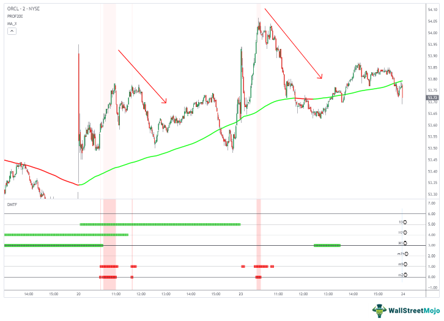

In the modern financial landscape, understanding market depth and algorithmic trading is crucial for traders seeking an edge in the markets. Market depth refers to the market's ability to handle large buy or sell orders without significantly affecting the security's price. It provides a detailed view of the order book, showcasing the volume of buy and sell orders at various price levels. This information is vital for determining market liquidity and potential price movements. 

Algorithmic trading, on the other hand, involves the use of computer algorithms to execute trades at high speeds. These algorithms can process vast amounts of market data in real-time, allowing for the execution of trades based on predefined criteria. By leveraging sophisticated algorithms, traders can capitalize on brief market opportunities that would be impossible to exploit manually.



This article explores the intersection of market depth and algorithmic trading, providing insights into how these tools can enhance trading strategies and outcomes. By integrating market depth analysis with algorithmic trading strategies, traders can improve trade execution, minimize market impact, and ultimately achieve better trading results.

## Table of Contents

## Understanding Market Depth

Market depth refers to the quantity of buy and sell orders available at different price levels for a particular security, serving as an indicator of market liquidity. It reflects the order book structure, where each entry corresponds to a buy or sell order with a specified quantity and price. Traders rely on this information to gauge the potential impact of executing large orders and make informed trading decisions.

This concept is often visualized using a market depth chart, also known as a "depth of market" (DOM) chart. This visual tool displays the aggregate number of buy and sell orders at each price point, providing a snapshot of market supply and demand. The chart typically features two columns, with buy orders on one side and sell orders on the other, aligning the depth of these orders against their respective prices.

Key aspects of market depth include assessing liquidity, understanding bid-ask spreads, and identifying support and resistance levels. Liquidity, in this context, refers to the market's ability to absorb large transactions without causing significant price fluctuations. High liquidity is characterized by a large volume of orders at various price levels, enabling smoother trade execution.

The bid-ask spread is another critical component of market depth. It represents the difference between the highest price a buyer is willing to pay (bid) and the lowest price a seller is willing to accept (ask). A narrow bid-ask spread typically indicates higher [liquidity](/wiki/liquidity-risk-premium) and, hence, a more efficient market. Conversely, a wide spread may suggest low liquidity or heightened [volatility](/wiki/volatility-trading-strategies).

Support and resistance levels are derived from the concentrations of buy and sell orders at specific price levels. A support level is formed when there is a substantial amount of buy orders at a particular price, preventing the price from falling further. Similarly, a resistance level occurs when sell orders cluster at a certain price, inhibiting further price increases. Recognizing these levels helps traders anticipate potential price movements and adjust their strategies accordingly.

In conclusion, understanding market depth equips traders with valuable insights into market liquidity, price dynamics, and potential trading opportunities. By analyzing market depth data, traders can better manage the execution of large trades, minimize slippage, and improve their overall trading performance.

## Role of Market Depth in Trading

Market depth plays a crucial role in trading, as it provides insights into the liquidity and order flow of a security, allowing traders to make more informed decisions. By examining the [order book](/wiki/order-book-trading-strategies), which lists the buy and sell orders at various price levels, traders can predict potential price movements and implement strategies that capitalize on these insights.

A strong market depth indicates that a security can handle large transactions with minimal price impact, thereby enhancing trading efficiency. This is particularly advantageous for institutional traders or those executing high-[volume](/wiki/volume-trading-strategy) trades. When market depth is robust, the likelihood of slippage—where the executed price deviates from the expected price—is reduced, thereby promoting better trading outcomes.

Traders also use market depth data to identify imbalances between supply and demand. For instance, a significant concentration of buy orders at a certain price level might suggest a potential support level, where traders anticipate the price to rise. Conversely, a large number of sell orders can indicate resistance. By understanding these dynamics, traders can time their entries and exits more effectively.

Additionally, analyzing market depth enables traders to recognize potential market manipulation tactics, such as spoofing—where large orders are placed with the intent to cancel them before execution, creating a false impression of demand or supply. By closely monitoring the changes and patterns within the order book, traders can discern these deceptive strategies and adjust their trading decisions accordingly.

In conclusion, leveraging market depth in trading offers substantial benefits, allowing traders to operate with a more comprehensive view of market conditions. By understanding the flow of orders and potential manipulation signals, traders can enhance their tactical approaches and achieve improved results in the financial markets.

 to Algorithmic Trading

Algorithmic trading, commonly referred to as 'algo trading,' is a method of executing trades using pre-programmed algorithms that perform tasks with high speed and volume. This technology-driven approach to trading analyzes real-time market data to identify trading opportunities based on pre-set criteria, enabling rapid execution often unattainable by manual trading.

At its core, [algorithmic trading](/wiki/algorithmic-trading) uses mathematical models and complex formulas to make decisions. These algorithms can evaluate numerous variables simultaneously, such as market trends, order volume, and pricing, which allows them to execute trades based on precise calculations. Algorithms ensure that the trades are executed at the most opportune moments, thereby increasing the potential for profit while minimizing human error and emotional bias.

One of the primary advantages of algo trading is its ability to capitalize on micro-movements in the market by operating at speeds beyond human capability. This speed is pivotal in strategies like high-frequency trading, where algorithms execute a large number of orders at incredibly fast rates to capture small price discrepancies.

Common strategies employed in algorithmic trading include:

1. **Trend Following**: This strategy is based on technical analysis to follow market trends without predicting any price levels. Algorithms identify and exploit upward or downward trends by executing trades based on moving averages, channel breakouts, and similar indicators.

2. **Mean Reversion**: This strategy operates on the principle that asset prices and volatility tend to revert to their historical means over time. Algorithms monitor statistical averages to buy or sell stocks anticipating that prices will return to the average or median value. 

3. **Statistical Arbitrage**: Algorithms seek to exploit price inefficiencies between securities. By analyzing statistical correlations and covariances between asset prices, algorithms can execute trades to profit from expected price corrections.

These strategies exemplify how algo trading can leverage computational power to optimize trading outcomes. The use of historical and real-time data underscores the need for robust data analysis techniques, often incorporating [machine learning](/wiki/machine-learning) models to enhance prediction accuracy and strategic execution.

Algorithmic trading platforms provide traders with access to these strategies through customizable algorithms, which can be backtested against historical data to ensure efficacy before deploying them in live markets. Such platforms allow traders to tailor their strategies to their unique market outlook, risk appetite, and investment goals.

## Integrating Market Depth with Algorithmic Trading

Combining market depth analysis with algorithmic trading stands as a robust approach to enhancing trading efficiency and outcomes. Market depth offers detailed insights into the order book, providing information on the quantity of buy and sell orders across different price levels. This data is integral in informing algorithmic trading strategies, which rely on automated, rules-based execution.

Algorithmic trading systems can be programmed to incorporate market depth data, thereby optimizing trade execution and minimizing slippage. Slippage refers to the difference between the expected price of a trade and the actual price at which the trade is executed. By using depth-of-market data, algorithms can anticipate order book movements and position trades advantageously, ensuring they execute at or near the desired price level.

For example, an algorithm may use a simple Python script to automate trades based on market depth data. Below is a basic concept illustrating how such an algorithm might function:

```python
def execute_trade(order_book, desired_price, trade_volume):
    buy_orders = order_book['buy']
    sell_orders = order_book['sell']

    if sell_orders[0]['price'] <= desired_price and sell_orders[0]['volume'] >= trade_volume:
        # Execute buy trade
        execute_buy(sell_orders[0]['price'], trade_volume)
    elif buy_orders[0]['price'] >= desired_price and buy_orders[0]['volume'] >= trade_volume:
        # Execute sell trade
        execute_sell(buy_orders[0]['price'], trade_volume)

def execute_buy(price, volume):
    print(f"Executing buy order at {price} for {volume} units.")

def execute_sell(price, volume):
    print(f"Executing sell order at {price} for {volume} units.")
```

Key benefits of integrating market depth with algorithmic trading include lower transaction costs and emotion-free trading. Automated systems conduct trades rapidly and without the psychological biases that can affect human traders, leading to more rational and consistent trading decisions. Furthermore, by basing decisions on quantitative data, these algorithms achieve improved precision, as they can process vast amounts of market information at speeds unattainable by human traders.

Overall, integrating market depth information into algorithmic trading systems allows for more informed, efficient, and effective market interactions, positioning traders to capitalize on even minor fluctuations in the market.

## Tools and Platforms for Algo Trading with Market Depth

Several platforms provide traders with integrated solutions for analyzing market depth and executing algorithmic trades efficiently. MetaTrader, TradeStation, and [Interactive Brokers](/wiki/interactive-brokers-api) are among the most popular platforms, each offering unique advantages and tools tailored to support sophisticated trading strategies.

MetaTrader is renowned for its wide array of analytical tools and user-friendly interface, making it a popular choice for both novice and experienced traders. It offers robust features such as customizable charts, technical indicators, and automated trading through Expert Advisors (EAs). MetaTrader supports real-time data feeds, essential for market depth analysis, and provides extensive [backtesting](/wiki/backtesting) capabilities to evaluate trading strategies using historical data. Additionally, the MQL4/MQL5 programming languages allow for the development of custom indicators and trading robots, enabling a high degree of personalization.

TradeStation is another powerful platform known for its comprehensive suite of trading tools. It offers deep market analysis with advanced charting capabilities, real-time streaming data, and integrated market depth views. The platform's EasyLanguage scripting language allows traders to create their own trading algorithms or modify existing ones to better suit their strategies. TradeStation is highly regarded for its execution speed and data accuracy, crucial elements for success in algorithmic trading. Furthermore, it provides a solid framework for backtesting and optimizing trading strategies before live deployment.

Interactive Brokers stands out with its extensive range of trading instruments and rich functionality, appealing particularly to professional traders and institutions. It offers powerful market depth tools and APIs (Application Programming Interfaces) that facilitate the development of bespoke trading applications. The Trader Workstation (TWS) platform provides comprehensive market data, news, and research to aid informed decision-making. Interactive Brokers’ API supports multiple programming languages including Python, Java, and C++, offering flexibility to integrate complex trading models. It emphasizes reliability and sophistication, qualities highly valued by algorithmic traders.

When selecting a platform for algorithmic trading with market depth, traders should evaluate several key features. Execution speed is critical, as delays can lead to missed opportunities or unfavorable trade execution. Data accuracy is equally important, ensuring that trading decisions are based on precise and current information. User-friendliness contributes to more efficient workflow management and can reduce the learning curve associated with advanced trading platforms.

To conclude, these platforms provide essential tools and capabilities that enable traders to harness market depth and algorithmic trading effectively. By considering factors such as execution speed, data accuracy, and user-friendliness, traders can select the platform best suited to their specific needs, ultimately enhancing their trading performance and outcomes.

## Case Study: Successful Application of Market Depth in Algo Trading

A trading firm, named Quantum Traders, implemented market depth in their algorithmic trading strategies to significantly enhance their financial returns. By effectively analyzing order book data, Quantum Traders was able to optimize trade entries and exits, which led to improved performance metrics.

The firm’s approach involved a comprehensive analysis of the order book, which contains detailed information about outstanding buy and sell orders at various price levels for a particular security. By closely monitoring this data, Quantum Traders could identify the liquidity hotspots and adjust their strategies accordingly. The main objective was to execute trades when the market conditions were most favorable, thereby minimizing the market impact and slippage.

To achieve this, Quantum Traders adopted an algorithm that integrated market depth data. The algorithm was designed to identify the optimal execution points by assessing the buy and sell pressure at different market levels. This provided insights into potential price reversals or continuations. The algorithm's logic was based on the understanding that a significant imbalance between buy and sell orders could lead to price movements. For instance, if the order book showed a higher volume of buy orders at a certain level compared to sell orders, it could signal a potential upward price movement.

```python
def evaluate_order_book(buy_orders, sell_orders):
    """
    Function to evaluate order book data.
    :param buy_orders: List of buy order volumes at different price levels.
    :param sell_orders: List of sell order volumes at different price levels.
    :return: Signal for trade action based on order book analysis.
    """
    buy_pressure = sum(buy_orders)
    sell_pressure = sum(sell_orders)

    if buy_pressure > sell_pressure:
        return "Buy Signal"
    elif sell_pressure > buy_pressure:
        return "Sell Signal"
    else:
        return "Hold Signal"
```

Quantum Traders utilized this function as a component of their strategy to determine trade actions based on market depth signals. Over time, this approach led to enhanced decision-making capabilities, allowing the firm to capture lucrative trading opportunities while mitigating risks associated with volatile markets.

From this case study, several lessons were learned and best practices established, useful for both institutional and individual traders. First, continuously monitoring and analyzing order book data is crucial for understanding market dynamics and identifying high-probability trades. Second, integrating such insights into algorithmic strategies helps optimize trade execution by taking advantage of prevailing market conditions.

Furthermore, ensuring the robustness and adaptability of trading algorithms to handle various market scenarios can protect against unexpected losses. Lastly, traders should also focus on maintaining a balance between automated systems and human oversight to adapt quickly to unforeseen market changes. These practices, when implemented effectively, can significantly enhance trading performance and competitiveness in the market.

## Challenges and Considerations

Algorithmic trading that incorporates market depth faces several challenges and considerations that traders must address to succeed. One of the primary issues is data latency. As trades are executed at high speeds, any delay in receiving or processing market data can result in missed opportunities or suboptimal trade execution. This requires traders to invest in technology that minimizes latency by optimizing network architecture and employing low-latency data feeds.

Maintaining system reliability is another crucial aspect. Trading platforms need to handle high volumes of data and execute numerous trades simultaneously without failure. System outages can lead to significant financial losses and missed trading opportunities. Therefore, implementing robust infrastructure with redundant systems and continuous monitoring is essential to ensure reliability and minimize downtime.

Regulatory compliance presents another layer of complexity. Algorithmic trading, particularly with market depth data, must adhere to various regulations that govern financial markets. These regulations can cover order transparency, market manipulation, and trade reporting. Traders need to stay informed about evolving regulations and adapt their strategies to ensure compliance, which may involve regular audits and adjustments to trading algorithms.

Risk management is critical in mitigating potential losses due to market volatility. Traders should develop comprehensive risk management strategies that include setting stop-loss orders, diversifying their trading portfolios, and using predictive analytics to anticipate market movements. This enables traders to protect capital and preserve long-term profitability, even in adverse market conditions.

Finally, adapting to evolving market conditions is necessary for sustained success. Markets are dynamic, with conditions that can change rapidly due to economic events, political developments, or technological advancements. Traders must continuously analyze market data, evaluate algorithm performance, and adjust strategies to remain competitive. This often involves machine learning techniques to refine algorithms based on historical data and predicted market shifts.

In conclusion, successfully integrating market depth into algorithmic trading requires addressing challenges like data latency, system reliability, and regulatory compliance, complemented by robust risk management and continuous strategy adaptation.

## Conclusion

Market depth and algorithmic trading stand as formidable resources for modern traders, offering substantial benefits when used in conjunction. By understanding and effectively leveraging these concepts, traders can significantly enhance their trading decisions, leading to improved market outcomes. The detailed visibility provided by market depth allows traders to assess the liquidity at various price points, aiding in the prediction of price movements and the identification of market trends. This insight is invaluable for executing trades with minimal impact, particularly in highly liquid markets.

Algorithmic trading, on the other hand, introduces speed and precision to trading activities, enabling the execution of complex strategies that may involve large volumes and rapid transactions. When algorithms are programmed to incorporate market depth data, traders can optimize their trade execution and reduce slippage. This integration results in lower transaction costs and increases the probability of successful trades by relying on data-driven decisions rather than emotional reactions.

To maximize these advantages, traders are encouraged to incorporate both market depth and algorithmic trading in their strategies. The utilization of platforms that offer comprehensive tools for analyzing market depth and executing automated trades can further enhance trading efficiency. Evaluating platforms based on execution speed, data accuracy, and user-friendliness ensures that traders have reliable resources to support their activities.

In conclusion, traders who effectively combine market depth insights with algorithmic trading strategies are better positioned to navigate the complexities of financial markets and achieve superior trading outcomes. By continuously refining their approaches and selecting the appropriate technological solutions, traders can maintain a competitive edge and capitalize on opportunities in dynamic market environments.

## References & Further Reading

[1]: Antonov, A. & Konikov, M. (2019). ["Modern SABR Analytics: From Theory to Practice."](https://link.springer.com/book/10.1007/978-3-030-10656-0) Springer.

[2]: Nasir, M.A., & Bourouis, H. (2021). ["Algorithmic and High-Frequency Trading: Impact on Market Liquidity and Volatility."](https://www.sciencedirect.com/science/article/pii/S1057521921003185) Springer.

[3]: Aldridge, I. (2010). ["High-Frequency Trading: A Practical Guide to Algorithmic Strategies and Trading Systems."](https://onlinelibrary.wiley.com/doi/pdf/10.1002/9781119203803.fmatter) Wiley.

[4]: Cartea, Á., Jaimungal, S., & Penalva, J. (2015). ["Algorithmic and High-Frequency Trading."](https://assets.cambridge.org/97811070/91146/frontmatter/9781107091146_frontmatter.pdf) Cambridge University Press.

[5]: Hull, J.C. (2017). ["Options, Futures, and Other Derivatives."](https://www.pearson.com/en-us/subject-catalog/p/options-futures-and-other-derivatives/P200000005938/9780136939917) Pearson.