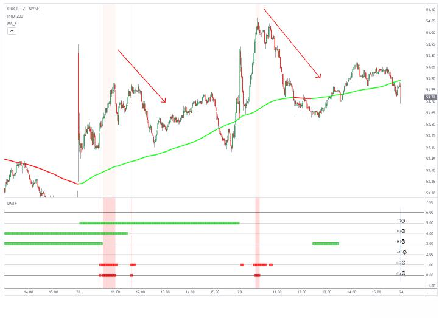
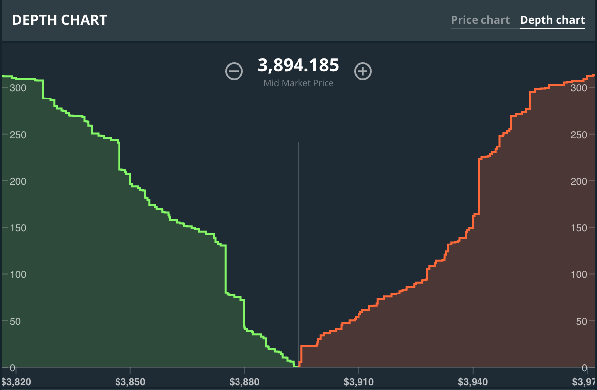
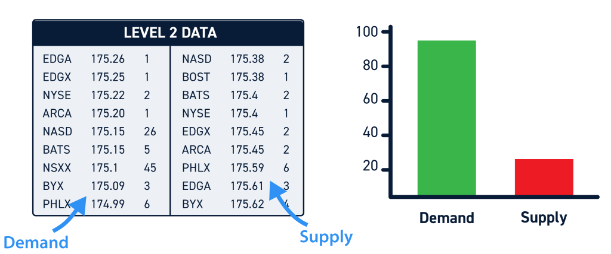

## Table of Contents

## What is Market Depth?

Market Depth refers to the measure of a market’s ability to handle large buy or sell orders without significantly impacting the price. It’s essentially a snapshot of supply and demand at different price levels, showing how many shares, contracts, or units are available to trade and at what prices. Think of it as a window into the market’s order book—where buyers (bids) and sellers (asks) line up, waiting to transact.

At its core, it’s about visibility. For instance, in a stock market, Market Depth reveals the number of buy orders queued at lower prices and sell orders stacked at higher ones, beyond just the best bid and ask. A "deep" market has lots of orders at various levels, meaning it can absorb big trades with minimal price swings. A "shallow" market, with fewer orders, might see prices jump or drop sharply on a single large order.

It’s typically displayed in real-time through tools like Level 2 screens or depth-of-book data, giving traders a live feed of pending orders. Whether you’re trading stocks, forex, or crypto, Market Depth shows the market’s thickness—how robust or fragile it is under pressure. It’s less about predicting the future and more about understanding the current battlefield of buyers and sellers.

## Why is Market Depth important in trading?

Market Depth is important in trading because it gives you a clearer picture of how a market might react to your moves—or anyone else’s. It’s like a gauge of stability and opportunity, showing how much buying or selling pressure a market can handle before prices shift. Without it, you’re trading half-blind, relying only on surface-level prices instead of the underlying dynamics.

For one, it reveals [liquidity](/wiki/liquidity-risk-premium). A deep market with lots of orders at various price levels means you can enter or exit positions—especially large ones—without causing wild price swings. That’s crucial if you’re moving serious [volume](/wiki/volume-trading-strategy) or need a quick getaway. Shallow depth, on the other hand, warns you that even a modest trade could spike or crash the price, exposing you to slippage or worse.

It also hints at [volatility](/wiki/volatility-trading-strategies). Thin depth often signals choppy waters ahead—prices can gap up or down fast if orders dry up. Deep markets tend to be smoother, buffering against sudden jolts. Plus, it’s a window into intent: big clusters of buy or sell orders can show where support or resistance might kick in, tipping you off to potential breakouts or reversals.

For day traders, scalpers, or anyone working tight margins, Market Depth is a lifeline—it helps you time entries and exits with precision. Even for longer-term players, it’s a check on execution risk. In short, it’s about control: knowing the market’s capacity lets you trade smarter, not just harder.

## How is Market Depth displayed?



Market Depth is displayed through tools that show the live [order book](/wiki/order-book-trading-strategies)—essentially a real-time list of buy and sell orders waiting to be filled at different price levels. The most common way traders see it is via a **Level 2 screen** or a **depth-of-book interface**, which you’ll find on platforms like Thinkorswim, [Interactive Brokers](/wiki/interactive-brokers-api), or crypto exchanges like Binance.

Picture a two-column setup. On the left, you’ve got the **bids**—buy orders stacked from the highest price someone’s willing to pay down to lower levels. On the right, the **asks**—sell orders listed from the lowest price someone’s offering up to higher ones. Each row shows the price and the volume (shares, contracts, or coins) queued there. For example, in a stock, you might see 500 shares bid at $99.95 and 300 offered at $100.05, with more orders fanning out in both directions.

Some platforms jazz it up with a **depth chart**—a visual graph where green bars (bids) climb down from the middle and red bars (asks) rise up, showing order volume at a glance. The gap in the center is the spread. Others use a ladder format, where prices scroll vertically, and numbers update as orders hit or get filled.

It’s dynamic—blinking and shifting as traders add, cancel, or execute orders. Level 1 data gives you just the best bid and ask, but Market Depth (Level 2 or deeper) peels back the curtain, showing the full lineup. Access varies—retail traders might pay extra for it, while pros get it standard. Either way, it’s your live feed into the market’s pulse.

## What does the order book represent in Market Depth?


The order book in Market Depth represents the real-time lineup of all pending buy and sell orders for a given asset, laid out by price and volume. It’s the raw data behind the market’s supply and demand, showing exactly who’s willing to trade and at what levels. Think of it as the marketplace’s ledger—every bid to buy and every ask to sell, stacked up and ready to go.

Specifically, it’s split into two sides. The **bid side** lists buy orders, starting with the highest price someone’s willing to pay (the best bid) and stepping down from there. The **ask side** shows sell orders, beginning with the lowest price someone’s offering (the best ask) and climbing higher. Each entry pairs a price with a volume—like 200 shares bid at $50.10 or 1 BTC offered at $60,000—revealing how much is on the table at each step.

This setup reflects the market’s depth: thick stacks of orders near the current price mean a robust buffer, while thin patches signal vulnerability to big moves. It’s not static—orders get added, filled, or pulled constantly, shifting the book as trading unfolds. The gap between the best bid and ask is the spread, a quick clue to liquidity.

In essence, the order book is Market Depth’s backbone—it shows the market’s structure, where support or resistance might lie, and how much pressure it can take before prices budge. It’s the unfiltered truth of what traders are actually doing, not just what they’re saying.

## How do bid and ask prices relate to Market Depth?

Bid and ask prices are the front line of Market Depth—they’re the starting points that anchor the order book and show where trading action begins. The **bid** is the highest price a buyer is willing to pay right now, while the **ask** is the lowest price a seller is willing to accept. Together, they form the market’s immediate boundary, and Market Depth builds out from there, revealing the layers of orders behind them.

In the order book, the **best bid** sits at the top of the buy side, with lower bids fanning out below it. The **best ask** leads the sell side, with higher asks stacking up above. For example, if a stock’s best bid is $100.00 for 100 shares and the best ask is $100.10 for 200 shares, Market Depth shows what’s next—maybe 300 shares bid at $99.95 and 150 offered at $100.15. This depth tells you how much volume waits beyond the surface.

The gap between bid and ask—the **spread**—ties directly to depth. A tight spread (say, $0.01) with lots of orders nearby suggests deep liquidity; a wide spread (like $1.00) with thin orders hints at fragility. As trades hit, they “eat” into the book—market orders match against the best bid or ask, peeling away volume and exposing the next level of depth.

So, bid and ask are the tip of the spear—Market Depth shows how long that spear is, revealing the market’s strength or weakness beyond the headline prices. They’re the doorway; depth is what’s inside.

## What are the differences between Level 1 and Level 2 Market Depth?



Level 1 and Level 2 Market Depth are like different zoom levels on a trading map—both show you the market, but one’s a quick glance and the other’s a detailed dive.

**Level 1** is the basics. It gives you the **best bid** (highest price a buyer will pay) and **best ask** (lowest price a seller will accept), plus the size of those orders and the last traded price. Think of it as the market’s front door—simple, real-time data you’d see on a basic quote screen or ticker. For a stock, it might show a bid of $50.00 for 100 shares and an ask of $50.05 for 200 shares. It’s enough for casual traders or long-term investors to get a sense of where things stand, but it stops there.

**Level 2** goes deeper. It opens up the full **order book**, showing all the bids and asks at multiple price levels beyond just the best ones—often five, ten, or more steps on each side, depending on the platform. You’d see not just $50.00 bid and $50.05 ask, but also $49.95 bid for 300 shares, $50.10 ask for 150 shares, and so on. It’s dynamic, updating as orders pile in or get filled, and often includes market maker or exchange IDs for each quote. This is the raw Market Depth traders crave for spotting liquidity, support, or resistance.

The big difference? **Scope and detail**. Level 1 is a snapshot of the market’s surface; Level 2 is a live feed of its guts. Level 1’s free on most platforms, while Level 2 often costs extra or needs a subscription—think $10-$50 a month, depending on the broker. For scalpers or day traders, Level 2’s a must; for buy-and-hold folks, Level 1 usually suffices. It’s about how much of the battlefield you need to see.

## How does Market Depth affect liquidity?

Market Depth directly shapes liquidity by showing how much buying and selling interest exists at various price levels, which determines how easily trades can happen without jolting the price. It’s the market’s cushion—the more depth, the more liquid things are.

A **deep market** has thick stacks of orders—lots of bids and asks close to the current price and spread out across levels. Say a stock’s at $100 with 1,000 shares bid at $99.95, 800 at $99.90, and 1,200 offered at $100.05, 900 at $100.10. That depth means you can throw in a big order—like 500 shares—and the market absorbs it smoothly, maybe shifting the price a penny or two. Liquidity’s high because there’s plenty of volume to match against without disrupting the balance.

A **shallow market** is the opposite—thin orders, sparse levels. If the same stock has just 50 shares bid at $99.95 and 100 offered at $100.05, a 500-share order could blow through the book, jumping the price to $101 or crashing it to $99. Liquidity’s low; the market can’t handle volume without lurching.

Depth also ties to the **spread**. Tight spreads with deep orders signal strong liquidity—trades execute fast and cheap. Wide spreads with thin depth scream illiquidity—big moves lurk if someone leans in. It’s why [forex](/wiki/forex-system) pairs like EUR/USD (deep) trade smoother than a penny stock (shallow).

In short, Market Depth *is* liquidity’s blueprint. More orders, more buffer—less depth, more brittleness. It’s what keeps the market flowing or leaves it gasping.

## What role does Market Depth play in price movements?

Market Depth plays a big role in price movements by acting as the market’s shock absorber—or its breaking point. It’s the order book’s layout that decides how much pressure prices can take before they shift, stall, or snap.

In a **deep market**, with lots of bids and asks stacked at tight intervals, price movements tend to be gradual. Imagine a stock at $50 with 1,000 shares bid at $49.95, 800 at $49.90, and 1,200 offered at $50.05, 900 at $50.10. A 500-share sell order hits—it gets soaked up without much fuss, maybe nudging the price down a tick to $49.95. The depth acts like a buffer, smoothing out volatility because there’s enough volume to absorb trades.

In a **shallow market**, thin depth amplifies moves. Same stock, but now it’s just 50 shares bid at $49.95 and 100 offered at $50.05. That same 500-share sell crashes through the bids, potentially dropping the price to $49.50 or lower as it hunts for buyers. Thin depth means no cushion—prices lurch when orders outweigh what’s there.

Depth also flags **support and resistance**. A fat stack of bids (like 5,000 shares at $49.90) can halt a decline—sellers hit a wall. A big ask wall (say, 4,000 at $50.10) can cap an upmove—buyers get stalled. But if a huge order—like a 10,000-share buy—blows through shallow depth, it triggers a [breakout](/wiki/breakout-trading), spiking the price as it clears the book.

It’s a tug-of-war: depth dictates how far and fast prices bend under pressure. More orders dampen swings; less depth unleashes them. Traders watch it to gauge where the market might hold or fold.

## How to estimate Market Depth?

Estimating Market Depth isn’t about an exact formula—it’s about piecing together data from the order book and market behavior to gauge how much trading volume a market can handle before prices budge. Here’s how you can do it, step-by-step, whether you’re eyeballing it or crunching numbers:

### 1. Access the Order Book
Start with a **Level 2 feed** or depth chart from your trading platform (e.g., Thinkorswim, Binance, Interactive Brokers). This gives you the raw data: all bids (buy orders) and asks (sell orders) with their prices and volumes. For a stock at $50, you might see 500 shares bid at $49.95, 300 at $49.90, and 400 offered at $50.05, 200 at $50.10.

### 2. Measure Volume at Price Levels
Add up the total volume on each side within a price range you care about—say, $0.50 or 1% from the current price. For that $50 stock:
- **Bid side**: 500 ($49.95) + 300 ($49.90) = 800 shares down to $49.90.
- **Ask side**: 400 ($50.05) + 200 ($50.10) = 600 shares up to $50.10.
This tells you the immediate “depth”—how many shares are queued before the price shifts more than a bit.

### 3. Assess the Spread
Check the gap between the best bid and ask ($49.95 to $50.05 = $0.10). A tight spread with decent volume (like 500 vs. 400) hints at deeper liquidity; a wide spread (e.g., $1) with thin orders (50 vs. 100) suggests shallowness. The spread’s size relative to the asset’s volatility—tight in forex, wider in crypto—sets your baseline.

### 4. Test with Hypothetical Orders
Estimate how much volume the market can absorb by “walking the book.” Imagine a 1,000-share buy order at $50:
- It takes 400 at $50.05, 200 at $50.10, then hunts up—600 shares filled, price jumps past $50.10.
- Depth here is shallow; 1,000 shares pushes it over $0.10 (0.2%).
In a deeper market (e.g., 2,000 at $50.05, 1,500 at $50.10), the same order barely nudges it. This mental simulation shows where the breaking point lies.

### 5. Calculate Depth Metrics
For a more formal estimate, use a simple metric like **cumulative volume** or **slippage cost**:
- **Cumulative Volume**: Sum orders within a range (e.g., 800 bid + 600 ask = 1,400 shares within $0.20). Higher numbers = deeper market.
- **Slippage Cost**: Average price change per unit traded. If 1,000 shares move the price $0.10, slippage is $0.0001/share. Lower slippage = deeper depth.
Some platforms or APIs (like Bloomberg) spit out “depth scores,” but you can eyeball it with totals.

### 6. Factor in Historical Behavior
Look at past trades via **time-and-sales** data. If a 5,000-share order last week moved the price 2% in a thin market, expect similar fragility. Deep markets shrug off big trades—check volume spikes against price charts to calibrate your estimate.

### 7. Adjust for Market Context
Depth varies by time and asset. A stock might have 10,000 shares of depth during the open but 1,000 at lunch. Forex pairs like EUR/USD stay deep; altcoins thin out off-hours. Cross-check with average daily volume—high-volume assets tend to have deeper [books](/wiki/algo-trading-books).

### Practical Tips
- **Start Small**: Practice on a liquid asset (SPY, BTC/USD) with a demo account. Watch how depth reacts to your test orders.
- **Use Tools**: Depth charts visualize volume walls—green bid bars, red ask bars. Big stacks signal depth; gaps show weakness.
- **Backtest**: Pull historical order book data (if available) and simulate trades to see how depth held up.

### Example
For Bitcoin at $60,000:
- Bids: 10 BTC at $59,950, 8 BTC at $59,900.
- Asks: 12 BTC at $60,050, 7 BTC at $60,100.
- Depth within $100: 18 BTC bid, 19 BTC ask. A 20 BTC buy clears asks to $60,100—a $100 move (0.17%). Decent depth, but not ironclad.

It’s an art as much as science—combine order book snapshots, trade history, and gut feel. Deeper depth means more room to maneuver; shallow depth means brace for impact.

Below is a Python script to estimate Market Depth using simulated or real order book data. This example assumes you’re pulling data from an API (like Binance for crypto) or using dummy data, then calculating depth metrics like cumulative volume and slippage. I’ll keep it flexible—you can adapt it to your data source.

```python
import requests  # For API calls (optional)
import pandas as pd
import numpy as np

# Step 1: Fetch or simulate order book data
def get_order_book_dummy():
    # Dummy data for a stock at $50 (replace with real API call if needed)
    order_book = {
        'bids': [
            [49.95, 500],  # [price, volume]
            [49.90, 300],
            [49.85, 200]
        ],
        'asks': [
            [50.05, 400],
            [50.10, 200],
            [50.15, 300]
        ]
    }
    return order_book

# Optional: Fetch real data from Binance (uncomment and adjust API key if using)
"""
def get_order_book_binance(symbol="BTCUSDT", limit=10):
    url = f"https://api.binance.com/api/v3/depth?symbol={symbol}&limit={limit}"
    response = requests.get(url)
    data = response.json()
    return {
        'bids': [[float(price), float(qty)] for price, qty in data['bids']],
        'asks': [[float(price), float(qty)] for price, qty in data['asks']]
    }
"""

# Step 2: Calculate cumulative volume within a price range
def calculate_depth(order_book, current_price, price_range=0.50):
    bids = np.array(order_book['bids'])
    asks = np.array(order_book['asks'])
    
    # Filter within range (e.g., $0.50 from current price)
    bid_mask = bids[:, 0] >= (current_price - price_range)
    ask_mask = asks[:, 0] <= (current_price + price_range)
    
    bid_volume = bids[bid_mask, 1].sum()
    ask_volume = asks[ask_mask, 1].sum()
    
    return {
        'bid_depth': bid_volume,
        'ask_depth': ask_volume,
        'total_depth': bid_volume + ask_volume
    }

# Step 3: Estimate slippage for a hypothetical order
def estimate_slippage(order_book, order_size, side='buy'):
    prices = order_book['asks'] if side == 'buy' else order_book['bids']
    prices = sorted(prices, key=lambda x: x[0], reverse=(side == 'sell'))
    
    remaining_size = order_size
    total_cost = 0
    last_price = prices[0][0]
    
    for price, volume in prices:
        if remaining_size <= 0:
            break
        fill_size = min(remaining_size, volume)
        total_cost += fill_size * price
        remaining_size -= fill_size
        last_price = price
    
    if remaining_size > 0:
        print(f"Warning: Order size {order_size} exceeds available depth.")
        return None, None
    
    avg_price = total_cost / order_size
    slippage = abs(avg_price - prices[0][0])  # Difference from best price
    return avg_price, slippage

# Step 4: Main function to analyze Market Depth
def analyze_market_depth(order_book, current_price=50.00, order_size=1000):
    # Calculate depth within $0.50 range
    depth = calculate_depth(order_book, current_price, price_range=0.50)
    print(f"Depth within $0.50 of ${current_price}:")
    print(f"  Bid Depth: {depth['bid_depth']} units")
    print(f"  Ask Depth: {depth['ask_depth']} units")
    print(f"  Total Depth: {depth['total_depth']} units")
    
    # Estimate slippage for a buy order
    avg_price_buy, slippage_buy = estimate_slippage(order_book, order_size, 'buy')
    if avg_price_buy:
        print(f"\nSlippage for {order_size}-unit buy order:")
        print(f"  Average Fill Price: ${avg_price_buy:.2f}")
        print(f"  Slippage: ${slippage_buy:.4f}")
    
    # Estimate slippage for a sell order
    avg_price_sell, slippage_sell = estimate_slippage(order_book, order_size, 'sell')
    if avg_price_sell:
        print(f"\nSlippage for {order_size}-unit sell order:")
        print(f"  Average Fill Price: ${avg_price_sell:.2f}")
        print(f"  Slippage: ${slippage_sell:.4f}")

# Run the analysis
if __name__ == "__main__":
    # Use dummy data
    order_book = get_order_book_dummy()
    
    # Uncomment to use real Binance data instead
    # order_book = get_order_book_binance("BTCUSDT")
    
    # Analyze with current price and hypothetical order size
    analyze_market_depth(order_book, current_price=50.00, order_size=1000)
```

## How can beginners interpret Market Depth data?

Beginners can interpret Market Depth data by starting with the basics and focusing on a few key signals, keeping it simple while building intuition. It’s about reading the order book like a map of buyer and seller strength—here’s how to get started.

First, **look at the bid and ask layout**. Open a Level 2 screen or depth chart on your trading platform (like TradingView or a broker’s app). You’ll see bids (buy orders) on the left or bottom, descending from the highest price, and asks (sell orders) on the right or top, ascending from the lowest. For a stock at $50, you might see 200 shares bid at $49.95 and 300 offered at $50.05. More volume near the current price means the market’s “thicker”—harder to push around.

Next, **check the spread**. The gap between the best bid and best ask—like $49.95 to $50.05—is your first clue. A tight spread (a few cents) with decent volume suggests stability; a wide spread (say, $1) with thin orders warns of jumpy prices. Practice spotting this on something liquid, like an S&P 500 [ETF](/wiki/etf-trading-strategies) (SPY).

Then, **watch for walls**. A big stack of orders—like 1,000 shares bid at $49.90—can act as a floor, slowing a drop. A fat ask—like 800 at $50.10—might cap a rise. These are support and resistance in real time. Compare the sizes: if bids outnumber asks near the price, buying pressure might lift it; if asks dominate, selling could weigh it down.

Finally, **track changes**. Depth isn’t static—orders get added or pulled. If bids start thinning out while asks pile up, the price might dip soon. Use a paper trading account to watch this live—say, on a forex pair like EUR/USD—and note how depth shifts before a move.

Keep it basic: thicker depth = calmer prices, thinner depth = wilder swings. Stick to one market, log what you see, and match it to price action. It’s less about mastering every detail and more about feeling the market’s pulse over time.

## What strategies can traders use with Market Depth?

Traders can use Market Depth to craft strategies that exploit the order book’s signals, turning raw data into actionable edges. Here are some practical approaches, from straightforward to sharp:

1. **Scalping the Spread**: In a deep, tight market—like a major forex pair (EUR/USD)—traders can buy at the bid and sell at the ask, pocketing the spread. With thick depth (e.g., 1,000 lots bid at $1.1000, 1,200 offered at $1.1001), you can flip small positions fast, relying on high liquidity to minimize slippage. It’s quick-hit profits, but you need low commissions and fast execution.

2. **Breakout Trading**: Watch for thin depth near key levels. If a stock’s at $50 with only 100 shares offered at $50.05 and a big buy order looms, a breakout’s likely—price jumps as it clears the asks. Enter long just as depth thins and volume spikes, aiming to ride the momentum. Reverse it for breakdowns below thin bid support.

3. **Fading Walls**: Big order stacks—like 5,000 shares bid at $49.90—can signal support, but if they vanish (spoofing or cancellation), the price often drops. Fade the wall: short when a fat bid disappears, anticipating a fall as weaker depth gets exposed. Works best in choppy markets with spoofing risks.

4. **Liquidity Hunting**: In shallow markets, place limit orders just inside the best bid or ask—say, bid $49.98 when the best is $49.95—grabbing better fills as market orders chew through thin depth. It’s passive but leverages depth to undercut scalpers.

5. **Order Flow Momentum**: Track depth shifts for directional clues. If bids stack up (e.g., 500 shares at $50, then 700, then 1,000) while asks thin out, buy early—momentum’s building. Flip it for shorts when asks pile and bids fade. Pair with volume spikes for confirmation.

6. **Spoofing Defense**: In crypto or stocks, big fake orders might trick beginners. If a 10,000-share ask at $50.10 keeps flickering but never fills, it’s likely spoofing. Wait it out or counter-trade when it pulls—say, buy if price dips on the bluff collapsing.

These strategies hinge on reading depth live—use Level 2 or a depth chart on a fast platform. Start small, test in a demo, and match moves to your style: scalpers love tight depth, swing traders eye breakouts. It’s about timing the market’s pulse, not outguessing it.

## How do large orders impact Market Depth?

Large orders can shake up Market Depth like a boulder dropped in a pond—how much it ripples depends on the market’s thickness. They interact directly with the order book, either soaking up liquidity or reshaping the battlefield for everyone watching.

In a **deep market**, with lots of bids and asks stacked tight, a big order gets absorbed more quietly. Say a stock’s at $100 with 2,000 shares bid at $99.95, 1,500 at $99.90, and 2,500 offered at $100.05, 2,000 at $100.10. A 3,000-share sell order hits—it wipes out the $100.05 and $100.10 asks (4,500 total), but the price might only dip to $99.95 as leftover bids catch the rest. Depth cushions the blow, keeping the move small—maybe a dime or two.

In a **shallow market**, the same order can wreak havoc. If there’s just 200 shares bid at $99.95 and 300 offered at $100.05, that 3,000-share sell blasts through the asks and bids, potentially crashing the price to $99.50 or lower as it hunts for takers. Thin depth means no buffer—prices gap fast, and volatility spikes.

Large orders also shift **perception**. A fat buy order clearing asks (e.g., 5,000 shares at $100.05 eaten up) thins the sell side, signaling strength—traders might pile in, pushing the price higher. Conversely, a huge sell flattening bids screams weakness, triggering panic sells. This can cascade if depth doesn’t refill quick.

Then there’s the **iceberg effect**. Big players often split orders into smaller chunks, hiding their full size. A 10,000-share buy might show as 500-share nibbles, chipping away at depth subtly—traders only notice when the book starts tilting.

Impact depends on size relative to depth: a 1,000-share order in a crypto coin with 10 BTC of depth is chaos; in a stock with 100,000 shares queued, it’s a blip. Either way, it’s a live stress test—depth either holds the line or buckles.

## How can advanced traders analyze Market Depth for market manipulation?

Advanced traders can analyze Market Depth for market manipulation by digging into the order book’s patterns and anomalies, spotting moves that don’t match natural trading flow. It’s detective work—here’s how they do it:

1. **Spoofing Detection**: Look for big orders that flicker in and out without filling. Say a stock’s at $50, and a 10,000-share ask pops up at $50.10, pushing prices down as traders react—then it vanishes. That’s spoofing: fake sell pressure to scare the market. Track the bid-ask imbalance—legit depth builds steadily; spoofed orders jump erratically. Time-and-sales data helps confirm if it’s all show and no trades.

2. **Layering Clues**: Watch for stacked orders at incremental levels—like 500 shares at $50.05, $50.10, $50.15—that disappear once the price moves. This “layering” tricks algorithms or traders into thinking resistance is heavy, only to pull the rug when the manipulator’s real trade (e.g., a buy) hits the other side. Depth that evaporates post-move is a red flag.

3. **Iceberg Hunting**: Big players hide size with iceberg orders—small visible chunks masking a larger play. If 200 shares keep refilling at $49.95 after every fill, but volume spikes way beyond, it’s likely an iceberg. Cross-check with tape (trade executions)—consistent small fills with outsized price impact scream hidden depth.

4. **Wash Trade Signals**: Spot repetitive bid-ask hits at the same price with no net change—like 1,000 shares bought at $50, then sold at $50 instantly. Depth stays static, but volume ticks up, faking activity to lure others in. High-frequency blips on thin markets (e.g., crypto) are prime suspects.

5. **Liquidity Traps**: A sudden depth wall—like 20,000 shares bid at $49.90—can bait traders into piling in, only to vanish, dropping support and triggering stops. Advanced traders monitor order longevity: real depth sticks; fake walls flicker. Pair with unusual spread widening for confirmation.

6. **Momentum Ignition**: A burst of small orders eats depth on one side—say, clearing $50.05 asks—sparking a breakout, then reverses as the manipulator cashes out. Depth thins artificially fast; watch for quick order cancellations post-spike on the tape.

To nail this, use **tools**: Level 2 feeds with millisecond updates, heatmaps showing order density, and trade flow data. Back it with context—low-volume stocks or altcoins are manipulation playgrounds; blue chips less so. Record patterns over days—spoofers repeat tricks. It’s about separating signal from noise: real depth evolves organically; manipulated depth smells like a script.

## What factors influence Market Depth?

Market depth is influenced by several key [factor](/wiki/factor-investing)s, shaping how buy and sell orders are reflected in the trading environment. Among these, tick size is a primary determinant. Tick size, the minimum price movement of a trading instrument, directly affects market depth by delineating the granularity of price levels at which trades can occur. A smaller tick size usually implies more price levels within any given price range, potentially leading to more bid and ask orders distributed across various price levels. This distribution can enhance liquidity, as traders have more flexibility in selecting entry and [exit](/wiki/exit-strategy) points. Conversely, a larger tick size might consolidate orders into fewer price levels, possibly diminishing market depth.

Price movement restrictions, such as circuit breakers and trading halts, significantly impact market depth by preventing drastic short-term volatility, thereby helping stabilize markets during extreme conditions. These mechanisms temporarily stop trading when prices move beyond pre-set thresholds, allowing for a "cooling-off" period. This intervention can affect market depth by altering the immediate supply and demand, as traders reassess their strategies during halts. While these restrictions are designed to protect investors from erratic market behaviors, they may also disrupt the natural order flow, affecting market depth by shifting order sizes and distribution once trading resumes.

Trading restrictions, including limits on options and futures, also play a crucial role in shaping market depth. These restrictions may include position limits that cap the number of contracts a trader can hold, limiting excessive speculation that can skew market prices and distort depth. By regulating these derivatives markets, authorities aim to prevent undue influence by any single market participant, thus maintaining a more balanced and stable marketplace. These controls ensure that market depth reflects a more accurate aggregation of market sentiment by controlling systemic risks associated with high leverage and large positions.

In summary, the interplay between tick size, price movement restrictions, and trading constraints creates a complex landscape influencing market depth. Each factor plays a role in shaping how orders are spread across price levels, impacting liquidity and market stability.

## How do algorithms leverage Market Depth in trading?

Market depth data plays a crucial role in developing [algorithmic trading](/wiki/algorithmic-trading) strategies as it provides a detailed snapshot of buy and sell orders at various price levels in the market. This granularity enables algorithms to optimize trade execution by analyzing supply and demand nuances. By leveraging market depth data, algorithms can identify liquidity pools, detect potential price movements, and adapt their strategies dynamically.

Algorithms utilize market depth to execute trades efficiently primarily through order book analysis. For instance, if the order book displays a substantial number of buy orders at a specific price level, the algorithm might infer strong support at that level and strategically place buy orders just above it. Conversely, a large cluster of sell orders might indicate resistance, prompting selling activities before reaching that threshold.

Another example involves the use of market-making strategies. Here, algorithms constantly place buy and sell orders at different price points to benefit from the bid-ask spread. By continuously gauging the market depth, these algorithms adjust their order sizes and positions to minimize risk and maximize profitability. In a scenario where market depth indicates thinning liquidity, the algorithm may reduce order sizes to prevent adverse market impact.

The benefits of incorporating market depth into algorithmic trading are significant. It enhances liquidity detection, supports better price discovery, and facilitates informed decision-making, offering a competitive advantage. However, there are limitations. Highly granular data can be overwhelming, necessitating robust computational resources and sophisticated models to extract actionable insights. Additionally, rapid changes in market depth require powerful algorithms capable of processing data in real time to remain effective, highlighting the challenge of latency. Moreover, interpreting market depth without considering external market factors or relying solely on this data can lead to misleading conclusions, potentially resulting in losses.

In summary, while market depth is integral to refining algorithmic trading strategies, its effective utilization demands substantial computational capability, real-time processing, and comprehensive analysis to offer true value.


## References & Further Reading

[1]: Johnson, B., & Holloway, D. (2019). ["Algorithmic Trading & DMA: An introduction to direct access trading strategies"](https://www.amazon.com/Algorithmic-Trading-DMA-introduction-strategies/dp/0956399207). 4Myeloma Press.

[2]: Kissell, R., & Malamut, R. (2006). ["Algorithmic Decision-Making Framework"](https://guides.pm-research.com/content/iijtrading/2006/1/82). The Journal of Banking & Finance.

[3]: Aldridge, I. (2013). ["High-Frequency Trading: A Practical Guide to Algorithmic Strategies and Trading"](https://www.wiley.com/en-us/High+Frequency+Trading%3A+A+Practical+Guide+to+Algorithmic+Strategies+and+Trading+Systems-p-9780470579770). John Wiley & Sons.

[4]: Harris, L. (2003). ["Trading and Exchanges: Market Microstructure for Practitioners"](https://www.amazon.com/Trading-Exchanges-Market-Microstructure-Practitioners/dp/0195144708). Oxford University Press.

[5]: Hasbrouck, J. (2007). ["Empirical Market Microstructure: The Institutions, Economics, and Econometrics of Securities Trading"](https://academic.oup.com/book/52241). Oxford University Press.

[6]: [Investopedia Market Depth Definition](https://www.investopedia.com/terms/m/marketdepth.asp)

[7]: [TradingView Order Book and Market Depth Support](https://www.tradingview.com/support/solutions/43000505776-order-book-and-market-depth/)

[8]: [FXCM Understanding Market Depth Education](https://www.fxcm.com/uk/education/forex-trading-tips/understanding-market-depth/)

[9]: [CMC Markets What is market depth Glossary](https://www.cmcmarkets.com/en/learn-glossary/market-depth)

[10]: [NASDAQ Market Depth Glossary](https://www.nasdaq.com/glossary/m/market-depth)