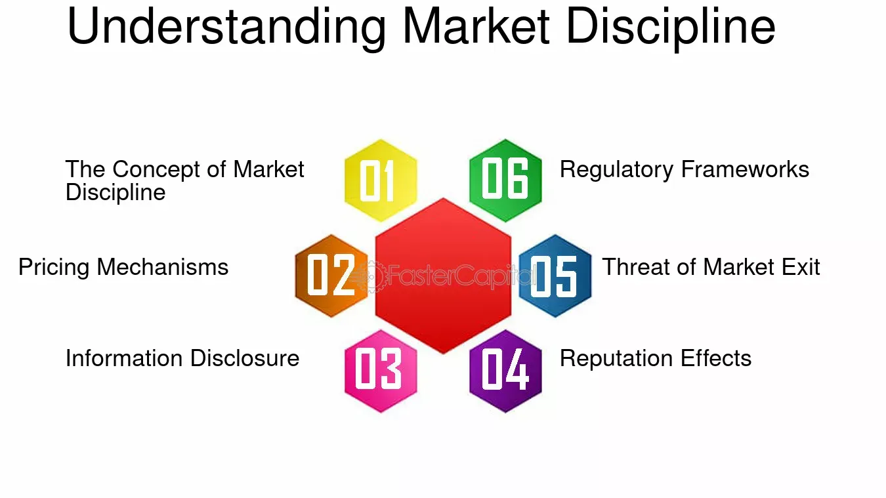

## Table of Contents

## What is market discipline?

Market discipline is a concept in finance and economics where market forces, like investors and customers, keep financial institutions in check. It means that if a bank or a company does not behave well or takes too many risks, people might stop doing business with them. This pressure from the market encourages these institutions to act responsibly and manage their risks properly.

For example, if a bank starts making risky loans and people find out, depositors might take their money out of the bank. This can lead to the bank losing money and having to change its ways. Market discipline helps to make sure that financial institutions are careful and honest, because if they are not, they could lose business and even fail.

## Why is market discipline important in financial markets?

Market discipline is important in financial markets because it helps keep banks and other financial institutions honest and careful. When investors and customers can see what these institutions are doing, they can choose to take their money elsewhere if they don't like what they see. This makes the institutions think twice before taking big risks or doing things that might not be good for their customers. It's like having a big group of people watching over them, making sure they behave well.

Without market discipline, financial institutions might take too many risks because they think they won't get in trouble. This can lead to big problems, like financial crises. For example, if a bank makes a lot of risky loans and those loans fail, the bank could lose a lot of money and even go bankrupt. This can hurt the whole economy. Market discipline helps prevent this by making sure that banks and other institutions know they will be punished by the market if they don't act responsibly.

## What are the main mechanisms of market discipline?

The main mechanisms of market discipline are the actions taken by investors and customers to influence how financial institutions behave. One key mechanism is the withdrawal of funds. If people think a bank is taking too many risks or not managing their money well, they might take their money out of the bank. This can make the bank lose a lot of money quickly, which forces them to be more careful. Another mechanism is the refusal to buy stocks or bonds from a company that is not doing well. If investors don't want to buy a company's stocks or bonds, it can be hard for the company to get the money it needs to grow or even keep running.

Another important mechanism is the impact of reputation. If a financial institution gets a bad reputation for risky behavior or bad management, people will be less likely to do business with them. This can hurt the institution's business a lot, because trust is very important in finance. Finally, market discipline can also come from other financial institutions. If banks and other companies stop lending money to a risky institution, it can make it hard for that institution to keep going. All these mechanisms work together to make sure that financial institutions act responsibly and manage their risks well.

## How do market discipline mechanisms influence the behavior of financial institutions?

Market discipline mechanisms make financial institutions behave better by putting pressure on them from investors and customers. If people think a bank is being too risky or not managing their money well, they might take their money out of the bank. This can make the bank lose a lot of money fast. To avoid this, banks have to be careful about the risks they take. They know that if they do something wrong, people can easily move their money to another bank that seems safer.

Another way market discipline works is through the reputation of the financial institution. If a bank gets a bad reputation for risky behavior or bad management, people will be less likely to do business with them. Trust is very important in finance, so a bad reputation can hurt a bank's business a lot. Banks know this, so they try to keep a good reputation by acting responsibly. This means they have to manage their risks well and treat their customers fairly.

Market discipline also comes from other financial institutions. If banks and other companies stop lending money to a risky institution, it can be hard for that institution to keep going. This pressure from other financial institutions makes them think twice before taking big risks. All these mechanisms together help make sure that financial institutions act in a way that keeps the financial system stable and safe for everyone.

## What role do depositors and investors play in market discipline?

Depositors and investors play a big role in keeping financial institutions in check. When depositors put their money in a bank, they expect it to be safe. If they think the bank is taking too many risks or not managing their money well, they might take their money out. This can hurt the bank a lot because it needs that money to do its business. So, depositors help make sure banks act responsibly by moving their money to safer banks if they need to.

Investors also help with market discipline. They buy stocks and bonds from companies and banks. If they think a company is being too risky or not doing well, they might not buy its stocks or bonds. This makes it hard for the company to get the money it needs to grow or even keep running. So, investors push companies to be careful and honest by choosing where to put their money wisely. Together, depositors and investors make sure that financial institutions behave well and manage their risks properly.

## How can market discipline be measured and evaluated?

Market discipline can be measured and evaluated by looking at how depositors and investors react to the actions of financial institutions. One way to do this is by tracking how much money people take out of a bank when they think it's being too risky. If a lot of people are taking their money out, it shows that they are using market discipline to make the bank behave better. Another way is to see if investors are buying or selling the stocks and bonds of a company. If investors are selling a lot of stocks or bonds, it means they think the company is not doing well and are trying to push it to change.

We can also look at the interest rates that banks have to pay on their loans. If a bank is seen as risky, it might have to pay higher interest rates to get people to lend them money. This higher cost can make the bank more careful about the risks it takes. Finally, we can use surveys and reports to see what people think about a bank's reputation. If a bank has a bad reputation, it's a sign that market discipline is working to make the bank act more responsibly. By looking at all these things together, we can get a good idea of how well market discipline is working.

## What are the limitations and challenges of implementing market discipline?

Market discipline can be hard to put into action because it depends a lot on people knowing what's going on. If depositors and investors don't have all the information they need, they can't make good choices about where to put their money. Sometimes, banks and companies might hide the risky things they are doing, so people don't know to take their money out or stop buying stocks. Also, some people might not understand how risky a bank or company is, even if they have the information. This can make market discipline less effective because people aren't reacting the way they should.

Another challenge is that market discipline can sometimes be too harsh. If everyone takes their money out of a bank at the same time, it can cause the bank to fail, even if it wasn't doing anything too risky. This can hurt the whole economy. Also, some banks are so big and important that people think the government will save them if they get into trouble. This can make depositors and investors less worried about the risks, which weakens market discipline. So, while market discipline is important, it needs to be balanced with other ways to keep financial institutions in check.

## How do regulatory frameworks support or hinder market discipline?

Regulatory frameworks can help market discipline by making sure that banks and companies share important information with the public. When rules make it so that financial institutions have to tell everyone about their risks and how they are doing, it helps depositors and investors make better choices. This means people can move their money to safer places if they need to, which pushes banks to be careful. Also, regulators can set rules that stop banks from doing very risky things, which makes the whole financial system safer and helps market discipline work better.

However, regulatory frameworks can also get in the way of market discipline. If the rules are too strict, they might stop banks from taking any risks at all, even the good ones that can help the economy grow. Also, if people think the government will always save big banks from failing, they might not worry about the risks as much. This can make market discipline weaker because depositors and investors won't feel the need to keep banks in check. So, finding the right balance in regulations is important to make sure market discipline can work well.

## Can you explain the difference between market discipline and regulatory discipline?

Market discipline and regulatory discipline are two ways to make sure banks and financial institutions behave well. Market discipline happens when depositors and investors watch what banks do and move their money if they think the bank is being too risky. This pressure from the market makes banks careful because they know they can lose business if they don't act responsibly. It's like having a big group of people keeping an eye on the banks and making sure they do the right thing.

Regulatory discipline, on the other hand, comes from rules and laws set by the government. Regulators make sure banks follow these rules, which can include things like how much money they need to keep on hand and what kinds of risks they can take. If a bank breaks these rules, it can get in trouble with the government, which can lead to fines or other punishments. So, regulatory discipline is about the government stepping in to make sure banks are safe and fair, while market discipline is about the choices people make with their money.

## What are some historical examples where market discipline has significantly impacted financial markets?

One big example of market discipline at work was during the 2008 financial crisis. Many banks in the United States were making risky loans, especially to people who couldn't afford to pay them back. When people found out about these risky loans, they started to worry. Depositors took their money out of the banks, and investors stopped buying the banks' stocks and bonds. This made the banks lose a lot of money and some even went bankrupt. The pressure from depositors and investors showed how market discipline can make banks change their ways when they are doing something wrong.

Another example happened in the early 1990s with the savings and loan crisis in the U.S. Many savings and loan associations were taking big risks with people's money. When depositors realized this, they started pulling their money out. This led to a lot of these associations failing because they couldn't keep up with the withdrawals. The market discipline from depositors helped show that these institutions were not managing their risks well, and it pushed the government to step in and fix the problem. Both of these examples show how important market discipline is in keeping financial institutions honest and careful.

## How do advancements in technology and data analytics affect market discipline?

Advancements in technology and data analytics have made market discipline stronger. Now, people can get information about banks and companies much faster and easier than before. With the internet and social media, news about a bank's risky behavior can spread quickly. This means depositors and investors can react faster by taking their money out or selling stocks and bonds. Also, data analytics helps people understand the risks better. They can use special tools to look at a lot of information and see if a bank is doing something dangerous. This makes it easier for people to keep banks in check and push them to be more careful.

However, technology and data analytics can also make things harder for market discipline. Sometimes, there is so much information out there that it can be confusing. People might not know which information to trust, and this can make it hard for them to make good choices about where to put their money. Also, some banks might use technology to hide their risky behavior better. They can use complex financial products that are hard to understand, even with data analytics. So, while technology and data analytics can help market discipline, they also bring new challenges that people need to be aware of.

## What future trends might influence the evolution of market discipline mechanisms and functions?

In the future, technology will keep changing how market discipline works. More and more, people will use things like [artificial intelligence](/wiki/ai-artificial-intelligence) and big data to watch what banks and companies are doing. This means they can find out about risky behavior even faster and make smarter choices about where to put their money. Also, as more people use digital banking and online investing, they can move their money around the world quickly. This makes market discipline stronger because banks know that people can leave them fast if they do something wrong.

But there will also be new challenges. As technology gets better, banks might find new ways to hide risky behavior. They could use very complicated financial products that are hard for even smart computers to understand. Also, if there is too much information out there, people might get confused and not know what to trust. This could make it harder for market discipline to work well. So, while technology can help make banks more careful, it's important for people to keep learning and stay sharp to make sure market discipline keeps working right.

## References & Further Reading

[1]: Marcos Lopez de Prado. ["Advances in Financial Machine Learning"](https://www.amazon.com/Advances-Financial-Machine-Learning-Marcos/dp/1119482089). John Wiley & Sons, 2018.

[2]: David Aronson. ["Evidence-Based Technical Analysis: Applying the Scientific Method and Statistical Inference to Trading Signals"](https://www.amazon.com/Evidence-Based-Technical-Analysis-Scientific-Statistical/dp/0470008741). Wiley, 2006.

[3]: Stefan Jansen. ["Machine Learning for Algorithmic Trading: Predictive models to extract signals from market and alternative data for systematic trading strategies with Python, 2nd Edition"](https://github.com/stefan-jansen/machine-learning-for-trading). Packt Publishing, 2020.

[4]: Ernest P. Chan. ["Quantitative Trading: How to Build Your Own Algorithmic Trading Business"](https://www.amazon.com/Quantitative-Trading-Build-Algorithmic-Business/dp/0470284889). Wiley, 2008.

[5]: Securities and Exchange Commission (SEC). ["What We Do"](https://www.sec.gov/about/mission) - An overview of the SEC’s role in regulating and maintaining financial market stability.

[6]: European Commission. ["Proposal for a Regulation laying down harmonised rules on artificial intelligence (Artificial Intelligence Act)"](https://digital-strategy.ec.europa.eu/en/library/proposal-regulation-laying-down-harmonised-rules-artificial-intelligence) - A document outlining the EU’s approach to AI regulation, relevant to the context of algorithmic trading.