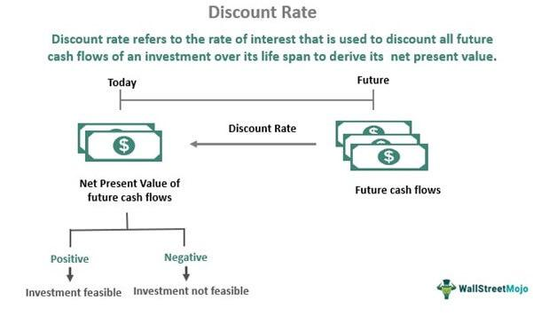

Investment market discounts and algorithmic trading have become pivotal concepts in the landscape of modern finance. Investment market discounts arise when the purchase price of a security is below its nominal or intrinsic value. This discrepancy can occur due to numerous factors, such as shifts in interest rates, changes in credit ratings, or market sentiment, each influencing the valuation of securities and creating opportunities for informed investors.

On the other hand, algorithmic trading, often referred to as algo trading, leverages computer algorithms to execute trades at speeds and frequencies that surpass human capacity. These algorithms are programmed to follow a set of rules to determine the timing, price, or quantity of trades, facilitating efficient market transactions. Understanding these systems' complexities and roles in financial markets is critical for both institutional and individual investors.

This article will explore market discounts' fundamental aspects, dissect the mechanisms and strategies underpinning algorithmic trading, and illustrate how these two elements can interplay within financial strategies. Mastering these topics is essential for navigating today's intricate financial markets and harnessing their potential for optimized investment outcomes.

## Table of Contents

## Understanding Investment Market Discounts

Market discounts represent a discrepancy between the market price of a financial asset and its intrinsic or theoretical value. This phenomenon is commonly observed in various investment vehicles such as stocks, bonds, and mutual funds, where the market price falls below their perceived or fundamental value. Understanding market discounts is crucial for investors, as it offers opportunities for acquiring undervalued assets that might yield significant returns once the market corrects the price disparity.

Several factors contribute to market discounts. Interest rates, for instance, have a dramatic impact on the discounting of assets. When interest rates rise, the present value of an asset's future cash flows decreases, leading to a drop in the asset's market price if the cash flows remain unchanged. This can result in a market discount. Conversely, when interest rates decline, the present value of future cash flows increases, potentially reducing or eliminating the discount.

Credit ratings also play a pivotal role. Assets backed by entities with low credit ratings often trade at discounts due to perceived higher risk. For instance, bonds issued by companies with lower credit ratings may offer higher yields to attract investors, yet their market prices might trade at discounts to compensate for the risk of default.

Market discounts pose several implications for investment strategies. They can create [arbitrage](/wiki/arbitrage) opportunities where investors buy undervalued assets and wait for the market to adjust prices upwards, capturing the difference as profit. This approach, while potentially profitable, requires investors to possess a keen understanding of market timing and risk management, as market corrections are not guaranteed.

Additionally, market discounts can be attractive to value investors who seek to purchase assets that are undervalued based on [fundamental analysis](/wiki/fundamental-analysis). These investors often hold onto their investments long-term, anticipating that the market will eventually recognize the intrinsic value of the asset.

In summary, market discounts are influenced by a variety of factors, including interest rates and credit ratings. Recognizing these discounts allows investors to strategize effectively, either by exploiting short-term mispricings or by betting on the long-term appreciation of undervalued assets.

## The Role of Algorithmic Trading in Modern Finance

Algorithmic trading, often referred to as algo trading, involves the use of computer programs to execute financial market transactions based on predetermined criteria. These criteria could include price levels, timing, and trading volumes. The process essentially automates trading activities, minimizing human intervention, and is driven by complex mathematical models and formulas that aim to identify profitable opportunities in the financial markets.

**Types of Algorithmic Trading Strategies**

1. **Trend-Following Strategies**: 
   These strategies are based on the technical analysis of market trends. The principle is to buy assets that are on a rising trend and sell those on the decline. Simple moving averages and channel breakouts are common techniques used within these strategies. The idea is to capitalize on market [momentum](/wiki/momentum) without the necessity of predicting price levels.

2. **Arbitrage**: 
   Arbitrage involves the simultaneous purchase and sale of an asset to profit from a difference in the price. It typically arises due to inefficiencies in the market. For example, an asset might be priced differently in two different markets. Algorithms are designed to exploit these differences quickly before the market corrects itself. An example is [statistical arbitrage](/wiki/statistical-arbitrage), which uses statistical methods to create profit opportunities.

3. **Market-Making**: 
   In this strategy, an algorithm continuously quotes both buy and sell prices in a financial instrument. Market makers aim to profit from the spread between the bid and the ask price. It requires sophisticated algorithms to manage risks such as inventory imbalances and to remain competitive.

4. **Mean Reversion**: 
   This strategy is based on the premise that high and low prices are temporary and that an asset's price will tend to revert to its average price over time. Algorithms identify trading ranges and algorithms execute trades when price levels deviate significantly from historical averages.

5. **Algorithmic Execution Strategies**: 
   These strategies aim to minimize market impact and reduce trading costs. Examples include time-weighted average price (TWAP) and [volume](/wiki/volume-trading-strategy)-weighted average price (VWAP). They execute orders in small portions over a period to avoid significant changes in the asset price.

**Benefits and Challenges of Algorithmic Trading**

**Benefits**: 

Algorithmic trading offers numerous advantages, including improved accuracy and the ability to handle massive volumes of trades simultaneously, reducing the potential for human error. Furthermore, algorithms can respond to market changes faster than a human, providing a competitive edge in terms of speed and efficiency. Cost-effectiveness is another advantage, as algorithms can reduce transaction costs by optimizing the execution of trades.

**Challenges**: 

Despite its benefits, [algorithmic trading](/wiki/algorithmic-trading) also has challenges. One major issue is the potential for market [volatility](/wiki/volatility-trading-strategies), as the simultaneous execution of trades by numerous algorithms can result in rapid price movements. There is also an inherent risk associated with algorithmic malfunctions or coding errors, which could lead to significant financial losses. Furthermore, the dependency on historical data for developing algorithms can sometimes lead to inaccuracies if the market behaves in unexpected ways. Managing these risks requires robust testing and contingency planning.

In conclusion, algorithmic trading represents a significant component of modern finance, shaping how trades are executed and decision-making processes are informed. While it presents opportunities for optimizing trading strategies, it also demands careful risk management and a detailed understanding of its complexities.

## Interplay Between Market Discounts and Algorithmic Trading

Algorithmic trading has become an integral tool for investors aiming to capitalize on market discounts. With the prowess of sophisticated algorithms, traders can efficiently identify and exploit opportunities where assets are priced below their intrinsic value.

Algorithms employ mathematical models and pre-defined strategies to analyze vast amounts of financial data. By assessing historical price patterns, news sentiment, and macroeconomic indicators, algorithms can precisely pinpoint when market discounts occur. For instance, when a stock price falls sharply due to short-term market noise rather than fundamental changes, algorithmic trading systems like mean reversion models can detect these discrepancies and execute trades to exploit them. The formula often used in such situations is:

$$
P_t = P_{t-1} + \alpha (V_t - \bar{V})
$$

where $P_t$ is the current price, $P_{t-1}$ is the previous price, $V_t$ represents the current volume, and $\bar{V}$ is the average volume over a certain period. The term $\alpha$ is a sensitivity factor.

Historical examples further illustrate the effective use of algorithmic trading in leveraging market discounts. During the 2008 financial crisis, several hedge funds employed algorithms to detect undervalued assets, capitalizing on the temporary market imbalances. These algorithms adjusted their parameters to accommodate increased market volatility, allowing for precise execution of trades that contributed to significant returns during market recovery phases.

A more contemporary example involves the use of arbitrage algorithms in bond markets. These algorithms can identify price discrepancies between related financial instruments, such as corporate bonds and CDS spreads, to exploit minimal price differences for profit. Over time, as algorithms learn from market behaviors, their efficiency in identifying similar opportunities increases.

The efficiency of algorithmic trading lies in its ability to operate at speeds unattainable by human traders, rapidly adjusting to new data and executing trades in milliseconds. This enables traders to consistently manage and capitalize on fleeting discount opportunities across various markets and asset classes.

## Technological Advancements Impacting Algo Trading

Recent technological advancements have significantly reshaped algorithmic trading, rendering it more efficient and dynamic. Central to these developments are improvements in data processing capabilities and the incorporation of [artificial intelligence](/wiki/ai-artificial-intelligence) (AI) techniques in trading algorithms.

### Improvements in Data Processing and AI

1. **Data Processing**: Modern algorithmic trading platforms leverage vast datasets, necessitating advanced data processing capabilities. The evolution of high-performance computing and the proliferation of cloud computing services have facilitated the real-time analysis of these large datasets. Distributed computing frameworks like Apache Hadoop and Apache Spark have enabled traders to process large volumes of historical and real-time data, thereby improving decision-making speed and accuracy.

2. **Artificial Intelligence and Machine Learning**: AI and machine learning (ML) have revolutionized trading algorithms by providing them with the ability to learn from past data and adapt to new market conditions. Machine learning models, such as neural networks and decision trees, have become instrumental in predicting market trends and identifying patterns that may not be obvious through traditional analysis. Techniques like natural language processing (NLP) allow traders to analyze news articles and social media feeds to gauge market sentiment, thereby providing a more comprehensive view of market dynamics.

### Potential Future Developments

1. **Quantum Computing**: The advent of quantum computing promises to take algorithmic trading to unprecedented levels of efficiency. Quantum computers can process complex calculations exponentially faster than traditional computers, which could enhance the speed and accuracy of trading decisions. While still in nascent stages, quantum algorithms such as Shor's and Grover's show potential in optimizing trading strategies and solving intricate financial models.

2. **Enhanced Predictive Models**: Future advancements in AI are likely to produce even more sophisticated predictive models. Reinforcement learning, a type of machine learning where algorithms learn optimal strategies through trial and error, shows promise in developing adaptive trading strategies that can evolve autonomously based on changing market conditions.

3. **Integration of Blockchain Technology**: Blockchain can impact algorithmic trading by providing a secure and transparent method of executing trades. Smart contracts, facilitated by blockchain, could automate the entire trade lifecycle, reducing the need for intermediaries and thus lowering transaction costs and time.

4. **Increased Use of Alternative Data**: The integration and analysis of alternative data sources, such as satellite imagery or IoT device data, could provide unique market insights that traditional datasets might miss. This could lead to more informed and strategic algorithmic trading decisions.

These technological advancements not only fortify the current framework of algorithmic trading but also set the stage for future innovations that could further transform financial markets. The continuous evolution of technology is bound to introduce more sophisticated tools and methodologies, fostering an era of highly efficient and strategic trading endeavors.

## Risk Management in Algorithmic Trading

Risk management is crucial when engaging in algorithmic trading, where programmable systems execute trading strategies at high speeds. This involves identifying, measuring, and controlling potential financial losses, ensuring that the automated nature does not lead to significant detriment.

**Common Risk Management Strategies in Algo Trading**

1. **Diversification**: By spreading investments across various assets, sectors, or markets, traders can mitigate risks associated with the volatility of a single asset class. The principle here is to reduce the dependency on any single investment.

2. **Position Sizing**: This involves determining the appropriate amount of capital allocated to each trade. Techniques such as the Kelly Criterion can be used to calculate the optimal size of a series of bets, defined by:
$$
   f^* = \frac{bp - q}{b}

$$

   where $f^*$ is the fraction of the capital to bet, $b$ is the odds received on the wager, $p$ is the probability of winning, and $q$ is the probability of losing.

3. **Stop-Loss Orders**: These are automatic exit strategies that sell an asset when it reaches a predetermined price. This prevents further losses should a trade move adversely.

4. **Stress Testing and Backtesting**: Regularly testing algorithms against historical data and hypothetical scenarios to evaluate performance under varied market conditions helps in understanding potential losses and adjusting strategies accordingly.

5. **Real-time Monitoring and Alerts**: Employing systems that offer real-time data analytics and trigger alerts when anomalies are detected. This assists in taking corrective action promptly.

**Tips for Investors to Mitigate Risks in Algorithmic Trading**

- **Comprehensive Understanding**: Investors should have a clear understanding of the algorithm, including the logic, market conditions it suits, and its potential weaknesses. 

- **Regular Audits**: Continuously auditing the algorithms helps in identifying biases, errors, or shifts in market dynamics that can affect performance.

- **Leverage Control**: While leverage can amplify gains, it equally amplifies losses. Maintaining a conservative leverage ratio is essential for managing risk.

- **Stay Updated on Regulations**: Regulatory landscapes continuously evolve; staying updated can help avoid compliance-related risks.

- **Ethical Guidelines**: Ensuring that algorithms align with ethical standards, avoiding manipulative and potentially illegal trading practices.

- **Machine Learning and AI Utilization**: These technologies can improve risk management by adapting to new data, thus potentially predicting unfavorable conditions more accurately and promptly.

By integrating these strategies, investors can enhance their risk management frameworks, making algorithmic trading more robust and less susceptible to unpredictable market shifts. This strategic approach helps not only in safeguarding capital but also in achieving more consistent returns over time.

## Future Trends in Market Discounts and Algo Trading

In forecasting the future trends of investment market discounts and algorithmic trading, one must consider a variety of economic factors and technological developments poised to reshape these arenas. 

Market discounts often arise due to discrepancies between the perceived value of an investment and its market price. Future trends will likely be influenced by variables such as interest rates, economic growth, inflationary pressures, and changes in fiscal and monetary policy. For instance, in a high-interest-rate environment, investment market discounts may widen as increased borrowing costs potentially depress asset values. Conversely, a low-interest-rate scenario could narrow these discounts by encouraging borrowing and investment, pushing asset values closer to their perceived intrinsic value.

Technological advancements are expected to significantly influence the future of algorithmic trading. Increased processing power, enhanced data analytics capabilities, and artificial intelligence algorithms might enable even more sophisticated trading strategies. For example, [machine learning](/wiki/machine-learning) algorithms could provide more accurate predictions of market trends, helping traders to better capitalize on market discounts. Additionally, the integration of natural language processing (NLP) could enhance algorithms' abilities to interpret and respond to news events or social media sentiment, thereby refining trading strategies.

Economic factors such as globalization, trade policies, and geopolitical tensions can also impact market efficiency, thus influencing both market discounts and the efficacy of algorithmic trading. As markets become more interlinked, the ability of traders to predict and react to international developments will be crucial. 

Investors can prepare for these changes by adopting more flexible strategies and incorporating facets of algorithmic trading in their operations. Staying abreast of technological developments and understanding how macroeconomic policies impact market dynamics will be invaluable. Considering a diversification approach and utilizing risk management tools will also help buffer against potential volatility or adverse market conditions. By remaining informed and adaptable, investors can position themselves advantageously in a rapidly evolving financial landscape.

## Conclusion

In conclusion, the exploration of investment market discounts and algorithmic trading reveals their integral roles in modern finance. Understanding market discounts involves recognizing the factors that lead to such phenomena, including interest rates and credit ratings, and acknowledging their impact on investment strategies. Simultaneously, algorithmic trading, with its diverse strategies like trend-following and arbitrage, offers both substantial benefits and notable challenges. The interplay between these elements allows savvy investors to leverage algorithmic trading to capitalize on market discounts efficiently.

Recent technological advancements have further propelled algorithmic trading, enhancing data processing and the sophistication of trading algorithms through artificial intelligence. These advancements pave the way for future developments, signaling increased reliance on, and evolution of, trading technologies.

Risk management remains a critical component in algorithmic trading, underscoring the necessity for investors to adopt robust strategies to mitigate associated risks. Looking forward, anticipation of future trends in investment market discounts and algorithmic trading suggests that economic factors will remain influential. Therefore, maintaining awareness of these trends and preparing strategically will be paramount for investors.

Overall, a thorough comprehension of market discounts and algorithmic trading will equip investors with invaluable insights, enabling them to navigate the complexities of the investment landscape with improved acumen and confidence.

## References & Further Reading

[1]: Bergstra, J., Bardenet, R., Bengio, Y., & Kégl, B. (2011). ["Algorithms for Hyper-Parameter Optimization."](https://dl.acm.org/doi/10.5555/2986459.2986743) Advances in Neural Information Processing Systems 24.

[2]: ["Advances in Financial Machine Learning"](https://www.amazon.com/Advances-Financial-Machine-Learning-Marcos/dp/1119482089) by Marcos Lopez de Prado

[3]: ["Evidence-Based Technical Analysis: Applying the Scientific Method and Statistical Inference to Trading Signals"](https://www.amazon.com/Evidence-Based-Technical-Analysis-Scientific-Statistical/dp/0470008741) by David Aronson

[4]: ["Machine Learning for Algorithmic Trading"](https://github.com/stefan-jansen/machine-learning-for-trading) by Stefan Jansen

[5]: ["Quantitative Trading: How to Build Your Own Algorithmic Trading Business"](https://www.amazon.com/Quantitative-Trading-Build-Algorithmic-Business/dp/1119800064) by Ernest P. Chan