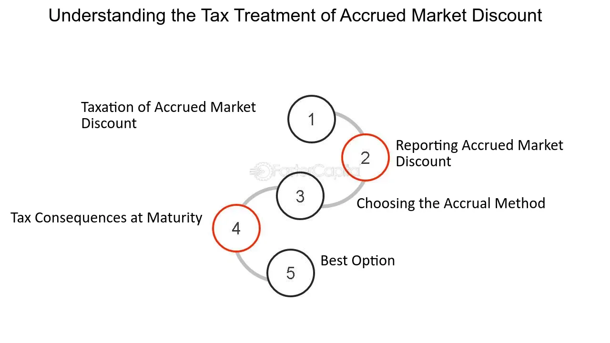

## Table of Contents

## What is a market discount?

A market discount is when a bond or other debt instrument is bought for less than its face value. The face value is the amount the bond will be worth when it matures. For example, if a bond's face value is $1,000 but you can buy it for $950, the $50 difference is the market discount.

This discount happens because of changes in interest rates, the bond issuer's credit rating, or other market conditions. When you buy a bond at a market discount and hold it until it matures, you will get the full face value. The difference between what you paid and the face value is considered taxable income, but you can choose to report it yearly or all at once when the bond matures.

## How does a market discount differ from a face value?

A market discount is the difference between what you pay for a bond and its face value. The face value is the amount the bond will be worth when it matures. For example, if a bond's face value is $1,000 but you can buy it for $950, the $50 difference is the market discount. This happens because of changes in interest rates, the bond issuer's credit rating, or other market conditions.

The face value, also known as the par value, is the amount the bond issuer agrees to pay back to the bondholder when the bond matures. It's a fixed amount set when the bond is issued. On the other hand, the market discount is not fixed and can change based on what people are willing to pay for the bond in the market. When you buy a bond at a market discount and hold it until it matures, you will get the full face value, and the discount you got is considered taxable income.

## What are the common causes of a market discount?

A market discount happens when a bond's price falls below its face value. One common reason for this is changes in interest rates. If interest rates go up after a bond is issued, new bonds will offer higher interest payments. This makes the older bonds with lower interest rates less attractive to investors, so their prices drop, causing a market discount.

Another reason for a market discount is changes in the bond issuer's credit rating. If a company or government that issued the bond faces financial trouble or its credit rating drops, investors might see the bond as riskier. They will then demand a lower price for the bond, leading to a market discount.

Market conditions can also cause a market discount. If there is less demand for bonds in general or if there is more uncertainty in the market, bond prices can fall below their face value. These factors together can make a bond less valuable in the eyes of investors, resulting in a market discount.

## Can you explain the mechanism behind market discounts?

When a bond's price drops below its face value, that difference is called a market discount. This happens because of changes in things like interest rates, how safe people think the bond is, or what's going on in the market. For example, if interest rates go up, new bonds will offer more money to people who buy them. This makes the old bonds with less money less interesting, so people won't pay as much for them, and their price goes down.

Another reason for a market discount is if people start thinking the company or government that made the bond is not as safe as before. If their credit rating goes down, people might worry they won't get their money back. So, they'll want to pay less for the bond, causing a market discount. Also, if there's a lot of uncertainty in the market or fewer people want to buy bonds, their prices can go down too. All these things can make a bond less valuable and lead to a market discount.

## How do market discounts affect bond pricing?

Market discounts play a big role in how much a bond costs. When a bond's price falls below what it will be worth when it matures, that difference is the market discount. This happens because of changes in things like interest rates, how safe people think the bond is, or what's going on in the market. If interest rates go up, new bonds will offer more money to people who buy them. This makes the old bonds with less money less interesting, so people won't pay as much for them, and their price goes down.

Another reason for a market discount is if people start thinking the company or government that made the bond is not as safe as before. If their credit rating goes down, people might worry they won't get their money back. So, they'll want to pay less for the bond, causing a market discount. Also, if there's a lot of uncertainty in the market or fewer people want to buy bonds, their prices can go down too. All these things can make a bond less valuable and lead to a market discount, which directly affects how much someone will pay for the bond.

## What role do interest rates play in market discounts?

Interest rates are a big reason why bonds can have a market discount. When interest rates go up, new bonds start to offer more money to people who buy them. This makes the old bonds, which pay less money, less attractive. So, people won't want to pay as much for the old bonds, and their price goes down. This difference between what the bond will be worth when it matures and what people are willing to pay for it now is the market discount.

If interest rates go down, the opposite can happen. Old bonds that pay more money than new bonds become more attractive. People might be willing to pay more for these old bonds, which could make their price go up. But if interest rates stay high, the market discount on old bonds can stay or even get bigger, because people will keep looking for the new bonds that offer more money.

## How are market discounts calculated?

Market discounts are figured out by looking at the difference between what you pay for a bond and what it will be worth when it matures. If a bond's face value is $1,000 but you can buy it for $950, the market discount is $50. This happens because things like interest rates, how safe people think the bond is, or what's going on in the market can change how much people are willing to pay for the bond.

To find the market discount, you subtract the price you pay for the bond from its face value. For example, if the face value is $1,000 and the market price is $950, you do $1,000 - $950 = $50. This $50 is the market discount. It's important to know this because when you buy a bond at a market discount and hold it until it matures, you will get the full face value, and the discount you got is considered taxable income.

## What are the tax implications of purchasing a bond at a market discount?

When you buy a bond at a market discount, it means you paid less than what the bond will be worth when it matures. This difference between what you paid and the bond's face value is considered taxable income. The tax rules say you can choose how you want to report this income. You can either report it all at once when the bond matures, or you can report a little bit of it each year while you own the bond.

If you choose to report the market discount yearly, you'll need to figure out how much of the discount to report each year. This is usually done by dividing the total market discount by the number of years until the bond matures. This way, you're spreading out the tax over time. But if you wait until the bond matures to report the whole discount, you'll have a bigger tax bill all at once. It's a good idea to talk to a tax advisor to see which option is best for you.

## How do market discounts impact investment strategies?

When you're thinking about where to put your money, market discounts can change how you make your choices. If you see a bond that's selling for less than what it will be worth when it matures, you might decide to buy it. This is because you know you'll get more money back when the bond matures, and that extra money is like a bonus. But you also need to think about how long you want to keep your money tied up in the bond and if you're okay with waiting until it matures to get that extra money.

Market discounts can also make you think about the risks. If a bond is selling at a discount, it might mean that people think the company or government that made the bond is not as safe as before. You might decide to buy the bond if you think the risk is worth it, or you might choose to stay away from it if you're worried about not getting your money back. Either way, knowing about market discounts helps you make smarter choices about where to invest your money.

## What are the risks associated with buying securities at a market discount?

When you buy a bond or other security at a market discount, there's a chance that the company or government that made it might not be able to pay you back. If their financial situation gets worse, or if their credit rating drops, the bond might become even riskier. This could mean you might not get the full face value of the bond when it matures, or you might have to wait longer to get your money.

Another risk is that interest rates might go up even more after you buy the bond. If that happens, the value of your bond could go down even further because new bonds will be offering higher interest payments. This could make it hard to sell your bond before it matures if you need your money back sooner. So, it's important to think about how long you can afford to keep your money tied up in the bond and if you're okay with these risks.

## How do market conditions influence the level of market discounts?

Market conditions can make the market discount on a bond bigger or smaller. If there's a lot of uncertainty in the market, like during an economic downturn or a big event, people might not want to buy bonds. This can make bond prices go down, leading to bigger market discounts. Also, if there's less demand for bonds in general, their prices can drop, and the market discount can grow.

On the other hand, if the market is doing well and people feel confident, they might be more willing to buy bonds. This could make bond prices go up, which would mean smaller market discounts. Market conditions can change quickly, so it's important to keep an eye on them if you're thinking about buying a bond at a market discount.

## What advanced strategies can investors use to capitalize on market discounts?

Investors can use a few smart moves to take advantage of market discounts. One way is to buy bonds at a discount and hold them until they mature. This means you'll get the full face value of the bond, and the difference between what you paid and the face value is like a bonus. But you need to be okay with waiting until the bond matures to get this extra money. Another strategy is to buy bonds that you think are undervalued because of temporary market conditions. If you believe the market will get better, you can buy these bonds at a discount and sell them later for a profit when their prices go up.

Another approach is to use a bond ladder strategy. This means you buy bonds that mature at different times. Some will mature soon, and others will take longer. This way, you can take advantage of market discounts on different bonds and get your money back at different times. It can help you spread out the risk and make sure you have some money coming in regularly. By using these strategies, you can make the most of market discounts and potentially earn more from your investments.

## What is the interplay between market discounts and algorithmic trading?

Algorithmic trading has become an integral tool for investors aiming to capitalize on market discounts. With the prowess of sophisticated algorithms, traders can efficiently identify and exploit opportunities where assets are priced below their intrinsic value.

Algorithms employ mathematical models and pre-defined strategies to analyze vast amounts of financial data. By assessing historical price patterns, news sentiment, and macroeconomic indicators, algorithms can precisely pinpoint when market discounts occur. For instance, when a stock price falls sharply due to short-term market noise rather than fundamental changes, [algorithmic trading](/wiki/algorithmic-trading) systems like mean reversion models can detect these discrepancies and execute trades to exploit them. The formula often used in such situations is:

$$
P_t = P_{t-1} + \alpha (V_t - \bar{V})
$$

where $P_t$ is the current price, $P_{t-1}$ is the previous price, $V_t$ represents the current volume, and $\bar{V}$ is the average volume over a certain period. The term $\alpha$ is a sensitivity factor.

Historical examples further illustrate the effective use of algorithmic trading in leveraging market discounts. During the 2008 financial crisis, several hedge funds employed algorithms to detect undervalued assets, capitalizing on the temporary market imbalances. These algorithms adjusted their parameters to accommodate increased market [volatility](/wiki/volatility-trading-strategies), allowing for precise execution of trades that contributed to significant returns during market recovery phases.

A more contemporary example involves the use of [arbitrage](/wiki/arbitrage) algorithms in bond markets. These algorithms can identify price discrepancies between related financial instruments, such as corporate bonds and CDS spreads, to exploit minimal price differences for profit. Over time, as algorithms learn from market behaviors, their efficiency in identifying similar opportunities increases.

The efficiency of algorithmic trading lies in its ability to operate at speeds unattainable by human traders, rapidly adjusting to new data and executing trades in milliseconds. This enables traders to consistently manage and capitalize on fleeting discount opportunities across various markets and asset classes.

## What is Risk Management in Algorithmic Trading?

Risk management is crucial when engaging in algorithmic trading, where programmable systems execute trading strategies at high speeds. This involves identifying, measuring, and controlling potential financial losses, ensuring that the automated nature does not lead to significant detriment.

**Common Risk Management Strategies in Algo Trading**

1. **Diversification**: By spreading investments across various assets, sectors, or markets, traders can mitigate risks associated with the volatility of a single asset class. The principle here is to reduce the dependency on any single investment.

2. **Position Sizing**: This involves determining the appropriate amount of capital allocated to each trade. Techniques such as the Kelly Criterion can be used to calculate the optimal size of a series of bets, defined by:
$$
   f^* = \frac{bp - q}{b}

$$

   where $f^*$ is the fraction of the capital to bet, $b$ is the odds received on the wager, $p$ is the probability of winning, and $q$ is the probability of losing.

3. **Stop-Loss Orders**: These are automatic exit strategies that sell an asset when it reaches a predetermined price. This prevents further losses should a trade move adversely.

4. **Stress Testing and Backtesting**: Regularly testing algorithms against historical data and hypothetical scenarios to evaluate performance under varied market conditions helps in understanding potential losses and adjusting strategies accordingly.

5. **Real-time Monitoring and Alerts**: Employing systems that offer real-time data analytics and trigger alerts when anomalies are detected. This assists in taking corrective action promptly.

**Tips for Investors to Mitigate Risks in Algorithmic Trading**

- **Comprehensive Understanding**: Investors should have a clear understanding of the algorithm, including the logic, market conditions it suits, and its potential weaknesses. 

- **Regular Audits**: Continuously auditing the algorithms helps in identifying biases, errors, or shifts in market dynamics that can affect performance.

- **Leverage Control**: While leverage can amplify gains, it equally amplifies losses. Maintaining a conservative leverage ratio is essential for managing risk.

- **Stay Updated on Regulations**: Regulatory landscapes continuously evolve; staying updated can help avoid compliance-related risks.

- **Ethical Guidelines**: Ensuring that algorithms align with ethical standards, avoiding manipulative and potentially illegal trading practices.

- **Machine Learning and AI Utilization**: These technologies can improve risk management by adapting to new data, thus potentially predicting unfavorable conditions more accurately and promptly.

By integrating these strategies, investors can enhance their risk management frameworks, making algorithmic trading more robust and less susceptible to unpredictable market shifts. This strategic approach helps not only in safeguarding capital but also in achieving more consistent returns over time.

## References & Further Reading

[1]: Bergstra, J., Bardenet, R., Bengio, Y., & Kégl, B. (2011). ["Algorithms for Hyper-Parameter Optimization."](https://dl.acm.org/doi/10.5555/2986459.2986743) Advances in Neural Information Processing Systems 24.

[2]: ["Advances in Financial Machine Learning"](https://www.amazon.com/Advances-Financial-Machine-Learning-Marcos/dp/1119482089) by Marcos Lopez de Prado

[3]: ["Evidence-Based Technical Analysis: Applying the Scientific Method and Statistical Inference to Trading Signals"](https://www.amazon.com/Evidence-Based-Technical-Analysis-Scientific-Statistical/dp/0470008741) by David Aronson

[4]: ["Machine Learning for Algorithmic Trading"](https://github.com/stefan-jansen/machine-learning-for-trading) by Stefan Jansen

[5]: ["Quantitative Trading: How to Build Your Own Algorithmic Trading Business"](https://www.amazon.com/Quantitative-Trading-Build-Algorithmic-Business/dp/1119800064) by Ernest P. Chan