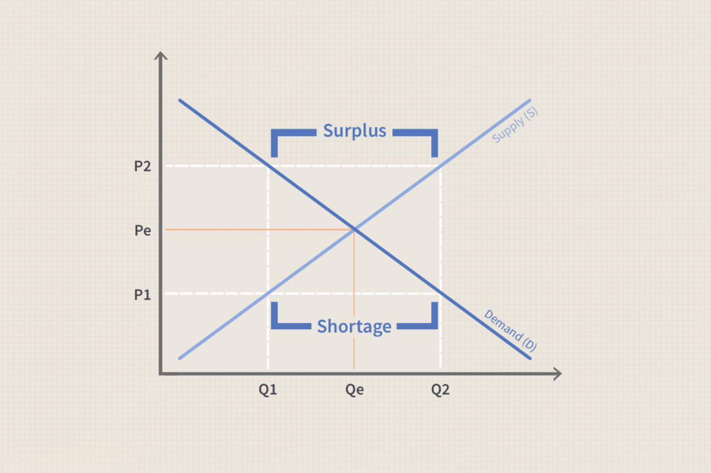

The modern economic landscape is shaped by continuous transformations, intricate dynamics, and a persistent state of flux. Central to understanding this tumultuous environment are key concepts such as economic imbalance, market dynamics, and market disequilibrium. Economic imbalance arises when discrepancies between supply and demand cause either a surplus or a shortage in the market. This can disrupt the equilibrium, leading to inefficiencies and resource misallocation.

Market dynamics, which encompass the forces influencing prices, supply, and demand, are equally critical. They play a pivotal role in how markets function and adjust to internal and external pressures. Historical events, including the Great Depression and the 2008 financial crisis, underscore the significant impact of these dynamics, contributing vital insights into how markets respond to various shocks and interventions.



A prominent force shaping contemporary financial markets is algorithmic trading, or algo trading. This method employs sophisticated computer algorithms to execute trades with high speed, often exploiting brief market inefficiencies. While algo trading can contribute to market stability by providing liquidity and aiding price discovery, it also bears the potential to disrupt equilibrium, particularly during volatile periods.

In addition to understanding these forces, technological advancements offer novel opportunities to address market challenges. With tools like big data analytics and machine learning, market participants can predict and swiftly react to potential imbalances. Blockchain technology further enhances market transparency and efficiency by improving supply chain management.

This article will explore the interplay between these crucial concepts and their influence on global financial markets. By examining the roles of technology and innovation, the discussion will highlight how they can mitigate economic imbalances and market disequilibrium, offering pathways toward more stable and sustainable growth in the ever-evolving economic landscape.

## Table of Contents

## Understanding Economic Imbalance and Market Dynamics

Economic imbalance arises when there is a disparity between supply and demand, resulting in either a surplus or a shortage. This imbalance is a fundamental component of market dynamics, which encompass the forces influencing prices, supply, and demand across various markets. Understanding these dynamics is crucial to grasping how markets operate and recognizing how imbalances contribute to market disequilibrium.

Market dynamics are shaped by a multitude of factors, including consumer preferences, technological advancements, government policies, and global events. These elements can cause shifts in supply and demand, prompting markets to adjust prices accordingly. When these forces drive supply and demand out of alignment, economic imbalances occur, necessitating corrective measures to restore equilibrium.

Historical examples provide insight into how economic imbalances manifest and their broader implications. The Great Depression, one of the most significant economic downturns in the 20th century, was characterized by severe imbalances across major economies. Massive drops in consumer spending and investment led to an overproduction of goods, resulting in widespread business failures and unemployment.

Similarly, the 2008 financial crisis offers a contemporary example of market imbalances and their consequences. Rooted in the housing market, the crisis was fueled by high-risk mortgage lending practices and the subsequent collapse of housing prices. This created a cascade of imbalances, affecting financial institutions globally and triggering a severe economic contraction.

Economic theories and models have been developed to study these imbalances and predict potential outcomes. Concepts like supply and demand curves illustrate how different factors, such as changes in consumer preferences or production costs, can shift equilibrium. The basic formula for market equilibrium is:

$$
Q_d = Q_s
$$

where $Q_d$ is the quantity demanded and $Q_s$ is the quantity supplied. When these two are unequal, an imbalance occurs, leading to either a surplus ($Q_s > Q_d$) or a shortage ($Q_d > Q_s$).

Efforts to address economic imbalances often include policy interventions and market adjustments. For instance, during the Great Depression, government programs aimed to stimulate demand and create jobs, while regulatory measures targeted financial market stability following the 2008 crisis.

Understanding the principles of economic imbalance and market dynamics is vital for navigating today's complex economic landscape. By analyzing past events and applying economic theories, stakeholders can better anticipate and respond to imbalances, promoting sustainable market functioning and preventing future crises.

## What is Market Disequilibrium?

Market disequilibrium is a situation where there is a mismatch between the quantity of goods and services that businesses are willing to supply and the quantity that consumers are willing to purchase. This leads to either excess supply, where more goods are available than are demanded, or excess demand, where the demand for goods exceeds their availability. The imbalance disrupts the market's natural equilibrium price, where supply equals demand.

Several factors can cause market disequilibrium. Government interventions, such as price controls, can distort natural market signals. For instance, price ceilings, intended to keep essential goods affordable, can lead to shortages as they make it less profitable for suppliers to produce that good. Conversely, price floors, like minimum wage laws, can result in a surplus of labor, as they raise the cost to employers, potentially reducing the number of jobs available.

Labor market inefficiencies also contribute to disequilibrium. These inefficiencies may arise from skill mismatches or geographical mismatches between workers and available jobs. When the skills of the labor force do not align with the requirements of available jobs, the result is unemployment, underemployment, or unfilled positions, perpetuating economic imbalance.

External shocks are another critical [factor](/wiki/factor-investing) causing market disequilibrium. These shocks can be sudden and unforeseen events that disrupt supply or demand. For example, natural disasters, geopolitical tensions, or pandemics can alter consumer preferences and supply chain operations overnight. A relevant historical example is the oil crisis of the 1970s, which drastically reduced the global supply of oil, leading to widespread economic instability.

These factors demonstrate that market disequilibrium is often a result of perturbations in the economic environment, which prevent market forces from reaching a state of balance. Effective policy and market adaptability are essential in addressing these imbalances, striving to restore equilibrium and ensuring a more stable economic environment.

## Algorithmic Trading: A Game Changer

Algorithmic trading, or algo trading, represents a transformative force in financial markets, executed by deploying computer algorithms to perform trades at rapid speeds. Its core function is to exploit market inefficiencies, whether they be price discrepancies or [liquidity](/wiki/liquidity-risk-premium) gaps, by making swift and precise trading decisions that are impossible for human traders to replicate in real-time. The impact of [algorithmic trading](/wiki/algorithmic-trading) on market equilibrium, which traditionally involves balancing supply and demand, is profound but complex.

Algo trading can contribute to market equilibrium by providing liquidity and narrowing bid-ask spreads. Liquidity provision ensures that there are always enough buyers and sellers available to execute trades without causing significant price shifts. By narrowing bid-ask spreads, algorithmic trading reduces transaction costs and enhances market efficiency. For example, market-making algorithms are employed to continuously quote buy and sell prices for specific securities and adjust these quotes in response to new market information. This activity can stabilize prices and ensure smoother market operations.

However, the role of algorithmic trading in economic imbalances is not unidirectional. On one hand, it can mitigate [volatility](/wiki/volatility-trading-strategies) by quickly correcting mispricings when they emerge. For example, [arbitrage](/wiki/arbitrage) algorithms identify price discrepancies across different markets or financial instruments and execute trades to take advantage of these opportunities, driving prices toward fundamental values.

On the other hand, algo trading can exacerbate volatility under certain conditions. High-frequency trading ([HFT](/wiki/high-frequency-trading-strategies)), a subset of algorithmic trading, is particularly known for this. HFT algorithms might engage in activities such as flash trading, where trades are executed in fractions of a second. During periods of market stress or when several algorithms respond to the same signals simultaneously, they may amplify price movements rather than dampen them. The "Flash Crash" of May 6, 2010, is often cited as an example where computerized trading contributed to a rapid and profound market disruption.

The interaction between algorithmic trading and economic imbalances is further complicated by the potential for feedback loops. A feedback loop may occur when the actions of trading algorithms influence market conditions to the extent that new signals generated by these conditions cause the algorithms to act again, potentially leading to a self-reinforcing cycle of buying or selling pressure.

In conclusion, algorithmic trading is indeed a game-changer, capable of both stabilizing and destabilizing markets. Its dual capacity to reduce and intensify market volatility highlights the importance of regulatory oversight and the development of robust risk management strategies. Understanding the nuanced effects of algorithmic trading on market dynamics is crucial for investors, policymakers, and financial institutions.

## Technology's Role in Balancing Markets

Advancements in technology play a pivotal role in addressing market imbalances by providing tools that enhance the precision and speed of decision-making processes in financial markets. One of the most significant contributions of technology is through big data analytics. By analyzing vast amounts of data collected from various sources, stakeholders can gain insights into market trends, consumer behavior, and potential disruptions. This analysis facilitates the prediction of market changes and helps in formulating strategies to mitigate the effects of imbalances.

Machine learning algorithms further augment these capabilities by improving the accuracy of predictive models. These algorithms can identify patterns and trends that might be invisible to human analysts, thereby offering a more nuanced understanding of the market dynamics. A typical application is in automated trading systems, where algorithms make decisions based on real-time data to execute trades swiftly, minimizing human error and reaction time. These systems are designed to respond to market fluctuations promptly, thereby smoothing out potential volatilities and assisting in maintaining equilibrium.

Blockchain technology introduces another layer of innovation by providing transparency and traceability in supply chains. It records transactions in a decentralized ledger, allowing stakeholders to access real-time data regarding the movement of goods and services. This transparency is crucial in identifying bottlenecks and inefficiencies that could lead to market disequilibrium. For example, if a disruption occurs upstream in the supply chain, stakeholders can quickly react to the situation by adjusting production or rerouting logistics, thus minimizing potential market shocks.

The integration of technology in market operations can be exemplified by the use of Python for creating predictive models. Python, with libraries such as NumPy for numerical computations, pandas for data manipulation, and Scikit-learn for implementing [machine learning](/wiki/machine-learning) models, provides a robust ecosystem to handle complex financial analyses. Here's a simple Python script demonstrating how one might use linear regression to predict market trends:

```python
import numpy as np
import pandas as pd
from sklearn.model_selection import train_test_split
from sklearn.linear_model import LinearRegression
from sklearn.metrics import mean_squared_error

# Sample dataset with market variables
data = pd.DataFrame({
    'Market Indicator 1': np.random.rand(100),
    'Market Indicator 2': np.random.rand(100),
    'Market Indicator 3': np.random.rand(100),
    'Market Trend': np.random.rand(100)
})

# Splitting data into training and test sets
X = data.drop('Market Trend', axis=1)
y = data['Market Trend']
X_train, X_test, y_train, y_test = train_test_split(X, y, test_size=0.2, random_state=42)

# Linear regression model
model = LinearRegression()
model.fit(X_train, y_train)

# Predictions and model evaluation
predictions = model.predict(X_test)
mse = mean_squared_error(y_test, predictions)

print(f'Mean Squared Error: {mse}')
```

In sum, technology not only aids in predicting market behavior but also provides crucial tools to adapt to and correct imbalances. By leveraging advanced analytics, machine learning, and blockchain technologies, financial markets are better equipped to enhance efficiency, diminish risks, and achieve a state of balance amid dynamic economic conditions.

## Innovative Solutions to Market Disequilibrium

Innovative solutions to market disequilibrium address the complexities of supply and demand through advanced strategies such as dynamic pricing, on-demand manufacturing, and subscription models. These approaches can effectively realign market forces, ensuring a closer match between supply and consumer demand.

Dynamic pricing leverages algorithms and data analytics to adjust prices in real-time based on current market conditions, consumer demand, and other factors. This approach maximizes revenue by capturing consumer surplus and optimizing inventory levels. For instance, airlines and ridesharing services frequently use dynamic pricing to manage capacity and demand fluctuations. The mathematical basis for dynamic pricing can be encapsulated in the following formula:

$$
P_t = P_0 + \Delta P \times D_t
$$

Where:
- $P_t$ is the price at time $t$.
- $P_0$ is the base price.
- $\Delta P$ is the price change factor.
- $D_t$ represents the demand factor at time $t$.

On-demand manufacturing transforms traditional production strategies by producing goods only when an order is received, thus reducing waste and aligning production [volume](/wiki/volume-trading-strategy) with market demand. It allows manufacturers to be more responsive to market changes and consumer preferences, minimizing overproduction and inventory costs. Companies like automotive manufacturers and custom furniture producers utilize this model to balance production with real-time market demands.

Subscription models provide a steady revenue stream while ensuring a consistent demand for products or services. By charging a recurring fee for access to goods or services, businesses can estimate demand more accurately and plan accordingly. This model is particularly beneficial in digital services and media industries, where consumer access is prioritized over individual sales transactions.

Beyond these models, businesses adopting sustainable practices can address consumer demand for eco-friendly products while mitigating resource scarcity. By integrating renewable materials and ethical sourcing into their supply chains, companies not only respond to consumer expectations but also contribute to long-term resource availability.

Collaborative consumption models are reshaping consumer behavior by enabling shared access to products and services, optimizing the use of resources. Examples include car-sharing and accommodation-sharing platforms, which maximize resource usage and reduce the redundancy seen in traditional ownership models. These approaches facilitate a circular economy where ownership is less prioritized over access and utility, fostering more sustainable consumption patterns.

In summary, leveraging these innovative solutions can significantly mitigate market disequilibrium by ensuring a more efficient allocation of resources and better alignment of supply with market demand. Sustainable practices and collaborative consumption contribute further by promoting resource efficiency and meeting modern consumer expectations.

## Conclusion

Economic imbalance, market dynamics, and market disequilibrium are intricately linked in shaping modern financial markets. As global economies continue to evolve, understanding these interconnected elements becomes vital for devising effective strategies. Algorithmic trading and technological innovations present a dual-faceted influence on market balance. These advancements offer opportunities for enhancing market efficiency through rapid trade executions and data-driven strategies, yet they also introduce challenges such as increased volatility and reduced transparency in price formation.

Policymakers, businesses, and investors must develop a nuanced understanding of these factors to navigate the complexities inherent in today's global economy. A comprehensive grasp of how algorithmic trading can both mitigate and exacerbate economic disruptions is essential for formulating policies that promote market stability. Furthermore, businesses must leverage technological progress, such as machine learning and big data analytics, to accurately predict market trends and align supply with demand, thus reducing potential disequilibrium.

By fostering innovation and adaptability, global markets stand a better chance of managing disequilibrium and encouraging sustainable economic growth. Embracing dynamic pricing models, enhancing supply chain transparency through blockchain technology, and adopting environmentally sustainable practices are steps that can help achieve this balance. Collaborations across sectors and continuous investment in technology-driven solutions will be crucial to navigating future economic landscapes, ultimately leading to more resilient and balanced financial markets.

## References & Further Reading

[1]: Bergstra, J., Bardenet, R., Bengio, Y., & Kégl, B. (2011). ["Algorithms for Hyper-Parameter Optimization."](https://dl.acm.org/doi/10.5555/2986459.2986743) Advances in Neural Information Processing Systems 24.

[2]: ["Advances in Financial Machine Learning"](https://www.amazon.com/Advances-Financial-Machine-Learning-Marcos/dp/1119482089) by Marcos Lopez de Prado

[3]: ["Evidence-Based Technical Analysis: Applying the Scientific Method and Statistical Inference to Trading Signals"](https://www.amazon.com/Evidence-Based-Technical-Analysis-Scientific-Statistical/dp/0470008741) by David Aronson

[4]: ["Machine Learning for Algorithmic Trading"](https://github.com/PacktPublishing/Machine-Learning-for-Algorithmic-Trading-Second-Edition) by Stefan Jansen

[5]: ["Quantitative Trading: How to Build Your Own Algorithmic Trading Business"](https://books.google.com/books/about/Quantitative_Trading.html?id=j70yEAAAQBAJ) by Ernest P. Chan