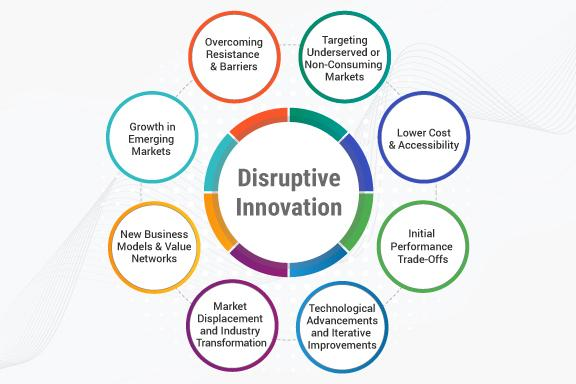

Market disruption, innovation, and algorithmic trading are now integral to contemporary business strategies. These elements have revolutionized industry landscapes, offering avenues for novel business models and strategic advancements. Market disruption typically occurs when groundbreaking innovations challenge and transform existing markets, fostering environments ripe for the introduction of new business paradigms. These disruptions can stimulate efficiency and open up new markets, compelling companies to adapt rapidly or risk becoming obsolete.

Innovative business models have emerged in response to this rapid change, often capitalizing on technology and digital platforms to enhance customer engagement and optimize operations. Companies like Uber and Airbnb exemplify this shift, leveraging technology to redefine traditional service delivery frameworks. By innovating their business models, such companies have successfully navigated market disruptions and established themselves as leaders in their respective industries.



Algorithmic trading exemplifies how innovation can transform specific sectors, particularly in financial services. This sophisticated trading method employs complex algorithms to automate and speed up investment decisions, reducing human error and emotional influences. With the increasing integration of Artificial Intelligence (AI), algorithmic trading has reached unprecedented levels of performance, offering adaptiveness and precision that traditional trading methods cannot match.

The impact of technology, particularly AI, on these shifts cannot be overstated. AI facilitates novel analytical techniques and predictive capabilities, enhancing decision-making processes across various sectors. By integrating AI, companies can develop more personalized and effective strategies, maintaining competitiveness in a rapidly evolving market. As businesses harness these technological advancements, they must also be mindful of managing risks associated with cybersecurity and ethical considerations, ensuring that innovation drives sustainable and responsible growth.

## Table of Contents

## Understanding Market Disruption

Market disruption occurs when an innovation or a set of innovations significantly alters the landscape of an industry. This phenomenon is often driven by technological advancements, shifts in consumer preferences, or regulatory changes that pave the way for novel solutions and business models. Such disruptions challenge established norms and incumbents who may struggle to adapt to the new market dynamics. 

A prime example of market disruption is the digital transformation witnessed in the retail industry. The advent of e-commerce platforms like Amazon has fundamentally changed how consumers shop, forcing traditional brick-and-mortar retailers to rethink their strategies. By leveraging technology, these platforms offer unmatched convenience, wider product assortments, and competitive pricing, compelling traditional players to innovate or risk obsolescence.

In the financial services sector, [artificial intelligence](/wiki/ai-artificial-intelligence) (AI) has become a disruptive force. AI-driven financial technologies, or "fintech," are reshaping how financial services are delivered, making transactions faster, more efficient, and increasingly personalized. Innovations such as robo-advisors provide automated, algorithm-driven financial planning services with minimal human intervention, challenging traditional advisory and wealth management models.

Market disruptions can lead to rapid changes, requiring agility and resilience from businesses. Companies that recognize the potential of these disruptive innovations can capitalize on new opportunities by adopting adaptive business models, investing in technology, and redefining their value propositions to align with evolving customer needs.

Moreover, disruptions necessitate a shift in organizational culture towards embracing change and risk-taking. This often involves strategic investments in research and development and cultivating a workforce skilled in emerging technologies. By doing so, businesses can maintain relevance in a landscape that is continuously being redefined by disruptive forces. 

In an era where change is the only constant, market disruption epitomizes both a challenge and an opportunity. Companies that thrive are those that not only anticipate disruption but also leverage it as a catalyst for innovation and growth.

## Innovation in Business Models

Innovative business models allow companies to take advantage of new opportunities created by market disruption. These opportunities often arise from shifts in consumer behavior, advancements in technology, or changes in regulatory environments. Companies that innovate in their business models frequently prioritize efficiency, customer engagement, and the adoption of digital platforms.

Efficiency is a cornerstone of innovative business models. By streamlining operations and minimizing waste, companies can offer competitive pricing, improve profit margins, and increase market share. For example, the sharing economy companies Uber and Airbnb revolutionized traditional industries by developing platform-based models that maximize asset utilization. These platforms connect users with available resources—be it a car or an apartment—thus reducing the costs associated with asset ownership. By deploying algorithms that optimize matching processes and pricing strategies, these companies have effectively disrupted the transportation and hospitality sectors.

Customer engagement is another critical focus area for innovative business models. In an increasingly competitive market, understanding and fulfilling customer needs is vital. Companies can harness data analytics to gain insights into consumer behavior, preferences, and trends. This information allows for personalized experiences, enhancing customer loyalty and satisfaction. For instance, tech companies leverage user data to tailor their services and marketing efforts, thereby improving engagement and retention rates.

Leveraging technology is essential in driving innovation. Advancements in areas such as artificial intelligence (AI), [machine learning](/wiki/machine-learning), and big data analytics have opened new frontiers for business. These technologies enable companies to automate processes, perform real-time analysis, and make data-driven decisions. Investing in technology infrastructure and specialized human capital is crucial for businesses seeking to innovate. Not only does this foster a culture of continuous improvement, but it also positions companies to respond swiftly to emerging trends and disruptions.

Embracing change is pivotal for innovation. Companies must be willing to adapt existing models or develop new ones in response to evolving market dynamics. This involves not only technological adoption but also a shift in organizational mindset. Encouraging creativity, fostering an agile work environment, and incentivizing risk-taking can stimulate innovation. Organizations that commit to continuous learning and development of their workforce are better equipped to navigate the challenges of a rapidly evolving business landscape.

In summary, innovative business models that capitalize on market disruption are characterized by a focus on efficiency, enhanced customer engagement, and the strategic use of technology. Companies like Uber and Airbnb exemplify how digital platforms can transform industries by offering novel solutions and maximizing existing resources. By embracing change and investing in technology and human capital, businesses can position themselves to thrive in a world of constant disruption.

## The Rise of Algorithmic Trading

Algorithmic trading, often referred to as algo trading, involves the use of computer programs and algorithms to execute trading orders at speeds and frequencies impossible for human traders. This form of trading leverages complex mathematical models and high-speed data analysis to make investment decisions based on a set of pre-defined rules.

Initially, [algorithmic trading](/wiki/algorithmic-trading) was predominantly a tool for large financial institutions seeking to handle their substantial trading volumes with improved precision and reduced transaction costs. However, advancements in technology have democratized access, enabling retail traders to benefit from algo trading strategies as well. Factors contributing to this accessibility include increased computing power, lower costs of data storage, and the proliferation of user-friendly trading platforms.

One of the most significant advancements in algorithmic trading has been the integration of artificial intelligence (AI). AI-driven trading systems employ machine learning and other AI techniques to devise adaptive trading strategies. These systems can process vast amounts of real-time market data to identify patterns and predict future price movements. Such capabilities are not only more accurate than traditional methods but also allow the system to adjust strategies in response to evolving market conditions.

The advantage of AI in algorithmic trading is twofold. Firstly, AI algorithms can efficiently sift through volumes of historical and current market data to detect patterns that may not be evident to human analysts. By leveraging pattern recognition capabilities, these systems can optimize trading strategies for better returns. Secondly, AI reduces human emotional biases in trading decisions, leading to more disciplined and objective investment processes.

For example, consider a simple moving average crossover strategy, a popular technique in trading:

$$
\text{Buy signal}: \ \text{If } MA_{\text{short-term}} > MA_{\text{long-term}}
$$
$$
\text{Sell signal}: \ \text{If } MA_{\text{short-term}} < MA_{\text{long-term}}
$$

In Python, a rudimentary version of such a strategy might be implemented as follows:

```python
import numpy as np
import pandas as pd

# Assume df is a Pandas DataFrame containing 'Date' and 'Price' columns
def moving_average(data, window_size):
    return data.rolling(window=window_size).mean()

data['short_term_ma'] = moving_average(data['Price'], short_window)
data['long_term_ma'] = moving_average(data['Price'], long_window)

data['signal'] = 0
data['signal'][short_window:] = np.where(data['short_term_ma'][short_window:] > data['long_term_ma'][short_window:], 1, -1)

# Detailed analysis and AI integration will involve replacing static parameters with adaptive methods using machine learning techniques.
```

Overall, the rise of algorithmic trading represents a paradigm shift in the financial markets. The incorporation of AI and machine learning into trading algorithms provides a significant edge in rapidly changing markets, allowing traders to execute complex strategies swiftly with precision unachievable through manual trading efforts.

## Impact of AI on Algorithmic Trading

Artificial Intelligence (AI) is playing a transformative role in algorithmic trading by enhancing the complexity and efficacy of analytical and predictive processes. AI technology equips algorithmic systems with the ability to perform sophisticated data analysis, allowing them to extract meaningful insights from large volumes of market data. As a result, AI-driven trading programs can identify complex patterns and trends that traditional algorithms may overlook, leading to more informed decision-making.

One significant advantage of AI in algorithmic trading is the capability of machine learning models to learn and adapt dynamically to evolving market conditions. These models utilize historical data to predict future market behavior, refining their algorithms over time to improve accuracy. For instance, [reinforcement learning](/wiki/reinforcement-learning), a branch of machine learning, can be employed where algorithms are rewarded or penalized based on the success of their trading strategies. This continuous process of learning enhances the adaptability and robustness of trading strategies.

AI-driven algorithmic trading systems also contribute to the development of more personalized trading strategies. By analyzing a trader’s historical behavior and market preferences, AI can tailor strategies to align with individual goals, tolerances, and objectives. This personalization can be particularly beneficial in crafting strategies that account for a trader's specific risk appetite and investment horizon.

Moreover, AI technology is instrumental in mitigating the emotional biases inherent in human trading. Emotional reactions, such as fear and greed, often lead to irrational trading decisions. AI algorithms, being devoid of emotional influences, ensure that trading decisions are driven purely by data and rational analysis. This objectivity helps minimize the risk of errors stemming from human emotions, thereby optimizing the overall decision-making process.

In summary, AI enhances algorithmic trading by enabling sophisticated data analysis, promoting adaptability through continuous learning, providing personalized trading strategies, and eliminating emotional biases from trading decisions. These advancements make AI technology a vital asset in modern trading environments, promising more strategic and effective outcomes for traders.

## Benefits and Challenges for Businesses

Businesses today are increasingly leveraging AI and algorithmic trading to enhance operational efficiency, reduce costs, and scale their operations more effectively. The integration of these technologies provides significant competitive advantages, offering dynamic and adaptable solutions to complex problems.

AI and algorithmic trading can streamline processes by automating tasks that traditionally require significant human intervention. For example, AI algorithms can analyze extensive datasets to identify patterns and make decisions at speeds unparalleled by human capabilities. This not only reduces the time and resources spent on manual data processing but also minimizes the risk of human error, thereby lowering operational costs.

The scalability provided by AI and algorithmic trading technologies is another critical benefit. Businesses can process vast amounts of data and execute transactions at a [high frequency](/wiki/high-frequency-trading), scaling their operations to meet varying demands without proportionally increasing overhead costs. This scalability is particularly beneficial in rapidly changing markets, where businesses need to adapt quickly to remain competitive.

Despite these advantages, businesses face several challenges when adopting AI and algorithmic trading. Cybersecurity risks are a primary concern. As businesses become more reliant on digital infrastructures, they also become more vulnerable to cyber threats. Safeguarding sensitive financial and operational data requires robust cybersecurity measures, which can be resource-intensive. 

Moreover, there are ethical considerations surrounding the deployment of AI in algorithmic trading. Issues such as data privacy, transparency in decision-making, and the potential for algorithmic bias must be addressed to maintain public trust and comply with regulatory standards.

Innovative business models that incorporate these technologies necessitate a willingness to adapt continuously. This includes staying informed about technological advancements and being prepared to pivot strategies accordingly. Businesses must operate with a mindset that embraces change, always looking to enhance their processes and offerings through innovation.

Success in this context requires a strategic balance between technological adoption and planning. It's crucial to integrate AI and algorithmic trading not as isolated tools, but as part of a comprehensive strategy that aligns with the organization's goals. This involves not only investing in technology but also in human capital to ensure that staff are equipped to manage and leverage these tools effectively.

In conclusion, AI and algorithmic trading offer substantial benefits to businesses, enabling increased efficiency, cost-effectiveness, and scalability. However, these advantages come with challenges, including cybersecurity risks and ethical concerns, which require thorough consideration and strategic management. By embracing innovation and maintaining a flexible, informed approach, businesses can effectively navigate these challenges and sustain success.

## Conclusion

Market disruption and innovation serve as pivotal drivers that create avenues for new business models and technological advancements, such as AI in trading. Businesses, to maintain competitive edge, must be proactive, embracing change and leveraging technology. The shift towards algorithmic trading, enhanced by AI, provides significant benefits and is remolding the landscape of financial markets.

The rise of algorithmic trading powered by artificial intelligence facilitates more efficient and adaptive trading strategies. These strategies utilize sophisticated algorithms capable of processing vast amounts of data in real-time, thus enabling faster and more informed decision-making. This integration of AI has reduced emotional biases often associated with human trading and enhanced the accuracy of predictive analysis. Consequently, companies that effectively integrate AI into their trading operations are likely to achieve enhanced operational efficiency and competitive advantage.

To fully capitalize on these tools, businesses must balance technological adoption with strategic risk management. The potential risks associated with AI and algorithmic trading include cybersecurity threats, ethical concerns, and the possibility of algorithmic errors. Therefore, organizations should invest not only in technology but also in comprehensive oversight mechanisms to manage these challenges. Implementing robust cybersecurity measures and establishing ethical guidelines are essential steps in mitigating these risks.

In conclusion, the future success of businesses and trading markets hinges on the ability to harness the potential of market disruption and innovation while adeptly managing the associated risks. Embracing technological advancements such as AI in trading will enable businesses to remain agile and competitive in an increasingly dynamic global market landscape.

## References & Further Reading

[1]: Bergstra, J., Bardenet, R., Bengio, Y., & Kégl, B. (2011). ["Algorithms for Hyper-Parameter Optimization."](https://dl.acm.org/doi/10.5555/2986459.2986743) Advances in Neural Information Processing Systems 24.

[2]: ["Advances in Financial Machine Learning"](https://www.amazon.com/Advances-Financial-Machine-Learning-Marcos/dp/1119482089) by Marcos Lopez de Prado

[3]: ["Evidence-Based Technical Analysis: Applying the Scientific Method and Statistical Inference to Trading Signals"](https://www.amazon.com/Evidence-Based-Technical-Analysis-Scientific-Statistical/dp/0470008741) by David Aronson

[4]: ["Machine Learning for Algorithmic Trading"](https://github.com/stefan-jansen/machine-learning-for-trading) by Stefan Jansen

[5]: ["Quantitative Trading: How to Build Your Own Algorithmic Trading Business"](https://www.amazon.com/Quantitative-Trading-Build-Algorithmic-Business/dp/1119800064) by Ernest P. Chan