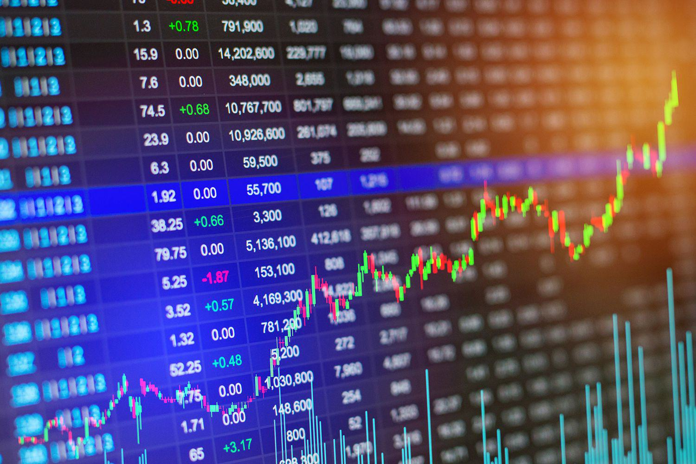

In the ever-evolving landscape of financial markets, a complex interplay of economic factors and technological advancements significantly influences market dynamics. Economic shifts, whether driven by policy changes, global events, or market sentiment, can impact prices and resource allocations, often leading to market distortions. Market distortion occurs when extrinsic factors disrupt the natural operations of the market, causing misaligned prices and inefficient resource distribution. Such distortions can manifest from various sources, including government interventions, subsidies, and monopolistic practices, all of which can alter the natural supply and demand balance.

Technological advancements, particularly algorithmic trading, have added a layer of complexity to market operations. Algorithmic trading employs sophisticated algorithms and high-speed data processing to execute trades with precision and rapidity unreachable by human traders. This capability enhances market efficiency by improving liquidity and narrowing bid-ask spreads; however, it can also exacerbate market distortions, especially during periods of volatility. For instance, the rapid execution of trades can lead to significant price swings, magnifying the effects of existing market imperfections.



Understanding the intricate interplay between economic factors and algorithmic trading is essential for navigating today's financial landscape. As technology continues to transform market structures, identifying how these elements affect market stability and efficiency becomes increasingly important. By comprehending these dynamics, stakeholders can better address the challenges and opportunities that arise within modern economic systems. This article further explores the relevant aspects of financial markets to provide insights into the complex interactions at play.

## Table of Contents

## Understanding Economic Factors Influencing Market Distortion

Economic factors play a crucial role in influencing market distortion by impacting the natural balance of supply and demand. Government policies, subsidies, and taxation are primary factors in this dynamic. When a government implements subsidies, they often artificially inflate prices by encouraging overproduction in sectors like agriculture. This alters the equilibrium price level, where supply exceeds demand, leading to resource misallocation and inefficient market outcomes. Similarly, taxation policies can distort economic behavior by influencing consumer and producer decisions, potentially leading to black markets or tax evasion.

Furthermore, monopolistic power and market dominance by large corporations can significantly distort markets. These entities can reduce competition through practices such as predatory pricing or acquiring potential competitors, which can manipulate prices and reduce consumer choice. The ability to set prices above the competitive level, termed as price maker, allows these corporations to earn supernormal profits at the expense of consumers and overall economic efficiency.

Global economic events provide further instances of market distortion. Financial crises exemplify how such events can precipitate substantial distortions. For instance, during the 2008 financial crisis, the collapse of major financial institutions led to credit market freezes, affecting liquidity and access to capital, which in turn distorted economic activities globally. The ensuing panic also led to volatile asset prices and significant changes in consumption and investment patterns, further distorting economic activities.

These economic factors demonstrate the complex mechanisms through which interventions and market powers can lead to market distortion. Understanding these influences is critical for developing strategies and policies that minimize negative impacts and promote efficient market outcomes.

## Examples of Market Distortion

Government subsidies in agriculture are a prominent example of market distortion, frequently resulting in artificially high prices that encourage overproduction. These subsidies aim to maintain farmer incomes and stabilize the agricultural sector. However, they can disrupt the natural interplay of supply and demand. By guaranteeing minimum prices or offering direct payments based on output levels, subsidies can lead to excessive production, often exceeding consumption needs. This overproduction can result in waste or the necessity for export subsidies to offload surplus onto international markets, affecting global trade dynamics.

Protectionist trade measures, such as tariffs, further demonstrate how interventions can distort markets. Tariffs are taxes imposed on imported goods, designed to protect domestic industries from foreign competition by making imported goods more expensive. While such measures might support local employment and production in the short term, they typically lead to higher prices for consumers and can provoke retaliatory tariffs from other countries. This can escalate into trade conflicts, disrupting international supply chains and creating inefficiencies in global trade.

Monopoly power is another significant source of market distortion. Large corporations, particularly in the tech industry, often exhibit substantial market influence that restricts competition. By controlling vast market shares, these entities can manipulate prices and limit consumer choices. Their dominance allows them to establish barriers to entry that prevent new competitors from emerging. This market power can be detrimental to innovation and consumer welfare, as monopolistic firms may reduce incentives to improve products or lower prices over time.

These examples illustrate the multifaceted nature of market distortions, underscoring the need for careful policy design and regulatory frameworks to address these challenges effectively.

## Algorithmic Trading: A Double-Edged Sword

Algorithmic trading employs automated and complex mathematical algorithms to execute trades with precision and speed far beyond human capability. By leveraging advanced computational techniques, [algorithmic trading](/wiki/algorithmic-trading) seeks to capitalize on temporal inefficiencies in the market. This approach not only facilitates rapid trade execution but also improves market [liquidity](/wiki/liquidity-risk-premium). As liquidity increases, the bid-ask spreads—representing the difference between the price sellers are willing to accept and the price buyers are willing to pay—tend to narrow, leading to more efficient stock pricing.

However, algorithmic trading is not without its pitfalls, particularly in its potential to escalate market [volatility](/wiki/volatility-trading-strategies). A prime example is the 2010 "Flash Crash," where the Dow Jones Industrial Average plunged nearly 1,000 points within minutes, then quickly recovered. This dramatic event was partly attributed to high-frequency trading algorithms that, reacting to market conditions, pulled back liquidity, exacerbating price swings. Such incidents highlight how algorithmic trading, while enhancing liquidity, can also contribute to instability during periods of market stress.

These algorithms function by continuously analyzing vast datasets for patterns and triggers that can influence trading decisions. For instance, they might react to changes in interest rates or geopolitical events that could forecast fluctuations in asset values. Despite their precision and speed, this reliance on data-driven models introduces a complexity where the feedback loops generated by multiple algorithms can disrupt market equilibrium. For example, if several algorithms simultaneously identify a market inefficiency and initiate trades, it may lead to unintended market movements, amplifying volatility.

Furthermore, the competition among financial entities to gain a technological edge has intensified the race toward sophisticated algorithmic strategies. This phenomenon often involves leveraging [machine learning](/wiki/machine-learning) and [artificial intelligence](/wiki/ai-artificial-intelligence) to anticipate market movements with greater accuracy. Yet, while these tools can enhance predictive capabilities, they also necessitate robust risk management protocols to prevent cascading failures in volatile markets.

In conclusion, algorithmic trading is indeed a double-edged sword. It provides significant benefits to market efficiency and liquidity, but its intricacies and speed can also induce volatility. As markets continue to evolve, striking a balance between technological innovation and market stability remains a critical challenge for traders and regulators alike.

## How Economic Factors and Algo Trading Intersect

Algorithmic trading, which utilizes automated systems to execute trades at high speed, is significantly influenced by economic factors such as interest rates and monetary policy. These economic indicators inform market trends and affect trading strategies, often prompting algorithmic traders to adjust their models and approaches to align with prevailing fiscal environments. For instance, lower interest rates may encourage risk-taking behavior and asset acquisition, influencing algorithmic trading models designed to capitalize on such market conditions.

Economic imbalances, which can be aggravated by the extensive use of algorithmic trading, often lead to increased market volatility. During periods of economic instability, algorithmic systems might react to signals that human traders would interpret differently, sometimes resulting in exaggerated market movements. This volatility underscores the necessity for regulatory oversight and strategic intervention to prevent unintended destabilization. Regulatory bodies may implement circuit breakers or impose rules limiting high-frequency trading to maintain market order and protect investors from abrupt and severe price swings.

The role of technology and data analytics is increasingly crucial in understanding and predicting how economic factors affect algorithmic trading patterns. Advanced analytics allow traders to process vast amounts of real-time economic data and integrate it into their algorithmic models. Techniques such as machine learning enable systems to adapt based on historical data patterns, economic reports, and policy announcements, enhancing predictive accuracy. For example, by employing time series analysis, traders can assess the potential impact of an [interest rate](/wiki/interest-rate-trading-strategies) change on stock prices, adjusting their trading strategies accordingly. 

Python, as a versatile programming language, is frequently used to implement these sophisticated trading algorithms. Here is a simplified example demonstrating how Python might be used to simulate the effect of interest rate changes on a stock price using basic forecasting:

```python
import numpy as np
import pandas as pd
from statsmodels.tsa.arima.model import ARIMA

# Sample data: closing prices of a stock
stock_prices = [120, 121, 122, 123, 125, 127, 128, 130, 131, 130]

# Create a pandas series
data = pd.Series(stock_prices)

# Fit ARIMA model (Order p=1, d=1, q=1 is used for demonstration)
model = ARIMA(data, order=(1, 1, 1))
model_fit = model.fit()

# Forecast the effect of a hypothetical interest rate decrease
forecast = model_fit.forecast(steps=3)
print(forecast)
```

In this context, algorithms are increasingly able to simulate various economic scenarios, enhancing a trader's ability to forecast and strategically respond to market forces. Continued advancements in technology promise to further refine these capabilities, allowing algorithmic trading to integrate more seamlessly with economic realities and potentially mitigate distortion effects.

## Mitigating Market Distortion: Technology and Innovation

Technological advancements have emerged as pivotal tools in mitigating market distortion, enhancing both transparency and efficiency in financial markets. One of the foremost technologies transforming market operations is blockchain. Blockchain technology provides a decentralized and immutable ledger system that enhances transparency by allowing all transaction participants to view and verify transactions. This transparency reduces the likelihood of fraudulent activities and ensures that all market players have access to the same data, thereby facilitating a level playing field. According to a study published by the IEEE, blockchain's ability to provide real-time settlement and reduce information asymmetry holds significant promise for reducing market distortions caused by lack of transparency (Zheng et al., 2017).

Another critical technological advancement is big data analytics, which allows for the processing and analysis of vast amounts of market data to detect patterns and predict market movements. By leveraging big data, market participants can gain insights into market trends and make data-driven decisions, improving market efficiency. Big data analytics fosters a proactive approach to market changes, assisting in the identification of potential distortions before they can majorly impact the market.

Machine learning models further augment this predictive capability by training algorithms on historical market data to forecast future trends. Models such as decision trees, neural networks, and support vector machines can analyze complex datasets to predict market fluctuations and potential distortions. For instance, a machine learning model might identify a pattern indicating a potential market bubble, allowing traders and regulators to take preventive measures to mitigate potential negative impacts. Here's a simple example of a Python code snippet that uses machine learning for market trend prediction:

```python
from sklearn.model_selection import train_test_split
from sklearn.ensemble import RandomForestRegressor
import pandas as pd

# Load and preprocess the data
data = pd.read_csv('market_data.csv')
features = data.drop(columns=['Target'])
target = data['Target']

# Split the data
X_train, X_test, y_train, y_test = train_test_split(features, target, test_size=0.2, random_state=42)

# Train the model
model = RandomForestRegressor(n_estimators=100, random_state=42)
model.fit(X_train, y_train)

# Predict future trends
predictions = model.predict(X_test)
```

Innovative trading platforms capitalize on these technologies by offering advanced analytics and trading tools, enabling traders to execute data-informed strategies efficiently. These platforms incorporate real-time data analysis, predictive modeling, and automated trading strategies that respond instantaneously to market changes, thus reducing the lag that often contributes to market distortions.

Regulatory frameworks, reinforced by technology, play a crucial role in mitigating market distortion. By using technology to monitor market activities, regulators can detect anomalies and undesirable patterns indicative of market manipulation. Proactive regulation, informed by technological innovation, can help maintain market integrity and stability. The European Union's Markets in Financial Instruments Directive II (MiFID II) exemplifies such a regulatory approach, leveraging technology to enhance transparency and protect investors.

In conclusion, as financial markets become increasingly complex, integrating technological innovation with regulatory measures offers a robust solution to mitigating market distortions. Blockchain, big data analytics, machine learning, and innovative trading platforms together create a resilient ecosystem that not only enhances market efficiency but also ensures a fair and transparent trading environment for all.

## Conclusion

Understanding the complex interplay between economic factors, market distortions, and algorithmic trading is essential for effectively navigating the contemporary financial landscape. Algorithmic trading, which leverages advanced algorithms to optimize trading operations, offers significant advantages such as increased efficiency and liquidity. However, these benefits come with inherent risks, particularly the potential for heightened market volatility if algorithmic strategies malfunction or interact in unpredictable ways. This underscores the necessity for balanced regulatory measures aimed at mitigating adverse impacts on market stability. 

Strategic regulation involves setting parameters that ensure the functioning of algorithmic trading systems aligns with broader market stability goals. For instance, implementing circuit breakers can prevent excessive trading-induced fluctuations by temporarily halting trading during sharp market movements. Moreover, transparent disclosure requirements and robust compliance regimes can ensure that market participants adhere to practices that promote fair trading conditions.

Continued innovation within technology holds promise for addressing these market challenges. Technologies such as blockchain and big data analytics offer enhanced transparency and efficiency, aiding in the detection and correction of market anomalies. These tools can be instrumental in monitoring market activities and identifying potential distortions before they escalate. Furthermore, machine learning models provide valuable insights by predicting changes in market conditions, allowing stakeholders to adapt strategies swiftly and effectively.

In conclusion, while algorithmic trading enhances financial market operations, it is crucial to manage its integration carefully to avoid destabilizing effects. Ongoing technological advancements provide the necessary framework to tackle these challenges, fostering more stable and sustainable economic growth. By embracing both regulatory and innovative approaches, financial markets can better accommodate the complexities of modern economic dynamics.

## References & Further Reading

[1]: Bergstra, J., Bardenet, R., Bengio, Y., & Kégl, B. (2011). ["Algorithms for Hyper-Parameter Optimization."](https://dl.acm.org/doi/10.5555/2986459.2986743) Advances in Neural Information Processing Systems 24.

[2]: ["Advances in Financial Machine Learning"](https://www.amazon.com/Advances-Financial-Machine-Learning-Marcos/dp/1119482089) by Marcos Lopez de Prado

[3]: ["Evidence-Based Technical Analysis: Applying the Scientific Method and Statistical Inference to Trading Signals"](https://www.amazon.com/Evidence-Based-Technical-Analysis-Scientific-Statistical/dp/0470008741) by David Aronson

[4]: Zheng, Z., Xie, S., Dai, H., & Wang, H. (2017). ["An Overview of Blockchain Technology: Architecture, Consensus, and Future Trends."](https://ieeexplore.ieee.org/document/8029379) In 2017 IEEE International Congress on Big Data (BigData Congress).

[5]: ["Machine Learning for Algorithmic Trading"](https://github.com/stefan-jansen/machine-learning-for-trading) by Stefan Jansen

[6]: ["Quantitative Trading: How to Build Your Own Algorithmic Trading Business"](https://github.com/LucindaYa/quant-resources/blob/master/Quantitative%20Trading%20How%20to%20Build%20Your%20Own%20Algorithmic%20Trading%20Business.pdf) by Ernest P. Chan