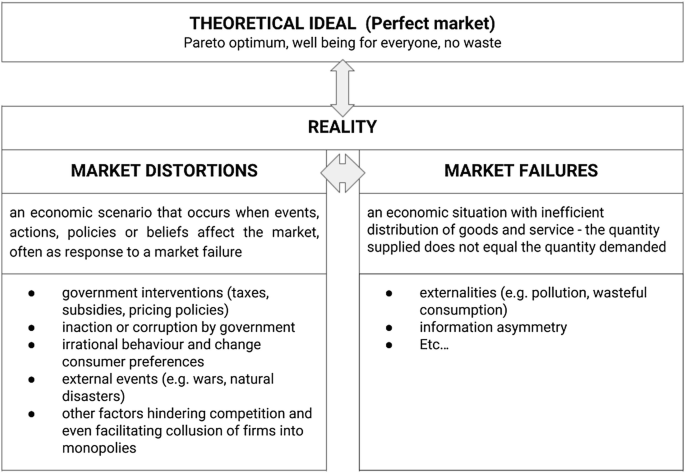

## Table of Contents

## What is market distortion?

Market distortion happens when something stops the market from working the way it should. This can be because of rules made by the government, big companies controlling prices, or other things that make it hard for the market to be fair. When the market is distorted, prices might not show what things are really worth, and it can be tough for new businesses to start up.

For example, if the government puts a tax on a product, it can make that product more expensive than it should be. This can lead to people buying less of it, even if they really need it. Another example is when a few big companies agree to keep prices high. This stops other companies from coming in and offering lower prices, which is bad for customers who end up paying more.

## What are the common causes of market distortion?

Market distortion often happens because of government policies. When governments set rules like taxes, subsidies, or price controls, they can change how the market works. For example, if the government puts a high tax on a product, it can make that product more expensive than it should be. This can lead to people buying less of it, even if they really need it. On the other hand, subsidies can make some products artificially cheap, which can make other businesses struggle to compete.

Another big cause of market distortion is when big companies have too much power. If a few large companies control most of the market, they might agree to keep prices high. This is called a monopoly or oligopoly. When this happens, it's hard for new businesses to start up because they can't offer lower prices. This can be bad for customers who end up paying more than they should.

Sometimes, market distortion can also come from things like imperfect information or external factors. If people don't have all the information they need to make good choices, they might buy things that aren't worth the price. External factors, like natural disasters or sudden changes in technology, can also mess up the market by changing how much of a product is available or how much it costs to make.

## How do government policies contribute to market distortion?

Government policies can cause market distortion by changing how the market works. One way they do this is by setting taxes on products. When a government puts a high tax on something, it makes that product more expensive than it should be. This can make people buy less of it, even if they really need it. For example, if there's a big tax on cigarettes, fewer people might buy them, which can change how the market for cigarettes works.

Another way government policies can distort the market is through subsidies. Subsidies are when the government gives money to businesses to make their products cheaper. This can make some products artificially cheap, which can be tough for other businesses that don't get subsidies. They might struggle to compete because their products are more expensive. For instance, if farmers get subsidies to grow certain crops, it can make those crops cheaper than others, which can mess up the market for all kinds of food.

Price controls are another policy that can cause market distortion. When the government sets a maximum price for a product, it can lead to shortages because businesses might not want to sell at that low price. On the other hand, if the government sets a minimum price, it can lead to a surplus because people might not want to buy at that high price. Both situations can stop the market from working the way it should, making it hard for supply and demand to balance out naturally.

## Can market distortion occur in both financial and goods markets?

Yes, market distortion can happen in both financial and goods markets. In goods markets, it can happen when the government sets rules like taxes or subsidies that change the prices of products. For example, if the government puts a high tax on a product, it can make that product more expensive than it should be. This can lead to people buying less of it, even if they really need it. On the other hand, subsidies can make some products artificially cheap, which can make it hard for other businesses to compete.

In financial markets, market distortion can also happen because of government policies or the actions of big companies. For instance, if the government sets rules that limit how much interest banks can charge on loans, it can make it hard for banks to make money. This can lead to fewer loans being available, which can mess up the financial market. Also, if a few big companies control most of the financial market, they might keep prices high, making it tough for new businesses to start up and offer better deals.

Both types of markets can be affected by imperfect information or external factors too. If people don't have all the information they need, they might make bad choices about what to buy or invest in. And things like natural disasters or big changes in technology can also cause market distortion by changing how much of a product is available or how much it costs to make.

## What role do monopolies and oligopolies play in causing market distortion?

Monopolies and oligopolies can cause market distortion by having too much control over the market. A monopoly happens when one company controls almost everything in a market. They can set high prices because there's no one else to compete with them. This makes it hard for new businesses to start up because they can't offer lower prices. Customers end up paying more than they should, which is not fair. An example is if one company controls all the water in a city, they can charge whatever they want, and people have to pay it because they need water.

Oligopolies are similar but involve a few big companies instead of just one. These companies might agree to keep prices high, which is called collusion. This stops other companies from coming in and offering lower prices. It's bad for customers because they have to pay more, and it's bad for the market because it doesn't work the way it should. For example, if a few big companies control the oil market, they can keep gas prices high, even if it costs less to make the gas. This makes it hard for new oil companies to start up and offer cheaper gas.

## How do subsidies and tariffs lead to market distortion?

Subsidies can lead to market distortion by making some products artificially cheap. When the government gives money to businesses to help them produce certain goods, it can make those goods cheaper than others. This can be tough for other businesses that don't get subsidies because they have to sell their products at a higher price. For example, if farmers get subsidies to grow wheat, wheat might become cheaper than other crops. This can make it hard for farmers who grow other crops to compete, and it can mess up the market for all kinds of food.

Tariffs also cause market distortion by making imported goods more expensive. When a government puts a tax on goods coming from other countries, it raises the price of those goods. This can make people buy more of the goods made in their own country, even if the imported goods are better or cheaper without the tax. For example, if there's a tariff on imported cars, people might buy more cars made at home, even if the imported cars are better. This can protect local businesses but can also lead to higher prices for customers and fewer choices in the market.

## What are the economic impacts of market distortion on consumers and producers?

Market distortion can have big effects on consumers. When the market isn't working right, consumers might have to pay more for things than they should. This can happen if there are too many taxes on a product or if big companies are keeping prices high. Consumers might also have fewer choices because it's hard for new businesses to start up and compete. This can make it tough for people to find what they need at a good price. For example, if there's a high tax on a product, people might buy less of it even if they really need it, which can make their lives harder.

Producers can also be affected by market distortion. If the government gives subsidies to some businesses but not others, it can make it hard for the businesses without subsidies to compete. They might have to sell their products at higher prices, which can make it hard to make money. On the other hand, if there are tariffs on imported goods, local producers might be protected, but they might also get lazy because they don't have to worry about competition. This can stop them from trying to make better products or find ways to make things cheaper. In the end, market distortion can make it hard for producers to do their best and for the market to work the way it should.

## Can market distortion be beneficial in certain scenarios?

Market distortion can sometimes be good in certain situations. For example, the government might use subsidies to help important industries like farming or renewable energy. This can make food cheaper for people or help the environment by making green energy more affordable. Without these subsidies, these industries might struggle to grow, and people might not be able to afford the things they need.

Another way market distortion can be helpful is when the government uses tariffs to protect local businesses. If a country is just starting to make a product, it might need some help to compete with big companies from other countries. Tariffs can give these new businesses a chance to grow and create jobs. While this might make some things more expensive for a while, it can help the economy in the long run by making the country less dependent on other countries for important goods.

## How can market distortion be measured and quantified?

Market distortion can be measured by looking at how prices are different from what they should be in a fair market. Economists use something called the "price distortion index" to see how much prices are affected by things like taxes, subsidies, or big companies controlling the market. They compare the actual price of a product to what it would be if the market was working perfectly. If the difference is big, it means there's a lot of distortion.

Another way to measure market distortion is by looking at how much a product is being bought and sold. If there's a lot of distortion, the amount of a product being sold might be very different from what people really need. Economists can use data on supply and demand to see if the market is working right. If the market is distorted, there might be too much or too little of a product, which can show how big the distortion is.

## What are some historical examples of significant market distortions?

One big example of market distortion happened during the Great Depression in the 1930s. The U.S. government tried to help farmers by buying their crops and destroying them to keep prices high. This was called the Agricultural Adjustment Act. It made food more expensive for people who were already struggling to get by. The government thought it would help farmers, but it ended up making the market for food very distorted. People couldn't afford to buy what they needed, and it made the economic problems even worse.

Another example is the oil crisis in the 1970s. Some countries in the Middle East decided to stop selling oil to the United States because they didn't like U.S. support for Israel. This caused a big shortage of oil and made gas prices go way up. The U.S. government tried to fix the problem by putting price controls on gas, but this made things worse. People had to wait in long lines at gas stations, and some stations ran out of gas completely. The market for oil was very distorted because of the actions of the oil-producing countries and the U.S. government's response.

## What strategies can be implemented to mitigate or prevent market distortion?

One way to reduce market distortion is by making sure there are good rules in place. Governments can help by making laws that stop big companies from controlling prices or keeping new businesses out. They can also look at how taxes and subsidies affect prices and try to make them fairer. For example, if a tax is making a product too expensive, the government might lower it or find another way to raise money. By keeping an eye on the market and making changes when needed, governments can help make sure prices are fair and that everyone has a chance to compete.

Another strategy is to make sure people have all the information they need to make good choices. If people know what things really cost and how they are made, they can make better decisions about what to buy. This can help the market work better because people will buy things that are worth the price. Governments and businesses can work together to share this information and make it easy for people to understand. By doing this, they can reduce market distortion and make sure the market is working the way it should.

## How do global trade agreements influence market distortion?

Global trade agreements can help reduce market distortion by making trade between countries fairer. When countries agree to lower tariffs and other barriers, it can make goods cheaper and easier to buy from other places. This can help stop big companies in one country from keeping prices high, because they have to compete with companies from other countries. It also gives new businesses a chance to start up and sell their products in other countries, which can make the market more competitive and fair.

But sometimes, global trade agreements can also cause market distortion. If one country gets a lot of subsidies for its businesses, it can make their products cheaper than they should be. This can make it hard for businesses in other countries to compete, even if they are part of a trade agreement. Also, if the rules in the agreement are not fair, some countries might end up with more power than others. This can lead to market distortion because the market is not working the same way for everyone.

## References & Further Reading

[1]: Bergstra, J., Bardenet, R., Bengio, Y., & Kégl, B. (2011). ["Algorithms for Hyper-Parameter Optimization."](https://dl.acm.org/doi/10.5555/2986459.2986743) Advances in Neural Information Processing Systems 24.

[2]: ["Advances in Financial Machine Learning"](https://www.amazon.com/Advances-Financial-Machine-Learning-Marcos/dp/1119482089) by Marcos Lopez de Prado

[3]: ["Evidence-Based Technical Analysis: Applying the Scientific Method and Statistical Inference to Trading Signals"](https://www.amazon.com/Evidence-Based-Technical-Analysis-Scientific-Statistical/dp/0470008741) by David Aronson

[4]: Zheng, Z., Xie, S., Dai, H., & Wang, H. (2017). ["An Overview of Blockchain Technology: Architecture, Consensus, and Future Trends."](https://ieeexplore.ieee.org/document/8029379) In 2017 IEEE International Congress on Big Data (BigData Congress).

[5]: ["Machine Learning for Algorithmic Trading"](https://github.com/stefan-jansen/machine-learning-for-trading) by Stefan Jansen

[6]: ["Quantitative Trading: How to Build Your Own Algorithmic Trading Business"](https://github.com/LucindaYa/quant-resources/blob/master/Quantitative%20Trading%20How%20to%20Build%20Your%20Own%20Algorithmic%20Trading%20Business.pdf) by Ernest P. Chan