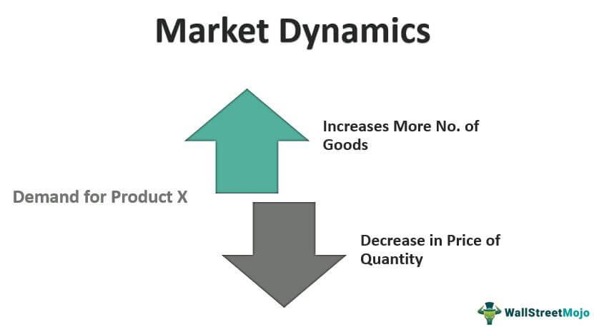

The constantly evolving economic landscape is influenced by numerous factors shaping market dynamics. These dynamics reflect the complex interactions between market participants and external variables, which collectively dictate the movement and pricing of goods and services. This article explores key concepts such as market analysis, market dynamics, and algorithmic trading through economic examples that elucidate these interactions. A thorough grasp of these elements can provide significant insights into market behavior and trends.

Market analysis plays a vital role in understanding the trends, risks, and opportunities within an economic environment. It involves evaluating consumer behaviors, competitive forces, and external market influences, utilizing various economic models to predict future market movements. By comparing past and present data, stakeholders can recognize patterns and forecast possible future scenarios.



Market dynamics pertain to the forces impacting the behaviors of producers and consumers, subsequently affecting pricing signals in the economy. The interplay of supply and demand, alongside external factors like government policies and global events, determines market equilibrium and fluidity. Understanding these dynamics provides insight into price fluctuations, economic stability, and the competitive landscape within industries.

Algorithmic trading represents a revolutionary advancement in market operations, utilizing computer algorithms to execute trades at speeds beyond human capacity. This method contributes to market dynamics by increasing efficiency, liquidity, and accessibility in trading environments. It has significantly altered traditional market structures, introducing both new opportunities and challenges.

Together, these dynamics affect pricing strategies, economic stability, and the competitive environment, highlighting the importance of a comprehensive approach in market analysis. As we traverse through this article, we aim to illuminate how these components interact, offering valuable insights for navigating and understanding the complex terrain of the modern economy.

## Table of Contents

## Understanding Market Dynamics

Market dynamics encompass the interplay of various forces that shape the behavior of both producers and consumers within an economic system, subsequently influencing pricing signals. At the core of market dynamics lie the principles of supply and demand, which serve as fundamental determinants of market equilibrium and fluidity.

Supply and demand operate in tandem to establish market equilibrium, a state where the quantity of goods demanded by consumers equals the quantity supplied by producers. This relationship can be graphically represented through supply and demand curves, where the intersection denotes the equilibrium price and quantity. Adjustments in either supply or demand can disrupt this balance, leading to variations in market prices.

Price elasticity is a critical [factor](/wiki/factor-investing) in shaping market dynamics. It measures the responsiveness of quantity demanded or supplied to changes in price. If a product is highly elastic, small price changes result in significant shifts in the quantity demanded or supplied. Understanding elasticity allows businesses and policymakers to predict how changes in prices might affect market behavior.

The structure of competition also significantly impacts market dynamics. Markets can range from perfect competition, with numerous small firms and homogeneous products, to monopolies, with a single firm dominating and exerting significant control over prices. These structures influence how market forces operate and interact, affecting pricing strategies and consumer choices.

Seasonality introduces another layer of complexity to market dynamics. Various industries experience fluctuations in supply and demand due to seasonal variations, such as increased retail demand during holidays or agricultural products' supply changes due to harvest cycles. Anticipating these patterns is crucial for maintaining market stability and planning production and marketing strategies.

In analyzing market dynamics, it's essential to consider the implications of supply-side and demand-side economics. Supply-side economics focuses on policies that enhance production capabilities, such as tax cuts for businesses or deregulation, with the expectation of increasing supply, lowering prices, and stimulating economic growth. Conversely, demand-side economics emphasizes boosting consumer spending and aggregate demand, typically through governmental spending or reducing personal taxes, to drive economic activity.

Understanding these distinct economic approaches helps policymakers craft strategies that harness market dynamics for desired outcomes. For example, a government might adopt demand-side strategies during a recession to boost consumer spending and stimulate economic growth. Alternatively, supply-side policies might be favored to foster long-term economic development by encouraging production and investment.

## Market Analysis and Its Importance

Market analysis is a pivotal tool in understanding the dynamics of any given market. It involves a thorough assessment of market trends, consumer behaviors, and the competitive pressures that shape the commercial environment. Utilizing economic models within market analysis allows stakeholders to gain strategic insights, providing a foundation from which businesses can tailor effective strategies.

Economic models serve as frameworks for analyzing the relationships between various market factors. For example, the supply and demand model helps to predict how changes in market conditions can affect price levels and quantities. This model is fundamental as it links consumer behavior with pricing strategies, helping businesses understand how to position themselves competitively. More advanced models, such as the SWOT analysis (assessing strengths, weaknesses, opportunities, and threats), enable businesses to evaluate their market position relative to competitors and market conditions.

Incorporating market analysis with an understanding of market dynamics gives a comprehensive picture of the economic landscape. This approach allows businesses to anticipate shifts in consumer preferences, technological advancements, and regulatory changes. By understanding these movements, companies can design strategies that are aligned with current and future market conditions, ensuring they remain competitive and relevant.

Case studies of successful companies illustrate the crucial role of accurate market analysis in business decision-making. For instance, Netflix's transition from DVD rentals to a streaming service was a strategic move rooted in detailed market analysis. By understanding emerging internet trends and shifting consumer preferences towards on-demand content, Netflix was able to position itself as a leader in the entertainment industry. This transformation showcases how market analysis can uncover opportunities that lead to significant competitive advantages.

In conclusion, market analysis is indispensable for businesses seeking to navigate complex market environments. It provides the necessary insights to adapt to market dynamics and consumer behavior shifts, offering a strategic edge in decision-making processes. As markets continue to evolve, the ability to perform and act upon thorough market analysis remains a key factor in achieving sustained business success.

## Algorithmic Trading and Market Dynamics

Algorithmic trading employs sophisticated computer algorithms to execute trading strategies at speeds far exceeding human capabilities. This technological advancement has significantly impacted market dynamics, particularly in terms of trade efficiency, [liquidity](/wiki/liquidity-risk-premium), and market accessibility.

The efficiency introduced by [algorithmic trading](/wiki/algorithmic-trading) is primarily attributed to its ability to process vast amounts of data in real-time, enabling rapid execution of trades based on pre-defined criteria. This instantaneous action reduces the time lag associated with manual trading and minimizes the opportunity for adverse price movements. Consequently, markets have seen enhanced liquidity as algorithmic trading facilitates more frequent transactions and narrower bid-ask spreads, thus improving overall market fluidity.

Additionally, algorithmic trading has democratized market access. Previously dominated by large financial institutions, markets have become more accessible to smaller firms and individual investors due to the proliferation of algorithmic trading platforms. These platforms often incorporate features like automated risk management tools and customizable trading strategies, leveling the competitive playing field.

The rise of algorithmic trading has not only transformed traditional market structures but has also altered competitive environments. High-frequency trading ([HFT](/wiki/high-frequency-trading-strategies)), a subset of algorithmic trading characterized by extremely high speeds, exemplifies this transformation. HFT firms often compete based on speed and technological infrastructure, shifting the focus from traditional financial analysis to technological prowess.

However, the influence of algorithmic trading is not without risks and challenges. The flash crash of May 6, 2010, prompted scrutiny into the systemic risks posed by algorithmic trading. This phenomenon, a rapid and significant market decline, highlighted the potential for algorithms to exacerbate market [volatility](/wiki/volatility-trading-strategies). While safeguards such as circuit breakers have been implemented to mitigate these risks, the complexity of interactions among multiple algorithmic systems can still lead to unforeseen consequences.

Furthermore, there are concerns regarding the opacity of algorithmic strategies. These strategies are often proprietary and lack transparency, posing challenges for regulators tasked with ensuring fair market practices. Despite these risks, the benefits of enhanced efficiency and liquidity often outweigh the drawbacks, as evidenced by the continued growth and adoption of algorithmic trading.

As algorithmic trading continues to evolve, its impact on market dynamics will likely become even more pronounced. Advances in [machine learning](/wiki/machine-learning) and [artificial intelligence](/wiki/ai-artificial-intelligence) offer the potential for even more sophisticated and adaptive trading strategies, further transforming how traders and institutions approach the market. This ongoing evolution necessitates continuous examination of both the benefits and risks associated with algorithmic trading to ensure stable and efficient market operations.

## Economic Examples Illustrating Market Dynamics

Renewable energy transformations are a prime example of how market dynamics can significantly alter entire sectors. Technological innovations, such as advances in solar panel efficiency and wind turbine design, have greatly reduced the cost of renewable energy production. This decrease in cost has shifted consumer preferences towards cleaner energy sources, aligning with global trends in environmental consciousness and regulation. Regulatory changes, such as government incentives and carbon taxes, have further accelerated this shift, creating a favorable environment for the growth of renewable energy sectors.

These dynamics are illustrative of how various forces interact. As technological advancements reduce costs, the price elasticity of demand for renewable energy becomes more favorable, leading to higher adoption rates. Simultaneously, regulations play a crucial role in shaping the competitive landscape by encouraging investment and market entry into the renewable sector. This interaction aligns with fundamental market dynamics theories, where technological, regulatory, and consumer preference shifts drive market changes.

The housing market cycle offers another perspective on how market dynamics can impact economic stability and cycles. Seasonality plays a significant role in housing markets, with demand typically rising in spring and summer months due to favorable weather and family schedules aligning with school years. This seasonal variation affects pricing and inventory levels, leading to cyclical patterns in housing market activity.

Regulatory impacts, such as changes in interest rates and housing policies, can significantly alter market dynamics by influencing borrowing costs and demand for housing. For example, a reduction in interest rates generally decreases mortgage costs, boosting housing demand and prices. Conversely, stringent lending regulations can suppress activity by making it harder for consumers to qualify for loans.

These examples provide empirical evidence of theoretical market dynamics concepts, showcasing their applications in real-world scenarios. By understanding the interplay of technological changes, consumer preferences, and regulatory environment, stakeholders can better anticipate shifts in market dynamics and adapt strategies accordingly.

## Strategic Implications for Stakeholders

Understanding market dynamics is crucial for stakeholders such as policymakers, business leaders, and investors to develop informed strategies that respond effectively to economic changes. This understanding begins with the alignment of business models with both current and anticipated market dynamics. By recognizing shifts in consumer preferences, technological advancements, and regulatory environments, stakeholders can tailor their strategies to maintain competitiveness and sustainability.

Incorporating proactive measures like scenario planning and risk management frameworks is essential for building resilience against market uncertainties. Scenario planning involves exploring different future possibilities and preparing strategies for potential challenges or opportunities these might present. For instance, businesses can develop multiple financial models using Python to simulate potential market outcomes:

```python
import numpy as np

# Parameters for scenario planning
initial_investment = 100000  # Initial investment in USD
growth_rates = np.array([0.03, 0.05, 0.07])  # Different growth rates
years = 5

# Calculating future values for different growth scenarios
future_values = initial_investment * (1 + growth_rates) ** years
print(future_values)
```

Risk management frameworks further enhance an organization's capacity to manage uncertainties by identifying, assessing, and prioritizing risks. These frameworks enable businesses to develop strategies that mitigate potential adverse effects on operations and profitability.

The utilization of advanced analytical tools and algorithmic trading is pivotal in reinforcing strategic decision-making capabilities. Analytical tools provide stakeholders with data-driven insights that enhance understanding of market trends and consumer behaviors. These insights are crucial for predicting market movements and making informed investment decisions.

Algorithmic trading, on the other hand, offers efficiency and precision in executing trading strategies. By employing algorithms, traders can analyze vast datasets in real-time, identify optimal trading opportunities, and execute trades with minimal human intervention. This not only increases market liquidity but also reduces transaction costs and enhances market accessibility.

In conclusion, stakeholders who strategically incorporate market dynamics into their decision-making processes are better equipped to navigate volatile economic environments. By leveraging advanced technologies and frameworks, they can capitalize on market opportunities while mitigating potential risks, thus achieving sustainable competitive advantages.

## Conclusion

Economic and market dynamics are intricate yet paramount for comprehending the broader economic landscape. These dynamics play critical roles in influencing pricing, economic stability, and competitive environments. By incorporating market analysis and algorithmic trading insights, businesses and stakeholders can achieve a finer grasp of market conditions, which enhances operational efficiency and enables strategic decision-making.

Market analysis serves as a foundational tool, providing a comprehensive assessment of trends, consumer behavior, and competitive forces. When combined with algorithmic trading, which employs advanced computational strategies to execute trades at high speed, stakeholders gain a nuanced understanding of market operations. Algorithmic trading contributes to market dynamics by increasing efficiency in trade execution, enhancing liquidity, and improving market accessibility. This synergy between analysis and execution ensures that firms are better equipped to navigate volatile economic environments.

Having a firm grasp of these market dynamics yields significant competitive advantages. Businesses can tailor their strategies to align with current and future market conditions, thereby mitigating risks. This involves using advanced analytical tools to derive insights that support decision-making processes and adopting scenario planning and risk management frameworks to enhance resilience against market uncertainties.

The ongoing evolution of market dynamics is driven by technological advancements and continuous research. Innovations in data analytics, machine learning, and financial technologies promise to reshape our understanding and capabilities in market analysis and trading. These developments suggest a future where market dynamics are even more multifaceted but also more comprehensible and manageable for those equipped to harness them. As such, stakeholders invested in maintaining a competitive edge must remain adaptable, leveraging new tools and insights to stay ahead in an ever-changing economic landscape.

## References & Further Reading

[1]: Chincarini, L. B., & Kim, D. (2006). ["Quantitative Equity Portfolio Management: An Active Approach to Portfolio Construction and Management."](https://www.amazon.com/Quantitative-Equity-Portfolio-Management-Construction/dp/0071459391) McGraw-Hill.

[2]: Hendershott, T., Jones, C. M., & Menkveld, A. J. (2011). ["Does Algorithmic Trading Improve Liquidity?"](https://onlinelibrary.wiley.com/doi/full/10.1111/j.1540-6261.2010.01624.x) The Review of Financial Studies, 24(8), 2205-2244.

[3]: MacKenzie, D. (2020). ["Trading at the Speed of Light: How Ultrafast Algorithms are Transforming Financial Markets."](https://ieeexplore.ieee.org/document/9647710) Princeton University Press.

[4]: Sornette, D. (2009). ["Why Stock Markets Crash: Critical Events in Complex Financial Systems."](https://www.jstor.org/stable/j.ctt1h1htkg) Princeton University Press.

[5]: Hull, J. C. (2017). ["Options, Futures, and Other Derivatives."](https://books.google.com/books/about/Options_Futures_and_Other_Derivatives_eB.html?id=2iopDwAAQBAJ) Pearson.