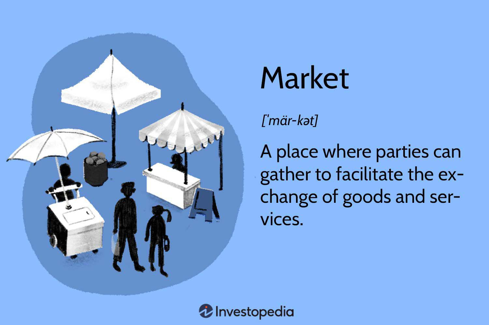

Understanding the types of economic markets and the strategies governing trades is imperative in economics and finance. Market participants, ranging from individual investors to large institutions, rely on this knowledge to navigate the complexities of global and local economies effectively. This article will explore the characteristics of different market types and the pivotal role of algorithmic trading within these markets.

Traditionally, markets operate on physical exchanges, where commodities, stocks, and other financial instruments are traded. However, technological advancements have ushered in high-frequency virtual trades, where algorithms now play a transformative role. Algorithms have fundamentally reshaped modern trading, optimizing trading strategies that not only improve investment outcomes but also enhance market liquidity. Moreover, they possess the attributes to significantly reduce the margin of human error by providing precise, emotion-free transaction executions.



Algorithmic trading offers a robust framework through which multiple trading paradigms can operate, from simple rule-based transactions to complex data-driven strategies that encompass statistical models and machine learning. By automating these processes, investors are empowered to execute large volumes of trade with minimal human oversight, executing trades swiftly and efficiently. This not only mitigates the risk of human error but also opens up opportunities to exploit market inefficiencies, ultimately leading to enhanced market performance.

As the financial landscape continues to evolve, algorithmic trading is a critical component reshaping financial markets. The integration of algorithms in trading processes is not merely an enhancement but a pivotal shift, marking a departure from traditional trading practices to a more sophisticated, technology-driven approach. Understanding these dynamics allows investors to better engage with and leverage the power of algorithmic strategies.

Our exploration will focus on how algorithms, combined with extensive market data and strategic foresight, are reshaping how we understand and interact with financial markets. The evolving landscape necessitates a rethinking of investment strategies and an appreciation of the technological forces at play, paving the way for a new era in finance where technology and market acumen collaborate to optimize performance and innovation.

## Table of Contents

## Different Types of Economic Markets

Economic markets can be analyzed based on the nature of their participants, the commodities traded, and their operational frameworks. These markets fundamentally shape the economic landscape by influencing resource allocation and price formation.

**Physical Markets**

Physical markets, such as retail and wholesale markets, are characterized by face-to-face transactions involving tangible goods. Retail markets serve end consumers, with goods being sold directly to individuals, while wholesale markets typically involve the redistribution of large quantities to retailers or other intermediaries. Both rely on supply and demand dynamics to establish pricing structures, where higher demand relative to supply increases prices, and vice-versa.

**Virtual Markets**

Virtual markets, enabled by technological advancements, facilitate trading through online platforms that connect buyers and sellers digitally. These markets encompass a wide range of commodities, from consumer goods to financial instruments. Online trading platforms have revolutionized traditional markets by increasing accessibility, reducing transaction costs, and allowing for a broader range of participants to engage.

**Specialized Markets**

Specialized markets focus on specific commodities or sectors, such as financial, housing, or commodity markets. Financial markets deal with securities like stocks, bonds, and derivatives, playing a crucial role in capital allocation and risk management. Housing markets, on the other hand, focus on real estate and are influenced significantly by factors like interest rates, employment levels, and consumer confidence. Commodity markets encompass the trading of raw or primary products like oil, metals, and agricultural goods. These markets are often characterized by high [volatility](/wiki/volatility-trading-strategies) and can be influenced by geopolitical events and natural conditions.

**Role of Supply and Demand**

Supply and demand form the backbone of market price determination. The equilibrium price in any market is reached when the quantity supplied equals the quantity demanded. This equilibrium ensures an efficient allocation of resources where no participant has the incentive to change their behavior, thereby leading to an optimal distribution from a market perspective. In mathematical terms:

$$
Q_d = Q_s
$$

Where $Q_d$ is the quantity demanded and $Q_s$ is the quantity supplied. Deviations from equilibrium result in price fluctuations until stability is restored.

**Challenges and Regulatory Aspects**

Different types of markets face unique challenges and necessitate varying levels of oversight and regulation. Physical markets require regulatory frameworks to prevent fraudulent practices and ensure consumer protection. Virtual markets must address issues like cybersecurity, data privacy, and the digital divide to ensure fair access and integrity of transactions. Specialized markets, particularly financial and commodity markets, often operate under stringent regulations to mitigate systemic risks, prevent excess speculation, and ensure transparent price discovery processes.

Regulatory bodies such as the U.S. Securities and Exchange Commission (SEC) or the Commodity Futures Trading Commission (CFTC) are tasked with enforcing rules and maintaining the function of these markets. Their oversight is vital in fostering investor confidence and enhancing the stability and integrity of economic markets worldwide.

## Understanding Algorithmic Trading

Algorithmic trading, commonly known as algo-trading, involves the use of computer programs to execute trades according to predetermined criteria. This approach has reshaped financial markets by enhancing efficiency and accuracy while reducing the influence of human emotions.

### History and Evolution

The roots of [algorithmic trading](/wiki/algorithmic-trading) can be traced back to the early 1970s when the New York Stock Exchange introduced designated order turnaround (DOT) systems for routing orders electronically. As technology advanced, the 1980s and 1990s witnessed the emergence of more sophisticated algorithms, paving the way for the high-frequency trading ([HFT](/wiki/high-frequency-trading-strategies)) seen today. This evolution was driven by improvements in computational power, data handling capabilities, and network infrastructure, transforming markets by increasing trading speed and [volume](/wiki/volume-trading-strategy).

### Minimizing Human Emotion

Algorithms are fundamentally designed to ensure consistency in trading by executing trades based on logic rather than emotion. Human traders are prone to biases such as fear and greed, which can result in irrational decision-making. In contrast, algorithms operate within the strict confines of predefined rules, executing trades with precision and impartiality. This systematic nature helps in minimizing errors commonly associated with manual trading.

### Trading Strategies

Several algorithmic trading strategies cater to different market conditions and objectives:

- **Trend-following:** This strategy capitalizes on momentum, where trades are executed based on the analysis of market trends. Algorithms monitor price movement and execute buy or sell orders based on the direction of the trend.

- **Arbitrage:** This involves exploiting price discrepancies in different markets or instruments. For instance, if a security is priced differently in two markets, an algorithm would simultaneously buy in the market where the price is lower and sell in the one where it is higher, thus making a profit from the spread.

- **Mean Reversion:** Based on the theory that prices will eventually return to their average, this strategy involves buying securities that are below their historical average and selling those above. Algorithms analyze historical data to predict reversion points.

### Technical Requirements and Skills

Implementing algorithmic trading requires robust technical infrastructure, including high-performance computing systems capable of processing vast amounts of data in real-time. Additionally, low-latency networks are crucial for executing trades at optimal speeds without delay. 

From a skill perspective, proficiency in programming languages such as Python or C++ is essential for creating and implementing trading algorithms. Knowledge of quantitative finance, [statistics](/wiki/bayesian-statistics), and [machine learning](/wiki/machine-learning) further aids in developing sophisticated models tailored to market needs. Here's a simple Python example of a basic trend-following strategy using moving averages:

```python
import pandas as pd

def moving_average_strategy(data, short_window, long_window):
    signals = pd.DataFrame(index=data.index)
    signals['price'] = data['price']
    signals['short_mavg'] = data['price'].rolling(window=short_window, min_periods=1).mean()
    signals['long_mavg'] = data['price'].rolling(window=long_window, min_periods=1).mean()

    signals['signal'] = 0.0
    signals['signal'][short_window:] = np.where(signals['short_mavg'][short_window:] > signals['long_mavg'][short_window:], 1.0, 0.0)   
    signals['positions'] = signals['signal'].diff()

    return signals

# Example usage
# data = pd.DataFrame({'price': [your_price_data]})
# signals = moving_average_strategy(data, short_window=40, long_window=100)
```

The future of algorithmic trading promises further innovation with the adoption of [artificial intelligence](/wiki/ai-artificial-intelligence) and machine learning, allowing for more adaptive and predictive models that react dynamically to market conditions. Understanding these principles and technical aspects is crucial for anyone looking to engage in this sophisticated form of trading.

## Advantages and Disadvantages of Algorithmic Trading

Algorithmic trading has revolutionized the finance industry by utilizing sophisticated programs to execute trades with remarkable speed and accuracy. One of the primary advantages of algorithmic trading is its ability to operate continuously, 24 hours a day, without the necessity for human intervention. This round-the-clock operation facilitates trading across global markets, ensuring that trading opportunities are not missed due to time constraints or human availability.

The precision and speed with which algorithmic systems execute trades are unmatched by human traders. Algorithms can process vast amounts of market data in real-time, ensuring that trades are executed at the desired price points with minimal slippage. This is particularly advantageous in high-frequency trading (HFT), where trades are executed in fractions of a second to capitalize on small price discrepancies.

Another significant benefit of algorithmic trading is its capacity to minimize human error and emotional decision-making. Emotions such as fear and greed can lead to irrational trading decisions, often resulting in poor investment outcomes. By using predefined rules and strategies, algorithmic trading systems ensure that decisions are based solely on data and statistical analyses, reducing the likelihood of error and improving overall consistency.

Moreover, automated trading can offer substantial cost advantages. The elimination of manual intervention reduces transaction costs and frees up human traders to focus on developing and refining trading strategies rather than executing trades. The efficiency is further enhanced by eliminating the spread between buy and sell prices, particularly in markets where algorithmic trading ensures tighter bid-ask spreads.

Despite its numerous benefits, algorithmic trading is not without challenges. One major issue is technological dependence. Trading systems are vulnerable to technical glitches, software bugs, and hardware failures, which can result in significant financial losses. For instance, a malfunctioning algorithm could continue to execute erroneous trades until identified and halted, potentially leading to substantial trade-to-trade losses.

Additionally, algorithmic trading can contribute to increased market volatility. High-frequency strategies, in particular, can lead to rapid and large movements in asset prices, sometimes resulting in market disruptions. These movements may not always reflect fundamental economic changes, thus raising concerns about market stability.

Regulatory scrutiny is another consideration for algorithmic trading. Financial authorities are keen to ensure fair trading practices, requiring firms to adhere to strict compliance and reporting standards. This regulatory landscape is continually evolving, posing challenges for firms to keep algorithms in line with the latest rules and regulations.

Other risks include the potential misalignment of algorithms with current market conditions. Algorithms based on historical data may not perform well in atypical or rapidly changing market environments, leading to suboptimal trading outcomes. Furthermore, the impact on market [liquidity](/wiki/liquidity-risk-premium) can be a concern. While algorithms often enhance liquidity by creating more trading activity, the rapid withdrawal of algorithmic traders during market stress can exacerbate liquidity shortages.

In conclusion, algorithmic trading offers significant advantages in terms of speed, precision, and emotional neutrality. However, it also presents challenges such as technological risks, regulatory issues, and potential impacts on market stability and liquidity. Investors must carefully weigh these pros and cons, assessing whether algorithmic trading aligns with their strategic objectives and risk tolerance.

## Future of Markets and Algorithmic Trading

As economic markets continue to evolve, the incorporation of advanced technologies is set to dramatically transform traditional and emerging markets. Algorithmic trading, an area of rapid development, is projected to grow substantially, further solidifying its role in the financial landscape. This growth is facilitated by advancements in technology, particularly in the fields of artificial intelligence (AI) and machine learning (ML), which enhance the capabilities of trading algorithms.

The integration of AI and ML in algorithmic trading promises to bring about more sophisticated strategies. These algorithms can process vast amounts of data faster and more accurately than ever before, identifying patterns and executing trades with minimal latency. Machine learning models, specifically, can adapt to new data, continuously improving their performance. For instance, [reinforcement learning](/wiki/reinforcement-learning)—a type of machine learning where [agents](/wiki/agents) learn optimal behaviors through trial and error in a dynamic environment—can be applied to optimize trading strategies dynamically.

```python
# Example of a basic reinforcement learning setup using a Q-learning algorithm

import numpy as np

# Define the environment parameters
states = ["Market Up", "Market Down"]
actions = ["Buy", "Sell", "Hold"]
q_table = np.zeros((len(states), len(actions)))

# Parameters for Q-learning
learning_rate = 0.1
discount_factor = 0.95
epsilon = 0.2  # for exploration

def choose_action(state):
    if np.random.uniform(0, 1) < epsilon:
        return np.random.choice(actions)
    else:
        return np.argmax(q_table[state])

# Simulate a series of trading actions
for episode in range(100):
    state = np.random.choice([0, 1])  
    action = choose_action(state)
    reward = np.random.randn()  # Simulated reward
    next_state = np.random.choice([0, 1])

    # Update Q-table
    q_table[state, action] = q_table[state, action] + learning_rate * (
        reward + discount_factor * np.max(q_table[next_state]) - q_table[state, action])
```

As algorithmic trading grows, it will inevitably lead to important discussions regarding market regulations. The challenge will be to create regulatory frameworks that ensure fairness and transparency while allowing for innovation. Regulators may need to adapt by developing new monitoring tools to keep pace with the rapid changes and complexities introduced by high-frequency and algorithmic trading.

In terms of broader economic considerations, investors must acknowledge the shifting landscape where technology becomes a driving force. Traditional investors may need to adopt more sophisticated approaches, incorporating quantitative analysis and algorithmic tools to remain competitive. This shift highlights the importance of developing skills in data science and coding for those involved in trading and investment management.

Strategically, the evolution of markets powered by algorithmic trading necessitates a re-evaluation of investment strategies. Investors will need to consider factors such as market liquidity, volatility, and the potential for systemic risks triggered by algorithmic failures or flash crashes. Therefore, maintaining a balance between embracing technological advancements and managing associated risks will be essential for both individual and institutional investors to thrive in this transformed economic environment.

## Conclusion

Markets and algorithmic trading stand at the forefront of modern economics, offering both vast opportunities and significant challenges. Understanding the complexities of various market types and the nuances of algorithmic trading is imperative for improving trading efficiency and enhancing participant engagement within these markets.

As technology continually advances, along with the evolving conditions of global markets, it is essential to remain informed and adaptable. This vigilance is crucial for making strategic investment decisions that are well-aligned with current trends and future possibilities.

Algorithmic strategies, with their precision and ability to eliminate emotional biases, present a robust tool for navigating complex market dynamics. By leveraging these strategies, investors can optimize their participation and gain a competitive edge. The adoption of such technologies requires a willingness to embrace change and innovation, recognizing the profound impact they have on market structures and operations.

Looking ahead, economic environments are expected to be increasingly driven by technological innovation. Embracing these changes and preparing to adapt in this fast-paced landscape will allow investors and institutions to thrive. By fostering a thorough understanding of both market mechanics and algorithmic processes, stakeholders can position themselves advantageously as these transformative forces reshape the financial world.

## References & Further Reading

[1]: Bergstra, J., Bardenet, R., Bengio, Y., & Kégl, B. (2011). ["Algorithms for Hyper-Parameter Optimization."](https://papers.nips.cc/paper/4443-algorithms-for-hyper-parameter-optimization) Advances in Neural Information Processing Systems 24.

[2]: ["Advances in Financial Machine Learning"](https://www.amazon.com/Advances-Financial-Machine-Learning-Marcos/dp/1119482089) by Marcos Lopez de Prado

[3]: ["Evidence-Based Technical Analysis: Applying the Scientific Method and Statistical Inference to Trading Signals"](https://www.amazon.com/Evidence-Based-Technical-Analysis-Scientific-Statistical/dp/0470008741) by David Aronson

[4]: ["Machine Learning for Algorithmic Trading"](https://github.com/PacktPublishing/Machine-Learning-for-Algorithmic-Trading-Second-Edition) by Stefan Jansen

[5]: ["Quantitative Trading: How to Build Your Own Algorithmic Trading Business"](https://books.google.com/books/about/Quantitative_Trading.html?id=j70yEAAAQBAJ) by Ernest P. Chan