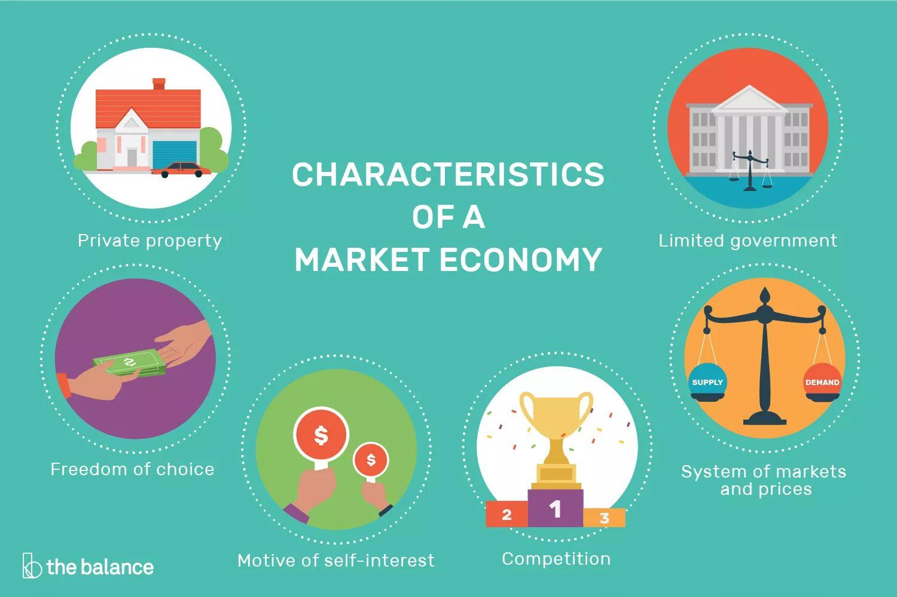

## Table of Contents

## What is a market economy?

A market economy is a type of economic system where the prices of goods and services are determined by the forces of supply and demand. In this system, businesses and individuals make decisions based on what they think will be profitable or beneficial for them. Governments have a limited role and mainly focus on protecting property rights and ensuring fair competition. This means that if a lot of people want to buy a certain product, its price will go up, and if fewer people want it, the price will go down.

In a market economy, people can start their own businesses and choose what to produce based on what consumers want. This freedom can lead to a lot of innovation and variety in products and services. However, it can also result in inequality, as some people might become very rich while others struggle to meet their basic needs. Governments in market economies often step in to provide some basic services like education and healthcare, and to help those who are less fortunate through social programs. Overall, a market economy aims to efficiently allocate resources and satisfy the needs and wants of the population through the interactions of buyers and sellers in the marketplace.

## How did market economies historically develop?

Market economies started to develop a long time ago, around the time when people began to trade with each other. In the beginning, people traded things they had for things they needed. This was called bartering. As societies grew, money was invented, which made trading easier. In ancient places like Greece and Rome, markets became more organized, and people could buy and sell more freely. This was the start of market economies, where the price of things depended on how many people wanted them and how many were available.

Over time, market economies became more complex. In the Middle Ages, trade routes like the Silk Road connected different parts of the world, allowing more goods to be exchanged. During the Industrial Revolution in the 18th and 19th centuries, factories and new technology made it possible to produce more goods quickly. This led to bigger markets and more competition. Economists like Adam Smith wrote about how market economies worked, saying that if people were free to buy and sell, it would benefit everyone. This idea helped shape modern market economies, where governments have a role but mostly let the market decide prices and what gets produced.

## What are the key characteristics of a market economy?

A market economy is all about people being free to buy and sell things. In this kind of economy, the prices of things go up and down based on how much people want them and how many are available. This is called supply and demand. If a lot of people want a toy, its price will go up. But if nobody wants it, the price will go down. Businesses decide what to make based on what they think people will buy. This freedom can lead to a lot of new ideas and different products for people to choose from.

But, market economies can also have problems. Sometimes, some people get very rich while others don't have enough money for basic needs. This can make life unfair for some people. Governments in market economies often step in to help by providing things like schools and hospitals, and by making sure everyone has a fair chance to compete. Even with these challenges, market economies aim to use resources well and meet the needs and wants of people by letting buyers and sellers interact freely in the market.

## What role do prices play in a market economy?

In a market economy, prices are really important because they help decide what gets made and sold. When a lot of people want something, the price goes up. This tells businesses that they should make more of that thing because they can make more money. On the other hand, if nobody wants something, the price goes down. This tells businesses that they should make less of it because it's not selling well. So, prices act like signals that guide businesses on what to produce.

Prices also help make sure that resources are used in the best way. If something is hard to find, its price will go up, which means people will use it more carefully. If something is easy to find, its price will be lower, and people might use more of it. This way, prices help balance out what people want with what's available. In the end, prices in a market economy help make sure that goods and services go to the people who want them the most and are willing to pay for them.

## How does competition function within a market economy?

In a market economy, competition is like a game where businesses try to do better than each other. When companies compete, they want to make the best products or offer the lowest prices to attract more customers. This can lead to new ideas and better products for everyone. For example, if two phone companies are competing, they might come up with new features to make their phones more appealing. This competition can make life better for people because they get to choose from a variety of good products.

Competition also helps keep prices fair. When businesses compete, they have to keep their prices reasonable because if they charge too much, customers will go to another company. This means that companies have to find ways to make their products cheaper or better to stay in the game. However, too much competition can sometimes be tough for smaller businesses, which might struggle to keep up with bigger ones. Governments in market economies often step in to make sure competition stays fair and that no single company gets too powerful.

## What are the main mechanisms that drive a market economy?

In a market economy, the main things that make it work are supply and demand, competition, and prices. Supply and demand is like a seesaw. When a lot of people want something, the demand goes up, and businesses make more of it. But if nobody wants it, the demand goes down, and businesses make less. This balance helps decide what gets made and sold. Competition is like a race between businesses. They try to make the best products or offer the lowest prices to win customers. This can lead to new ideas and better choices for people.

Prices are also really important. They act like signals that tell businesses what to do. If the price of something goes up, it means a lot of people want it, so businesses should make more. If the price goes down, it means not many people want it, so businesses should make less. Prices help make sure that resources are used in the best way possible. Together, these things - supply and demand, competition, and prices - keep the market economy running smoothly, making sure that goods and services go to the people who want them the most.

## How do supply and demand influence market economies?

In a market economy, supply and demand are like the bosses that decide what gets made and sold. When a lot of people want something, the demand goes up. This tells businesses that they should make more of that thing because they can make more money. On the other hand, if nobody wants something, the demand goes down. This tells businesses that they should make less of it because it's not selling well. So, supply and demand work together to guide businesses on what to produce.

Supply and demand also help keep the market balanced. If something is hard to find, the supply is low, and the price goes up. This makes people use it more carefully or look for other options. If something is easy to find, the supply is high, and the price goes down. This means people might use more of it. In the end, supply and demand make sure that resources are used in the best way and that goods and services go to the people who want them the most and are willing to pay for them.

## What is the role of government in a market economy?

In a market economy, the government's job is to make sure everything runs smoothly and fairly. They do this by setting rules that businesses have to follow, like making sure they don't cheat or harm people. The government also protects things like property rights, which means they make sure people can own things and no one can just take them away. This helps people feel safe to start businesses and invest money.

Another big role of the government is to help people who might not do well on their own in the market. They do this by providing services like schools, hospitals, and help for people who don't have enough money. This is important because, in a market economy, some people can get very rich while others struggle. The government steps in to make things more equal and to make sure everyone has a chance to live a good life.

## How do market economies handle economic crises?

In a market economy, when a big economic problem happens, like a crisis, the government often steps in to help fix things. They might do things like giving money to people who lost their jobs or helping banks that are in trouble. This is because, in a market economy, the government wants to make sure that the economy keeps working and that people don't suffer too much. They might also change rules or make new laws to stop the same problem from happening again.

Sometimes, businesses in a market economy also try to fix things on their own during a crisis. They might lower prices or come up with new products to keep people buying. Competition can help here because businesses want to do better than others, even during tough times. But, it's usually a mix of what the government does and what businesses do that helps get through an economic crisis in a market economy.

## What are the advantages and disadvantages of a market economy?

A market economy has many good things about it. It lets people start their own businesses and make choices about what to buy and sell. This freedom can lead to lots of new ideas and different products for people to choose from. When businesses compete, they try to make the best products or offer the lowest prices, which can make life better for everyone. Prices in a market economy help make sure that resources are used in the best way, and goods and services go to the people who want them the most. This system can also grow quickly because businesses want to make money, which can create more jobs and wealth.

But, a market economy also has some problems. Sometimes, it can make life unfair because some people get very rich while others don't have enough money for basic needs. This can lead to big differences between people. During tough times, like an economic crisis, some people might lose their jobs or homes, and businesses might fail. The government often has to step in to help, which can be hard to manage. Also, businesses might focus more on making money than on what's good for the environment or society, which can cause other problems.

## How do market economies compare to other economic systems like socialism or mixed economies?

A market economy is different from socialism and mixed economies in some big ways. In a market economy, businesses and people make choices about what to buy and sell, and prices go up and down based on what people want and what's available. This freedom can lead to a lot of new ideas and different products. But, it can also make life unfair because some people get very rich while others struggle. In socialism, the government has a bigger role. They decide what gets made and how it's shared, aiming to make sure everyone has what they need. This can make things more equal, but it might also mean fewer choices and less freedom for businesses and people.

A mixed economy tries to take the best parts of both market economies and socialism. In a mixed economy, the government and businesses both play important roles. The government might provide things like schools and hospitals, and make rules to keep things fair, while businesses are free to compete and make choices. This can balance freedom with fairness, but it can also be hard to manage because the government and businesses need to work together well. Overall, each system has its own way of trying to use resources and meet people's needs, but they do it in different ways.

## What are some advanced theories or models used to analyze market economies?

One advanced theory used to analyze market economies is the general equilibrium theory. This theory looks at how all the different parts of an economy, like businesses, people, and prices, all work together. It tries to understand how changes in one part, like a change in the price of a product, can affect everything else. It's like a big puzzle where each piece affects the others. Economists use math to study these relationships and see how the whole economy can find a balance where everyone is happy with what they have.

Another model is the game theory, which looks at how people and businesses make choices when they're competing with each other. It's like playing a game where each player tries to do the best they can, but what they do depends on what others do. This model helps economists understand why businesses might choose to lower prices or come up with new products. It's useful for figuring out how competition works and how businesses can work together or against each other in a market economy.

A third model is the neoclassical growth model, which focuses on how an economy grows over time. It looks at things like how much people save, how much new technology is invented, and how much people work. This model helps economists understand what makes an economy grow faster or slower. It's important for figuring out how to make a market economy stronger and better at meeting people's needs in the long run.

## References & Further Reading

[1]: Adam Smith. ["The Wealth of Nations"](https://www.ibiblio.org/ml/libri/s/SmithA_WealthNations_p.pdf) (1776)

[2]: Friedrich Hayek. ["The Road to Serfdom"](https://en.wikipedia.org/wiki/The_Road_to_Serfdom).

[3]: Milton Friedman. ["Capitalism and Freedom"](https://en.wikipedia.org/wiki/Capitalism_and_Freedom).

[4]: Eric Brynjolfsson & Andrew McAfee. ["The Second Machine Age: Work, Progress, and Prosperity in a Time of Brilliant Technologies"](https://psycnet.apa.org/record/2014-07087-000).

[5]: Marcos Lopez de Prado. ["Advances in Financial Machine Learning"](https://www.amazon.com/Advances-Financial-Machine-Learning-Marcos/dp/1119482089).

[6]: Eugene F. Fama. ["Efficient Capital Markets: A Review of Theory and Empirical Work"](https://www.jstor.org/stable/2325486), The Journal of Finance (1970).

[7]: Burton G. Malkiel. ["A Random Walk Down Wall Street: The Time-tested Strategy for Successful Investing"](https://www.amazon.com/Random-Walk-Down-Wall-Street/dp/0393358380).

[8]: Andrew W. Lo & A. Craig MacKinlay. ["A Non-Random Walk Down Wall Street"](https://www.amazon.com/Non-Random-Walk-Down-Wall-Street/dp/0691092567).

[9]: Michael Lewis. ["Flash Boys: A Wall Street Revolt"](https://en.wikipedia.org/wiki/Flash_Boys).

[10]: Frank J. Fabozzi, Sergio M. Focardi, & Petter N. Kolm. ["Quantitative Equity Investing: Techniques and Strategies"](https://www.amazon.com/Quantitative-Equity-Investing-Techniques-Strategies/dp/0470262478).