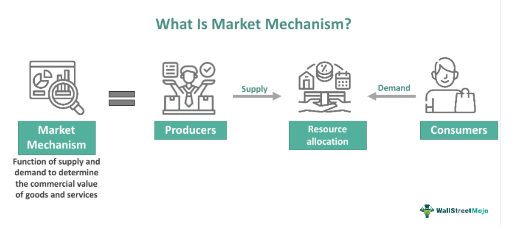

The global economy consists of various economic systems, with the market economy being one of the most prevalent. A market economy is defined by its reliance on the price signals generated through the forces of supply and demand to guide decisions related to investment, production, and distribution. These price signals reflect the relative scarcity or abundance of goods and services and influence the behavior of consumers and producers in the market.

Key to the function of a market economy is the concept of voluntary exchange, where market participants—consumers and producers—engage in transactions based on their individual preferences and resources. This allows for a self-regulating system where resources are allocated efficiently without significant government intervention, fostering an environment conducive to economic competition and innovation.

In modern market economies, the role of technology has become increasingly significant, especially with the rise of algorithmic trading. Algorithmic trading utilizes advanced computer algorithms to execute trades at speeds and volumes far beyond human capability. This technological advancement has transformed market dynamics, enhancing market efficiency, liquidity, and reducing transaction costs. However, it also introduces new challenges, including risks of heightened market volatility and systemic disruption.

Understanding the complexities of market economies, including their core features, advantages, challenges, and the impact of developments such as algorithmic trading, is essential for comprehending their role and functionality in today's interconnected world. Through this exploration, we can appreciate both the benefits and the limitations of market economies, helping stakeholders adapt to a dynamically evolving global economy.

## Table of Contents

## Core Features of a Market Economy

Market economies are distinguished by several core features that differentiate them from other economic systems. A fundamental aspect is the emphasis on private property rights. In a market economy, individuals and companies have the legal authority to own and manage their resources, including land, buildings, equipment, and intellectual property. This ownership right incentivizes resource management and creates an environment conducive to investment and innovation, as property owners can capitalize on their investments and improve production processes.

Supply and demand mechanisms play a crucial role in determining the allocation and pricing of goods and services. These forces operate based on the interactions between buyers and sellers in the marketplace. Prices act as signals to both consumers and producers—guiding their decisions on what to consume and produce. The law of demand suggests that, all else being equal, as the price of a good decreases, the quantity demanded increases, and vice versa. Similarly, the law of supply indicates that as the price of a good increases, producers are willing to supply more of it. This balancing act ensures that resources are allocated efficiently, minimizing shortages and surpluses.

Voluntary exchanges are conducted freely within market economies, with minimal government intervention. This freedom promotes economic competition, driving businesses to innovate to maintain competitive advantages. In such an environment, companies strive to produce superior products or offer better services to attract consumers, leading to technological advancements and improved efficiencies. Additionally, the absence of significant barriers results in a marketplace that is constantly adapting to new trends and consumer preferences, fostering an environment of continuous improvement and development.

Another defining characteristic of market economies is the motivation of consumers and producers by self-interest and profit. Consumers seek to maximize their utility, choosing products and services that provide the greatest satisfaction relative to their cost. On the other hand, producers aim to maximize profits by minimizing costs and optimizing their production processes. This self-interest-driven behavior is a powerful engine for economic dynamism, as it encourages individuals and businesses to be responsive to changes in the economic landscape and consumer demands.

Together, these features create a responsive and dynamic economic environment where resources are allocated efficiently, innovation thrives, and consumer satisfaction is continually addressed. However, the success of a market economy depends on the protection of property rights, the free flow of information, and the enforcement of contracts to ensure fair and transparent market operations.

## The Role of Algorithmic Trading in Market Economies

Algorithmic trading has become a defining characteristic of modern market economies, significantly impacting the manner in which financial markets operate. This approach utilizes sophisticated computer programs and algorithms to execute securities trading at extremely high speeds, transforming traditional trading methods and facilitating greater market efficiency.

One of the primary benefits of [algorithmic trading](/wiki/algorithmic-trading) is its ability to enhance [liquidity](/wiki/liquidity-risk-premium) within markets. By rapidly processing a large [volume](/wiki/volume-trading-strategy) of trades, algorithmic trading contributes to narrower bid-ask spreads. This phenomenon occurs because algorithms continuously monitor prices and react instantly to market changes, ensuring that prices remain competitive. Consequently, both traders and investors benefit from improved price discovery and cost efficiency.

Additionally, the speed at which algorithmic trading operates allows for the faster execution of trades. This rapid processing reduces transaction costs as trades are often executed at more favorable prices due to the high speed and precision with which algorithms operate. Moreover, the automation involved in algorithmic trading minimizes the emotional biases and errors that can sometimes affect human trading decisions, such as fear or greed. Algorithms follow predefined parameters and strategies, ensuring consistency and rationality in trade execution.

Despite these advantages, algorithmic trading is not without its risks. One significant concern is the potential for increased market [volatility](/wiki/volatility-trading-strategies). The speed and volume of trades can sometimes amplify price movements, leading to sharp market swings. For instance, algorithms programmed to sell securities rapidly in a falling market can exacerbate declines, potentially triggering further selling. 

Furthermore, there is a possibility of systemic disruptions due to technical glitches or erroneous algorithmic strategies. A well-documented example is the "flash crash" of May 6, 2010, when the U.S. stock market experienced a significant drop and recovery within minutes, partially due to algorithmic trading. Such events highlight the need for appropriate regulatory measures and risk management strategies to mitigate potential negative effects.

In summary, algorithmic trading represents a transformative element within market economies, offering substantial benefits in terms of efficiency, liquidity, and reduced costs. However, the challenges it presents—such as heightened volatility and systemic risks—necessitate careful oversight and strategic regulation to ensure that the positive outcomes can be maximized while minimizing potential drawbacks.

## Advantages of Market Economies

Market economies offer several significant advantages that contribute to their widespread prevalence. One of the key benefits is the high level of economic efficiency and innovation they promote. The competitive pressures inherent in market economies drive businesses to constantly improve their products and services to gain an edge over rivals. This competition encourages the efficient allocation of resources, ensuring that they are directed towards the most productive uses.

Furthermore, market economies provide consumers with a broad range of choices, accommodating diverse preferences and enhancing consumer satisfaction. The freedom for businesses to enter and [exit](/wiki/exit-strategy) the market results in a dynamic environment where companies are incentivized to meet consumer demands promptly and effectively. This responsiveness translates into rapid adaptations to shifts in consumer preferences and advances in technology, fostering continuous innovation.

Economic growth is another hallmark of market economies, supported by their ability to quickly adjust to global shifts. Unlike centrally planned economies, where decisions are often dictated by the state, market economies rely on the decentralized decision-making of individuals and firms. This decentralization allows economies to be more flexible and resilient, adapting more readily to changes in global market conditions.

In conclusion, market economies distinguish themselves by promoting economic efficiency, offering extensive consumer choices, and maintaining robust growth and adaptability. These advantages make them well-suited to meet the evolving demands of a rapidly changing global landscape.

## Challenges and Criticisms of Market Economies

Market economies can foster rapid economic growth and innovation, but they also present several challenges and criticisms related to inequality, market power, social welfare, and environmental sustainability. One significant concern is economic inequality, where the fruits of growth are not evenly distributed among the population. In a market economy, wealth generation is largely driven by the ownership of capital and resources, which may lead to an unequal distribution of income and opportunities. High-income individuals and organizations may accrue a disproportionate share of economic benefits, leading to disparity and social tensions. 

Moreover, market economies can occasionally foster monopolies or oligopolies. These market structures emerge when a single firm or a few firms dominate the market, restricting competition and potentially leading to higher prices or diminished product quality for consumers. Monopolistic practices can erode consumer welfare, since consumers may have fewer choices and pay more for goods and services than they would in a competitive market.

Another limitation of market economies is that they do not inherently prioritize social welfare. Unlike centrally planned economies, which can direct resources towards social objectives, market economies focus on profit maximization. This focus can result in underinvestment in essential services such as healthcare, education, and infrastructure, unless there is government intervention or sufficient economic incentives for private entities to invest.

Environmental concerns are another critical issue. Market economies may lead to the over-exploitation of natural resources, given the emphasis on profit and growth. This exploitation can result in environmental degradation, pollution, and loss of biodiversity. In the absence of regulatory oversight, firms may not account for the environmental externalities of their production processes, thereby harming the environment. Policies and regulations are necessary to align corporate objectives with societal environmental goals. 

Effective policy measures and regulatory frameworks are vital to address these challenges, ensuring that market economies can operate efficiently while safeguarding societal welfare and environmental sustainability.

## Conclusion

Market economies are intricate systems that thrive on the foundational principles of supply and demand, private ownership, and minimal government intervention. These systems are designed to promote efficiency and innovation by allowing market forces to guide economic activities. The natural interplay of supply and demand signals leads to optimal resource allocation and pricing, fostering an environment where businesses innovate to meet consumer needs.

However, the benefits provided by market economies come with challenges that must be addressed to ensure equitable growth and sustainability. Economic inequality is a significant concern, as the wealth generated within a market economy is not always distributed evenly across all sections of society. This disparity can lead to social and economic tensions that necessitate policies aimed at redistributive justice and inclusive growth. Additionally, market economies can place undue stress on environmental resources, as their profit-driven nature may overlook the ecological costs associated with production and consumption. This necessitates regulatory frameworks that incentivize sustainable practices and protect natural resources from exploitation.

Algorithmic trading represents a modern evolution within market economies, highlighting both opportunities and complexities. It brings efficiency and liquidity to financial markets but also introduces new risks such as market volatility and systemic disruptions. The speed and scale at which algorithmic trading operates require vigilant oversight and regulatory measures to ensure stability and transparency in financial markets.

Ultimately, market economies benefit greatly from ongoing adjustments and regulatory interventions to remain inclusive and environmentally conscious. Balancing the dynamic nature of market forces with appropriate governance is essential to crafting an economic system that serves the interests of all stakeholders, ensuring that the advantages of market economies are maximized while mitigating their inherent challenges.

## References & Further Reading

[1]: Adam Smith. ["The Wealth of Nations"](https://www.ibiblio.org/ml/libri/s/SmithA_WealthNations_p.pdf) (1776)

[2]: Friedrich Hayek. ["The Road to Serfdom"](https://en.wikipedia.org/wiki/The_Road_to_Serfdom).

[3]: Milton Friedman. ["Capitalism and Freedom"](https://en.wikipedia.org/wiki/Capitalism_and_Freedom).

[4]: Eric Brynjolfsson & Andrew McAfee. ["The Second Machine Age: Work, Progress, and Prosperity in a Time of Brilliant Technologies"](https://psycnet.apa.org/record/2014-07087-000).

[5]: Marcos Lopez de Prado. ["Advances in Financial Machine Learning"](https://www.amazon.com/Advances-Financial-Machine-Learning-Marcos/dp/1119482089).

[6]: Eugene F. Fama. ["Efficient Capital Markets: A Review of Theory and Empirical Work"](https://www.jstor.org/stable/2325486), The Journal of Finance (1970).

[7]: Burton G. Malkiel. ["A Random Walk Down Wall Street: The Time-tested Strategy for Successful Investing"](https://www.amazon.com/Random-Walk-Down-Wall-Street/dp/0393358380).

[8]: Andrew W. Lo & A. Craig MacKinlay. ["A Non-Random Walk Down Wall Street"](https://www.amazon.com/Non-Random-Walk-Down-Wall-Street/dp/0691092567).

[9]: Michael Lewis. ["Flash Boys: A Wall Street Revolt"](https://en.wikipedia.org/wiki/Flash_Boys).

[10]: Frank J. Fabozzi, Sergio M. Focardi, & Petter N. Kolm. ["Quantitative Equity Investing: Techniques and Strategies"](https://www.amazon.com/Quantitative-Equity-Investing-Techniques-Strategies/dp/0470262478).