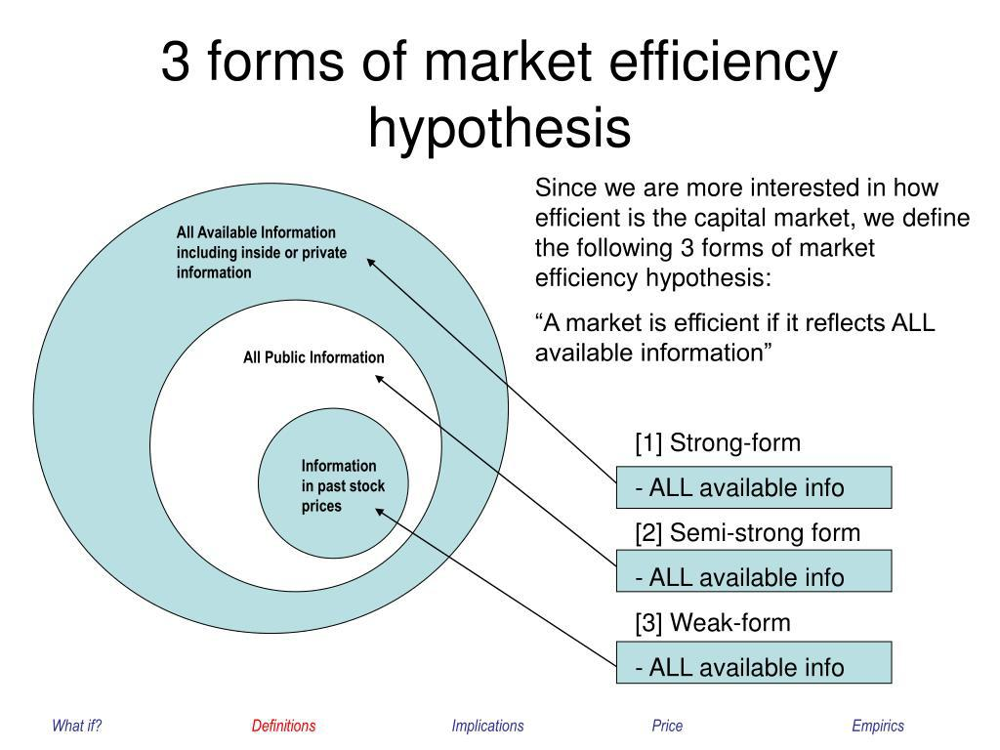

## Table of Contents

## What is the Market Efficiency Hypothesis?

The Market Efficiency Hypothesis, often called the Efficient Market Hypothesis (EMH), is a theory in finance that says stock prices reflect all available information. This means that if everyone knows everything there is to know about a company, the price of its stock should be fair and correct. According to this idea, it's very hard to beat the market consistently because any new information that comes out is quickly used by investors to adjust stock prices.

There are three forms of market efficiency: weak, semi-strong, and strong. The weak form says that past stock prices can't help predict future prices because all past information is already included in the current price. The semi-strong form goes further, saying that all publicly available information is reflected in stock prices, so even studying financial statements won't give you an edge. The strong form is the most extreme, suggesting that even insider information is reflected in stock prices, making it impossible to gain an advantage no matter what information you have.

While the EMH is widely discussed, it's not perfect. Some people argue that markets can be inefficient at times, allowing smart investors to find undervalued stocks and make profits. Behavioral finance, which looks at how psychology affects investing, also challenges the EMH by showing that people don't always act rationally, leading to market inefficiencies. Despite these criticisms, the EMH remains a key concept in understanding how markets work.

## Who developed the Market Efficiency Hypothesis?

The Market Efficiency Hypothesis, or Efficient Market Hypothesis (EMH), was developed by Eugene Fama. He is an economist who started working on this idea in the 1960s. Fama was trying to understand how stock prices move and whether it's possible to predict them. He looked at a lot of data and found that stock prices seem to include all the information that's out there. This led him to think that it's very hard to beat the market because prices adjust quickly to new information.

Fama's work on the EMH became very important in the world of finance. He wrote a famous paper in 1970 called "Efficient Capital Markets: A Review of Theory and Empirical Work," which explained his ideas in detail. Since then, many people have studied and talked about the EMH. While some agree with Fama, others think that markets can be inefficient sometimes, and that it's possible to find good deals in the stock market. Even though there are different opinions, Fama's work has had a big impact on how people think about investing and the stock market.

## What are the different forms of market efficiency?

The Efficient Market Hypothesis has three forms: weak, semi-strong, and strong. The weak form says that you can't use past stock prices to predict future prices. This is because all the old information is already in the current price. So, looking at price charts and patterns won't help you make money.

The semi-strong form goes a step further. It says that all public information, like news and financial reports, is already in the stock price. This means that even if you read all the company news and financial statements, you won't have an advantage over other investors. The stock price will change quickly when new information comes out.

The strong form is the most extreme. It says that even insider information, which is secret and not available to the public, is already in the stock price. This means that no matter what information you have, you can't beat the market. While the strong form is hard to believe, the weak and semi-strong forms are more accepted and used to explain how markets work.

## How does the Market Efficiency Hypothesis impact investment strategies?

The Market Efficiency Hypothesis impacts investment strategies by suggesting that it's very hard to beat the market consistently. If stock prices already include all available information, then trying to pick stocks that will do better than the market is a tough job. This idea pushes many investors towards passive investing, where they just buy and hold a broad market index, like the S&P 500. They believe that since they can't outsmart the market, it's better to own a piece of the whole market and save on the costs of trying to pick individual stocks.

However, not everyone agrees with the Market Efficiency Hypothesis. Some investors think that markets can be inefficient at times, which means there are chances to find undervalued stocks and make profits. These investors use active strategies, where they do a lot of research and try to find stocks that the market has not priced correctly yet. They might look at company financials, industry trends, or even use behavioral finance to understand how people's emotions can affect stock prices. So, while the Market Efficiency Hypothesis suggests passive investing, it also sparks debate and encourages some to keep looking for ways to beat the market.

## What is the difference between weak, semi-strong, and strong forms of market efficiency?

The weak form of market efficiency says that you can't predict future stock prices by looking at past stock prices. It means that all the old information about a stock's price is already included in its current price. So, if you're trying to make money by studying price charts and patterns, you won't have an advantage. This form of efficiency suggests that technical analysis, which is all about using past prices to guess future prices, doesn't work well.

The semi-strong form goes further. It says that not only are past prices reflected in the current stock price, but all public information is too. This includes news, financial reports, and anything else that everyone can see. If a company releases good news, the stock price will quickly change to reflect that news. So, even if you read all the public information about a company, you won't be able to beat the market because everyone else knows it too.

The strong form is the most extreme. It says that even insider information, which is secret and not available to the public, is already in the stock price. This means that no matter what information you have, you can't beat the market. While the strong form is hard to believe, the weak and semi-strong forms are more accepted and help explain why it's tough to make money by [picking](/wiki/asset-class-picking) individual stocks.

## Can you explain the concept of 'random walk' in relation to market efficiency?

The concept of 'random walk' is closely related to the idea of market efficiency. It means that stock prices move around in a way that you can't predict. Imagine you're walking down a street and at every step, you turn left or right randomly. You can't guess where you'll end up because each step is a surprise. In the same way, stock prices go up and down based on new information that comes out, and because this information is random, the prices move randomly too. This supports the idea of the weak form of market efficiency, which says that past stock prices can't help you predict future prices because all old information is already in the current price.

If stock prices follow a random walk, it means that trying to beat the market by looking at past price patterns won't work. You might get lucky sometimes, but over time, you won't be able to do better than the market as a whole. This is why many people who believe in the Efficient Market Hypothesis think that the best way to invest is to buy and hold a broad market index, like the S&P 500. They believe that since prices move randomly and reflect all information, it's better to own a piece of the whole market instead of trying to pick individual stocks that might go up or down unpredictably.

## What are some empirical tests used to assess market efficiency?

To check if markets are efficient, researchers use different kinds of tests. One common test is looking at how stock prices react to new information. For example, if a company announces good news and the stock price goes up right away, it suggests that the market is efficient because it quickly uses new information. Another test is checking if people can make money by using past stock prices to predict future prices. If nobody can do this consistently, it supports the idea that markets are efficient because past prices don't help predict the future.

Another way to test market efficiency is to see if certain investment strategies can beat the market. If nobody can find a way to pick stocks that do better than the market over a long time, it suggests that the market is efficient. Researchers also look at things like how quickly stock prices adjust to public news or if insiders can make money from secret information. If stock prices adjust fast and insiders can't make easy profits, it supports the idea that markets are efficient. These tests help us understand how well markets work and whether it's hard to beat them.

## How do anomalies and market inefficiencies challenge the Market Efficiency Hypothesis?

Anomalies and market inefficiencies challenge the Market Efficiency Hypothesis by showing that sometimes stock prices don't act the way the theory says they should. Anomalies are patterns or behaviors in the market that can't be explained by the idea that all information is already in the stock price. For example, the January effect is when stock prices tend to go up more in January than in other months. This suggests that markets might not be as efficient as the hypothesis claims, because if they were, stock prices shouldn't follow a monthly pattern.

Another challenge comes from behavioral finance, which looks at how people's emotions and mistakes can affect stock prices. If people get too excited or scared and make bad decisions, stock prices might not reflect all the information out there. This can lead to market inefficiencies where stocks are priced too high or too low. These findings make some people think that it might be possible to beat the market by understanding these patterns and behaviors, which goes against the idea that markets are always efficient.

## What role do behavioral finance theories play in critiquing market efficiency?

Behavioral finance theories play a big role in critiquing the idea that markets are always efficient. They show that people don't always make smart choices when they invest. Sometimes, people let their feelings like fear or excitement affect their decisions. This can make stock prices go up or down in ways that don't make sense if everyone was acting logically. For example, if a lot of people get scared and start selling their stocks at the same time, the prices might drop even if nothing bad happened to the companies. This kind of behavior can create market inefficiencies, where stock prices don't reflect all the information out there.

These theories challenge the Market Efficiency Hypothesis by suggesting that if people aren't always rational, then markets can't always be efficient. If emotions and mistakes can move stock prices, then it might be possible to find good deals in the market. Some investors use these ideas to try to beat the market by understanding how people's feelings can affect stock prices. This goes against the idea that it's very hard to do better than the market because all information is already in the stock prices. So, behavioral finance shows that markets might not be as efficient as the hypothesis claims.

## How has the Market Efficiency Hypothesis evolved since its inception?

Since Eugene Fama first came up with the Market Efficiency Hypothesis in the 1960s, the idea has changed a lot. At first, Fama's work suggested that stock prices include all available information, making it hard for anyone to beat the market. But as time went on, people started to find problems with this idea. They noticed things like the January effect, where stock prices often go up more in January than other months. These "anomalies" made some people think that markets might not always be as efficient as Fama thought.

Behavioral finance also played a big role in changing how people think about market efficiency. This field looks at how people's emotions and mistakes can affect stock prices. If people get too excited or scared and make bad choices, stock prices might not reflect all the information out there. This can lead to times when markets are not efficient. Today, many people believe that markets can be efficient most of the time, but not always. This has led to a mix of investment strategies, with some people still trying to beat the market by understanding these inefficiencies, while others stick to buying and holding a broad market index.

## What are the implications of market efficiency for financial regulation and policy?

The idea that markets are efficient has big effects on how governments make rules for financial markets. If markets are efficient, it means they work well on their own without too much help. This can make governments think they don't need to control the markets too much. They might believe that if everyone knows everything and prices are fair, then the market will fix itself. But, if markets are not always efficient, then governments might need to make more rules to stop people from cheating or to make sure everyone has the same information.

Even though the Market Efficiency Hypothesis says markets are usually fair, it doesn't mean they are perfect all the time. Things like the January effect or people's emotions can make markets act in strange ways. This makes some people think that governments should keep an eye on markets to make sure they stay fair. They might need to make rules to stop big problems from happening, like when too many people get scared and start selling their stocks at the same time. So, understanding how efficient markets are helps governments decide how much they should control the financial world.

## How do different market structures affect the applicability of the Market Efficiency Hypothesis?

Different market structures can change how well the Market Efficiency Hypothesis works. In big, busy markets like the New York Stock Exchange, lots of people are buying and selling all the time. This means new information gets into the stock prices quickly because so many people are looking at it. These markets are often seen as more efficient because it's hard to find a good deal that everyone else missed. But in smaller markets, like those for less-known companies, there might not be as many people trading. This can make it slower for new information to show up in the prices, so these markets might not be as efficient.

Also, the way a market is set up can affect how much information everyone has. In markets where it's easy to get information, like with big companies that share a lot of news, prices might reflect all the information better. But in markets where information is harder to find, like with new or smaller companies, prices might not show everything. This can make these markets less efficient because some people might know more than others. So, the structure of a market, like how many people are trading and how easy it is to get information, can make a big difference in how well the Market Efficiency Hypothesis applies.

## References & Further Reading

[1]: Fama, E. F. (1970). ["Efficient Capital Markets: A Review of Theory and Empirical Work."](https://www.jstor.org/stable/2325486) The Journal of Finance, 25(2), 383-417.

[2]: Biais, B., Foucault, T., & Moinas, S. (2014). ["Equilibrium Fast Trading."](https://www.sciencedirect.com/science/article/pii/S0304405X15000288) Journal of Financial Economics, 116(2), 292-313.

[3]: Aldridge, I. (2010). ["High-Frequency Trading: A Practical Guide to Algorithmic Strategies and Trading Systems."](https://www.ahmetbeyefendi.com/wp-content/uploads/2020/07/High-Frequency-Trading-Irene-Aldridge.pdf) Wiley.

[4]: Barberis, N., & Thaler, R. (2003). ["A Survey of Behavioral Finance."](https://www.nber.org/papers/w9222) In G. M. Constantinides, M. Harris, & R. Stulz (Eds.), Handbook of the Economics of Finance (Vol. 1, pp. 1051-1121). Elsevier.

[5]: Kirilenko, A. A., Kyle, A. S., Samadi, M., & Tuzun, T. (2017). ["The Flash Crash: High-frequency Trading in an Electronic Market."](https://www.jstor.org/stable/26652722) The Review of Financial Studies, 30(11), 2227-2303.

[6]: De Bondt, W. F. M., & Thaler, R. H. (1985). ["Does the Stock Market Overreact?"](https://onlinelibrary.wiley.com/doi/full/10.1111/j.1540-6261.1985.tb05004.x) The Journal of Finance, 40(3), 793-805.

[7]: Lopez de Prado, M. (2018). ["Advances in Financial Machine Learning."](https://www.amazon.com/Advances-Financial-Machine-Learning-Marcos/dp/1119482089) Wiley.

[8]: Malkiel, B. G. (2003). ["The Efficient Market Hypothesis and Its Critics."](https://www.princeton.edu/~ceps/workingpapers/91malkiel.pdf) Journal of Economic Perspectives, 17(1), 59-82.

[9]: Carhart, M. M. (1997). ["On Persistence in Mutual Fund Performance."](https://onlinelibrary.wiley.com/doi/full/10.1111/j.1540-6261.1997.tb03808.x) The Journal of Finance, 52(1), 57-82.