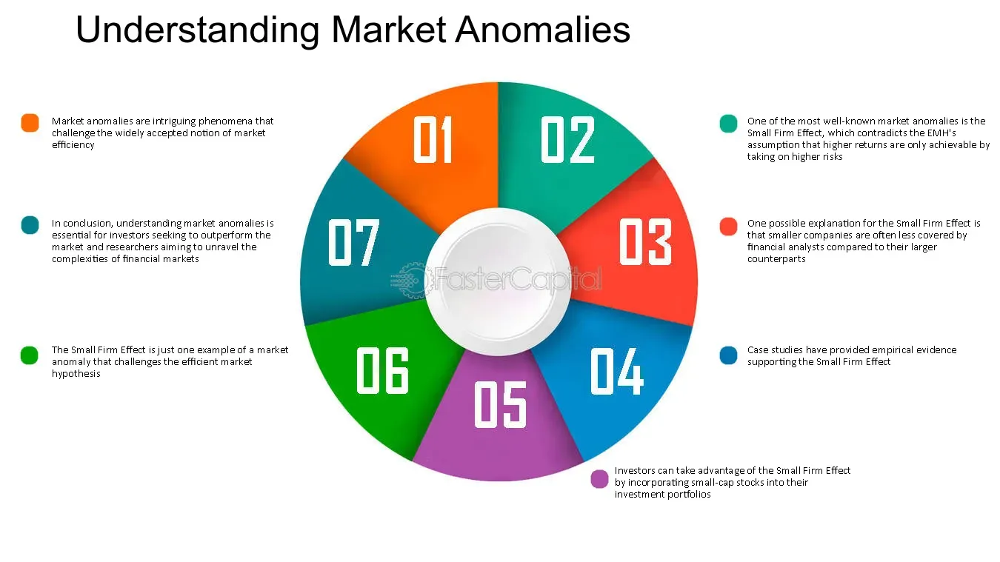

## Table of Contents

## What is market efficiency?

Market efficiency is a concept in finance that describes how well stock prices reflect all available information. If a market is efficient, it means that the prices of stocks quickly adjust to new information, making it hard for investors to beat the market consistently by picking stocks that will do better than others.

In an efficient market, it's believed that all public information is already included in the stock prices. This makes it difficult for investors to find undervalued stocks or to predict future price movements based on new information, because the market reacts so quickly. However, some people argue that markets are not always perfectly efficient and that there are times when investors can find opportunities to make profits.

## What are the three forms of market efficiency?

There are three forms of market efficiency: weak, semi-strong, and strong. The weak form says that all past stock prices are already included in the current price. This means you can't use past prices to predict future prices and make money. If the weak form is true, then looking at charts and patterns won't help you beat the market.

The semi-strong form goes further. It says that all public information, not just past prices, is already in the stock price. This includes news, financial reports, and anything else that everyone can see. If the semi-strong form is true, then even if you read the news and do a lot of research, you still can't beat the market because the price adjusts to new information very quickly.

The strong form is the most extreme. It says that all information, even private or insider information, is already in the stock price. If the strong form is true, then no one can beat the market, not even people with secret information. Most people think the strong form is too strict, but it's good to know about all three forms to understand how markets work.

## How does market efficiency affect individual investors?

Market efficiency can make things tricky for individual investors. If the market is efficient, it means that stock prices already include all the information out there. This makes it hard for investors to find stocks that are priced too low or too high. If you can't find undervalued stocks, it's tough to beat the market and make more money than others. So, many individual investors might choose to just put their money in index funds, which try to match the market's performance instead of trying to beat it.

On the other hand, some investors believe that markets aren't always perfectly efficient. They think there are times when they can find good deals on stocks. These investors might spend a lot of time researching and trying to find these opportunities. If they're right, they could make more money than if they just followed the market. But it's risky, and it takes a lot of work. So, market efficiency affects how individual investors decide to invest their money and how much effort they put into [picking](/wiki/asset-class-picking) stocks.

## What are common market anomalies?

Market anomalies are things that happen in the stock market that don't fit with the idea of market efficiency. One common anomaly is the January effect, where stocks, especially small ones, tend to do better in January than in other months. People think this might happen because investors sell stocks at the end of the year for tax reasons and then buy them back in January. Another anomaly is the [momentum](/wiki/momentum) effect, where stocks that have been going up keep going up for a while, and stocks that have been going down keep going down. This goes against the idea that past prices can't predict future prices.

Another anomaly is the size effect, where smaller companies' stocks often do better than bigger companies' stocks. This could be because small companies are less watched by investors, so there are more chances to find good deals. The value effect is also common, where stocks that seem cheap based on their price compared to their earnings or assets tend to do better than stocks that seem expensive. These anomalies make some investors think they can beat the market by finding these patterns and using them to their advantage. But, it's not easy, and these patterns can change over time.

## Can market anomalies be exploited for profit?

Yes, some investors try to make money by using market anomalies. They look for patterns like the January effect, where stocks do better in January, or the momentum effect, where stocks keep going up or down after they start moving. If they can spot these patterns early, they might buy or sell stocks at the right time to make a profit. But it's not easy. The market can change, and what worked before might not work again. Plus, a lot of other investors are trying to do the same thing, which can make the patterns less useful.

However, exploiting market anomalies is risky. Just because a pattern has worked in the past doesn't mean it will keep working. Sometimes, what looks like a good deal can turn out to be a trap. Also, the costs of trading, like fees and taxes, can eat into any profits. So, while some investors have made money this way, it's not a sure thing. It takes a lot of research, skill, and sometimes a bit of luck to make money from market anomalies.

## How do behavioral finance theories explain market anomalies?

Behavioral finance theories say that market anomalies happen because people don't always make smart choices when they invest. Instead of being perfect and logical, people can be swayed by their feelings and make mistakes. For example, they might get too excited about a stock that's going up and buy it at a high price, causing a bubble. Or they might be too scared to buy a good stock because it went down a bit, even though it's a good deal. These feelings and mistakes can create patterns in the market that don't make sense if everyone was acting logically.

One way behavioral finance explains anomalies is through things like overconfidence and loss aversion. Overconfidence can make people think they know more than they do, so they trade too much and make bad choices. Loss aversion means people hate losing money more than they like making money, so they might hold onto losing stocks too long, hoping they'll go back up. These behaviors can lead to things like the momentum effect, where stocks keep moving in the same direction because of people's reactions, or the January effect, where people sell stocks at the end of the year to avoid taxes and then buy them back in January. By understanding these behaviors, we can see why the market doesn't always work the way it should if everyone was perfectly rational.

## What is the impact of market efficiency on asset pricing models?

Market efficiency has a big impact on how people think about asset pricing models. These models try to figure out what stocks should be worth based on different things like how risky they are or how much money they make. If the market is efficient, it means that all the information out there is already in the stock prices. So, asset pricing models need to take this into account. They have to assume that the prices are right most of the time, and any new information will quickly change the prices. This makes it hard for these models to find stocks that are priced wrong, because the market is good at adjusting prices.

But, if the market isn't always efficient, then asset pricing models can look for times when stocks are priced wrong. They can use things like market anomalies to find stocks that might be a good deal. For example, if a model sees that small stocks tend to do better in January, it might tell investors to buy those stocks at the end of December. This means that asset pricing models have to think about how efficient the market is and whether there are patterns they can use to make money. It's a tricky balance, but understanding market efficiency helps make these models better at figuring out what stocks should be worth.

## How do empirical studies test for market efficiency?

Empirical studies test for market efficiency by looking at how well stock prices reflect all the information out there. They do this by checking if investors can make money by using past prices, public news, or even secret information to pick stocks. For example, they might see if people who use past stock prices to make decisions can beat the market. If they can't, it suggests that the market is efficient because all the past information is already in the prices.

These studies also look at how quickly stock prices change when new information comes out. If prices adjust really fast to new news, it means the market is efficient. Researchers might look at what happens to stock prices after big news events, like earnings reports or economic announcements. If the prices move right away and don't keep moving after that, it's a sign that the market is good at using new information. But if prices keep changing a lot after the news, it might mean the market isn't as efficient as we thought.

## What role do information asymmetries play in market efficiency?

Information asymmetries happen when some people know more than others about something important, like a company's future plans or financial health. In the stock market, if some investors have secret information that others don't, they can make better choices about which stocks to buy or sell. This goes against the idea of market efficiency, which says that all information should be in the stock prices already. If some people have an advantage because of secret information, it can make the market less fair and less efficient.

These information asymmetries can lead to market anomalies, where stock prices don't act the way they should if everyone had the same information. For example, if insiders know a company is about to do really well, they might buy a lot of stock before the news comes out, pushing the price up. When the news finally comes out, the price might not change much because the insiders already moved it. This shows that information asymmetries can mess with how well the market works, making it harder for the market to be truly efficient.

## How have technological advancements influenced market efficiency?

Technological advancements have made the stock market more efficient by making it easier and faster for information to spread. Now, with the internet and smartphones, news and financial reports can reach investors all over the world in seconds. This means that stock prices can adjust to new information very quickly, which is a big part of what makes a market efficient. Also, computers and algorithms can look at huge amounts of data and find patterns that people might miss. This helps the market use all the information out there to set prices more accurately.

But technology can also make the market less efficient in some ways. High-frequency trading, where computers buy and sell stocks in milliseconds, can cause prices to move around a lot and create patterns that don't make sense if everyone was acting logically. Sometimes, these quick trades can even cause big swings in the market, like flash crashes. Also, not everyone has access to the same technology, so some people might still have an advantage over others, which can lead to information asymmetries and make the market less fair.

## What are the criticisms of the Efficient Market Hypothesis?

Some people don't like the Efficient Market Hypothesis because they think it's too perfect. It says that all information is already in the stock prices, so no one can beat the market by picking stocks. But in real life, people make mistakes and don't always act logically. They can get too excited or too scared, and this can make stock prices move in ways that don't make sense if everyone was thinking clearly. Also, some people might have secret information that others don't, which can give them an unfair advantage. This means the market isn't as fair or efficient as the hypothesis says it should be.

Another problem is that the Efficient Market Hypothesis doesn't explain why some investors do better than others over time. If the market was perfectly efficient, no one should be able to beat it consistently. But there are investors, like Warren Buffett, who have made a lot of money by picking the right stocks. Critics say this shows that the market isn't as efficient as the hypothesis claims. They also point out that there are patterns, like stocks doing better in January or small stocks doing better than big ones, that don't fit with the idea of an efficient market. These patterns suggest that there are times when investors can find good deals and make money, which goes against what the hypothesis says.

## How do regulatory frameworks enhance or hinder market efficiency?

Regulatory frameworks can help make the market more efficient by making sure everyone has the same information. Rules like making companies tell the public about important news help stop some people from knowing secrets that others don't. This makes the market fairer because everyone can use the same information to decide what stocks to buy or sell. Also, rules that stop insider trading, where people use secret information to make money, help keep the market honest. When everyone follows the same rules, it's easier for stock prices to show what the company is really worth.

But sometimes, too many rules can make the market less efficient. If there are too many rules, it can be hard for companies to do business and for investors to make quick decisions. This can slow down how fast new information gets into stock prices. Also, if the rules are too strict, it might stop new companies from coming into the market or make it hard for investors to try new ways of investing. So, while rules are important for keeping the market fair, they need to be balanced so they don't make it too hard for the market to work well.

## What is the response of algo trading to market anomalies?

Algorithmic trading, commonly known as algo trading, employs computer algorithms to execute a large number of orders in financial markets at speeds beyond human capabilities. This trading method has evolved significantly with the advent of [artificial intelligence](/wiki/ai-artificial-intelligence) (AI), transforming traditional trading practices into more sophisticated and efficient processes.

The integration of AI in algo trading has led to the development of advanced algorithms capable of processing and analyzing massive datasets. These algorithms can identify intricate patterns and trends within financial markets, enabling traders to exploit market inefficiencies more effectively. The three primary algo trading strategies that address market anomalies are [trend following](/wiki/trend-following), statistical [arbitrage](/wiki/arbitrage), and sentiment analysis.

Trend following involves algorithms that detect price movements and trends, allowing traders to capitalize on upward or downward market trajectories. The strategy relies on technical indicators, such as moving averages, to generate buy or sell signals. For example, if the 50-day moving average of a stock's price crosses above the 200-day moving average, an algorithm might interpret this as a bullish signal. The mathematical representation involves calculating the moving average $MA_t$ for a security at time $t$:

$$
MA_t = \frac{\sum_{i=1}^{n} P_{t-i+1}}{n}
$$

where $P_{t-i+1}$ is the price at time $t-i+1$ and $n$ is the period of the moving average.

Statistical arbitrage exploits temporary mispricing between related securities. This strategy uses statistical and econometric techniques to identify these discrepancies and execute trades that are expected to profit when prices revert to their mean. For instance, algorithms may employ pairs trading, where two correlated assets are traded based on the divergence and convergence of their price relationship. The correlation coefficient ($\rho$) calculation is vital in such strategies:

$$
\rho_{XY} = \frac{\text{cov}(X, Y)}{\sigma_X \sigma_Y}
$$

where $X$ and $Y$ are asset prices, $\text{cov}(X, Y)$ is the covariance, and $\sigma_X$ and $\sigma_Y$ are the standard deviations.

Sentiment analysis utilizes natural language processing (NLP) to gauge market sentiment from news articles, social media, and financial reports. By analyzing linguistic patterns, sentiment algorithms can predict market movements. This involves classifying textual data into positive, negative, or neutral categories, with [machine learning](/wiki/machine-learning) models like recurrent neural networks (RNNs) often deployed for this task.

The role of advanced algorithms and AI extends beyond identifying market anomalies, enhancing predictive analytics and market responsiveness. Machine learning models, including [deep learning](/wiki/deep-learning) architectures, refine predictions by learning from vast and varied datasets. This capability ensures that algo trading systems adapt swiftly to changing market conditions, optimizing trade execution and decision-making processes.

In summary, [algorithmic trading](/wiki/algorithmic-trading), bolstered by AI, offers sophisticated methodologies for addressing market inefficiencies through trend following, [statistical arbitrage](/wiki/statistical-arbitrage), and sentiment analysis. These strategies underscore the profound impact of advanced technologies in transforming financial markets, enabling traders to navigate complex and volatile environments with enhanced precision and speed.

## References & Further Reading

[1]: Eugene F. Fama. (1970). ["Efficient Capital Markets: A Review of Theory and Empirical Work."](https://www.jstor.org/stable/2325486) The Journal of Finance, 25(2), 383-417.

[2]: De Bondt, W. F. M., & Thaler, R. (1985). ["Does the Stock Market Overreact?"](https://onlinelibrary.wiley.com/doi/full/10.1111/j.1540-6261.1985.tb05004.x) The Journal of Finance, 40(3), 793-805.

[3]: Hendershott, T., Jones, C. M., & Menkveld, A. J. (2011). ["Does Algorithmic Trading Improve Liquidity?"](https://onlinelibrary.wiley.com/doi/full/10.1111/j.1540-6261.2010.01624.x) The Journal of Finance, 66(1), 1-33.

[4]: Kahneman, D., & Tversky, A. (1979). ["Prospect Theory: An Analysis of Decision under Risk."](https://www.jstor.org/stable/1914185) Econometrica, 47(2), 263-291.

[5]: Barberis, N., & Thaler, R. (2003). ["A Survey of Behavioral Finance."](https://www.nber.org/papers/w9222) Handbook of the Economics of Finance, Vol 1B.

[6]: Marcos López de Prado. (2018). ["Advances in Financial Machine Learning."](https://www.amazon.com/Advances-Financial-Machine-Learning-Marcos/dp/1119482089) Wiley.

[7]: Chan, E. P. (2009). ["Quantitative Trading: How to Build Your Own Algorithmic Trading Business."](https://github.com/ftvision/quant_trading_echan_book) Wiley.