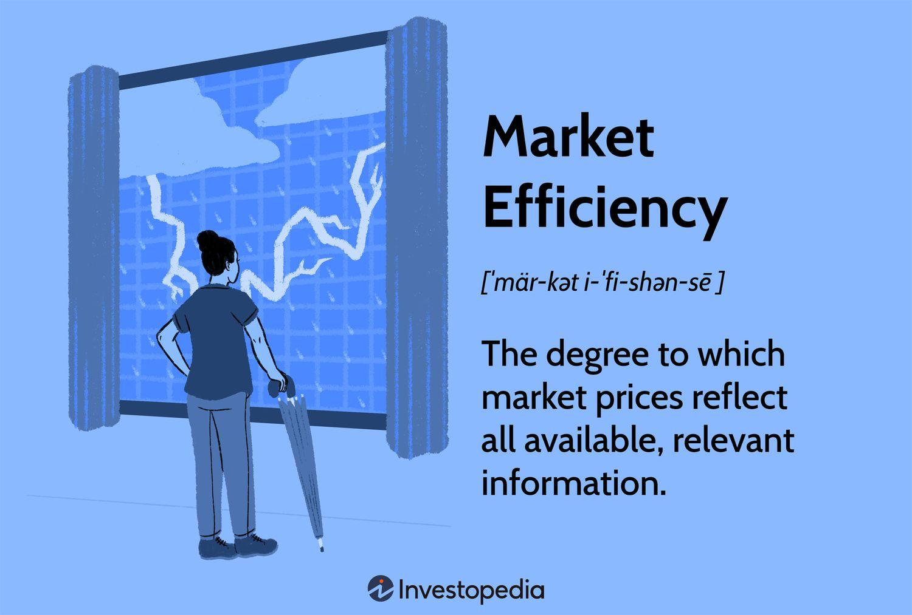

The landscape of financial markets is continuously evolving with the convergence of economic theories and algorithmic trading technologies. Central to this evolution is the concept of market efficiency, which has long been a cornerstone for understanding financial markets. Originally established by the Efficient Market Hypothesis (EMH), market efficiency posits that asset prices fully reflect all available information, thereby making it impossible for investors to consistently achieve returns that exceed average market returns on a risk-adjusted basis.

The advent of algorithmic trading has significantly influenced these traditional market theories by introducing new dynamics in trade execution and information dissemination. Algorithmic trading utilizes complex algorithms to execute trades at speeds and frequencies that are impossible for human traders. By leveraging historical data and real-time market signals, these algorithms can effectuate trades that potentially enhance market liquidity and efficiency, minimizing human errors and emotional biases.



This article examines the role and implications of market efficiency within the context of economic theories and algorithmic trading. Understanding the theoretical underpinnings of market efficiency becomes essential, particularly when considering the practical applications in modern trading strategies. As we explore this interaction, we aim to bridge the conceptual framework of market efficiency with the dynamic and practical landscape of contemporary trading environments. Through this exploration, we seek to provide insights into how economic theories can inform and enhance algorithmic trading strategies, ultimately contributing to a deeper understanding of the complexities present in today's financial markets.

## Table of Contents

## Understanding Market Efficiency

Market efficiency is a fundamental concept in financial economics, describing how effectively market prices incorporate and reflect all available information. This principle is encapsulated by the Efficient Market Hypothesis (EMH), which posits that it's impossible to consistently achieve returns that exceed average market returns on a risk-adjusted basis, due to the rapid dissemination and reflection of information in prices.

The EMH is categorized into three primary forms, each relating to different degrees of information assimilation:

1. **Weak Form Efficiency:** This level of market efficiency suggests that current asset prices fully reflect all past trading information, such as historical prices and volume. Consequently, technical analysis, which relies on past price data and trading volume to predict future price movements, would be ineffective. Investors should not be able to achieve abnormal returns using such historical data, as any patterns, trends, or anomalies within this information have already been adjusted for in current prices.

2. **Semi-Strong Form Efficiency:** This form extends the scope to include all publicly available information, encompassing financial statements, news releases, and other public disclosures. It asserts that asset prices adjust rapidly to new public information, rendering fundamental analysis, which uses public information to estimate security values, futile for gaining consistent excess returns. As public information is already reflected in current prices, the only means of achieving superior returns would be through non-public information, such as insider knowledge.

3. **Strong Form Efficiency:** At this highest level of market efficiency, prices are claimed to reflect all information, both public and private, meaning that even insider information is accounted for in the security's price. In a market characterized by strong form efficiency, no group of investors would be able to systematically earn above-average returns, as no information is untapped or concealed from influencing the price.

The implications of market efficiency are profound for investment strategies and highlight the ongoing debate between active and passive investing. Active investing involves attempting to outperform market benchmarks through selective buying and selling based on individual security analysis. This approach inherently assumes some degree of market inefficiency that can be exploited. On the other hand, passive investing rests on the assumption of efficient markets, advocating for broad market exposure through index funds or ETFs to achieve market-average returns at lower costs.

The understanding of market efficiency is crucial for investors as it shapes strategies and informs decisions regarding the appropriateness of attempting to beat the market versus opting for a more cost-effective, diversified investment approach. In reality, markets may not always perfectly adhere to the principles of EMH, leading to ongoing research and discussion on detecting and leveraging potential inefficiencies.

## Economic Theories and Market Efficiency

Economic theories serve as foundational elements in comprehending market efficiency, particularly concerning market behavior and price determination. These theories provide a systematic framework to evaluate how information is dispersed and assimilated in financial markets, influencing the efficient allocation of resources. 

Microeconomic principles are essential in explaining the decision-making processes of individual market participants. They examine how consumers and producers interact in markets, making choices based on constraints such as prices and incomes. The law of demand, elasticity, and utility maximization are pivotal in understanding how information and price signals affect market efficiency at the individual level. For example, if consumers react to price changes due to new information, it reflects how accurately and rapidly this information is integrated into the market valuation of securities.

Conversely, macroeconomic theories offer insights into aggregate market behaviors, focusing on broader economic indicators such as GDP, unemployment, and inflation. These indicators help in formulating expectations about the overall economy, influencing investor behavior and market trends. Keynesian and classical economic theories, for instance, provide contrasting views on how government interventions can affect market outcomes. These macro perspectives help in analyzing how systematic risks and economic cycles influence market efficiency, as investors adjust portfolios based on anticipated economic conditions.

Monetary policy, underpinned by economic theories, substantially shapes market conditions, affecting both market efficiency and stability. Central banks utilize tools such as interest rates and open market operations to control money supply and maintain economic stability. The Modigliani-Miller theorem, for example, postulates that in a world without taxes, bankruptcy costs, and asymmetric information, the market value of a company is not affected by how it is financed. However, in reality, monetary policies can influence [liquidity](/wiki/liquidity-risk-premium), interest rates, and subsequently, security prices and market efficiency.

The integration of economic theory with financial markets highlights the importance of these theoretical frameworks in predicting market outcomes. Efficient Market Hypothesis (EMH) interfaces with economic theories to postulate that it is impossible to consistently achieve returns above average market returns on a risk-adjusted basis, since asset prices reflect all available information. Despite criticisms and challenges to EMH, such as those posed by behavioral finance, its connection to economic theories remains critical in understanding market dynamics and crafting investment strategies.

By combining insights from both micro and macroeconomic theories, market participants can better evaluate the interplay between information dissemination, price discovery, and market efficiency. This theoretical synthesis is instrumental in developing robust trading strategies that seek to exploit market inefficiencies while comprehending the overarching economic landscape. Understanding these dynamics assists investors and policymakers in making informed decisions that align with both individual objectives and macroeconomic goals.

## The Rise of Algorithmic Trading

Algorithmic trading, a method combining financial markets with advanced computational algorithms, has redefined the landscape of trade execution and market analysis. By leveraging both historical data and real-time market signals, these algorithms facilitate precise and rapid trading decisions. The use of such technology helps in two primary ways: enhancing market liquidity and increasing efficiency.

The enhancement in market liquidity is achieved through automated, high-frequency trades that continuously adjust to market conditions. This increased trading activity fills gaps in the market, thus maintaining a tighter spread between bid and ask prices and providing more opportunities for transactions at any given time. Efficiency is improved by the elimination of psychological and emotional biases inherent in human traders. Algorithms are designed to follow logical plans based solely on data and statistical models, making the execution process less prone to errors that arise from human emotional responses such as fear or greed.

Furthermore, [algorithmic trading](/wiki/algorithmic-trading) serves as a practical application of economic and monetary theories, translating theoretical constructs into executable strategies in the financial markets. Economic principles, such as those concerning supply and demand, are embedded within the algorithmic frameworks to optimize trades. For instance, an algorithm might exploit discrepancies in a stock’s price due to temporary misalignments in market supply and demand, adjusting its strategy based on these transient inefficiencies.

The implications of algorithmic trading extend to profound impacts on market efficiency and price discovery processes. While algorithms are engineered to operate within efficient market paradigms, their influence raises questions about the nature and sustainability of efficiency in modern markets. High-frequency trading, a subset of algorithmic trading, sometimes contributes to market [volatility](/wiki/volatility-trading-strategies), even as it aims to mirror efficient market conditions. Algorithms designed for [arbitrage](/wiki/arbitrage) opportunities, where they quickly capitalize on price differences between markets, also affect how information is incorporated into prices, potentially skewing the traditional mechanisms of price discovery.

The rise of algorithmic trading, therefore, embodies both an optimization of existing market dynamics and a catalyst for evolving the broader understanding and application of economic and financial theories. As this form of trading becomes increasingly prevalent, its implications will continue to inform discussions around market structures and efficiency, necessitating ongoing exploration and adaptation.

## Challenges to Market Efficiency

Despite the theoretical robustness of market efficiency, certain market behaviors and anomalies challenge the assumptions posited by the Efficient Market Hypothesis (EMH). These challenges primarily stem from behavioral finance, market anomalies, and technological advances, casting doubt on the level of efficiency in financial markets.

Behavioral finance introduces a psychological dimension to financial markets by highlighting the cognitive biases and irrational decisions that investors often make. These cognitive biases include overconfidence, herd behavior, and loss aversion, which can cause deviations from what EMH would predict as rational market behavior. For instance, overconfidence can lead investors to overestimate their knowledge or predictive capabilities, leading to excessive trading and subsequent market inefficiencies. Similarly, herd behavior, where investors mimic the actions of the majority, can cause asset prices to deviate from their intrinsic values, challenging the assumption that all available information is already reflected in asset prices.

Market anomalies further complicate the narrative of market efficiency. These anomalies, such as [momentum](/wiki/momentum), the value effect, and small-cap premiums, provide opportunities for investors to achieve returns that contradict the predictions of EMH. Momentum refers to the tendency for asset prices to continue moving in the same direction for some time. This phenomenon indicates that past price trends can have predictive power, contrary to the EMH’s claim that past information is fully reflected in current prices. The value effect suggests that stocks with low price-to-book ratios tend to outperform those with high ratios, indicating a persistent undervaluation of certain stocks. Small-cap premiums imply that smaller companies tend to outperform larger ones, possibly due to less coverage and evaluation by analysts, which might lead to inefficiencies in pricing.

Technology and information asymmetry further complicate market efficiency. The rise of algorithmic and high-frequency trading has significantly altered the landscape of financial markets, providing both a mechanism for enhancing efficiency and a source of potential inefficiencies. While these technologies enable faster dissemination and incorporation of information into prices, they also create opportunities for sophisticated investors to exploit less informed market participants. Information asymmetry, where some investors have superior access to information, results in a disparity that can lead to mispricing in financial markets.

These challenges suggest that, while EMH offers a foundational understanding of market behavior, real-world markets exhibit complexities that can lead to inefficiencies. This recognition prompts a deeper examination of how these anomalies and behaviors can be systematically understood and potentially exploited by investors, contributing to a more nuanced perspective on market efficiency.

## Implications for Investors

Understanding market efficiency is paramount for investors deciding between active and passive investment strategies. Active investing involves selecting stocks and other assets with the aim of outperforming the market. Passive investing, in contrast, typically involves following a market index, reflecting the belief that markets efficiently incorporate all available information into prices, as suggested by the Efficient Market Hypothesis (EMH).

Investors who seek to leverage market inefficiencies attempt to exploit anomalies and behavioral biases. Despite these opportunities, achieving consistent success remains challenging. Notable market anomalies include the momentum effect, where assets that have performed well in the past continue to perform well in the short term, the value effect, where assets with lower valuations outperform, and small-cap premiums, where smaller companies outperform larger ones. However, these strategies often come with additional risks and require rigorous analysis and timing to exploit successfully.

Diversification and disciplined risk management are critical, even in markets perceived to be efficient. Diversification reduces the unsystematic risk associated with individual securities by spreading investments across various assets, sectors, and geographies. Disciplined risk management involves setting a risk threshold and adherence to stop-loss limits to protect portfolios against significant downturns.

Algorithmic trading provides enhanced strategies for navigating financial markets. By utilizing algorithms, investors can execute trading strategies that analyze historical data and market signals, thus optimizing trade execution and reducing errors and biases linked to human decision-making. Under certain conditions, algorithmic trading can promise improved returns. For example, high-frequency trading ([HFT](/wiki/high-frequency-trading-strategies)) can take advantage of small price discrepancies across different markets more efficiently than traditional methods.

In Python, simple [backtesting](/wiki/backtesting) of algorithmic trading strategies can be implemented using libraries like `pandas` and `numpy`. Here is a basic code snippet illustrating the use of these libraries for a moving average crossover strategy, a common algorithmic trading approach:

```python
import pandas as pd
import numpy as np

def moving_average_cross_strategy(data, short_window=40, long_window=100):
    signals = pd.DataFrame(index=data.index)
    signals['price'] = data['close']
    signals['short_mavg'] = data['close'].rolling(window=short_window, min_periods=1, center=False).mean()
    signals['long_mavg'] = data['close'].rolling(window=long_window, min_periods=1, center=False).mean()
    signals['signal'] = 0.0
    signals['signal'][short_window:] = np.where(signals['short_mavg'][short_window:] > signals['long_mavg'][short_window:], 1.0, 0.0)
    signals['position'] = signals['signal'].diff()

    return signals

# Example usage
# Assuming 'data' is a DataFrame with a DateTime index and a column 'close'
# signals = moving_average_cross_strategy(data)
```

In conclusion, while understanding market efficiency is crucial in guiding investment strategies, incorporating techniques to capitalize on inefficiencies, diversifying portfolios, and using algorithmic trading systems can enhance investment outcomes. However, these strategies also demand a profound understanding of market mechanisms and a readiness to adapt to new information and market signals.

## Conclusion and Future Perspectives

The interplay between market efficiency, economic theory, and algorithmic trading continues to redefine financial markets, influencing both the structure and functionality of these complex systems. Market efficiency, as articulated by the Efficient Market Hypothesis (EMH), asserts that asset prices reflect all available information. However, the rapid advancement of algorithmic trading and other technological innovations are testing these traditional notions. Algorithms, by processing vast datasets and executing trades at high speeds, have introduced new paradigms that may enhance or disrupt market efficiency.

As technology evolves, it challenges existing frameworks and offers fresh perspectives on market behavior. For example, [machine learning](/wiki/machine-learning) and [artificial intelligence](/wiki/ai-artificial-intelligence) in trading algorithms could better interpret market signals and adapt investment strategies, potentially leading to new forms of market efficiency not previously envisioned. The integration of these technologies can refine price discovery mechanisms, though it also raises concerns about market manipulation and systemic risk.

Future research is poised to explore these transformations in greater depth. Understanding the theoretical and practical implications of computational advancements will be paramount for clarifying the relationship between technology and market efficiency. This research will likely focus on the dual pressure of leveraging technological strengths while mitigating associated risks, thereby providing clearer guidance for market participants.

For investors, adaptability remains crucial. Remaining informed about technological trends and understanding their potential impacts on market dynamics is essential. Whether through embracing new algorithmic tools or recognizing market inefficiencies and anomalies, investors have the opportunity to refine their strategies in this evolving landscape. Continuous learning and strategic flexibility will help ensure resilience and success, regardless of market conditions. As the financial markets progress, a vigilant approach towards integrating economic theories with technological advancements will be the cornerstone of effective investment strategies.

## References & Further Reading

[1]: Fama, E. F. (1970). ["Efficient Capital Markets: A Review of Theory and Empirical Work."](https://www.jstor.org/stable/2325486) Journal of Finance, 25(2), 383-417.

[2]: Shleifer, A. (2000). ["Inefficient Markets: An Introduction to Behavioral Finance."](https://academic.oup.com/book/27761) Oxford University Press.

[3]: Burton, Malkiel (2003). ["A Random Walk Down Wall Street: The Time-Tested Strategy for Successful Investing."](https://www.amazon.com/Random-Walk-Down-Wall-Street/dp/0393358380) W.W. Norton & Company.

[4]: Chou, R., Chou, H., & Wu, C. (1999). ["Momentum Across International Equity Markets."](https://www.semanticscholar.org/paper/Anchoring-effect-on-foreign-institutional-momentum-Liao-Chou/4ff1bf89e565975ab15919e65f50c77bf9557ed3) Journal of Empirical Finance, 6(3), 249-271.

[5]: Hendershott, T., Jones, C. M., & Menkveld, A. J. (2011). ["Does Algorithmic Trading Improve Liquidity?"](https://onlinelibrary.wiley.com/doi/full/10.1111/j.1540-6261.2010.01624.x) Journal of Finance, 66(1), 1-33.

[6]: Lo, A. W. (2017). ["Adaptive Markets: Financial Evolution at the Speed of Thought."](https://www.amazon.com/Adaptive-Markets-Financial-Evolution-Thought/dp/0691135142) Princeton University Press.

[7]: Barberis, N., & Thaler, R. (2003). ["A Survey of Behavioral Finance."](https://www.nber.org/papers/w9222) In Handbook of the Economics of Finance, edited by George Constantinides, Milton Harris, and Rene M. Stulz, 1053-1128.