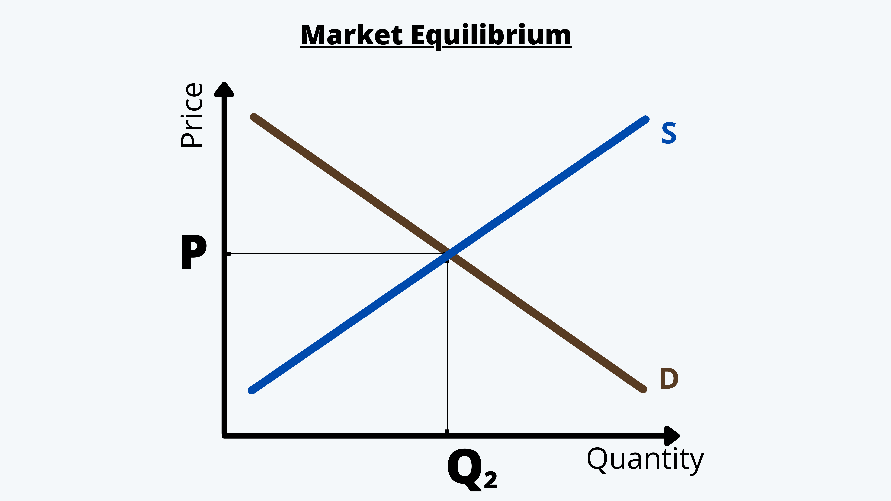

Market equilibrium models are integral to algorithmic trading, providing a critical framework for understanding how supply and demand interact to achieve balance in financial markets. These models, grounded in the principles of economic theory, have significantly evolved and now play a vital role in shaping the strategic execution of trades through algorithms. The objective is to ensure optimal market efficiency and maintain price stability, key factors in the smooth functioning of financial markets.

Market equilibrium, traditionally studied in economics, refers to the point where the quantity of an asset supplied equals the quantity demanded, resulting in stable prices with no impetus for traders to adjust their positions. The adaptation of these concepts into the realm of financial trading has paved the way for sophisticated algorithmic strategies that seek to enhance price discovery and market liquidity.



In this article, we examine the fundamental aspects of market equilibrium models as applied to algorithmic trading. These models enable traders to understand and predict market dynamics, including how prices adjust in response to external information and internal market shifts. By employing these models, traders can tailor their algorithms to respond agilely to evolving market conditions, thus retaining a competitive edge.

Moreover, the article addresses the practical challenges market participants face in maintaining equilibrium, particularly in rapidly changing financial environments. It also highlights innovative strategies employed by leading trading firms, which leverage advanced technologies and data analytics to navigate these complexities efficiently.

Ultimately, by understanding the nuances of these models, traders and investors can enhance their strategies, making informed decisions that contribute to market stability and profitability. This understanding is crucial for navigating the complexities of contemporary financial markets and achieving optimal trading outcomes.

## Table of Contents

## Understanding Market Equilibrium Models

Market equilibrium occurs when the supply of an asset aligns precisely with its demand, resulting in stable prices where market participants have no motive to change their positions. This balance between supply and demand is fundamental to the operation of financial markets.

### Walrasian and Marshallian Models of Equilibrium

The Walrasian model, conceptualized by Léon Walras, presents a comprehensive mechanism whereby prices adjust to equate supply with demand in all markets simultaneously. This model assumes a perfectly competitive market scenario where all participants are price takers and information is symmetrically shared among them. The key principle here is the tâtonnement process, where prices are iteratively adjusted until market-clearing levels are reached.

On the other hand, the Marshallian model, based on Alfred Marshall's insights, focuses on the partial equilibrium analysis in a single market. It examines how the equilibrium price and quantity in a market for a single good are determined by the intersection of supply and demand curves. The Marshallian model is particularly useful for understanding short-run market adjustments and the impact of external factors on a single market.

### Financial Market Equilibrium Models

Beyond classical economic models, financial markets employ specific models such as the Capital Asset Pricing Model (CAPM) and Arbitrage Pricing Theory (APT) to understand asset pricing and risk management.

The CAPM describes the relationship between systematic risk and expected return for assets, particularly stocks. It posits that the expected return of a security is equal to the risk-free rate plus the security's beta (a measure of its price [volatility](/wiki/volatility-trading-strategies) relative to the overall market) multiplied by the market risk premium:

$$
E(R_i) = R_f + \beta_i (E(R_m) - R_f)
$$

Where:
- $E(R_i)$ is the expected return on the capital asset,
- $R_f$ is the risk-free rate,
- $\beta_i$ is the beta of the security,
- $E(R_m)$ is the expected return of the market.

Arbitrage Pricing Theory (APT), proposed by Stephen Ross, provides a more flexible approach than CAPM by considering multiple factors that could affect an asset’s return. Unlike the single-[factor](/wiki/factor-investing) CAPM, APT accommodates multiple sources of systematic risk. The APT formula can be expressed as:

$$
E(R_i) = R_f + \sum_{j=1}^{n} \beta_{ij} F_j
$$

Where:
- $E(R_i)$ is the expected return of asset $i$,
- $R_f$ is the risk-free rate,
- $\beta_{ij}$ represents the sensitivity of the asset to factor $j$,
- $F_j$ is the risk premium of factor $j$.

Both models are crucial for traders as they provide quantitative frameworks for predicting asset returns and managing risk. By utilizing these models, traders can gain deeper insights into price dynamics, helping them to construct and manage robust trading portfolios. Understanding these theoretical foundations allows traders to anticipate market movements more effectively and align their strategies with market conditions.

## Equilibrium Models in Algorithmic Trading

Algorithmic trading integrates market equilibrium models to execute trades efficiently, ensuring that market prices reflect all available information. By doing so, it facilitates the alignment of supply and demand, stabilizing prices and enhancing market efficiency.

Limit [order book](/wiki/order-book-trading-strategies) models and market microstructure studies are pivotal in comprehending trading environments. The limit order book is a record of unexecuted limit orders waiting to be fulfilled, which serves as a valuable tool for evaluating the supply and demand for a specific asset at various price levels. Market microstructure, on the other hand, investigates the processes and outcomes of exchanging assets under explicit trading rules. Both frameworks aid traders in achieving price equilibrium by offering insights into order flow and [liquidity](/wiki/liquidity-risk-premium), vital components for determining price changes.

Mean reversion models leverage deviations from equilibrium to capitalize on the intrinsic tendency of prices to revert to their mean values over time. This phenomenon can be mathematically expressed through the Ornstein-Uhlenbeck process, a stochastic differential equation commonly used to model mean-reverting behavior:

$$
dX_t = \theta(\mu - X_t)dt + \sigma dW_t
$$

In this equation, $X_t$ represents the asset price at time $t$, $\mu$ is the long-term mean, $\theta$ is the speed of reversion, $\sigma$ is the volatility, and $W_t$ is a Wiener process or Brownian motion. By identifying and exploiting these deviations, traders can optimally time their trades to maximize returns.

These strategies heavily rely on sophisticated algorithms and real-time data analysis. The development and implementation of these algorithms require robust programming capabilities, typically in languages such as Python, due to its extensive libraries and frameworks for numerical computations and data processing. An example of a simple mean reversion strategy can be illustrated in Python:

```python
import numpy as np

# Parameters
theta = 0.15  # Speed of reversion
mu = 50.0     # Long-term mean
sigma = 2.0   # Volatility
dt = 0.01     # Time increment
n_steps = 1000

# Simulate mean-reverting process
price_series = [mu]
for _ in range(n_steps):
    dx = theta * (mu - price_series[-1]) * dt + sigma * np.sqrt(dt) * np.random.normal()
    price_series.append(price_series[-1] + dx)

# Plot the results
import matplotlib.pyplot as plt
plt.plot(price_series)
plt.title('Simulated Mean Reversion Process')
plt.xlabel('Time Steps')
plt.ylabel('Price')
plt.show()
```

In conclusion, the application of equilibrium models in [algorithmic trading](/wiki/algorithmic-trading) helps to optimize trade execution and enhance market efficiency. By understanding the dynamics of limit order [books](/wiki/algo-trading-books), market microstructure, and mean reversion tendencies, traders can make informed decisions that contribute to achieving price stability and optimizing returns.

## Strategies to Maintain Market Equilibrium

Market making algorithms play a crucial role in maintaining market equilibrium by providing continuous liquidity. These algorithms operate by placing buy and sell orders at various price levels, effectively reducing the bid-ask spreads. This mechanism ensures that trades can be executed efficiently and with minimal price slippage. By doing so, market makers help stabilize prices and balance supply and demand, thus contributing to the overall health of the financial market.

Arbitrage strategies are another key component in enforcing equilibrium pricing. These strategies involve identifying and exploiting discrepancies in asset prices across different markets or related financial instruments. The basic principle of [arbitrage](/wiki/arbitrage) is to buy an asset at a lower price in one market and sell it at a higher price in another, profiting from the price difference. For instance, if the price of a stock is lower on one exchange than another, an arbitrageur can purchase the stock on the cheaper exchange and sell it where it is priced higher, making a risk-free profit. This activity helps align prices between markets and uphold market efficiency. 

Python Example for Arbitrage Strategy:
```python
# Example Python code for a simple arbitrage strategy
def execute_arbitrage(asset, lower_price, higher_price, quantity):
    buy_cost = lower_price * quantity
    sell_revenue = higher_price * quantity
    profit = sell_revenue - buy_cost

    if profit > 0:
        print(f"Arbitrage opportunity: Buy {asset} at {lower_price}, sell at {higher_price}")
        print(f"Profit: {profit}")

# Example scenario
execute_arbitrage('StockXYZ', 150, 155, 100)
```

Trend-following strategies, while counterintuitive to market equilibrium, can also contribute to market stability. These strategies involve making trades based on the direction of market trends, buying when prices are rising and selling when they are falling. Trend-following provides liquidity during trending periods, as these traders buy into rising markets, offering sell-side participants an [exit](/wiki/exit-strategy), and vice-versa during downtrends. With this added liquidity, trend-followers inadvertently stabilize markets by providing the necessary [volume](/wiki/volume-trading-strategy) during volatile periods to prevent extreme price swings. 

Overall, these strategies—[market making](/wiki/market-making), arbitrage, and trend-following—enhance the efficiency and stability of financial markets by ensuring that prices reflect all available information, thereby helping maintain equilibrium.

## Key Players in Algorithmic Trading

Virtu Financial, Hudson River Trading, and Two Sigma are prominent entities in the field of algorithmic trading, leading the way in employing sophisticated algorithms to maintain market equilibrium. These firms are renowned for their use of advanced technologies and data-driven approaches to optimize trading operations across diverse financial markets, ensuring efficient execution of trades.

Virtu Financial is known for its extensive use of electronic market making, employing algorithms that provide continuous bid and ask prices, thereby enhancing market liquidity and reducing the spread. The firm's ability to rapidly process vast amounts of data and execute trades in milliseconds gives it an edge in highly competitive trading environments. By doing so, Virtu Financial contributes to market stability and efficient price discovery.

Hudson River Trading (HRT) specializes in [quantitative trading](/wiki/quantitative-trading), relying heavily on statistical and mathematical models to execute trades. Their strategy involves leveraging high-frequency trading ([HFT](/wiki/high-frequency-trading-strategies)) techniques to capture short-term market inefficiencies. HRT's algorithms are designed to quickly adapt to changing market conditions, facilitating the restoration of price equilibrium by exploiting arbitrage opportunities that align prices across different markets.

Two Sigma distinguishes itself through its research-driven approach, integrating [machine learning](/wiki/machine-learning) and [artificial intelligence](/wiki/ai-artificial-intelligence) in its trading strategies. By analyzing large datasets, Two Sigma's algorithms predict price movements and identify trading opportunities that others might miss. This focus on innovation and technology not only enables Two Sigma to maintain a competitive edge but also supports a more balanced and efficient global financial system.

These key players significantly influence the financial markets through their cutting-edge practices, ensuring that prices accurately reflect available information and contributing to the stability and balance of the global financial system. As algorithmic trading continues to evolve, the role of these firms in maintaining market equilibrium is likely to grow, highlighting the importance of technological advancement in modern trading strategies.

## Challenges in Achieving and Maintaining Equilibrium

Market equilibrium in algorithmic trading is an ideal state where the supply and demand for financial assets are balanced, ensuring stable prices and efficient markets. However, achieving and maintaining this equilibrium poses significant challenges due to various factors that impact the execution and coordination of trades. 

One of the primary challenges is latency arbitrage. This occurs when traders exploit time delays in the dissemination of market data. High-frequency traders (HFTs) leverage advanced technology to gain speed advantages, allowing them to act on information before it is fully reflected in the market prices. This temporal edge enables them to buy or sell assets at favorable prices before the rest of the market can react, leading to potential disruptions in price stability and hindering the attainment of real-time equilibrium.

Regulatory measures, such as the Markets in Financial Instruments Directive II (MiFID II) and the Dodd-Frank Act, are instituted to preserve market integrity and protect investors. While these regulations aim to prevent manipulative practices and enhance transparency, they can also have unintended consequences on equilibrium strategies. For instance, regulations mandating transparency may limit the ability of traders to employ certain arbitrage techniques, thus impacting their strategy formulation and execution.

Furthermore, market fragmentation adds another layer of complexity to achieving equilibrium. The existence of multiple trading venues, such as exchanges and alternative trading systems, can lead to inconsistent pricing across markets. This separation of liquidity pools can result in inefficiencies and mispricing, necessitating innovative arbitrage techniques. Traders must devise strategies to reconcile these price discrepancies and maintain consistency across venues, which often involves complex algorithms capable of operating across diverse market infrastructures.

Addressing these challenges requires continuous adaptations and innovations in trading strategies. Traders and firms invest heavily in technology and data analytics to reduce latency, comply with evolving regulatory landscapes, and effectively arbitrage fragmented markets. By deploying advanced algorithms and utilizing real-time data, they strive to foster a more efficient and balanced market environment. The dynamic nature of financial markets means that overcoming these challenges is an ongoing process, vital for the stability and efficiency required for sustainable market equilibrium.

## Conclusion

Market equilibrium models in algorithmic trading highlight a crucial intersection between economic theory and practical trading strategies. By applying these models, trading firms enhance market stability and efficiency, enabling more accurate price discovery and optimal resource allocation. These models serve as the foundation for strategic decision-making processes, as they incorporate complex variables and risk factors essential for maintaining equilibrium in dynamic financial markets.

The evolving nature of technology and market conditions necessitates the continuous refinement and adaptation of these models. As data processing technologies advance and market complexities increase, trading firms must update their algorithms to reflect current conditions. This involves integrating machine learning and artificial intelligence to develop predictive analytics that improve the models' precision and responsiveness.

Ultimately, understanding and applying market equilibrium models boosts the capability of traders and investors to secure favorable outcomes within an increasingly intricate financial ecosystem. By strategically leveraging these models, market participants are better equipped to navigate volatility, forecast price movements, and allocate resources efficiently. As these models continue to evolve, they will play an increasingly vital role in ensuring the integrity and resilience of global financial markets.

## References & Further Reading

[1]: Arrow, K. J., & Debreu, G. (1954). ["Existence of an Equilibrium for a Competitive Economy."](https://www.jstor.org/stable/1907353) Econometrica, 22(3), 265-290.

[2]: Fama, E. F. (1970). ["Efficient Capital Markets: A Review of Theory and Empirical Work."](https://www.jstor.org/stable/2325486) The Journal of Finance, 25(2), 383-417.

[3]: Black, F., & Scholes, M. (1973). ["The Pricing of Options and Corporate Liabilities."](https://www.cs.princeton.edu/courses/archive/fall09/cos323/papers/black_scholes73.pdf) Journal of Political Economy, 81(3), 637-654.

[4]: Ross, S. A. (1976). ["The Arbitrage Theory of Capital Asset Pricing."](https://www.sciencedirect.com/science/article/pii/0022053176900466) Journal of Economic Theory, 13(3), 341-360.

[5]: Harris, L. (2003). ["Trading and Exchanges: Market Microstructure for Practitioners."](https://academic.oup.com/book/52292) Oxford University Press.

[6]: Lopez de Prado, M. (2018). ["Advances in Financial Machine Learning."](https://www.amazon.com/Advances-Financial-Machine-Learning-Marcos/dp/1119482089) Wiley.

[7]: Chan, E. P. (2009). ["Quantitative Trading: How to Build Your Own Algorithmic Trading Business."](https://github.com/egorpe/EPChan-QuantitativeTrading/blob/master/example7_6.m) Wiley.

[8]: Jarrow, R. A., & Protter, P. (2016). ["A Short History of Stochastic Integration and Mathematical Finance: The Early Years, 1880-1970."](https://www.jstor.org/stable/4356300) Finance and Stochastics, 20, 1-40.

[9]: Berentsen, A., & Schär, F. (2017). ["A Short Introduction to the World of Cryptocurrencies."](https://papers.ssrn.com/sol3/papers.cfm?abstract_id=3105283) Federal Reserve Bank of St. Louis Review, 100(1), 1-16.