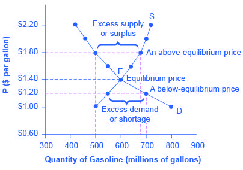

## Table of Contents

## What is market equilibrium?

Market equilibrium is when the amount of a product people want to buy is the same as the amount sellers want to sell. At this point, the price is just right so that everyone is happy. If the price is too high, fewer people will buy the product, and sellers might have too much left over. If the price is too low, more people will want to buy it than there is available, and sellers might run out quickly.

When the market reaches equilibrium, it means the market is balanced. This balance helps keep prices stable over time. If something changes, like a new trend or a change in costs, the equilibrium can shift. But the market will try to find a new balance where the amount people want to buy matches the amount sellers want to sell again.

## How is market equilibrium determined in a basic supply and demand model?

In a basic supply and demand model, market equilibrium is found where the supply curve and the demand curve meet. The supply curve shows how much of a product sellers are willing to sell at different prices. It usually goes up because sellers want to sell more when the price is higher. The demand curve shows how much of a product people want to buy at different prices. It usually goes down because people want to buy more when the price is lower. When these two curves cross, that's the equilibrium point. The price at this point is called the equilibrium price, and the amount of the product at this price is called the equilibrium quantity.

At the equilibrium point, the market is balanced. This means that the amount of the product people want to buy is exactly the same as the amount sellers want to sell. If the price is higher than the equilibrium price, there will be more of the product available than people want to buy, which is called a surplus. If the price is lower than the equilibrium price, there will be more people wanting to buy the product than there is available, which is called a shortage. The market will naturally move towards the equilibrium because sellers will lower their prices to sell their surplus, and buyers will offer more to get the product during a shortage, until they meet at the equilibrium point.

## What are the key assumptions of the basic market equilibrium model?

The basic market equilibrium model relies on a few important assumptions to work. One big assumption is that all buyers and sellers in the market are rational. This means they make decisions based on what's best for them. Buyers want to buy things at the lowest price they can, and sellers want to sell things at the highest price they can. Another assumption is that there are many buyers and sellers, so no single one can control the market price. This is called perfect competition. Everyone is a price taker, meaning they have to accept the market price and can't change it on their own.

Another key assumption is that all buyers and sellers have perfect information. This means they know everything about the product, like its quality and price, and they can make the best choices. The model also assumes that the product being traded is the same no matter who is selling it. This is called a homogeneous product. Lastly, the model assumes that there are no barriers to entering or leaving the market. This means new sellers can start selling easily, and existing sellers can stop selling without any problems. These assumptions help the model show how supply and demand work to find a balance in the market.

## Can you explain the concept of equilibrium price and quantity?

The equilibrium price is the price at which the amount of a product people want to buy is exactly the same as the amount sellers want to sell. Imagine you're at a market and you see lots of people wanting to buy apples, but there aren't enough apples to go around. The price of apples might go up until fewer people want to buy them and more sellers are willing to sell them. When the price reaches a point where the number of apples people want to buy matches the number of apples sellers want to sell, that's the equilibrium price.

The equilibrium quantity is the amount of the product that is bought and sold at the equilibrium price. Going back to our apple example, once the price of apples reaches the equilibrium price, the number of apples that people are buying is the same as the number of apples that sellers are selling. This amount is the equilibrium quantity. It's the sweet spot where the market is balanced, and neither buyers nor sellers are left wanting more or less of the product.

## What happens when there is a shift in supply or demand in the market equilibrium model?

When there's a shift in either supply or demand, the market equilibrium changes. Let's say there's a new trend and suddenly everyone wants more apples. This means the demand curve moves to the right because more people are trying to buy apples at every price. When this happens, the old equilibrium price and quantity are no longer balanced. To find a new balance, the price of apples will go up until the amount people want to buy matches the amount sellers are willing to sell again. The new equilibrium will have a higher price and a higher quantity of apples being sold.

On the other hand, if something happens that makes it harder for sellers to supply apples, like a bad harvest, the supply curve moves to the left. This means sellers are willing to sell fewer apples at every price. The old equilibrium is thrown off, and to find a new balance, the price of apples will go up. This time, though, the new equilibrium will have a higher price but a lower quantity of apples being sold. In both cases, the market adjusts to find a new equilibrium where the amount people want to buy matches the amount sellers want to sell, but the new equilibrium price and quantity will be different from before.

## How do external factors like taxes and subsidies affect market equilibrium?

When the government puts a tax on a product, it makes it more expensive for sellers to sell it. They might raise the price to cover the tax. This shifts the supply curve to the left because at every price, sellers are willing to sell less of the product. As a result, the equilibrium price goes up, and the equilibrium quantity goes down. People buy less of the product because it's more expensive, and sellers sell less because they're making less money after paying the tax. So, a tax can make the market smaller and the price higher.

On the other hand, if the government gives a subsidy to sellers, it's like giving them money to sell the product. This makes it cheaper for them to sell it, so they're willing to sell more at every price. The supply curve shifts to the right, and the equilibrium price goes down while the equilibrium quantity goes up. More people buy the product because it's cheaper, and sellers sell more because they're getting extra money from the subsidy. So, a subsidy can make the market bigger and the price lower.

Both taxes and subsidies change the balance in the market. They affect how much of a product is bought and sold and at what price. By understanding how these external factors work, we can see how the government can influence the market to reach different goals, like raising money through taxes or encouraging more of a product to be sold with subsidies.

## What are some limitations of the basic market equilibrium model?

The basic market equilibrium model helps us understand how prices and quantities are set in a market, but it has some limits. One big limit is that it assumes everyone has perfect information about the product. In real life, people often don't know everything about what they're buying or selling. They might not know the best price or the quality of the product, which can change how the market works. Also, the model assumes there are lots of buyers and sellers, and none of them can change the price by themselves. But in many real markets, some sellers might be big enough to affect the price, or there might not be many sellers at all.

Another limitation is that the model doesn't account for things like government rules, taxes, and subsidies, which can really change how the market works. In reality, these things can make the supply and demand curves shift in ways the basic model doesn't predict. The model also assumes that the product being sold is the same no matter who sells it. But often, products can be different depending on who makes them or where they come from, which can affect how much people want to buy them. So, while the basic market equilibrium model is a good starting point, it doesn't capture all the complexities of real-world markets.

## How do more advanced models, such as those incorporating expectations, differ from the basic model?

More advanced models that include expectations take into account that people often make decisions based on what they think will happen in the future, not just what's happening right now. In the basic model, people only care about the current price and how much of a product they want to buy or sell at that price. But in real life, if people expect the price of a product to go up, they might buy more now to get a better deal, which can push the current price up. On the other hand, if they expect the price to go down, they might wait to buy, which can push the current price down. These models show how people's guesses about the future can change what's happening in the market right now.

These advanced models are more realistic because they consider things like how people might react to news or rumors about a product. For example, if there's a rumor that a new phone is coming out soon, people might hold off on buying the current model, even if it's a good deal right now. This can lead to a drop in demand for the current model. The basic model wouldn't account for this because it doesn't look at future expectations. By including expectations, these advanced models can better predict how the market will change and help us understand why prices and quantities might shift in ways that seem unexpected if we only look at the basic supply and demand.

## What role do market equilibrium models play in economic policy-making?

Market equilibrium models help people who make economic policies understand how markets work. These models show how prices and the amount of things people buy and sell can change when something new happens, like a new law or a change in how much people want something. By using these models, policymakers can guess what might happen if they make a new rule or change an old one. For example, if they want to put a tax on something, they can use the model to see how it might make the price go up and people buy less of it.

These models are really useful, but they're not perfect. They make some guesses about how people act, like thinking everyone knows everything about what they're buying or selling. In real life, people don't always know everything, and big companies can change prices by themselves. So, policymakers have to be careful and use other information too. Even with these limits, market equilibrium models give a good starting point for making smart choices about economic policies. They help make sure that new rules or changes will help the market work better and make people happier.

## Can you describe a real-world application of a market equilibrium model?

Imagine the government wants to help people buy more electric cars because they're good for the environment. They decide to give money to people who buy electric cars, which is called a subsidy. To figure out what might happen, they use a market equilibrium model. The model shows that when the government gives money to buyers, it makes electric cars cheaper for them. This means more people will want to buy electric cars, so the demand for them goes up. The model predicts that because of the subsidy, more electric cars will be sold at a lower price than before.

The government uses this information to decide how big the subsidy should be. They want to make electric cars affordable enough that lots of people will buy them, but they also need to think about how much it will cost them. By using the market equilibrium model, they can find a good balance. The model helps them see that if the subsidy is too small, it won't make a big difference, but if it's too big, it might cost too much money. So, the government can use the model to make a smart choice that helps the environment and fits their budget.

## How do dynamic market equilibrium models account for changes over time?

Dynamic market equilibrium models look at how markets change over time. They show that things like prices and how much people buy or sell can move around a lot. These models don't just look at what's happening right now. They think about how things that happened before can change what will happen next. For example, if the price of a product went up last month, people might buy less of it this month. The models use math to guess what might happen in the future based on what's happening now and what happened before.

These models are really helpful because they can show how markets can be different at different times. They can look at things like how people's guesses about the future can change what they do now. If people think a product will be cheaper next month, they might wait to buy it. This can make the price go down now. By looking at these changes over time, dynamic models give a better picture of how markets work in the real world. They help us understand that markets are always moving and changing, not just staying still like in the basic models.

## What are the current research trends and future directions in market equilibrium modeling?

Researchers are always trying to make market equilibrium models better. One big trend is using computers to make models that can handle a lot more information at once. These models can look at lots of different things happening in the market, like how people's feelings or news can change what they do. They can also look at how markets in different places around the world affect each other. This helps us understand how big changes, like a new law or a big event, can make prices and how much people buy or sell change in ways we might not expect.

Another trend is looking at how people make choices based on what they think will happen in the future. These models try to guess how people's guesses about the future can change what they do now. For example, if people think a product will be more expensive later, they might buy more of it now. By adding this into the models, researchers can make better guesses about how markets will change over time. In the future, these models might get even better at understanding how people think and how markets change, helping us make smarter choices about money and the economy.

## What are Market Equilibrium Models and How Do We Understand Them?

Market equilibrium occurs when the supply of an asset aligns precisely with its demand, resulting in stable prices where market participants have no motive to change their positions. This balance between supply and demand is fundamental to the operation of financial markets.

### Walrasian and Marshallian Models of Equilibrium

The Walrasian model, conceptualized by Léon Walras, presents a comprehensive mechanism whereby prices adjust to equate supply with demand in all markets simultaneously. This model assumes a perfectly competitive market scenario where all participants are price takers and information is symmetrically shared among them. The key principle here is the tâtonnement process, where prices are iteratively adjusted until market-clearing levels are reached.

On the other hand, the Marshallian model, based on Alfred Marshall's insights, focuses on the partial equilibrium analysis in a single market. It examines how the equilibrium price and quantity in a market for a single good are determined by the intersection of supply and demand curves. The Marshallian model is particularly useful for understanding short-run market adjustments and the impact of external factors on a single market.

### Financial Market Equilibrium Models

Beyond classical economic models, financial markets employ specific models such as the Capital Asset Pricing Model (CAPM) and Arbitrage Pricing Theory (APT) to understand asset pricing and risk management.

The CAPM describes the relationship between systematic risk and expected return for assets, particularly stocks. It posits that the expected return of a security is equal to the risk-free rate plus the security's beta (a measure of its price [volatility](/wiki/volatility-trading-strategies) relative to the overall market) multiplied by the market risk premium:

$$
E(R_i) = R_f + \beta_i (E(R_m) - R_f)
$$

Where:
- $E(R_i)$ is the expected return on the capital asset,
- $R_f$ is the risk-free rate,
- $\beta_i$ is the beta of the security,
- $E(R_m)$ is the expected return of the market.

Arbitrage Pricing Theory (APT), proposed by Stephen Ross, provides a more flexible approach than CAPM by considering multiple factors that could affect an asset’s return. Unlike the single-[factor](/wiki/factor-investing) CAPM, APT accommodates multiple sources of systematic risk. The APT formula can be expressed as:

$$
E(R_i) = R_f + \sum_{j=1}^{n} \beta_{ij} F_j
$$

Where:
- $E(R_i)$ is the expected return of asset $i$,
- $R_f$ is the risk-free rate,
- $\beta_{ij}$ represents the sensitivity of the asset to factor $j$,
- $F_j$ is the risk premium of factor $j$.

Both models are crucial for traders as they provide quantitative frameworks for predicting asset returns and managing risk. By utilizing these models, traders can gain deeper insights into price dynamics, helping them to construct and manage robust trading portfolios. Understanding these theoretical foundations allows traders to anticipate market movements more effectively and align their strategies with market conditions.

## What are Equilibrium Models in Algorithmic Trading?

Algorithmic trading integrates market equilibrium models to execute trades efficiently, ensuring that market prices reflect all available information. By doing so, it facilitates the alignment of supply and demand, stabilizing prices and enhancing market efficiency.

Limit [order book](/wiki/order-book-trading-strategies) models and market microstructure studies are pivotal in comprehending trading environments. The limit order book is a record of unexecuted limit orders waiting to be fulfilled, which serves as a valuable tool for evaluating the supply and demand for a specific asset at various price levels. Market microstructure, on the other hand, investigates the processes and outcomes of exchanging assets under explicit trading rules. Both frameworks aid traders in achieving price equilibrium by offering insights into order flow and [liquidity](/wiki/liquidity-risk-premium), vital components for determining price changes.

Mean reversion models leverage deviations from equilibrium to capitalize on the intrinsic tendency of prices to revert to their mean values over time. This phenomenon can be mathematically expressed through the Ornstein-Uhlenbeck process, a stochastic differential equation commonly used to model mean-reverting behavior:

$$
dX_t = \theta(\mu - X_t)dt + \sigma dW_t
$$

In this equation, $X_t$ represents the asset price at time $t$, $\mu$ is the long-term mean, $\theta$ is the speed of reversion, $\sigma$ is the volatility, and $W_t$ is a Wiener process or Brownian motion. By identifying and exploiting these deviations, traders can optimally time their trades to maximize returns.

These strategies heavily rely on sophisticated algorithms and real-time data analysis. The development and implementation of these algorithms require robust programming capabilities, typically in languages such as Python, due to its extensive libraries and frameworks for numerical computations and data processing. An example of a simple mean reversion strategy can be illustrated in Python:

```python
import numpy as np

# Parameters
theta = 0.15  # Speed of reversion
mu = 50.0     # Long-term mean
sigma = 2.0   # Volatility
dt = 0.01     # Time increment
n_steps = 1000

# Simulate mean-reverting process
price_series = [mu]
for _ in range(n_steps):
    dx = theta * (mu - price_series[-1]) * dt + sigma * np.sqrt(dt) * np.random.normal()
    price_series.append(price_series[-1] + dx)

# Plot the results
import matplotlib.pyplot as plt
plt.plot(price_series)
plt.title('Simulated Mean Reversion Process')
plt.xlabel('Time Steps')
plt.ylabel('Price')
plt.show()
```

In conclusion, the application of equilibrium models in [algorithmic trading](/wiki/algorithmic-trading) helps to optimize trade execution and enhance market efficiency. By understanding the dynamics of limit order [books](/wiki/algo-trading-books), market microstructure, and mean reversion tendencies, traders can make informed decisions that contribute to achieving price stability and optimizing returns.

## References & Further Reading

[1]: Arrow, K. J., & Debreu, G. (1954). ["Existence of an Equilibrium for a Competitive Economy."](https://www.jstor.org/stable/1907353) Econometrica, 22(3), 265-290.

[2]: Fama, E. F. (1970). ["Efficient Capital Markets: A Review of Theory and Empirical Work."](https://www.jstor.org/stable/2325486) The Journal of Finance, 25(2), 383-417.

[3]: Black, F., & Scholes, M. (1973). ["The Pricing of Options and Corporate Liabilities."](https://www.cs.princeton.edu/courses/archive/fall09/cos323/papers/black_scholes73.pdf) Journal of Political Economy, 81(3), 637-654.

[4]: Ross, S. A. (1976). ["The Arbitrage Theory of Capital Asset Pricing."](https://www.sciencedirect.com/science/article/pii/0022053176900466) Journal of Economic Theory, 13(3), 341-360.

[5]: Harris, L. (2003). ["Trading and Exchanges: Market Microstructure for Practitioners."](https://academic.oup.com/book/52292) Oxford University Press.

[6]: Lopez de Prado, M. (2018). ["Advances in Financial Machine Learning."](https://www.amazon.com/Advances-Financial-Machine-Learning-Marcos/dp/1119482089) Wiley.

[7]: Chan, E. P. (2009). ["Quantitative Trading: How to Build Your Own Algorithmic Trading Business."](https://github.com/egorpe/EPChan-QuantitativeTrading/blob/master/example7_6.m) Wiley.

[8]: Jarrow, R. A., & Protter, P. (2016). ["A Short History of Stochastic Integration and Mathematical Finance: The Early Years, 1880-1970."](https://www.jstor.org/stable/4356300) Finance and Stochastics, 20, 1-40.

[9]: Berentsen, A., & Schär, F. (2017). ["A Short Introduction to the World of Cryptocurrencies."](https://papers.ssrn.com/sol3/papers.cfm?abstract_id=3105283) Federal Reserve Bank of St. Louis Review, 100(1), 1-16.