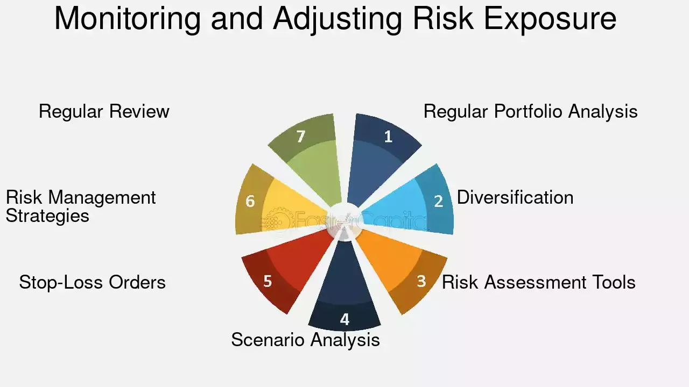

## Table of Contents

## What is market exposure and why is it important for investors?

Market exposure refers to the level of participation an investor has in the financial markets. It's basically how much of their money is invested in stocks, bonds, or other financial assets. If an investor has a lot of market exposure, it means a big part of their money is in the market. If they have little market exposure, it means they have less money invested.

Market exposure is important for investors because it helps them manage risk and potential rewards. If an investor wants to grow their money, they need some market exposure. But too much exposure can be risky, especially if the market goes down. So, investors need to find a balance that fits their goals and how much risk they can handle. By adjusting their market exposure, investors can protect their money and still have a chance to make more.

## How is market exposure measured in financial terms?

Market exposure is measured by looking at how much of an investor's money is in the market. This can be shown as a percentage or a dollar amount. For example, if an investor has $100,000 and $70,000 of it is invested in stocks, their market exposure to stocks is 70%. This helps investors see how much of their money is at risk if the market goes up or down.

Another way to measure market exposure is by using beta. Beta is a number that shows how much a stock or a portfolio moves compared to the overall market. If a stock has a beta of 1, it moves the same as the market. If it's more than 1, it moves more than the market, and if it's less than 1, it moves less. This helps investors understand how sensitive their investments are to market changes. By knowing their market exposure, investors can make better decisions about buying or selling investments.

## What are the different types of market exposure?

There are different types of market exposure that investors need to know about. One type is asset class exposure. This means how much of your money is in different kinds of investments like stocks, bonds, or real estate. For example, if you have a lot of money in stocks, you have high exposure to the stock market. If you have more money in bonds, you have high exposure to the bond market. Each asset class can go up or down at different times, so it's important to spread your money around to manage risk.

Another type of market exposure is sector exposure. This is about how much of your money is in different parts of the economy, like technology, healthcare, or energy. If you have a lot of money in tech stocks, you have high exposure to the technology sector. If that sector does well, you can make a lot of money, but if it does badly, you can lose a lot too. It's good to have some money in different sectors to balance out the risk.

The last type is geographic exposure. This means how much of your money is invested in different countries or regions. If you have a lot of money in the U.S. market, you have high exposure to the U.S. economy. But if you also invest in Europe or Asia, you spread your risk across different parts of the world. This can help protect your money if one country's economy is not doing well. By understanding these types of market exposure, investors can make smarter choices about where to put their money.

## Can you explain the concept of beta as a measure of market exposure?

Beta is a number that shows how much a stock or a portfolio moves compared to the overall market. It's a way to measure how sensitive your investments are to changes in the market. If a stock has a beta of 1, it means it moves the same way as the market. So, if the market goes up by 10%, a stock with a beta of 1 will also go up by about 10%. If a stock has a beta higher than 1, it moves more than the market. For example, a stock with a beta of 1.5 will go up by 15% if the market goes up by 10%. On the other hand, if a stock has a beta less than 1, it moves less than the market. A stock with a beta of 0.5 will only go up by 5% if the market goes up by 10%.

Understanding beta is important for investors because it helps them see how much risk they are taking with their investments. If you have a lot of stocks with high betas, your portfolio will be more sensitive to market changes, which can be riskier but also offer higher potential rewards. If you have stocks with low betas, your portfolio will be less affected by market swings, which can be safer but might not grow as much. By looking at the beta of their investments, investors can adjust their market exposure to match their risk tolerance and investment goals.

## How does market exposure relate to portfolio diversification?

Market exposure and portfolio diversification are closely connected. Market exposure is about how much of your money is in the market, and diversification is about spreading that money across different kinds of investments. When you diversify your portfolio, you put your money in different things like stocks, bonds, and maybe even real estate or commodities. This helps reduce the risk because if one type of investment goes down, the others might still do well. So, by diversifying, you can control your market exposure in a way that keeps your money safer.

Think of it like this: if all your money is in one stock or one type of investment, you have high market exposure to that one thing. If that stock or investment does badly, you could lose a lot of money. But if you spread your money across many different investments, you lower your exposure to any single one. This way, you still have market exposure, but it's spread out, which makes your overall investment less risky. Balancing market exposure through diversification helps investors achieve their financial goals while managing the risks that come with investing.

## What are the risks associated with high market exposure?

High market exposure means a lot of your money is in the market. This can be risky because if the market goes down, you could lose a lot of money. For example, if you have all your money in stocks and the stock market crashes, your savings could drop a lot. It's like putting all your eggs in one basket. If the basket falls, all your eggs break. High market exposure can make your investments go up a lot when the market is doing well, but it can also make them go down a lot when the market is not doing well.

Another risk is that high market exposure can make you feel stressed and worried. When you have a lot of money in the market, you might check your investments all the time and feel nervous about any small changes. This can be bad for your mental health. Also, if you need money quickly and the market is down, you might have to sell your investments at a lower price than you bought them, which means you lose money. Balancing your market exposure can help you avoid these risks and keep your money safer.

## How can investors manage or mitigate market exposure risks?

Investors can manage market exposure risks by diversifying their portfolio. This means spreading their money across different kinds of investments, like stocks, bonds, and maybe even real estate. If one type of investment goes down, the others might still do well, so the overall risk to your money is lower. It's like not putting all your eggs in one basket. By having different investments, you can balance out the ups and downs of the market and keep your money safer.

Another way to manage market exposure risks is by adjusting how much of your money is in the market. If you think the market might go down, you can move some of your money into safer places like savings accounts or money market funds. This is called reducing your market exposure. On the other hand, if you think the market will go up, you can put more money into investments. It's important to keep checking and changing your market exposure based on what's happening in the market and your own financial goals. This way, you can protect your money and still have a chance to make more.

Using tools like beta can also help investors manage market exposure risks. Beta shows how much a stock or a portfolio moves compared to the market. By looking at the beta of your investments, you can see how sensitive they are to market changes. If you have a lot of high-beta stocks, your portfolio will be more affected by market swings. You can reduce this risk by adding some low-beta investments. By understanding and adjusting the beta of your portfolio, you can control your market exposure and make smarter investment choices.

## What role do derivatives play in managing market exposure?

Derivatives are financial tools that can help investors manage their market exposure. They work by letting investors bet on the future price of something without actually owning it. For example, if you think the stock market will go down, you can use a derivative like an option or a futures contract to protect your money. This way, even if the market goes down, the derivative can help you lose less money. Derivatives give investors a way to control their market exposure without having to sell their investments.

Using derivatives can be tricky, though. They can be complicated and risky if you don't understand them well. But if used correctly, they can help investors manage their market exposure better. For instance, if you have a lot of money in the stock market and you're worried about a big drop, you can use derivatives to hedge your bets. This means you're preparing for a possible loss, which can make your overall investment safer. By using derivatives smartly, investors can adjust their market exposure and protect their money from big swings in the market.

## How does market exposure vary across different asset classes?

Market exposure can be different depending on what kind of investments you have. If you have a lot of money in stocks, you have high market exposure to the stock market. Stocks can go up and down a lot, so having a lot of money in them means your investments can change a lot too. On the other hand, if you have more money in bonds, your market exposure is more to the bond market. Bonds usually don't change as much as stocks, so they can be safer but might not grow as much. Real estate is another kind of investment, and having money in it means your market exposure is to the real estate market, which can be affected by things like housing prices and interest rates.

Different asset classes can also affect how sensitive your investments are to what's happening in the world. For example, if you have a lot of money in commodities like gold or oil, your market exposure is to those markets. Commodities can be very up and down because they depend on things like supply and demand. If you have money in cash or savings accounts, your market exposure is low because these don't change much with the market. By understanding how market exposure works with different asset classes, you can choose where to put your money to match your goals and how much risk you want to take.

## What are advanced strategies for optimizing market exposure?

Advanced strategies for optimizing market exposure involve using tools like options and futures to hedge against market risks. For example, if you think the market might go down, you can buy put options on your stocks. This gives you the right to sell your stocks at a set price, even if the market drops a lot. By doing this, you can protect your money from big losses. Another way is to use futures contracts to lock in prices for things like commodities or stock indexes. This can help you manage your market exposure better by knowing what you'll get in the future, no matter what happens in the market.

Another advanced strategy is to use dynamic asset allocation. This means changing how much of your money is in different kinds of investments based on what's happening in the market. If you think stocks will do well, you might put more money into them. If you think they might go down, you can move some money into safer investments like bonds or cash. This helps you keep your market exposure at a level that matches your goals and how much risk you can handle. By being flexible and adjusting your investments often, you can take advantage of good times in the market and protect your money during bad times.

## How can market exposure be used in forecasting market trends?

Market exposure can help investors guess what might happen in the market. If a lot of people are putting their money into stocks, it might mean they think the market will go up. This can be a sign that the market is doing well or will do well soon. On the other hand, if people are taking their money out of the market, it might mean they think the market will go down. By looking at how much money is going into or out of different investments, investors can get clues about what might happen next in the market.

Another way to use market exposure for forecasting is by looking at how much money is in different types of investments. For example, if more money is going into safe investments like bonds, it might mean people are worried about the market and think it might go down. If more money is going into riskier investments like stocks, it might mean people are feeling good about the market and think it will go up. By watching these changes in market exposure, investors can make better guesses about future market trends and adjust their own investments to be ready for what might happen.

## What are the regulatory considerations regarding market exposure for financial institutions?

Financial institutions have to follow rules about how much market exposure they can have. These rules are made by groups like the government or financial watchdogs to keep the financial system safe. For example, banks have to keep a certain amount of money in safe places like government bonds, so they don't have too much risk if the market goes down. This is called capital requirements. If a bank has too much money in risky investments, it might have to pay a fine or get in trouble with the regulators.

Regulators also look at how much risk a financial institution is taking with its market exposure. They use things like stress tests to see how well a bank would do if the market crashed. If a bank doesn't pass these tests, it might have to change how it invests its money. This helps make sure that banks and other financial institutions don't take too many risks and can still help people even if the market has big problems. By following these rules, financial institutions can keep their market exposure at a safe level and protect their customers' money.

## How can we measure market exposure and risk?

Effective financial measurement tools play a pivotal role in quantifying market exposure and assessing the associated risks, particularly in [algorithmic trading](/wiki/algorithmic-trading). These tools enable traders to gain a deep understanding of their potential financial exposure, which is essential for aligning their investment strategies with their risk tolerance levels.

One of the most widely used methods for measuring market exposure is the Value at Risk (VaR) model. VaR estimates the maximum potential loss in the value of a portfolio over a defined period for a given confidence interval. The formula used to calculate VaR for a normal distribution is as follows:

$$

\text{VaR} = \text{Z} \times \sigma \times \sqrt{t} 
$$

Where:
- $\text{Z}$ is the Z-score corresponding to the desired confidence level.
- $\sigma$ is the standard deviation of the portfolio's returns.
- $t$ is the time period.

VaR provides a clear estimate of potential losses, which enables traders to structure their portfolios to mitigate undue exposure to critical market movements.

Stress testing is another essential tool in measuring market exposure and risk. This method involves simulating extreme market conditions to evaluate the resilience of a portfolio. It assesses how various stress scenarios impact the portfolio's value and allows traders to foresee possible financial outcomes during adverse events. By analyzing these stress test results, traders can make informed decisions about their exposure and adjust their strategy to safeguard against potential losses.

Scenario analysis is another technique employed to measure market risk. This method evaluates potential financial outcomes by considering different hypothetical market conditions. Scenarios could include economic downturns, market rallies, or geopolitical events. The versatility of scenario analysis lies in its ability to account for non-linear relationships between different assets, offering a more comprehensive view of market exposure. By exploring a range of possible market states, traders gain insight into different risk levels and prepare accordingly.

To provide a practical perspective, here is a simple Python example to calculate VaR using historical return data:

```python
import numpy as np

# Sample historical return data
returns = np.array([0.02, -0.01, 0.015, -0.005, 0.03])

# Calculate standard deviation of returns
std_dev = np.std(returns)

# Set confidence level (e.g., 95%)
confidence_level = 0.95
z_score = 1.65  # Corresponding Z-score for 95% confidence

# Time period (e.g., 1 day)
time_period = 1  # in days

# Calculate VaR
var = z_score * std_dev * np.sqrt(time_period)
print(f"Value at Risk (VaR): {var:.4f}")
```

Accurate measurement of market exposure using these methods provides algorithmic traders with a sturdy framework for aligning their trading strategies with their risk tolerance levels. In doing so, traders can effectively manage risk, optimize portfolio performance, and enhance their overall trading strategy.

## What are the financial measurements used for informed decision making?

Average True Range (ATR) is a vital tool within the financial measurement toolkit that aids traders in making informed decisions by quantifying market volatility. Developed by J. Welles Wilder, ATR measures the degree of price movement within a market; it provides traders with insights into market dynamics and can significantly improve their risk management strategies.

Traders commonly use ATR to set dynamic stop-loss levels, which are crucial for protecting profits and minimizing losses. Unlike a fixed stop-loss, a dynamic one adjusts according to the current market volatility, offering a more flexible risk management approach. By calculating ATR, traders can determine the average volatility over a specific period, typically using a 14-day period. The formula to calculate ATR is as follows:

$$
\text{ATR} = \frac{\sum (\text{True Range})}{n}
$$

where the True Range (TR) for each day is the greatest of the following:
- The current high minus the current low,
- The absolute value of the current high minus the previous close,
- The absolute value of the current low minus the previous close.

Using ATR values, traders can set stop-loss levels at a multiple of the ATR, allowing them to tailor their [exit](/wiki/exit-strategy) strategies based on current market conditions rather than static presets. This approach minimizes the likelihood of premature exits due to short-term volatility spikes.

In adapting trading strategies to evolving market conditions, ATR helps traders adjust their exposure, ensuring that risk management aligns with current levels of market volatility. This adaptability is beneficial in periods of both heightened volatility and market stability, as it allows traders to recalibrate their strategies effectively.

Moreover, incorporating ATR and other financial measurements into trading systems supports optimized risk management techniques. Using Python, traders can automate the ATR calculation and integrate it within algorithmic trading systems to ensure consistent application. Here's a simple Python code to calculate ATR:

```python
import pandas as pd

def calculate_atr(data, period=14):
    data['High-Low'] = data['High'] - data['Low']
    data['High-Close_Prev'] = abs(data['High'] - data['Close'].shift(1))
    data['Low-Close_Prev'] = abs(data['Low'] - data['Close'].shift(1))
    data['True Range'] = data[['High-Low', 'High-Close_Prev', 'Low-Close_Prev']].max(axis=1)
    data['ATR'] = data['True Range'].rolling(window=period).mean()
    return data

# Example usage:
# data is a DataFrame with columns 'High', 'Low', and 'Close'
# atr_data = calculate_atr(data)
```

In conclusion, employing financial measurements like ATR enhances traders' ability to control risks and tailor their trading strategies to the ever-changing market landscape. This capability is essential for maintaining robust, adaptable trading systems that can thrive amidst varying levels of market turbulence.

## References & Further Reading

[1]: Jorion, P. (1997). ["Value at Risk: The New Benchmark for Managing Financial Risk."](https://archive.org/details/valueatrisknewbe0000jori) McGraw-Hill.

[2]: Ait-Sahalia, Y., & Lo, A. W. (2000). ["Nonparametric Risk Management and Implied Risk Aversion."](https://www.nber.org/papers/w6130) Journal of Econometrics, 94(1-2), 9-51.

[3]: [Berkowitz, J. (2001). "Testing the Accuracy of Density Forecasts, with Applications to Risk Management."](https://www.researchgate.net/publication/41735316_A_note_on_the_Berkowitz_test_with_discrete_distributions) Journal of Business & Economic Statistics, 19(4), 465-474.

[4]: Hull, J. C. (2018). ["Options, Futures, and Other Derivatives."](https://www.semanticscholar.org/paper/Options%2C-Futures%2C-and-Other-Derivatives-Hull/89bdee500c8623864fc9eb7a471546aa713acc44) Pearson Education.

[5]: Black, F., & Scholes, M. (1973). ["The Pricing of Options and Corporate Liabilities."](https://www.cs.princeton.edu/courses/archive/fall09/cos323/papers/black_scholes73.pdf) The Journal of Political Economy, 81(3), 637-654.