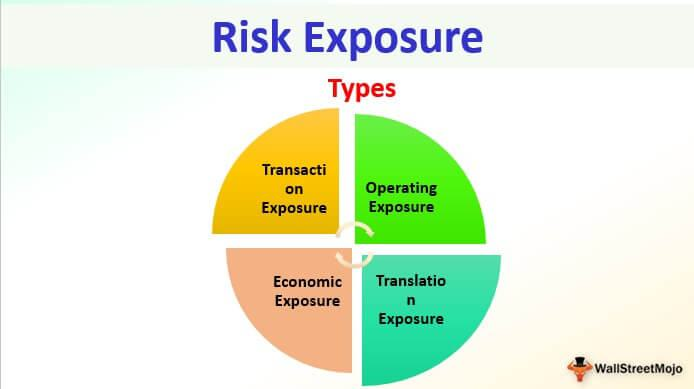

Market exposure risk is a critical component of financial investments, playing a particularly significant role in algorithmic trading. Algorithmic trading, often referred to as algo trading, utilizes complex computer algorithms to execute trades at high speeds and volumes. This form of trading demands meticulous strategies to effectively manage and measure financial risks. 

The significance of market exposure lies in its ability to provide insights into potential financial losses within a trading portfolio. It enables traders to identify and understand the extent of risk associated with various market positions. This understanding is vital for maintaining a balanced and diversified portfolio, mitigating risks, and optimizing performance.



In algorithmic trading, analyzing market exposure involves deploying sophisticated tools and techniques to ensure that exposure levels align with the trader's risk appetite and investment goals. This article seeks to illuminate the strategies for managing market exposure risk and the financial measurement techniques employed within algorithmic trading. By comprehending these aspects, traders can better manage potential losses and safeguard their investments in a volatile financial environment.

Key methods for measuring market exposure will be assessed, alongside strategies designed to mitigate risk. These include statistical tools and models that provide quantitative analysis of potential outcomes and the inherent risks associated with them. The ability to measure and understand market exposure not only aids in crafting more resilient trading strategies but also supports informed decision-making. This comprehensive approach ensures that traders can maintain a robust portfolio under fluctuating market conditions, thereby enhancing trading efficacy and stability.

## Table of Contents

## Understanding Market Exposure

Market exposure is a critical concept in financial investment, reflecting the degree to which an investor is susceptible to risk within a particular market or asset class. It is a quantitative measure, often represented as a percentage of the total portfolio. This percentage signifies how much of the overall investment is allocated to specific asset classes, geographic regions, or industry sectors. For instance, if an investor holds 30% of their portfolio in technology stocks, their market exposure to the technology sector is 30%.

Understanding market exposure is instrumental in strategizing for potential loss mitigation and portfolio diversification. By analyzing their market exposure, investors can identify concentrated risk areas, potentially leading to significant financial losses. For example, an investor with heavy exposure to a single industry or region is more vulnerable to specific market downturns affecting that particular segment. Diversification strategies are essential in this context, as they allow investors to spread investments across multiple asset classes, regions, and industries, thereby reducing their overall risk.

Several key factors influence the extent of market exposure. These include:

1. **Asset Classes**: Different asset classes, such as equities, bonds, commodities, and real estate, possess distinct risk profiles. Equity investments generally involve higher risk but offer the potential for higher returns compared to bonds, which are typically less volatile. Therefore, an investor's choice of asset class can significantly affect their market exposure and overall risk.

2. **Geographic Regions**: Global market dynamics can vary considerably, influenced by political, economic, and social factors unique to each region. Investors need to be aware of their exposure to specific geographic locations, as events like geopolitical tension or economic sanctions can have profound impacts on asset values. 

An illustrative approach to calculating market exposure can be demonstrated through Python. Consider an investment portfolio comprising multiple assets, each with a defined percentage allocation:

```python
portfolio = {
    'Technology Stocks': 0.30,
    'Bonds': 0.25,
    'Real Estate': 0.20,
    'Commodities': 0.15,
    'Emerging Market Stocks': 0.10
}

# Calculate market exposure for each asset class
for asset_class, allocation in portfolio.items():
    exposure = allocation * 100
    print(f'Market exposure to {asset_class}: {exposure}%')
```

This script calculates the exposure percentage for each asset class in the portfolio, facilitating a clearer understanding of potential risk concentrations. Awareness of these factors enables informed decisions, guiding investors in maintaining a balanced and diversified portfolio aligned with their risk tolerance and investment objectives.

## Measuring Market Exposure and Risk

Effective financial measurement tools play a pivotal role in quantifying market exposure and assessing the associated risks, particularly in [algorithmic trading](/wiki/algorithmic-trading). These tools enable traders to gain a deep understanding of their potential financial exposure, which is essential for aligning their investment strategies with their risk tolerance levels.

One of the most widely used methods for measuring market exposure is the Value at Risk (VaR) model. VaR estimates the maximum potential loss in the value of a portfolio over a defined period for a given confidence interval. The formula used to calculate VaR for a normal distribution is as follows:

$$

\text{VaR} = \text{Z} \times \sigma \times \sqrt{t} 
$$

Where:
- $\text{Z}$ is the Z-score corresponding to the desired confidence level.
- $\sigma$ is the standard deviation of the portfolio's returns.
- $t$ is the time period.

VaR provides a clear estimate of potential losses, which enables traders to structure their portfolios to mitigate undue exposure to critical market movements.

Stress testing is another essential tool in measuring market exposure and risk. This method involves simulating extreme market conditions to evaluate the resilience of a portfolio. It assesses how various stress scenarios impact the portfolio's value and allows traders to foresee possible financial outcomes during adverse events. By analyzing these stress test results, traders can make informed decisions about their exposure and adjust their strategy to safeguard against potential losses.

Scenario analysis is another technique employed to measure market risk. This method evaluates potential financial outcomes by considering different hypothetical market conditions. Scenarios could include economic downturns, market rallies, or geopolitical events. The versatility of scenario analysis lies in its ability to account for non-linear relationships between different assets, offering a more comprehensive view of market exposure. By exploring a range of possible market states, traders gain insight into different risk levels and prepare accordingly.

To provide a practical perspective, here is a simple Python example to calculate VaR using historical return data:

```python
import numpy as np

# Sample historical return data
returns = np.array([0.02, -0.01, 0.015, -0.005, 0.03])

# Calculate standard deviation of returns
std_dev = np.std(returns)

# Set confidence level (e.g., 95%)
confidence_level = 0.95
z_score = 1.65  # Corresponding Z-score for 95% confidence

# Time period (e.g., 1 day)
time_period = 1  # in days

# Calculate VaR
var = z_score * std_dev * np.sqrt(time_period)
print(f"Value at Risk (VaR): {var:.4f}")
```

Accurate measurement of market exposure using these methods provides algorithmic traders with a sturdy framework for aligning their trading strategies with their risk tolerance levels. In doing so, traders can effectively manage risk, optimize portfolio performance, and enhance their overall trading strategy.

## Risk Management Strategies in Algo Trading

Algorithmic trading, known for its speed and precision, necessitates sophisticated risk management strategies due to its dynamic and automated nature. One fundamental approach is the utilization of stop-loss orders. These orders aim to cap potential losses by automatically selling a security when its price hits a predetermined level. This control mechanism allows traders to prevent significant losses during unfavorable market movements.

Another key tool is the trailing stop. Unlike a fixed stop-loss, a trailing stop dynamically adjusts its stop price as the market price moves favorably. For instance, if a trader sets a trailing stop percentage of 5% on a stock purchased at $100, the stop price will initially be set at $95. If the stock price rises to $110, the stop price will move up to $104.50, thereby locking in profit while continuing to limit downside risk.

Dynamic position sizing is another critical component. This technique involves adjusting the size of a position based on the changing conditions of the market and the specific risk profile of the trade. For example, in volatile markets, traders might reduce their position sizes to lower potential exposure, whereas in stable markets, they might increase their positions to capitalize on favorable trends.

Diversification is an effective strategy to distribute risk across a variety of assets. By spreading investments across different asset classes, geographic regions, or industries, traders can dilute the impact of a negative event affecting any single investment. This approach reduces concentrated exposure and mitigates the risk of significant portfolio losses.

Hedging strategies are often employed to counterbalance risks, particularly under volatile market conditions. This can involve using derivative instruments such as options and futures to offset potential losses in primary investments. For example, a trader holding a significant amount of stocks might purchase put options to protect against a downturn in the stock market.

These risk management strategies are essential for maintaining stability and ensuring the resilience of algorithmic trading systems. By implementing stop-loss orders, trailing stops, dynamic position sizing, diversification, and hedging, traders can effectively manage risk and enhance the potential for sustainable profitability.

## Mitigating Market Volatility in Algo Trading

Market [volatility](/wiki/volatility-trading-strategies) introduces significant challenges to algorithmic trading by affecting pricing stability and introducing unpredictability in trading outcomes. Addressing these risks involves deploying robust algorithms that can adapt to and leverage market movements effectively. One approach involves integrating volatility indices, such as the VIX (Volatility Index), into trading algorithms. These indices serve as a measure of market expectation of near-term volatility, thus enabling algorithms to adjust trading strategies dynamically in response to market conditions. 

Furthermore, effective risk mitigation in algorithmic trading can be achieved through setting predefined risk limits. For instance, traders can incorporate Value at Risk (VaR) models to quantify the maximum potential loss over a specified period, with a given confidence interval. This allows traders to set boundaries on acceptable risk levels. The implementation of VaR in Python could involve:

```python
import numpy as np

def calculate_var(returns, confidence_level=0.95):
    """
    Calculate Value at Risk (VaR) for a given confidence level.

    Parameters:
    - returns: A list of investment returns.
    - confidence_level: The confidence level for VaR (default is 0.95 for 95%).

    Returns:
    - VaR value for the specified confidence level.
    """
    # Sort returns
    returns_sorted = np.sort(returns)
    # Calculate VaR at the specified confidence level
    var_index = int((1 - confidence_level) * len(returns_sorted))
    var_value = returns_sorted[var_index]
    return var_value
```

Another strategy is employing hedging techniques, such as purchasing options or futures to offset potential losses in the trade's primary position. This approach stabilizes the portfolio by counteracting adverse price movements. For example, if a trader is invested in a stock, buying a put option for the same stock can protect against significant price drops, offering a safety net during volatile periods.

These measures help maintain profitability while ensuring trading strategies are resilient to market instability. By integrating these practices, algorithmic traders can better manage exposure to volatile markets, achieving a balance between risk management and opportunity leverage.

## Financial Measurements for Informed Decision Making

Average True Range (ATR) is a vital tool within the financial measurement toolkit that aids traders in making informed decisions by quantifying market volatility. Developed by J. Welles Wilder, ATR measures the degree of price movement within a market; it provides traders with insights into market dynamics and can significantly improve their risk management strategies.

Traders commonly use ATR to set dynamic stop-loss levels, which are crucial for protecting profits and minimizing losses. Unlike a fixed stop-loss, a dynamic one adjusts according to the current market volatility, offering a more flexible risk management approach. By calculating ATR, traders can determine the average volatility over a specific period, typically using a 14-day period. The formula to calculate ATR is as follows:

$$
\text{ATR} = \frac{\sum (\text{True Range})}{n}
$$

where the True Range (TR) for each day is the greatest of the following:
- The current high minus the current low,
- The absolute value of the current high minus the previous close,
- The absolute value of the current low minus the previous close.

Using ATR values, traders can set stop-loss levels at a multiple of the ATR, allowing them to tailor their [exit](/wiki/exit-strategy) strategies based on current market conditions rather than static presets. This approach minimizes the likelihood of premature exits due to short-term volatility spikes.

In adapting trading strategies to evolving market conditions, ATR helps traders adjust their exposure, ensuring that risk management aligns with current levels of market volatility. This adaptability is beneficial in periods of both heightened volatility and market stability, as it allows traders to recalibrate their strategies effectively.

Moreover, incorporating ATR and other financial measurements into trading systems supports optimized risk management techniques. Using Python, traders can automate the ATR calculation and integrate it within algorithmic trading systems to ensure consistent application. Here's a simple Python code to calculate ATR:

```python
import pandas as pd

def calculate_atr(data, period=14):
    data['High-Low'] = data['High'] - data['Low']
    data['High-Close_Prev'] = abs(data['High'] - data['Close'].shift(1))
    data['Low-Close_Prev'] = abs(data['Low'] - data['Close'].shift(1))
    data['True Range'] = data[['High-Low', 'High-Close_Prev', 'Low-Close_Prev']].max(axis=1)
    data['ATR'] = data['True Range'].rolling(window=period).mean()
    return data

# Example usage:
# data is a DataFrame with columns 'High', 'Low', and 'Close'
# atr_data = calculate_atr(data)
```

In conclusion, employing financial measurements like ATR enhances traders' ability to control risks and tailor their trading strategies to the ever-changing market landscape. This capability is essential for maintaining robust, adaptable trading systems that can thrive amidst varying levels of market turbulence.

## Conclusion

Mastering market exposure risk strategies and financial measurement is fundamental to successful algorithmic trading. By understanding and efficiently managing market exposure, traders minimize exposure-related risks while maximizing profitability. Algorithmic trading necessitates sophisticated strategies that leverage financial measurements and risk management principles to provide a competitive edge in the fast-paced market environment.

Comprehensive knowledge of key elements, such as Value at Risk (VaR), stress testing, and scenario analysis, allows algorithmic traders to align their strategies with their risk tolerance levels accurately. This alignment is crucial in optimizing portfolio performance, ensuring that potential losses are addressed proactively.

Incorporating advanced risk management techniques, such as stop-loss orders and dynamic position sizing, further aids in mitigating risks. These strategies enable traders to maintain profitability by adapting to various market conditions swiftly. Additionally, the employment of hedging tactics and diversification within portfolios minimizes concentrated exposure, thereby enhancing resilience against potential financial downturns.

Integrating these well-rounded strategies empowers traders to safeguard their investments effectively. As markets continue to evolve, sustaining trading stability and seizing profitable opportunities depend on the rigorous application of these principles. With these tools, traders are better equipped to navigate the complexities of algorithmic trading, ensuring their success in dynamic market environments.

## References & Further Reading

[1]: Jorion, P. (1997). ["Value at Risk: The New Benchmark for Managing Financial Risk."](https://archive.org/details/valueatrisknewbe0000jori) McGraw-Hill.

[2]: Ait-Sahalia, Y., & Lo, A. W. (2000). ["Nonparametric Risk Management and Implied Risk Aversion."](https://www.nber.org/papers/w6130) Journal of Econometrics, 94(1-2), 9-51.

[3]: [Berkowitz, J. (2001). "Testing the Accuracy of Density Forecasts, with Applications to Risk Management."](https://www.researchgate.net/publication/41735316_A_note_on_the_Berkowitz_test_with_discrete_distributions) Journal of Business & Economic Statistics, 19(4), 465-474.

[4]: Hull, J. C. (2018). ["Options, Futures, and Other Derivatives."](https://www.semanticscholar.org/paper/Options%2C-Futures%2C-and-Other-Derivatives-Hull/89bdee500c8623864fc9eb7a471546aa713acc44) Pearson Education.

[5]: Black, F., & Scholes, M. (1973). ["The Pricing of Options and Corporate Liabilities."](https://www.cs.princeton.edu/courses/archive/fall09/cos323/papers/black_scholes73.pdf) The Journal of Political Economy, 81(3), 637-654.