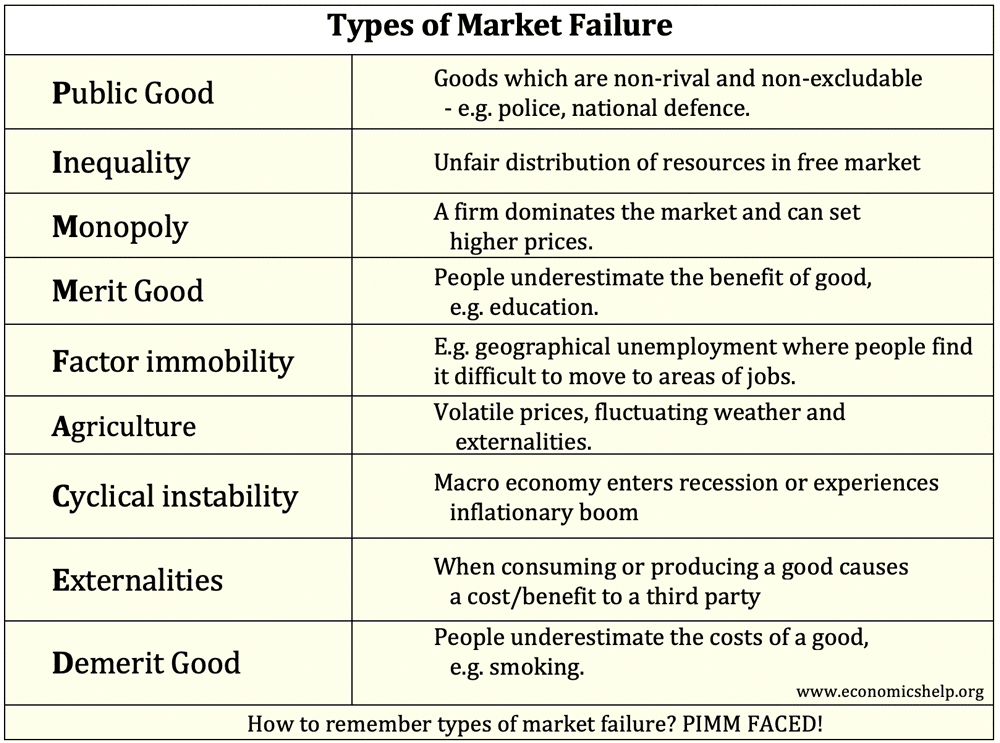

## Table of Contents

## What is market failure in economics?

Market failure in economics happens when the market does not work as it should. This means that the prices of goods and services do not reflect their true cost to society, and resources are not used efficiently. For example, if a factory pollutes a river but does not pay for the cleanup, the cost of pollution is borne by the community, not the factory. This leads to too much pollution because the factory does not have to pay for the damage it causes.

There are several reasons why market failures happen. One common reason is the presence of externalities, which are costs or benefits that affect people who are not directly involved in a transaction. Pollution is a negative externality. Another reason for market failure is the lack of competition, where a few big companies control the market and can set high prices. Public goods, like street lighting, also cause market failures because they are available to everyone and it's hard to charge people for using them. When these problems occur, the government might step in to fix things with laws, taxes, or by providing public goods directly.

## What are the main types of market failure?

Market failures happen for different reasons. One big reason is externalities. These are costs or benefits that affect people who aren't part of the deal. For example, if a factory pollutes the air, it harms people nearby, but the factory doesn't pay for that harm. This is a negative externality. On the flip side, if someone plants a beautiful garden that makes the neighborhood nicer, that's a positive externality. Because these costs and benefits aren't included in the price, the market doesn't work right.

Another type of market failure is when there's not enough competition. If a few big companies control a market, they can set high prices and make more profit than they should. This is called a monopoly or oligopoly. Without competition, the market can't keep prices fair and resources aren't used well. 

Lastly, public goods can cause market failures. Public goods, like clean air or national defense, are available to everyone and you can't stop people from using them. Because of this, companies might not want to provide these goods because they can't make money from them. When this happens, the government might need to step in to make sure these goods are available for everyone.

## Can you explain the concept of externalities as a cause of market failure?

Externalities are costs or benefits that affect people who aren't part of a deal. They happen when the actions of one person or company impact others without those others being paid or charged for it. For example, if a factory pollutes a river, the people living nearby suffer because their water is dirty. The factory doesn't pay for this harm, so the cost of pollution isn't included in the price of the factory's products. This leads to too much pollution because the factory doesn't have to pay for the damage it causes.

These externalities cause market failure because the market price doesn't show the true cost to society. If the factory had to pay for cleaning up the river, the price of its products would be higher. This would make the factory think twice about polluting. But since the cost is hidden, the market doesn't work right. The government might step in to fix this by making laws or setting taxes to make the factory pay for the pollution it causes. This helps to make sure that the market reflects the true cost of goods and services.

## How does public goods contribute to market failure?

Public goods are things that everyone can use and no one can be stopped from using them. Things like clean air, street lights, and national defense are public goods. Because everyone can use them, companies don't want to make them. They can't charge people for using them, so they can't make money. This means the market doesn't provide these goods on its own, which is a problem.

When the market doesn't provide public goods, it's a type of market failure. Without these goods, people's lives can be worse. For example, if there's no street lighting, it's harder and less safe to walk around at night. Because the market won't fix this problem on its own, the government usually steps in. The government can use taxes to pay for public goods, making sure everyone can use them even if they don't pay directly.

## What role does imperfect competition play in causing market failure?

Imperfect competition happens when there aren't enough businesses competing in a market. When just a few big companies control everything, it's called a monopoly or oligopoly. These big companies can set high prices because people don't have many other choices. This means the companies can make more money than they should, and the prices aren't fair. Because the market can't keep prices in check, resources aren't used well, and that's a type of market failure.

When there's imperfect competition, the market doesn't work the way it's supposed to. Instead of many businesses trying to offer the best products at the lowest prices, a few big ones can do what they want. This means customers might have to pay more and get less choice. The government might need to step in to break up these big companies or make rules to encourage more competition. This helps to make sure the market works better for everyone.

## How can information asymmetry lead to market failure?

Information asymmetry happens when one side of a deal knows more than the other side. For example, if you're buying a used car, the seller knows more about the car's problems than you do. This can lead to market failure because the market doesn't work well when people don't have the same information. The seller might sell you a bad car for a high price because you don't know it's bad. This means the price doesn't show the car's true value, and the market can't work right.

This problem can affect bigger things too, like health care or insurance. If a doctor knows more about a treatment than the patient, the patient might pay too much or get the wrong treatment. In insurance, people who know they're more likely to need it might buy more, while others don't buy enough. This makes it hard for insurance companies to set fair prices. When information isn't shared equally, the market can't match people's needs with what's available, leading to market failure.

## What are some real-world examples of market failure?

One real-world example of market failure is pollution from factories. When a factory pollutes the air or water, it harms the community around it. The factory doesn't have to pay for this harm, so it keeps polluting more than it should. This is a problem because the price of the factory's products doesn't include the cost of cleaning up the pollution. The government might step in by making laws or setting taxes to make the factory pay for the damage it causes, helping to fix the market failure.

Another example is when there's not enough competition in a market, like with big tech companies. If just a few big companies control everything, they can set high prices and make more money than they should. This isn't fair to customers who have to pay more and don't have many choices. The government might need to break up these big companies or make rules to encourage more competition, so the market can work better for everyone.

Information asymmetry is another cause of market failure, like in the used car market. When you buy a used car, the seller knows more about the car's problems than you do. This can lead to you paying too much for a bad car because you don't know its true value. To help fix this, the government might make rules that require sellers to be honest about the car's condition, so buyers can make better choices and the market can work more fairly.

## How do government interventions aim to correct market failures?

Governments step in to fix market failures by making rules, setting taxes, or providing things directly to people. For example, if a factory is polluting a river, the government might make a law that says the factory has to clean up the pollution. Or, they might set a tax on the factory to make it pay for the harm it causes. This helps to make sure the price of the factory's products includes the cost of pollution, so the market works better.

Another way governments fix market failures is by dealing with big companies that control too much of the market. If just a few big companies are setting high prices and making too much money, the government might break them up into smaller companies. Or, they might make rules to encourage more competition, so customers have more choices and can get better prices. This helps to make the market fair for everyone.

Lastly, governments can provide public goods that the market won't provide on its own. Things like street lights, clean air, and national defense are available to everyone, but companies can't make money from them. So, the government uses taxes to pay for these goods, making sure everyone can use them even if they don't pay directly. This helps to fix the market failure caused by public goods.

## What are the economic theories behind market failure?

Market failure happens when the market doesn't work the way it's supposed to. One big reason for this is externalities. Externalities are costs or benefits that affect people who aren't part of a deal. For example, if a factory pollutes a river, it harms people nearby, but the factory doesn't pay for that harm. This means the price of the factory's products doesn't include the cost of the pollution, so the market doesn't work right. Economists say that when externalities happen, the market fails because the price doesn't show the true cost to society.

Another reason for market failure is when there's not enough competition. If just a few big companies control a market, they can set high prices and make more money than they should. This isn't fair to customers who have to pay more and don't have many choices. Economists call this a monopoly or oligopoly, and it leads to market failure because the market can't keep prices fair on its own. The government might need to step in to break up these big companies or make rules to encourage more competition, so the market can work better for everyone.

Public goods also cause market failure. Public goods, like clean air or street lights, are available to everyone and you can't stop people from using them. Because of this, companies might not want to provide these goods because they can't make money from them. Economists say that when the market doesn't provide public goods, it's a type of market failure. The government usually steps in to pay for these goods with taxes, making sure everyone can use them even if they don't pay directly.

## How do different economic schools of thought view market failure?

Different economic schools of thought have different views on market failure. Neoclassical economists believe that markets usually work well, but they can fail because of things like externalities, lack of competition, and public goods. They think the government should step in to fix these problems with laws, taxes, or by providing public goods. For example, they might support a tax on pollution to make sure the price of goods includes the cost of pollution to society.

On the other hand, Austrian economists think that market failure is often a result of government messing with the market in the first place. They believe that markets can fix themselves if left alone, and that government intervention can make things worse. They might argue that pollution happens because the government doesn't protect property rights well enough, and if people could sue for pollution, the market would fix the problem without government help.

Public choice theorists have a different view. They think that market failure can happen, but they're worried about government failure too. They believe that politicians and bureaucrats might not always make the best choices because they're influenced by special interests or just trying to keep their jobs. So, they think we should be careful about relying too much on the government to fix market failures, because the government might not do a good job.

## What are the limitations of government interventions in correcting market failures?

Government interventions to fix market failures can have some problems. One big issue is that governments might not always make the best choices. Politicians and bureaucrats might be influenced by special interests, like big companies or groups that want certain laws passed. This can lead to laws or taxes that don't really fix the market failure and might even make things worse. For example, a tax on pollution might be too low to make a difference, or it might be set in a way that hurts small businesses more than big ones.

Another problem is that government actions can be slow and costly. It takes time to make new laws or set new taxes, and during that time, the market failure might keep causing problems. Also, running government programs can be expensive, and the money has to come from somewhere, usually taxes. If taxes are too high, it can hurt the economy in other ways, like making it harder for businesses to grow or for people to keep more of their money. So, while government interventions can help, they have to be careful and well thought out to really fix market failures without causing new problems.

## How can advanced economic modeling help in understanding and predicting market failures?

Advanced economic modeling can help economists understand and predict market failures by using complex math and computer programs to look at how markets work. These models can show how different things, like externalities or lack of competition, can mess up the market. For example, a model might show how pollution from a factory affects the community and the economy. By changing the numbers in the model, economists can see what might happen if the government makes a new law or sets a new tax. This helps them figure out the best way to fix the market failure.

These models also help predict future market failures by looking at lots of data and finding patterns. They can show how different parts of the economy are connected and how a problem in one part might cause a market failure in another. For example, a model might predict that if a big company keeps getting bigger, it could lead to less competition and higher prices in the future. By using these models, economists can warn policymakers about possible market failures before they happen, so they can take action to stop them.

## References & Further Reading

[1]: ["Advances in Financial Machine Learning"](https://www.amazon.com/Advances-Financial-Machine-Learning-Marcos/dp/1119482089) by Marcos Lopez de Prado

[2]: ["Machine Learning for Algorithmic Trading"](https://github.com/stefan-jansen/machine-learning-for-trading) by Stefan Jansen

[3]: ["Quantitative Trading: How to Build Your Own Algorithmic Trading Business"](https://www.amazon.com/Quantitative-Trading-Build-Algorithmic-Business/dp/1119800064) by Ernest P. Chan

[4]: Arrow, K. J. (1969). "The Organization of Economic Activity: Issues Pertinent to the Choice of Market Versus Non-market Allocation." The Analysis and Evaluation of Public Expenditure: The PPB System. 

[5]: Stiglitz, J. E. (1989). "Markets, Market Failures, and Development." The American Economic Review, 79(2), 197-203. 

[6]: "Market Structure and Regulation: Flash Crash." BBC News. Retrieved from [BBC](https://en.wikipedia.org/wiki/Timeline_of_BBC_Television_News).

[7]: Harris, L. (2003). ["Trading & Exchanges: Market Microstructure for Practitioners"](https://academic.oup.com/book/52292). Oxford University Press. 

[8]: Smith, A. (1776). "The Wealth of Nations."

[9]: Shiller, R. J. (2000). ["Irrational Exuberance."](https://www.jstor.org/stable/j.ctt7st4s) Princeton University Press.