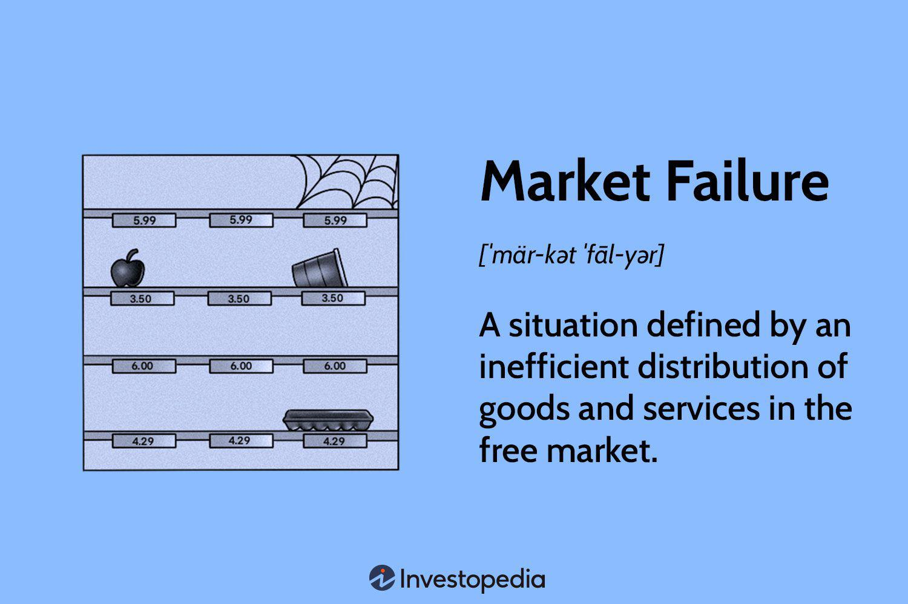

Market failure represents a critical concept in economics where markets fail to allocate resources efficiently, resulting in a net social welfare loss. This phenomenon occurs when the conditions necessary for perfect competition are not met. Market failures can significantly impact economic stability and policymaking. They arise due to various economic reasons, such as the presence of public goods, externalities, and information asymmetries. These factors disrupt the equilibrium where supply equals demand, leading to either overproduction or underproduction of goods and services.

Algorithmic trading (algo trading) has emerged as a transformative force in financial markets and economic theory. It involves the use of computer algorithms to execute trades at speeds and volumes unimaginable through traditional methods. By leveraging vast amounts of data and computational power, algo trading can enhance market efficiency and liquidity. However, its impact on market failure is dual-faceted. On one hand, algorithmic trading has the potential to mitigate market failures by improving liquidity and price discovery, thus moving markets closer to an optimal allocation of resources.

Conversely, the rapid pace and complexity of algorithmic trading can exacerbate certain types of market failure. For instance, it can lead to market instability and events like flash crashes, where markets plummet in minutes due to automated trades. Furthermore, algorithmic strategies can exploit information asymmetries or increase systemic risk, highlighting the delicate balance needed in this domain. 

Understanding the intricate interplay between economics, market failure, and algorithmic trading is crucial. As financial markets continue to evolve, grasping these dynamics will be key for policymakers, economists, and traders who aim to harness the benefits of algorithmic trading while mitigating its potential downsides. This necessitates a nuanced approach to regulation and oversight to ensure market integrity without stifling innovation.

## Table of Contents

## Understanding Market Failure

Market failure occurs when the allocation of goods and services by a free market is not efficient, leading to a net social welfare loss. In such scenarios, the inherent mechanisms of a market economy fail to achieve an optimal output, where marginal social benefit equals marginal social cost. This inefficiency typically necessitates intervention by governments or regulatory bodies to correct the imbalance. There are several principal causes of market failure: public goods, externalities, and information asymmetry.

**Public Goods**: Public goods are characterized by their non-excludability and non-rivalrous consumption. This means that individuals cannot be effectively excluded from their use, and one person's use does not reduce availability to others. Classic examples include national defense, clean air, and public parks. The free-rider problem arises here, where individuals have little incentive to pay for the provision of a good they can consume for free. Consequently, the private market may under-produce these goods, thereby necessitating government provision and funding through taxation.

**Externalities**: These are costs or benefits that affect third parties not directly involved in a transaction. Positive externalities, such as education and vaccination, confer benefits beyond the individual consumer, while negative externalities, such as pollution, impose costs on others. The presence of externalities leads to a mismatch between private and social optimal outputs. For example, firms may overproduce polluting goods because they do not bear the full social cost of the pollution. To correct such failures, policymakers may employ taxes, subsidies, or regulations to align private incentives with social welfare.

**Information Asymmetry**: Information asymmetry occurs when one party in a transaction possesses more or better information than the other. This can lead to adverse selection and moral hazard. For instance, in the insurance market, a lack of information about the probability of future losses may lead to higher premiums, discouraging low-risk individuals from purchasing coverage (adverse selection). Similarly, insured parties may take greater risks since they do not bear the full cost of their actions (moral hazard). Governments may address information asymmetries through disclosure requirements, regulations, and the establishment of standard-setting bodies.

Market failures have significant implications for economies, influencing both individual policy decisions and broad economic strategies. They can lead to suboptimal allocation of resources, reduced economic welfare, and can exacerbate inequalities. A well-known example is the 2008 financial crisis, partially attributed to the mispricing of risk in mortgage-backed securities and the lack of transparent information, demonstrating both externalities and information asymmetry. Environmental pollution is another pervasive example, representing a negative externality that necessitates regulatory action for mitigation.

Understanding market failures is paramount for developing effective economic policies that promote efficiency, equity, and stability in markets. Addressing these failures often involves a combination of government intervention and private sector adjustments, aiming to restore equilibrium and enhance the well-being of society as a whole.

## Economic Causes of Market Failure

Market failure occurs when the allocation of goods and services by a market is not efficient. Various economic factors contribute to this failure, significantly impacting how resources are distributed. Key causes including imperfect competition, externalities, information asymmetries, and the nature of public goods can create discrepancies between optimal and actual market operations.

**Imperfect Competition and Monopoly Power**

Imperfect competition arises when individual firms possess the power to set prices rather than taking them from the market, which often results in inefficiencies. In a perfectly competitive market, many firms operate with no single entity holding excess market power. However, monopolies, where one firm dominates the market, or oligopolies, where a small number of firms have all the market power, can lead to price-setting above marginal costs. This scenario results in consumer surplus loss and a deadweight loss to society. For instance, a monopolistic firm will produce less and charge more for its product than would be the case in an otherwise competitive market, reducing the overall welfare.

**Externalities and Market Inefficiencies**

Externalities are costs or benefits that affect third parties who did not choose to incur that cost or benefit. These can be either negative, such as pollution, or positive, like the societal benefits of education. Externalities cause market inefficiencies because the market equilibrium does not reflect the true social cost or benefit of a product. For instance, in the presence of negative externalities like pollution, the true social cost of a good is higher than the private cost. Consequently, goods associated with negative externalities tend to be overproduced, whereas those with positive externalities may be underproduced without government intervention, such as subsidies or taxes.

**Impact of Information Asymmetries on Market Operations**

Information asymmetry occurs when one party in a transaction possesses more or better information than the other. This can lead to adverse selection and moral hazard. Adverse selection is particularly prevalent in insurance markets, where buyers have more information about their risk levels than sellers, potentially leading to higher average costs for insurers and premiums for buyers. Moral hazard, on the other hand, involves a change in behavior that occurs when individuals are insulated from risk, a common issue in financial markets where parties may take excessive risks due to the belief that they will not bear the full consequences of their actions. Information asymmetries distort the market's capacity to allocate resources efficiently, often necessitating regulatory measures.

**Public Goods and Resource Allocation Issues**

Public goods are characterized by their non-excludable and non-rivalrous nature, meaning that one person's use does not diminish another's, and it is often impossible to prevent anyone from using them. Such goods include national defense and public parks. The problem with public goods in a free market is the tendency for underproduction, as private markets may not find it profitable to produce goods that cannot be sold exclusively. This often results in underfunding and inefficiencies. The free-rider problem, where individuals consume a resource without paying for it, exacerbates this issue, leading to suboptimal provision unless there is governmental intervention.

In conclusion, these economic causes—imperfect competition, externalities, information asymmetries, and the nature of public goods—demonstrate the complexity of market failures, highlighting the significant role of economic structures and incentives in shaping efficient market outcomes. Effective mitigation often demands a careful blend of regulation and strategic planning to correct these inherent market failings.

## The Rise of Algorithmic Trading

Algorithmic trading, commonly referred to as algo trading, has become an integral component of modern financial markets. Utilizing complex algorithms, it executes trades with precision at speeds and volumes unattainable by human traders. The essence of [algorithmic trading](/wiki/algorithmic-trading) lies in its ability to process vast amounts of market data, identify trading opportunities, and execute trades in a fraction of a second. 

The prevalence of algorithmic trading has surged, accounting for a significant proportion of trading activity across major stock exchanges. This rapid adoption is driven by the technological advancements in computing power, data processing capabilities, and the proliferation of financial data. Algorithms analyze multiple market variables, such as price, [volume](/wiki/volume-trading-strategy), and timing, to automate trading decisions based on predefined parameters.

One of the key benefits of algorithmic trading is its contribution to market efficiency. By facilitating rapid execution of trades, algorithms enhance the [liquidity](/wiki/liquidity-risk-premium) of financial markets, reducing the bid-ask spreads, and enabling more accurate price discovery. This results in a more efficient allocation of financial resources and potentially lowers the cost of trading for market participants.

From a technological standpoint, algorithmic trading relies heavily on advanced computing systems and sophisticated software algorithms. These systems employ [machine learning](/wiki/machine-learning) techniques, statistical models, and a vast array of trading strategies to optimize trade execution. The data-driven approach allows algorithms to adapt to market conditions, continuously learning from new data and adjusting strategies to maximize returns or minimize risks.

Moreover, high-frequency trading ([HFT](/wiki/high-frequency-trading-strategies)), a subset of algorithmic trading, capitalizes on short-term market inefficiencies. It involves executing thousands, or even millions, of orders per day with the goal of making small profits on minute price discrepancies. The success of HFT underscores the speed at which algorithms operate, exploiting market movements that occur in milliseconds.

In conclusion, the rise of algorithmic trading reflects the ongoing transformation of financial markets, driven by technological innovation and the increasing importance of data analytics. It presents both opportunities and challenges, enhancing market liquidity and efficiency while also necessitating robust regulatory frameworks to manage the associated risks.

## Algorithmic Trading and Market Failure: Mitigation and Exacerbation

Algorithmic trading, a prominent feature in modern financial markets, holds the potential to both mitigate and exacerbate market failures. One of its primary benefits is improving market efficiency through enhanced liquidity and more accurate pricing. Algorithmic trading utilizes complex algorithms to execute trades at exceptionally high speeds, facilitating a rapid exchange of assets which can reduce bid-ask spreads and increase market depth. This enables prices to reflect available information more accurately, thereby enhancing the price discovery process and reducing inefficiencies commonly associated with slower human-driven trading.

Furthermore, algorithmic trading can increase transparency in financial markets by making vast amounts of transactional data available in real time. This data-driven environment allows market participants to make more informed decisions, potentially leading to fairer and more efficient markets. High-frequency trading algorithms, for instance, continuously analyze incoming market data to identify [arbitrage](/wiki/arbitrage) opportunities, thereby aiding in price efficiency and helping align prices with underlying asset values more rapidly than manual trading methods.

However, the risks associated with algorithmic trading must not be overlooked. One significant concern is its potential contribution to market instability and failures, particularly during periods of high [volatility](/wiki/volatility-trading-strategies). High-frequency trading can sometimes lead to unintended consequences, such as "flash crashes," where rapid sell-offs occur in milliseconds, causing prices to plummet. These events underscore the inherent risks of relying heavily on automated trading systems without adequate safeguards.

A notable example is the Flash Crash of May 6, 2010. On this day, major U.S. stock indices experienced extreme volatility, with the Dow Jones Industrial Average dropping nearly 1,000 points within minutes before a quick recovery. Investigations revealed that algorithmic trading played a crucial role in this event, as automated systems accelerated the price decline by executing large volumes of trades based on market anomalies rather than fundamental economic shifts.

To mitigate such risks, robust risk management protocols are essential. This includes implementing circuit breakers, which temporarily halt trading in response to significant price movements, and scrutinizing high-frequency trading firms to ensure compliance with market integrity standards. While algorithmic trading introduces innovative efficiencies, its dual role in potentially causing and resolving market failures highlights the necessity for balanced regulatory oversight to safeguard market stability.

## Regulatory Perspectives and Solutions

Regulatory responses to algorithmic trading have evolved significantly over recent years, reflecting the growing impact of this technology on financial markets. Regulators worldwide have sought to implement policies that address both the opportunities and challenges presented by algorithmic trading, aiming to harness its potential benefits while minimizing systemic risks and market failures.

One approach has been the introduction of stringent risk management and transparency requirements for firms engaged in algorithmic trading. For instance, the European Securities and Markets Authority (ESMA) implemented the Markets in Financial Instruments Directive II (MiFID II) in 2018. MiFID II requires algorithmic trading firms to establish robust systems and controls to manage risks, including the deployment of circuit breakers and kill switches to prevent erroneous trades from disrupting markets. These measures enhance market stability by ensuring that trading algorithms operate within well-defined parameters, reducing the likelihood of runaway algorithms causing flash crashes.

Policies have also focused on minimizing information asymmetry—a key contributor to market failure—by enhancing transparency. Algorithms must be designed to operate in a manner that does not exploit informational advantages unfairly. Regulatory frameworks, such as the U.S. Securities and Exchange Commission's (SEC) Market Access Rule, obligate brokers and dealers to ensure that their algorithmic trading clients comply with all applicable rules, including those on transparency and fairness. These policies aim to create a level playing field for all market participants, fostering fair competition and reducing the risk of market manipulation.

International cooperation plays a critical role in regulating algorithmic trading. The global nature of financial markets necessitates coordinated efforts among national regulators to manage cross-border trade activities effectively. Organizations such as the International Organization of Securities Commissions (IOSCO) facilitate dialogue and harmonization of regulatory standards across different jurisdictions. Such collaboration ensures that regulatory frameworks remain consistently robust against the systemic risks posed by algorithmic trading, preventing regulatory arbitrage where market participants exploit differences between countries' rules.

Looking ahead, future regulatory directions are likely to focus on balancing continued technological innovation with the maintenance of market integrity. This could involve adaptive regulatory approaches that incorporate emerging technologies such as machine learning and [artificial intelligence](/wiki/ai-artificial-intelligence) in trading algorithms. Regulators might explore sandbox environments to test and refine new algorithms under controlled conditions, allowing innovation to flourish without compromising market stability. Additionally, the integration of real-time monitoring technologies could enhance the ability of regulators to detect and respond to aberrations swiftly, thereby mitigating potential disruptions.

In summary, regulatory efforts are centered on ensuring that algorithmic trading contributes positively to financial markets by enhancing efficiency and liquidity while safeguarding against market failure risks. The collaboration among international regulatory bodies and the adoption of future-oriented regulatory frameworks will be critical in managing the complex dynamics of algorithmic trading, thus sustaining the delicate balance between innovation and market integrity.

## Conclusion

Market failure occurs when the allocation of goods and services by a free market is not efficient, leading to a net social welfare loss. This inefficiency can arise from various economic causes, such as imperfect competition, externalities, and information asymmetries. Algorithmic trading, a modern advancement in financial markets, presents a dual role in relation to market failure. 

On one hand, algorithmic trading can mitigate market failures by enhancing liquidity and improving pricing mechanisms. Algorithms execute trades at high speeds and volumes, reducing transaction costs and narrowing bid-ask spreads, leading to a more efficient market. Moreover, the deployment of sophisticated algorithms can increase market transparency by disseminating information more rapidly, potentially correcting information asymmetries.

Conversely, the rapid and automatic nature of algorithmic trading introduces risks that can exacerbate market failures. Algorithms can interact in unforeseen ways, contributing to market volatility and instability. Events such as flash crashes illustrate how algorithmic trading can disrupt markets, leading to temporary but severe distortions in financial markets.

These complex dynamics necessitate balanced regulatory approaches. Effective regulation should aim to harness the positive aspects of algorithmic trading while minimizing its potential to exacerbate market failures. Policies should include robust risk management frameworks and real-time monitoring of trading activities. International cooperation is vital, given the global nature of financial markets and the cross-border implications of trading activities.

Looking ahead, the interplay between economics, market failure, and algorithmic trading is poised to evolve with advancements in technology and financial innovation. The future regulatory landscape must adapt to these changes, ensuring market stability and integrity without stifling innovation. As the financial markets continue to integrate algorithmic solutions, understanding and managing these interconnections will remain crucial for economic policy and market fairness.

## References & Further Reading

[1]: ["Advances in Financial Machine Learning"](https://www.amazon.com/Advances-Financial-Machine-Learning-Marcos/dp/1119482089) by Marcos Lopez de Prado

[2]: ["Machine Learning for Algorithmic Trading"](https://github.com/stefan-jansen/machine-learning-for-trading) by Stefan Jansen

[3]: ["Quantitative Trading: How to Build Your Own Algorithmic Trading Business"](https://www.amazon.com/Quantitative-Trading-Build-Algorithmic-Business/dp/1119800064) by Ernest P. Chan

[4]: Arrow, K. J. (1969). "The Organization of Economic Activity: Issues Pertinent to the Choice of Market Versus Non-market Allocation." The Analysis and Evaluation of Public Expenditure: The PPB System. 

[5]: Stiglitz, J. E. (1989). "Markets, Market Failures, and Development." The American Economic Review, 79(2), 197-203. 

[6]: "Market Structure and Regulation: Flash Crash." BBC News. Retrieved from [BBC](https://en.wikipedia.org/wiki/Timeline_of_BBC_Television_News).

[7]: Harris, L. (2003). ["Trading & Exchanges: Market Microstructure for Practitioners"](https://academic.oup.com/book/52292). Oxford University Press. 

[8]: Smith, A. (1776). "The Wealth of Nations."

[9]: Shiller, R. J. (2000). ["Irrational Exuberance."](https://www.jstor.org/stable/j.ctt7st4s) Princeton University Press.