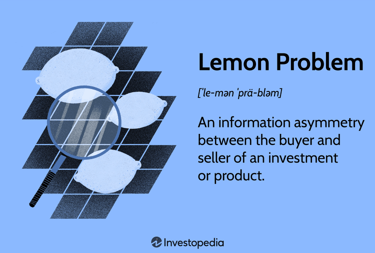

## Table of Contents

## What is the 'Market for Lemons' concept?

The 'Market for Lemons' is a concept from economics that was introduced by George Akerlof in 1970. It explains how problems with information can mess up markets, especially when buyers can't tell the difference between good and bad products. In his example, Akerlof used the market for used cars, where some cars are good ('peaches') and some are bad ('lemons'). Because buyers can't easily tell which is which, they might only be willing to pay a price that reflects the average quality of the cars. This makes sellers of good cars less likely to sell, leaving more bad cars in the market.

As more good cars leave the market, the average quality of cars goes down, which makes buyers even less willing to pay a high price. This can lead to a situation where only bad cars are sold, and the market might even collapse completely. This concept isn't just about cars; it applies to many markets where there's a problem with information. For example, it can affect job markets, insurance markets, and financial markets. The 'Market for Lemons' shows how important it is for buyers to have good information to keep markets working well.

## Who introduced the 'Market for Lemons' theory?

The 'Market for Lemons' theory was introduced by George Akerlof in 1970. He used this idea to show how problems with information can cause trouble in markets. Akerlof's example was about used cars, where some cars are good and some are bad. Because buyers can't easily tell the difference, they might only want to pay a price that reflects the average quality of the cars. This can make sellers of good cars not want to sell, leaving more bad cars in the market.

As more good cars leave the market, the average quality of cars goes down. This makes buyers even less willing to pay a high price. Eventually, only bad cars might be left, and the market could even stop working. This idea isn't just about cars; it can apply to many other markets too, like jobs, insurance, and money markets. The 'Market for Lemons' shows why it's important for buyers to have good information to keep markets running smoothly.

## What is the basic premise of the 'Market for Lemons' in relation to buyer and seller dynamics?

The 'Market for Lemons' idea says that when buyers can't easily tell if a product is good or bad, it can mess up the market. In this situation, buyers might only want to pay a price that fits the average quality of the products. This can make sellers of good products not want to sell, because they think the price is too low for their good stuff. As a result, more bad products stay in the market, and the average quality of what's for sale goes down.

As the quality goes down, buyers become even less willing to pay a high price. This can lead to a situation where only bad products are left in the market. Eventually, the market might not work at all because no one wants to buy or sell. This problem can happen in many different markets, not just with used cars. It shows how important it is for buyers to have good information so that markets can work well.

## How does information asymmetry affect the market for lemons?

Information asymmetry means that one side of a deal knows more than the other side. In the market for lemons, sellers know if their car is good or bad, but buyers don't. Because buyers can't tell the difference, they might only want to pay a price that fits the average quality of all the cars. This makes sellers of good cars not want to sell, because they think the price is too low for their good car. So, more bad cars stay in the market, and the average quality of cars for sale goes down.

As the quality of cars in the market gets worse, buyers become even less willing to pay a high price. This can lead to a situation where only bad cars are left in the market. Eventually, the market might not work at all because no one wants to buy or sell. This problem can happen in many different markets, not just with used cars. It shows how important it is for buyers to have good information so that markets can work well.

## What are the consequences of the 'Market for Lemons' on product quality?

The 'Market for Lemons' can make the quality of products in a market go down. When buyers can't tell if a product is good or bad, they might only want to pay a price that fits the average quality of all the products. This makes sellers of good products not want to sell, because they think the price is too low for their good stuff. As a result, more bad products stay in the market, and the average quality of what's for sale goes down.

As the quality goes down, buyers become even less willing to pay a high price. This can lead to a situation where only bad products are left in the market. Eventually, the market might not work at all because no one wants to buy or sell. This problem can happen in many different markets, not just with used cars. It shows how important it is for buyers to have good information so that markets can work well.

## Can you explain the role of signaling in mitigating the 'Market for Lemons' problem?

Signaling is a way to help fix the 'Market for Lemons' problem. It means that sellers can show buyers that their product is good. For example, a car seller might offer a warranty to show that their car is not a lemon. By doing this, they are signaling to buyers that they believe in the quality of their product. This can make buyers more willing to pay a higher price because they trust the seller's signal.

When sellers use signals, it helps to bring good products back into the market. If buyers see enough good signals, they might be more willing to buy, and this can make the market work better. For example, if many car sellers offer warranties, buyers might feel safer buying used cars. This can help keep good cars in the market and stop the average quality from going down. Signaling is important because it gives buyers the information they need to make better choices and keep the market running smoothly.

## How do warranties and guarantees influence buyer behavior in a market for lemons?

Warranties and guarantees can make buyers feel safer when they're buying something in a market for lemons. When a seller offers a warranty, it's like they're saying, "I believe this product is good, and I'll fix it if it's not." This makes buyers more likely to trust the seller and pay a higher price. They feel like they're protected if they end up with a bad product. So, warranties and guarantees can help bring good products back into the market because buyers are more willing to buy when they see these signals.

When more buyers are willing to pay for good products because of warranties, it can stop the market from getting worse. If lots of sellers start offering warranties, it can make the whole market seem more trustworthy. This can help keep the average quality of products from going down and stop the market from collapsing. Warranties and guarantees are important because they give buyers the confidence they need to keep the market working well.

## What are some real-world examples of markets that exhibit 'Market for Lemons' characteristics?

One real-world example of the 'Market for Lemons' is the used car market. When people want to buy a used car, they might not know if it's a good car or a bad one. Because they can't tell the difference, they might only want to pay a low price. This makes people who have good cars not want to sell them because they think the price is too low. So, more bad cars stay in the market, and the average quality of used cars goes down. This can make buyers even less willing to pay a high price, and eventually, the market might only have bad cars left.

Another example is the health insurance market. When people buy health insurance, they know more about their health than the insurance company does. Some people might be healthy and others might be sick, but the insurance company can't easily tell the difference. Because of this, the insurance company might charge everyone the same high price to cover the cost of the sick people. This can make healthy people not want to buy insurance because they think the price is too high. As a result, more sick people stay in the market, and the average health of people with insurance goes down. This can make insurance companies charge even higher prices, and the market might not work well.

## How can government regulations help address issues in a market for lemons?

Government regulations can help fix problems in a market for lemons by making sure buyers get good information. They can make rules that say sellers have to tell buyers about the quality of their products. For example, in the used car market, the government might say that sellers have to give a report on the car's history. This way, buyers can see if the car has been in accidents or had big repairs. When buyers know more, they can make better choices and are more likely to pay a fair price for good products. This can help keep good products in the market and stop the average quality from going down.

Another way the government can help is by making rules about warranties and guarantees. They can say that sellers have to offer a warranty on their products. This makes buyers feel safer because they know they can get help if the product is bad. When sellers know they have to offer a warranty, they might be more careful about what they sell. This can make the whole market more trustworthy and help keep good products in the market. By making these rules, the government can help make sure that markets work well and that buyers and sellers can trust each other.

## What strategies can sellers use to overcome the 'Market for Lemons' problem?

Sellers can use different strategies to show buyers that their products are good and not lemons. One way is by giving warranties or guarantees. When a seller offers a warranty, it means they believe in their product and are willing to fix it if it's bad. This makes buyers feel safer and more likely to pay a higher price. Another way is by giving out detailed information about the product. For example, a used car seller can give a report on the car's history, showing it has been well taken care of. This helps buyers trust the seller and feel confident about what they're buying.

Another strategy is for sellers to build a good reputation. If a seller is known for selling good products, buyers will trust them more. This can be done by always selling high-quality items and getting good reviews from customers. Sellers can also use certifications or third-party checks to show their products are good. For example, a car might get a certification from a trusted mechanic. These strategies help sellers show buyers that their products are worth buying, which can bring good products back into the market and stop the average quality from going down.

## How does the 'Market for Lemons' theory apply to online marketplaces?

The 'Market for Lemons' theory can really affect online marketplaces. When people buy things online, they often can't see or touch the product before buying it. This makes it hard for them to know if it's good or bad. Because of this, buyers might only want to pay a low price, thinking they might get a bad product. This can make sellers of good products not want to sell on the website, because they think the price is too low. So, more bad products stay on the site, and the average quality of what's for sale goes down. This can make buyers even less willing to pay a high price, and eventually, the online marketplace might only have bad products left.

To help fix this problem, online marketplaces can use different strategies. They can make sellers give out detailed information about their products, like pictures and descriptions. They can also let buyers leave reviews, so others can see if the product is good or bad. Another way is by having a system where sellers can offer warranties or guarantees. This makes buyers feel safer because they know they can get help if the product is bad. By using these strategies, online marketplaces can show buyers that their products are worth buying, which can bring good products back into the market and stop the average quality from going down.

## What advanced economic models have been developed to further analyze the 'Market for Lemons'?

Since George Akerlof introduced the 'Market for Lemons' idea, economists have come up with more advanced models to study it better. One model is called the signaling model. It says that sellers can show buyers that their product is good by giving out information, like offering a warranty or a detailed report. This helps buyers trust the seller and feel safe about buying. Another model is the screening model. It says that buyers can do things to find out if a product is good or bad, like asking for more information or checking reviews. Both models help explain how markets can work better when buyers and sellers have more information.

Another advanced model is the reputation model. It says that sellers can build a good name for themselves by always selling good products. When buyers see that a seller has a good reputation, they are more likely to trust them and pay a higher price. This can bring good products back into the market and stop the average quality from going down. These models show how important it is for buyers to have good information and for sellers to show that their products are worth buying. By understanding these models, economists can help make markets work better and stop the 'Market for Lemons' problem from getting worse.

## References & Further Reading

[1]: Akerlof, G. A. (1970). ["The Market for 'Lemons': Quality Uncertainty and the Market Mechanism."](https://viterbi-web.usc.edu/~shaddin/teaching/cs590fa13/papers/AkerlofMarketforLemons.pdf) The Quarterly Journal of Economics, 488-500.

[2]: Stiglitz, J. E. (2000). ["The Contributions of the Economics of Information to Twentieth Century Economics."](https://academic.oup.com/qje/article-abstract/115/4/1441/1820406) The Quarterly Journal of Economics, 115(4), 1441-1478.

[3]: Lopez de Prado, M. (2018). ["Advances in Financial Machine Learning"](https://www.amazon.com/Advances-Financial-Machine-Learning-Marcos/dp/1119482089). John Wiley & Sons.

[4]: Chan, E. P. (2009). ["Quantitative Trading: How to Build Your Own Algorithmic Trading Business"](https://github.com/ftvision/quant_trading_echan_book). John Wiley & Sons.

[5]: Jansen, S. (2018). ["Machine Learning for Algorithmic Trading: Predictive models to extract signals from market and alternative data for systematic trading strategies with Python"](https://www.amazon.com/Machine-Learning-Algorithmic-Trading-alternative/dp/1839217715). Packt Publishing.

[6]: Aronson, D. R. (2007). ["Evidence-Based Technical Analysis: Applying the Scientific Method and Statistical Inference to Trading Signals"](https://onlinelibrary.wiley.com/doi/book/10.1002/9781118268315). John Wiley & Sons.