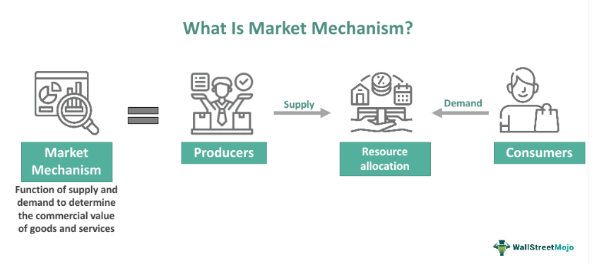

## Table of Contents

## What is market holding?

Market holding refers to the total amount of a specific asset, like stocks or bonds, that investors own at a certain time. It shows how much of the market is controlled by different groups, like big investors or the public. Knowing market holding helps people understand how the market might move and make better investment choices.

For example, if a small group of investors own a lot of a company's stock, they might be able to affect the stock's price by selling or buying more shares. On the other hand, if the stock is spread out among many small investors, it might be harder for any one person to change the price. This information is useful for investors trying to predict what might happen next in the market.

## Why is market holding important for businesses?

Market holding is important for businesses because it shows who owns their stocks or bonds. If a few big investors own a lot of the company's stock, they can influence important decisions like who runs the company or how it spends its money. This can be good or bad for the business. If these big investors support the company's goals, they can help it grow. But if they want different things, they might push the company in a direction it doesn't want to go.

Understanding market holding also helps businesses plan for the future. If a company knows that most of its stock is owned by the public, it might decide to do things that make those smaller investors happy, like paying dividends or making the stock price go up. On the other hand, if big investors own most of the stock, the company might focus on long-term growth that these investors care about. This way, businesses can make better choices that keep their owners happy and help the company succeed.

## How does market holding differ from market share?

Market holding and market share are two different things that people often talk about when they discuss business and investments. Market holding is about how much of a company's stocks or bonds are owned by different groups of people, like big investors or the public. It shows who has control over the company and can affect its decisions. For example, if a few big investors own a lot of a company's stock, they might have a say in who runs the company or how it spends its money.

Market share, on the other hand, is about how much of a market a company controls compared to its competitors. It's usually shown as a percentage and tells you how well a company is doing in selling its products or services. For example, if a company has a 30% market share in the smartphone market, it means that 30% of all smartphones sold are from that company. While market holding is about ownership and control, market share is about sales and competition.

## What are the key components of market holding?

Market holding is made up of different parts that show who owns a company's stocks or bonds. One important part is the number of shares held by big investors, like institutions or funds. These big investors can own a lot of a company's stock, which gives them the power to influence the company's decisions. Another part is the number of shares owned by the public, which means smaller investors who might not have as much control but still have a say in the company.

Another key component is the type of ownership, like whether the shares are held directly by people or through different kinds of investment vehicles, like mutual funds or ETFs. This can affect how easy it is for owners to sell their shares and how much they can influence the company. Lastly, the concentration of ownership matters too. If a few big investors own most of the stock, it's more concentrated. If the stock is spread out among many small investors, it's less concentrated. This can change how the company makes decisions and plans for the future.

## What strategies can companies use to improve their market holding?

Companies can improve their market holding by focusing on attracting more investors, especially big ones like institutions or funds. They can do this by showing that they are a good investment. This means having strong financial results, a clear plan for the future, and good communication with investors. If big investors see that the company is doing well and has a good future, they might buy more of its stock. This can increase the company's market holding and give it more stability and support.

Another strategy is to make the stock more appealing to the public. Companies can do this by offering dividends, which are payments to shareholders, or by doing things that make the stock price go up. They can also use stock splits to make the stock cheaper and easier for more people to buy. When more people own the stock, it becomes less concentrated, which can be good because it means no single group has too much control. This can make the company more attractive to a wider range of investors and improve its market holding.

## How do economic factors influence market holding?

Economic factors can change how much people want to own a company's stock, which affects market holding. When the economy is doing well, people feel confident and are more likely to invest in stocks. This can lead to more people buying a company's stock, which increases its market holding. On the other hand, if the economy is not doing well, people might be scared and sell their stocks. This can make a company's market holding go down because fewer people want to own its stock.

Interest rates are another big economic [factor](/wiki/factor-investing) that can influence market holding. When interest rates are low, borrowing money is cheaper, so companies can grow more easily. This can make their stocks more attractive to investors, leading to higher market holding. But when interest rates go up, borrowing money becomes more expensive, and companies might not grow as fast. This can make investors less interested in buying the stock, which can lower the company's market holding.

## What role does consumer behavior play in market holding?

Consumer behavior can affect market holding because it changes how well a company is doing. When people like a company's products or services and buy a lot of them, the company makes more money. This can make the company's stock more attractive to investors. If investors see that the company is doing well because of good consumer behavior, they might buy more of its stock. This increases the company's market holding because more people own its stock.

On the other hand, if consumers don't like a company's products or services and stop buying them, the company might not make as much money. This can make the company's stock less attractive to investors. If investors see that the company is not doing well because of bad consumer behavior, they might sell their stock. This can decrease the company's market holding because fewer people want to own its stock. So, consumer behavior can have a big impact on how much of a company's stock is owned by investors.

## How can market holding be measured and analyzed?

Market holding can be measured by looking at how many shares of a company's stock are owned by different groups of people. Companies often share this information in their reports, which show how many shares are owned by big investors like banks or funds, and how many are owned by the public. To measure market holding, you can add up all the shares owned by these different groups and see how they compare to the total number of shares the company has. This helps you understand who has control over the company and how much power they have.

Analyzing market holding involves looking at this data and thinking about what it means for the company. For example, if a few big investors own a lot of the stock, they might be able to influence the company's decisions. On the other hand, if the stock is spread out among many small investors, it might be harder for any one person to change things. By looking at changes in market holding over time, you can see if the company is becoming more or less popular with investors. This can help you predict how the company might do in the future and make better investment choices.

## What are the common challenges faced in maintaining market holding?

Keeping market holding steady can be hard for companies. One big challenge is competition. When other companies come out with better products or lower prices, it can make investors lose interest in a company's stock. If investors think another company is a better place to put their money, they might sell their shares, which can lower the company's market holding. Another challenge is how the economy is doing. If the economy is not doing well, people might be scared and sell their stocks, which can also make the company's market holding go down.

Another challenge is keeping investors happy. If a company doesn't make as much money as expected or has problems, investors might not want to keep their shares. This can lead to a drop in market holding because fewer people want to own the company's stock. Also, changes in the company's leadership or big decisions can make investors nervous. If they don't like what the company is doing, they might sell their shares, which can hurt the company's market holding. Keeping a good relationship with investors and making smart decisions is key to maintaining strong market holding.

## How do global market dynamics affect market holding strategies?

Global market dynamics can change how companies plan their market holding strategies. When things happen around the world, like trade agreements or big economic changes, it can affect how investors see a company. For example, if a country puts new rules on trade, it might make it harder for a company to sell its products in that country. This can make investors worried about the company's future, so they might sell their shares. Companies need to watch these global changes and adjust their plans to keep investors interested and maintain their market holding.

Also, global events like wars or health crises can shake up markets everywhere. When these things happen, investors might get scared and move their money to safer places. This can make a company's market holding go down because fewer people want to own its stock. Companies need to be ready for these big changes and have plans to keep their investors calm and confident. By understanding what's happening around the world, companies can make better choices to keep their market holding strong.

## What advanced analytical tools are used to predict changes in market holding?

To predict changes in market holding, companies use advanced tools like [machine learning](/wiki/machine-learning) and big data analytics. These tools help them look at a lot of information quickly and find patterns that might be hard to see otherwise. Machine learning can learn from past data to guess what might happen next with market holding. It can see how things like the economy, competition, and what consumers are doing might change how much of a company's stock people want to own. Big data analytics helps by collecting and sorting through huge amounts of information from all over the world, so companies can see what's happening everywhere and make better guesses about the future.

Another tool that helps is sentiment analysis, which looks at what people are saying online about a company. By using special software to read through social media posts, news articles, and other online content, companies can figure out if people feel good or bad about them. If people are talking positively, it might mean more investors will want to buy the company's stock, which could increase its market holding. If the talk is negative, investors might sell their shares, which could lower market holding. Using these advanced tools together helps companies stay ahead and make smart plans to keep their market holding strong.

## How can companies adapt their market holding strategies in response to technological advancements?

Companies can change their market holding strategies because of new technology by using tools like data analytics and [artificial intelligence](/wiki/ai-artificial-intelligence). These tools help them look at a lot of information quickly and find out what investors might do next. For example, if a company sees that a new technology is making people more interested in their products, they can use this information to show investors that their stock is a good buy. This can make more people want to own the company's stock and increase its market holding. Also, technology can help companies talk to investors better through social media and online platforms, making it easier to keep them happy and interested in the company.

Another way technology can change market holding strategies is by making it easier for companies to see what's happening around the world. With tools like big data, companies can look at information from different countries and see how global events might affect their stock. If a new technology is changing how people buy things, a company can use this information to make their products better and attract more investors. By staying on top of these technological changes, companies can make smart choices to keep their market holding strong and attract more people to own their stock.

## What are some key aspects of understanding financial strategies?

Financial strategies center around the careful planning and management of investments to meet distinct financial objectives. These strategies are crucial for optimizing portfolio performance and mitigating potential risks in volatile markets. Within this framework, three key components are indispensable: diversification, asset allocation, and risk management.

Diversification is a fundamental strategy that involves spreading investments across various assets to reduce exposure to any single asset or risk. The principle behind diversification is that a diversified portfolio is likely to yield more stable returns. It mitigates idiosyncratic risk—risks specific to a single asset or company. A diversified portfolio might have investments in different sectors, geographical regions, and asset classes. The formula for calculating portfolio diversification benefits often involves the correlation coefficient ($\rho$) between asset returns, where lower correlation implies higher diversification benefit:

$$
\sigma_p = \sqrt{\sum_{i=1}^{n}\sum_{j=1}^{n} w_i w_j \sigma_i \sigma_j \rho_{ij}}
$$

Here, $\sigma_p$ is the portfolio standard deviation, $w$ represents the asset weights, and $\sigma$ denotes the standard deviation of asset returns.

Asset allocation is another pivotal strategy, often defined as the process of distributing investments among various asset categories such as stocks, bonds, and cash. The proportion of these asset classes in a portfolio largely determines the expected risk and return. Asset allocation decisions might also increasingly consider alternative investments, such as real estate, commodities, and cryptocurrencies. By allocating assets thoughtfully, investors seek to optimize their risk-return profile according to their financial goals, risk tolerance, and investment horizon.

Risk management is integral to strategic investing, focusing on minimizing potential losses while aiming for expected gains. Understanding the relationship between risk and return is crucial when formulating risk management strategies. Typically, investments with higher potential returns come with higher risks. Key risk management techniques include setting stop-loss orders, using derivatives for hedging purposes, and continually assessing the portfolio's alignment with market conditions. Investors often employ certain metrics like Value at Risk (VaR) to quantify risk exposure, which estimates the maximum loss over a defined period with a given confidence level.

To develop a comprehensive financial strategy, investors must have a thorough knowledge of various asset classes. Traditional asset classes include stocks and bonds, where stocks represent equity ownership in companies and offer potential for capital appreciation, while bonds are debt instruments providing regular income through interest payments. In recent years, cryptocurrencies have emerged as a novel asset class, introducing opportunities for high returns along with significant [volatility](/wiki/volatility-trading-strategies). Understanding these assets' characteristics, market behaviors, and potential risks is imperative for building a resilient investment strategy.

In summary, understanding financial strategies requires a multifaceted approach involving diversification, asset allocation, and risk management. An adept understanding of different asset classes is also vital, helping investors navigate market complexities and achieve their financial objectives effectively.

## How is risk managed in algorithmic and traditional trading?

Risk management is a critical component in both algorithmic and traditional trading strategies, providing a safeguard against unpredictable market conditions and helping to preserve trading capital. Techniques such as diversification, position sizing, stop-loss orders, and portfolio hedging are fundamental to effective risk control.

Diversification involves spreading investments across various asset classes to reduce exposure to any single asset or risk. By holding a mix of stocks, bonds, and other financial instruments, traders can mitigate the risk of significant losses from a downturn in any single market. The concept is based on the idea that a diverse portfolio is likely to yield more stable returns over time.

Position sizing is another crucial technique, involving determining the amount of capital to allocate to each trade. This helps manage risk by ensuring that no individual position can significantly impact the overall portfolio. Traders often use formulas like the Kelly Criterion to optimize position sizes based on expected returns and risks:

$$
f^* = \frac{bp - q}{b}
$$

where $f^*$ is the fraction of the portfolio to wager, $b$ is the odds received on the wager, $p$ is the probability of winning, and $q$ is the probability of losing.

Stop-loss orders are employed to automatically sell a security when it reaches a certain price, limiting potential losses on a trade. They are particularly useful in volatile markets, providing a pre-defined [exit](/wiki/exit-strategy) strategy that prevents emotions from compromising decision-making.

Portfolio hedging involves strategies to offset potential losses in investments. Traders use derivatives like options and futures to hedge against downside risks, ensuring that their portfolios are better protected against adverse market shifts.

In [algorithmic trading](/wiki/algorithmic-trading), risk management is further enhanced by incorporating algorithms that automatically adjust positions based on real-time market data. These algorithms utilize pre-set rules to evaluate the risk-reward ratio dynamically and alter trading strategies as necessary. For instance, they might increase diversification or set tighter stop-loss levels in response to higher market volatility.

Effective risk management requires continuous monitoring and adjustment. In algorithmic trading, this entails using real-time data analysis and machine learning models to predict market movements and recalibrate risk parameters proactively. Traders must stay vigilant, adapting strategies to align with fluctuating market conditions, thereby ensuring the long-term stability and success of their portfolios.

The integration of these techniques across trading platforms illustrates the importance of a comprehensive risk management plan. By employing a combination of traditional methods and advanced algorithms, traders can effectively navigate the complexities of modern financial markets and protect their capital from adverse market moves.

## References & Further Reading

[1]: Bergstra, J., Bardenet, R., Bengio, Y., & Kégl, B. (2011). ["Algorithms for Hyper-Parameter Optimization."](https://dl.acm.org/doi/10.5555/2986459.2986743) Advances in Neural Information Processing Systems 24.

[2]: ["Advances in Financial Machine Learning"](https://www.amazon.com/Advances-Financial-Machine-Learning-Marcos/dp/1119482089) by Marcos Lopez de Prado

[3]: ["Evidence-Based Technical Analysis: Applying the Scientific Method and Statistical Inference to Trading Signals"](https://www.amazon.com/Evidence-Based-Technical-Analysis-Scientific-Statistical/dp/0470008741) by David Aronson

[4]: ["Machine Learning for Algorithmic Trading"](https://github.com/stefan-jansen/machine-learning-for-trading) by Stefan Jansen

[5]: ["Quantitative Trading: How to Build Your Own Algorithmic Trading Business"](https://www.amazon.com/Quantitative-Trading-Build-Algorithmic-Business/dp/1119800064) by Ernest P. Chan