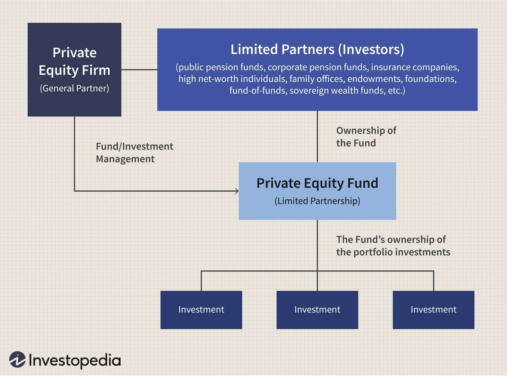

In today's fast-paced financial world, understanding the complexities of market dynamics is crucial for investors and traders. The modern financial landscape is characterized by rapid technological advancements that have fundamentally transformed traditional investment practices. This article focuses on advanced financial strategies, economic mechanisms, and the role of algorithmic trading in shaping modern markets, providing readers with insights into successfully navigating this evolving environment.

Traditional investment methods, once dominating financial strategies, are now complemented by sophisticated tools and techniques. Algorithmic trading, which relies on computer algorithms to execute trades, is becoming increasingly standard in the industry. This approach offers enhanced precision and efficiency, thus reducing human error and emotional biases typically associated with manual trading. By leveraging these advancements, investors can better align their strategies with market trends, enhancing their potential for success.



Navigating the financial landscape requires a delicate balance between tried-and-true investment practices and cutting-edge technology. While traditional methods such as diversification, asset allocation, and risk management remain vital, incorporating modern tools like artificial intelligence and machine learning can significantly refine these strategies. Investors must be adept at integrating both approaches to create resilient portfolios that can withstand market volatility.

The role of algorithmic trading has become pivotal, reflecting its influence on market dynamics. Its capabilities extend beyond automation, offering complex strategies like arbitrage, trend-following, and market-making that enhance decision-making processes. As such, mastering the concepts of financial technologies and their application is essential for achieving financial success. Those who can effectively harness the power of these systems are likely to gain a competitive edge in today's markets, making an understanding of this interplay between technology and traditional practices indispensable for modern investors.

## Table of Contents

## Understanding Financial Strategies

Financial strategies center around the careful planning and management of investments to meet distinct financial objectives. These strategies are crucial for optimizing portfolio performance and mitigating potential risks in volatile markets. Within this framework, three key components are indispensable: diversification, asset allocation, and risk management.

Diversification is a fundamental strategy that involves spreading investments across various assets to reduce exposure to any single asset or risk. The principle behind diversification is that a diversified portfolio is likely to yield more stable returns. It mitigates idiosyncratic risk—risks specific to a single asset or company. A diversified portfolio might have investments in different sectors, geographical regions, and asset classes. The formula for calculating portfolio diversification benefits often involves the correlation coefficient ($\rho$) between asset returns, where lower correlation implies higher diversification benefit:

$$
\sigma_p = \sqrt{\sum_{i=1}^{n}\sum_{j=1}^{n} w_i w_j \sigma_i \sigma_j \rho_{ij}}
$$

Here, $\sigma_p$ is the portfolio standard deviation, $w$ represents the asset weights, and $\sigma$ denotes the standard deviation of asset returns.

Asset allocation is another pivotal strategy, often defined as the process of distributing investments among various asset categories such as stocks, bonds, and cash. The proportion of these asset classes in a portfolio largely determines the expected risk and return. Asset allocation decisions might also increasingly consider alternative investments, such as real estate, commodities, and cryptocurrencies. By allocating assets thoughtfully, investors seek to optimize their risk-return profile according to their financial goals, risk tolerance, and investment horizon.

Risk management is integral to strategic investing, focusing on minimizing potential losses while aiming for expected gains. Understanding the relationship between risk and return is crucial when formulating risk management strategies. Typically, investments with higher potential returns come with higher risks. Key risk management techniques include setting stop-loss orders, using derivatives for hedging purposes, and continually assessing the portfolio's alignment with market conditions. Investors often employ certain metrics like Value at Risk (VaR) to quantify risk exposure, which estimates the maximum loss over a defined period with a given confidence level.

To develop a comprehensive financial strategy, investors must have a thorough knowledge of various asset classes. Traditional asset classes include stocks and bonds, where stocks represent equity ownership in companies and offer potential for capital appreciation, while bonds are debt instruments providing regular income through interest payments. In recent years, cryptocurrencies have emerged as a novel asset class, introducing opportunities for high returns along with significant [volatility](/wiki/volatility-trading-strategies). Understanding these assets' characteristics, market behaviors, and potential risks is imperative for building a resilient investment strategy.

In summary, understanding financial strategies requires a multifaceted approach involving diversification, asset allocation, and risk management. An adept understanding of different asset classes is also vital, helping investors navigate market complexities and achieve their financial objectives effectively.

## Market Holding and Economic Mechanisms

Market holding practices are crucial for maintaining the stability of securities prices, especially during periods of economic fluctuation. These practices include a combination of financial strategies and economic mechanisms designed to minimize volatility and enhance market confidence. Economic mechanisms play a significant role in influencing market behavior, with fiscal policy, monetary policy, and market regulations being the primary drivers.

Fiscal policy involves the government's use of spending and tax policies to influence economic conditions. For instance, increasing public expenditure or cutting taxes can stimulate economic activity, thereby influencing the demand for securities and stabilizing prices. Conversely, reducing expenditure or increasing taxes can help cool down an overheating economy, which may help maintain stable securities prices.

Monetary policy, governed by central banks, involves managing interest rates and the money supply to control inflation and stabilize the currency. By altering interest rates, central banks can affect the cost of borrowing and the return on investment, impacting investor behavior and securities pricing. For example, low interest rates generally make borrowing cheaper, encouraging investment and spending, which can support securities prices. Conversely, high interest rates can have the opposite effect, by discouraging borrowing and investment.

Market regulations are necessary to ensure transparency, prevent manipulative practices, and protect investors. By imposing rules and guidelines, regulatory bodies can help maintain orderly market conditions. Regulations may include requirements for disclosure, restrictions on insider trading, and limits on short selling, all of which are designed to enhance market stability.

Investors must understand how these economic mechanisms and policies affect market trends and asset valuation. For instance, a surprise change in interest rates can lead to rapid shifts in asset prices, creating opportunities or risks for investors. Similarly, unexpected changes in government fiscal policy can have a profound impact on market expectations and valuations.

The ethical considerations and legal implications of market holding practices are equally crucial. Investors and financial institutions must engage in market activities that uphold fairness, transparency, and integrity. Ethical behavior in market holding not only contributes to the stability of prices but also ensures trust in the financial system. Legal frameworks and regulations provide the necessary oversight to discourage and penalize unethical or illegal activities, safeguarding market participants' interests.

In summary, market holding involves strategic actions and the application of economic mechanisms to maintain securities price stability. Understanding fiscal and monetary policies, alongside market regulations, is essential for investors as they navigate market trends and valuation processes. These components, coupled with ethical and legal compliance, support a stable and trustworthy market environment.

## Overview of Algorithmic Trading

Algorithmic trading employs computer algorithms to make trading decisions with minimal human intervention, significantly reducing the risk of human error and emotional biases. By automating the trading process, algorithms can efficiently manage a large number of trades, executing complex strategies with high speed and precision that are unattainable for human traders. 

Common strategies within [algorithmic trading](/wiki/algorithmic-trading) include [arbitrage](/wiki/arbitrage), trend-following, market-making, and [statistical arbitrage](/wiki/statistical-arbitrage). Arbitrage strategies capitalize on price discrepancies across different markets or instruments. For instance, an arbitrage algorithm may simultaneously buy and sell the same asset in different markets to profit from price differences. Trend-following strategies rely on algorithms to identify and exploit market [momentum](/wiki/momentum) by tracking the direction of asset prices. These strategies assume that trends observed in prices will persist, allowing traders to generate returns from sustained price movements.

Market-making algorithms enhance [liquidity](/wiki/liquidity-risk-premium) by continuously providing buy and sell quotes for financial instruments, thereby facilitating smooth market operations. These algorithms aim to profit from the bid-ask spread while managing risk by minimizing inventories and exposure to price changes. Statistical arbitrage strategies utilize quantitative models to profit from small price inefficiencies over short time frames, relying on statistical methods to capture fleeting opportunities.

The integration of [machine learning](/wiki/machine-learning) (ML) and [artificial intelligence](/wiki/ai-artificial-intelligence) (AI) into algorithmic trading significantly expands its capabilities. Machine learning algorithms, particularly those employing techniques like [deep learning](/wiki/deep-learning) and natural language processing, enhance the capacity to analyze vast amounts of data. These algorithms can identify intricate patterns and complex relationships within datasets, enabling predictive analysis and the generation of novel trading signals. Python, with its extensive libraries like NumPy, pandas, and TensorFlow, is frequently used to develop and implement such machine learning models, thus optimizing the trading strategies.

By leveraging ML and AI, algorithmic trading systems can adapt to evolving market conditions, improve the accuracy of forecasts, and automate the decision-making process. This technological advancement positions algorithmic trading as a powerful tool in modern finance, enabling traders and investors to achieve superior execution and maintain a competitive edge in rapidly changing markets.

## Benefits and Challenges of Algorithmic Trading

Algorithmic trading, often referred to as algo trading, has transformed the financial markets by enabling a level of speed, efficiency, and scalability previously unattainable through traditional human trading methods. These benefits are primarily driven by the automation of trade processes and the ability to execute complex strategies in a fraction of a second.

One of the key advantages of algorithmic trading is the elimination of emotional biases. Human traders are prone to emotional decision-making, which can lead to inconsistent and flawed trades. Algorithmic systems, on the other hand, execute trades based on predefined criteria, thereby ensuring a level of decision-making consistency that is devoid of emotion. This allows for more systematic and disciplined trading strategies, enhancing overall execution quality.

However, algorithmic trading is not without its challenges. A significant barrier is the necessity for substantial technical expertise. Developing and maintaining algorithmic trading systems requires a deep understanding of both financial markets and computer programming. Traders must be adept in coding languages such as Python or C++, and be able to design algorithms that can adapt to different market conditions.

Overfitting and data bias are also pertinent issues in algorithmic trading. Overfitting occurs when a trading model is too closely tailored to historical data, resulting in poor performance on new data. This is akin to memorizing past market movements without understanding the underlying dynamics. Effective algorithms must generalize well across varying datasets to avoid this pitfall.

Moreover, the infrastructure supporting algorithmic trading is crucial. Robust systems are required to handle large volumes of data and execute trades in real time. This involves not only powerful computing resources but also reliable and fast access to real-time market data to ensure trades are executed at the best prices. Any latency in data processing or transmission can significantly impact the effectiveness of an algorithmic strategy.

In conclusion, while algorithmic trading provides substantial advantages over manual trading through enhanced speed and precision, it demands a high level of technical skill and robust infrastructure to be successfully implemented. Addressing challenges such as overfitting and ensuring real-time data access are critical for traders aiming to leverage these powerful trading systems effectively.

## The Role of Data in Financial Markets and Trading

Data is a fundamental component of successful financial trading strategies, serving as a critical tool for decision-making and performance assessment. In contemporary financial markets, various types of data drive trading decisions. Real-time market data offers immediate insights into current market conditions, enabling traders to react swiftly to price changes and trends. This data usually includes current bid and ask prices, volumes, and [order book](/wiki/order-book-trading-strategies) information. Historical data, on the other hand, provides a comprehensive view of past market behavior, allowing traders to backtest strategies and forecast potential future movements. Historical datasets often include price histories, trading volumes, and economic indicators over extended periods. 

In addition to these, [alternative data](/wiki/best-alternative-data) sources have gained prominence. These consist of non-traditional datasets such as social media sentiment, satellite imagery, and transactional data, providing unique perspectives that can enhance traditional data analysis.

The accuracy and efficacy of trading strategies heavily depend on the quality of input data. Therefore, the processes of data cleaning and processing are indispensable. Data cleaning involves removing noise and correcting errors in datasets, ensuring that the inputs used for analysis are both accurate and complete. Techniques such as outlier detection, missing value treatment, and normalization are often employed during this phase.

Data processing can be illustrated with a sample Python code snippet that applies basic data cleaning operations to a dataset:

```python
import pandas as pd

# Load data
data = pd.read_csv('market_data.csv')

# Handle missing values
data.fillna(method='ffill', inplace=True)

# Remove outliers
data = data[(data['price'] > data['price'].quantile(0.01)) & (data['price'] < data['price'].quantile(0.99))]

# Normalize data
data['normalized_price'] = (data['price'] - data['price'].mean()) / data['price'].std()
```

The application of data analytics enables traders to identify patterns and predict possible market movements, thereby gaining a competitive advantage. Techniques such as statistical analysis, machine learning, and artificial intelligence are frequently used. For example, a moving average can be calculated to identify trends:

```python
# Calculate moving average
data['moving_average'] = data['price'].rolling(window=20).mean()
```

Through the sophisticated use of data and analytics, traders can enhance their ability to forecast and react to market conditions efficiently, thereby sharpening their strategic edge in financial markets.

## Risk Management in Algorithmic and Traditional Trading

Risk management is a critical component in both algorithmic and traditional trading strategies, providing a safeguard against unpredictable market conditions and helping to preserve trading capital. Techniques such as diversification, position sizing, stop-loss orders, and portfolio hedging are fundamental to effective risk control.

Diversification involves spreading investments across various asset classes to reduce exposure to any single asset or risk. By holding a mix of stocks, bonds, and other financial instruments, traders can mitigate the risk of significant losses from a downturn in any single market. The concept is based on the idea that a diverse portfolio is likely to yield more stable returns over time.

Position sizing is another crucial technique, involving determining the amount of capital to allocate to each trade. This helps manage risk by ensuring that no individual position can significantly impact the overall portfolio. Traders often use formulas like the Kelly Criterion to optimize position sizes based on expected returns and risks:

$$
f^* = \frac{bp - q}{b}
$$

where $f^*$ is the fraction of the portfolio to wager, $b$ is the odds received on the wager, $p$ is the probability of winning, and $q$ is the probability of losing.

Stop-loss orders are employed to automatically sell a security when it reaches a certain price, limiting potential losses on a trade. They are particularly useful in volatile markets, providing a pre-defined [exit](/wiki/exit-strategy) strategy that prevents emotions from compromising decision-making.

Portfolio hedging involves strategies to offset potential losses in investments. Traders use derivatives like options and futures to hedge against downside risks, ensuring that their portfolios are better protected against adverse market shifts.

In algorithmic trading, risk management is further enhanced by incorporating algorithms that automatically adjust positions based on real-time market data. These algorithms utilize pre-set rules to evaluate the risk-reward ratio dynamically and alter trading strategies as necessary. For instance, they might increase diversification or set tighter stop-loss levels in response to higher market volatility.

Effective risk management requires continuous monitoring and adjustment. In algorithmic trading, this entails using real-time data analysis and machine learning models to predict market movements and recalibrate risk parameters proactively. Traders must stay vigilant, adapting strategies to align with fluctuating market conditions, thereby ensuring the long-term stability and success of their portfolios.

The integration of these techniques across trading platforms illustrates the importance of a comprehensive risk management plan. By employing a combination of traditional methods and advanced algorithms, traders can effectively navigate the complexities of modern financial markets and protect their capital from adverse market moves.

## Ethical and Regulatory Considerations

Algorithmic trading, a method that uses computer-driven strategies to execute trades, must adhere to a comprehensive set of regulatory standards designed to promote transparency and prevent practices that could lead to market abuse. These standards are essential to maintaining market integrity and ensuring that financial markets operate fairly, thereby protecting investors from manipulative tactics and ensuring their confidence in the system.

Regulatory frameworks, such as those instituted by the Securities and Exchange Commission (SEC) in the United States and the European Securities and Markets Authority (ESMA) in Europe, play a critical role in overseeing algorithmic trading activities. These organizations establish guidelines that require market participants to comply with rules regarding the transparency of their algorithms and the management of potential risks associated with high-frequency trading. For example, specific regulations require firms to maintain detailed records of their trading algorithms, implement stringent risk controls, and have robust systems for monitoring and managing trading activities.

Ethical trading practices emphasize transparency and data security, crucial for gaining and maintaining investor trust. Transparency involves the clear disclosure of trading strategies and practices to regulatory authorities to prevent insider trading and other forms of market manipulation. Additionally, maintaining rigorous data security measures is vital to protect sensitive trading information and ensure that data used in algorithmic trading is not subject to unauthorized access or manipulation.

Avoiding manipulative tactics is another cornerstone of ethical trading practices. This includes refraining from strategies that could distort market prices or volumes, such as spoofing or layering, where orders are placed with the intent to cancel them before execution, thereby misleading market participants about the supply and demand of a particular security.

To navigate the continuously evolving trading landscape, traders must remain informed about regulatory changes that may impact both algorithmic and traditional trading methods. This will often involve staying abreast of legislative updates and participating in industry discussions to understand the implications of new rules or amendments to existing regulations. Such diligence is crucial to ensure that trading strategies remain compliant and ethically sound, fostering a sustainable and trustworthy trading environment.

In summary, adhering to ethical and regulatory considerations in algorithmic trading not only upholds the integrity of financial markets but also protects investors and sustains the industry's reputation for fair trading practices.

## Conclusion: Navigating the Future of Financial Markets

As financial markets continue to evolve at an unprecedented pace, understanding and implementing complex financial strategies alongside cutting-edge technology becomes increasingly vital for market participants. Algorithmic trading, with its promise of speed, efficiency, and scalability, stands out as a transformative force shaping the future of trading. Offering the ability to process vast amounts of data and execute trades with precision, algorithmic trading enhances the decision-making process, allowing traders to capitalize on growth opportunities while minimizing risks associated with human error and biases.

To remain competitive in this dynamic environment, investors and traders must stay informed and adapt to the latest technological advancements. This adaptability is key, as technological innovation continually redefines market dynamics and trading methodologies. Embracing machine learning and artificial intelligence within algorithmic frameworks further enhances predictive capabilities, enabling market participants to anticipate market movements with greater accuracy. The integration of these technologies demands a robust infrastructure capable of handling real-time data access and processing, thereby supporting the intricacies of modern trading strategies.

However, navigating the future of financial markets requires more than just technical prowess. Investors must combine solid financial strategies with adherence to ethical practices to successfully face future market challenges. Robust risk management techniques, such as diversification and hedging, work hand in hand with ethical standards to ensure market integrity and protect investor interests. Moreover, staying abreast of regulatory developments is essential in maintaining compliance and preventing market abuse.

In conclusion, while the complexity of financial markets is set to increase, the opportunities they present are vast. By effectively leveraging technology and robust strategies, and upholding ethical practices, investors can optimally navigate evolving market conditions, ensuring sustained success in the financial landscape.

## References & Further Reading

[1]: Bergstra, J., Bardenet, R., Bengio, Y., & Kégl, B. (2011). ["Algorithms for Hyper-Parameter Optimization."](https://dl.acm.org/doi/10.5555/2986459.2986743) Advances in Neural Information Processing Systems 24.

[2]: ["Advances in Financial Machine Learning"](https://www.amazon.com/Advances-Financial-Machine-Learning-Marcos/dp/1119482089) by Marcos Lopez de Prado

[3]: ["Evidence-Based Technical Analysis: Applying the Scientific Method and Statistical Inference to Trading Signals"](https://www.amazon.com/Evidence-Based-Technical-Analysis-Scientific-Statistical/dp/0470008741) by David Aronson

[4]: ["Machine Learning for Algorithmic Trading"](https://github.com/stefan-jansen/machine-learning-for-trading) by Stefan Jansen

[5]: ["Quantitative Trading: How to Build Your Own Algorithmic Trading Business"](https://www.amazon.com/Quantitative-Trading-Build-Algorithmic-Business/dp/1119800064) by Ernest P. Chan