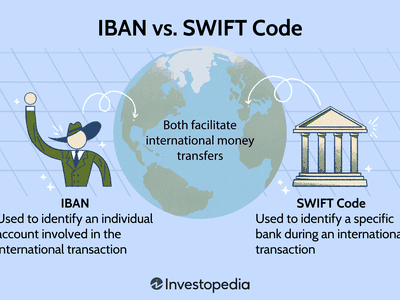

Market Identifier Codes (MICs) play a crucial role in the organization and operation of financial markets worldwide. These alphanumeric identifiers are vital for categorizing different trading venues, including stock exchanges, electronic platforms, and other financial infrastructures. They are essential in facilitating algorithmic trading, which has become a dominant force in modern financial markets. MICs provide unique identifiers for each trading venue and thereby help algorithmic systems rapidly access and process trading data efficiently.

Algorithmic trading systems rely on the fast and accurate transmission of data. MICs enhance this efficiency by allowing traders and systems to distinguish between various trading venues seamlessly. This function is pivotal for traders who operate at high speeds, where even the slightest delays can lead to missed opportunities. The standardized nature of MICs contributes significantly to reducing errors in trade execution and settlement, making the trading processes more reliable and robust.

The purpose of MICs extends beyond mere identification. They are responsible for ensuring the transparency of trading activities and maintaining a streamlined workflow in financial transactions. MICs are managed by the ISO standard 10383, and they standardize the identification of trading venues globally, thereby facilitating straight-through processing (STP). This efficiency, brought by MICs, underpins the fluidity of global financial markets, promoting liquidity and minimizing the friction associated with cross-border trading operations. Thus, MICs are not just identifiers but are integral to the structural framework that supports modern trading environments.

## Table of Contents

## What Is a Market Identifier Code (MIC)?

A Market Identifier Code (MIC) is a four-character alphanumeric identifier used to uniquely identify trading venues, such as stock markets and exchanges, around the world. As defined by ISO 10383, MICs serve as vital tools for ensuring standardized identification of markets, thereby facilitating efficient and reliable trading processes across diverse financial ecosystems.

### Structure and Format of MICs

The structure of a MIC is straightforward, consisting of four alphanumeric characters. Each MIC represents a particular market or exchange, which might include stock exchanges, currency exchanges, commodities exchanges, and other types of financial marketplaces. For instance, 'XNYS' denotes the New York Stock Exchange, while 'XLON' refers to the London Stock Exchange. The simplicity of the MIC format allows for easy integration into various financial data systems and protocols, enhancing interoperability across different trading platforms.

### Assignment and Management of MICs

The allocation and management of MICs are overseen by the International Organization for Standardization (ISO), specifically under the auspices of ISO 10383. The process involves the submission of an application to ISO, where entities that operate trading venues must provide detailed information about the market they wish to register. Once verified and approved, the market is assigned a unique MIC. Management of existing MICs involves regular updates to reflect changes in market status, such as mergers, closures, or new market launches, ensuring that each code remains accurately representative of its designated venue.

Overall, MICs play a critical role in facilitating clear and consistent communication across the global trading landscape. By providing a standard method for market identification, they help improve the efficiency of data exchange, reduce the risk of errors in transaction processing, and support the seamless integration of various trading systems.

## Understanding MICs in Financial Markets

Market Identifier Codes (MICs) play a critical role in the financial markets by providing a standardized method to uniquely identify stock markets and exchanges. Assigned by the ISO 10383 standard, these four-character alphanumeric codes facilitate the efficient categorization and recognition of trading venues globally. This standardization aids various processes, including routing orders to the correct exchanges, compiling market data, and regulatory reporting.

MICs are pivotal in enhancing straight-through processing (STP), a mechanism that automates the entire lifecycle of a trade transaction without human intervention. By ensuring precise identification of trading venues, MICs reduce errors, improve accuracy, and expedite the processing of trades. This standardization is crucial for institutional traders who handle large volumes of trades, as it allows for seamless integration of trading systems and processes.

Comparatively, MICs are distinct from other securities identification systems like the International Securities Identification Number (ISIN) and the Committee on Uniform Securities Identification Procedures (CUSIP) numbers. While ISINs provide unique identification for securities, encompassing equities, bonds, and others, and CUSIP numbers offer a similar function primarily for US and Canadian securities, MICs focus specifically on identifying trading venues rather than the securities themselves. This specificity makes MICs indispensable for traders and financial institutions in routing trades correctly and efficiently.

Therefore, MICs not only streamline global trading processes by providing clarity and reducing discrepancies but also complement other identification systems by focusing on the markets where securities are traded rather than on the securities alone. This distinction underscores the importance of MICs in the broader financial infrastructure, supporting transparency, accuracy, and efficiency in financial markets worldwide.

## Role of Algorithmic Trading in Financial Markets

Algorithmic trading, commonly referred to as algo trading, involves the use of advanced mathematical models and pre-programmed trading instructions to execute trades at high speed. The benefits of [algorithmic trading](/wiki/algorithmic-trading) are multifaceted, including enhanced trading efficiency, reduced transaction costs, and minimized human errors. By automating the trading process, algorithms can process vast datasets, identify trading opportunities, and execute orders much faster than traditional manual trading.

Market Identifier Codes (MICs) play a pivotal role in algorithmic trading systems. They act as unique identifiers for trading venues such as stock exchanges and over-the-counter markets worldwide. These codes ensure that transactions are accurately routed to the correct market, which is critical given the multitude of exchanges available globally. In a typical algorithmic trading system, a MIC is utilized to specify where a particular security will be traded. This ensures that the system does not misroute orders, thereby maintaining accuracy and efficiency.

The efficiency of automated trading is significantly impacted by the precision with which these MICs are employed. For example, when an algorithm identifies a trading opportunity, it will include the corresponding MIC in the order message. This integration ensures that the order is promptly sent to the appropriate exchange, allowing for swift execution and quick reaction to market movements. Such speed is crucial in markets where prices can fluctuate within milliseconds, making timely order execution a vital [factor](/wiki/factor-investing) in capitalizing on trading opportunities.

Through the structured use of MICs, algorithmic trading systems streamline the process of identifying and accessing diverse trading environments. Additionally, the global standardization provided by MICs reduces the complexity that would otherwise arise from dealing with various exchanges, each with different codes and protocols. This standardization facilitates a seamless flow of data across different regions and systems, promoting increased transparency and [liquidity](/wiki/liquidity-risk-premium) in the financial markets.

In summary, Market Identifier Codes are integral to the functionality and success of algorithmic trading by ensuring precise and efficient execution of trades across global markets. Through their usage, algo traders benefit from enhanced speed, accuracy, and reduced operational risk, ultimately contributing to the broader efficiency and reliability of financial markets.

## Types and Usage of MICs

Market Identifier Codes (MICs) are essential in global trading for systematic identification and categorization. They ensure uniformity and facilitate effective communication across various financial markets and platforms.

### Different Types of MICs: Operating and Segment MICs

MICs are broadly classified into two categories: Operating MICs and Segment MICs. 

- **Operating MICs**: These codes identify the main venue or exchange where trading occurs. An Operating MIC is associated with a primary market or trading entity, like the New York Stock Exchange or the London Stock Exchange. This classification provides a unified language for market participants to refer to primary trading venues.

- **Segment MICs**: These codes are used when a specific segment within a venue requires distinct identification. For instance, an exchange might operate multiple trading platforms, each catering to different asset classes or trading conditions. Segment MICs offer granularity by distinguishing between these diverse market segments, like derivatives markets or specific bond trading platforms.

### How MICs Standardize Market Identification Globally

MICs are crucial for standardizing the identification of exchanges and trading venues worldwide. With globalization in trading, there's a significant increase in cross-border transactions, necessitating a common language or system to prevent discrepancies. MICs serve as this universal standard, ensuring that no matter the location, market participants refer to exchanges and segments using consistent identifiers.

This standardization allows for seamless integration between various trading systems, enhancing Straight Through Processing (STP) by reducing the potential for mismatches in trade documentation. Such consistency is vital for efficient data processing and regulatory reporting, supporting both transparency and accuracy in global markets.

### Examples of MICs for Various Market Types and Platforms

Below are a few illustrative examples of MICs across different market types:

- **XNAS**: This MIC represents Nasdaq - an electronic stock exchange famous for being a hub for technology stocks. The simplicity of the four-letter code allows it to be easily integrated into trading algorithms and software systems.

- **XLON**: This code identifies the London Stock Exchange. As one of the principal exchanges in the UK, its MIC facilitates the clear understanding and processing of requests pertaining to the venue.

- **XETR**: The MIC for the Frankfurt Stock Exchange’s electronic trading platform, Xetra. This exemplifies how both the operating venue and specific electronic segment can be captured succinctly.

- **XNYC.BG**: An example of a segment MIC, identifying a specific bond trading platform under the broader umbrella of the New York Stock Exchange.

By uniquely identifying markets and their segments, MICs streamline information flow and maintain integrity across diverse trading environments. The use of standardized coding ensures that all participants, irrespective of geographic or operational differences, communicate effectively, minimizing the likelihood of errors and confusion.

## Why MICs Matter in Algorithmic Trading

Market Identifier Codes (MICs) play a crucial role in algorithmic trading by enhancing both the accuracy and speed of transactions. In the rapidly evolving landscape of financial trading, the precision offered by algorithmic systems is indispensable. By employing MICs, trading platforms can ensure that each transaction is accurately routed to the correct venue, thereby minimizing errors that might arise from ambiguous or incorrect market identification.

One of the primary benefits of using MICs in algorithmic trading is their ability to unambiguously identify trading venues. MICs assign a unique identifier to each trading venue, such as stock exchanges, electronic communication networks, and other types of markets. This identification is essential for algorithmic systems that rely on precise data inputs to make split-second trading decisions. By providing clear identification, MICs facilitate the smooth operation of these automated systems, eliminating the risk of misdirected trades that can result from incorrect market identification.

The practical implications of MICs extend to market transparency and liquidity. As trading systems rely on accurate market data to function optimally, MICs ensure that there is consistency and reliability in how markets are identified across various platforms. This consistency contributes to increased market transparency, as there is a reduced likelihood of miscommunication or misidentification. Furthermore, MICs can enhance market liquidity by simplifying the process of accessing various trading venues. When traders and algorithms can swiftly and accurately identify markets, it becomes easier to execute trades efficiently, thereby improving overall liquidity.

Additionally, the use of MICs supports regulatory compliance and reporting. As global financial markets become more interconnected, regulators require precise identification of trading venues to monitor and ensure fair trading practices. MICs help fulfill this requirement by providing a standardized framework for identifying and categorizing every trade's origin and destination. This standardization aids in the collection and analysis of trade data, further contributing to transparency and overall market stability.

In conclusion, the integration of MICs in algorithmic trading environments offers significant benefits. They enhance trading accuracy and speed, ensure clear identification of trading venues, and improve market transparency and liquidity. These advantages are crucial for the efficient functioning of algorithmic trading systems, which rely on rapid data processing and precise execution to capitalize on market opportunities.

## Challenges and Future of MICs in Trading

Market Identifier Codes (MICs) have become essential tools in the modern trading environment, but their implementation is not without challenges. One significant challenge is maintaining the accuracy and currency of the MIC database as global financial markets continue to evolve. As new exchanges emerge and existing ones merge or rebrand, the need for timely updates to MIC assignments becomes critical. Additionally, there can be inconsistencies in how exchanges interpret and apply MICs, leading to potential discrepancies in data reporting and transactions.

The evolution of MICs is intertwined with advancements in technology and market dynamics. The rise of decentralized finance (DeFi) platforms poses a unique challenge, as traditional MIC frameworks do not easily apply to these blockchain-based trading environments. There is an ongoing need to refine and expand MICs to accommodate the trading of digital assets and the platforms on which they are exchanged. Moreover, as algorithmic trading becomes more prevalent, the need for highly granular, standardized, and real-time market identifiers intensifies.

Looking ahead, the future adoption of MICs in global trading systems seems promising but contingent on technological integration and regulatory support. The continued development of distributed ledger technologies (DLT) might facilitate more efficient and transparent updating processes for MICs, offering a decentralized approach to maintaining a comprehensive and up-to-date database. Furthermore, increased collaboration among international regulatory bodies and trading institutions could lead to the establishment of more unified MIC standards, enhancing global trading efficiency.

In conclusion, while the challenges surrounding MIC implementation are notable, technological innovations and international cooperation offer potential pathways for their resolution. The evolution and broader adoption of MICs will likely parallel advancements in market technology and the growing complexity of global trading systems.

## Conclusion

Market Identifier Codes (MICs) are integral to the smooth functioning of global financial markets. These standardized alphanumeric codes are crucial for identifying and facilitating transactions in various financial venues, promoting efficiency and accuracy. MICs ensure that market participants have a consistent method for identifying trading exchanges and platforms, thus minimizing errors and enhancing the reliability of financial data and transactions.

In algorithmic trading, MICs play a transformative role by ensuring that trading algorithms can access precise and unambiguous information about transaction venues. This precision is vital for optimizing trading strategies and improving execution speed. Algorithmic traders leverage the standardization provided by MICs to develop automated systems that can respond quickly to market conditions, offering a competitive advantage in an increasingly fast-paced trading environment.

The adoption and continued evolution of MICs are imperative for maintaining transparency, liquidity, and overall market integrity. As market needs grow and technology advances, MICs are likely to become even more pivotal. They are expected to further integrate with sophisticated trading systems, allowing for more responsive and adaptive trading operations.

For traders and financial institutions, staying informed about developments in MICs is not just advisable, but necessary. Understanding changes and updates in market identifier systems can lead to more informed decision-making, safeguarding against potential operational risks. Recognizing the trends and transformations in MICs will help market participants capitalize on new opportunities and maintain their edge in the competitive financial landscape.

Overall, MICs are more than just a technical tool. They are a fundamental element in streamlining trading processes, fostering innovation in algorithmic strategies, and ensuring robust market operations. Traders and stakeholders should recognize their significance and remain proactive in adapting to their evolving framework.

## References & Further Reading

[1]: ["ISO 10383: Market Identifier Codes (MIC)."](https://www.iso20022.org/market-identifier-codes) International Organization for Standardization.

[2]: Menkveld, A. J. (2013). ["High Frequency Trading and the New-Market Makers."](https://www.sciencedirect.com/science/article/pii/S1386418113000281) Journal of Financial Markets, 16(4), 712-740.

[3]: Cliff, D. (2011). ["Computational Behavioural Finance: Taking Agent-Based Models of the Markets to the Next Level."](https://academic.oup.com/edited-volume/55833/chapter/440476257) ERCIM News.

[4]: Lioudis, N. (2020). ["Algorithmic Trading: Definition, Strategies, and Future."](https://wjaets.com/sites/default/files/WJAETS-2024-0054.pdf) Investopedia.

[5]: ["Algorithmic Trading: Winning Strategies and Their Rationale"](https://www.wiley.com/en-us/Algorithmic+Trading%3A+Winning+Strategies+and+Their+Rationale-p-9781118460146) by Ernest P. Chan