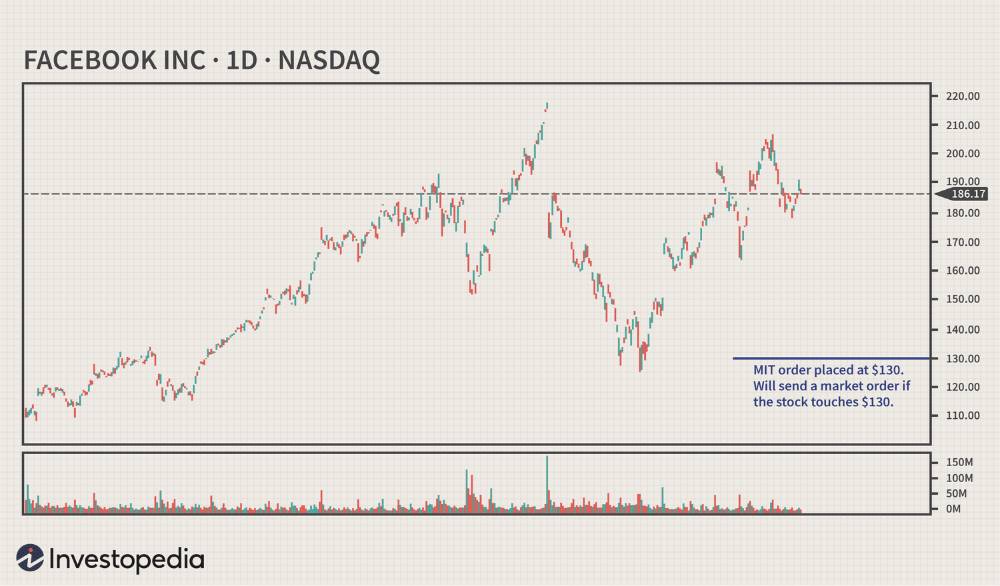

Market-if-touched (MIT) orders have gained notable importance among modern traders, offering a mechanism to execute trades once predefined price thresholds are achieved. By automatically converting into market orders upon reaching specified trigger prices, MIT orders help streamline the trading process, catering to both novice and seasoned traders alike. 

The essence of MIT orders lies in their capacity to automate trading decisions, minimizing the need for constant market surveillance. This article will examine the intricacies of MIT orders and their role in various trading strategies. By setting specific price points, traders can ensure that their trades occur at optimal moments, aligning with predefined market conditions.



Understanding MIT orders is vital for those seeking to optimize trading strategies. We will explore the basics, such as how MIT orders differ from other market orders, and emphasize their role in algorithmic trading. Embracing these orders allows traders to efficiently navigate volatile markets, making calculated moves that are less prone to human error.

Moreover, this article will address the challenges faced when implementing MIT orders and offer strategies to maximize their potential. By integrating these orders wisely, traders can refine their market engagement approach, leveraging them to automate and control entry and exit points effectively.

Whether you're navigating early stages or fine-tuning advanced strategies, MIT orders stand as a key component in enhancing the trading experience. An in-depth understanding of these tools can lead to more disciplined market transactions, supporting traders in achieving efficient and strategic outcomes.

## Table of Contents

## Understanding Market-If-Touched (MIT) Orders

A Market-if-Touched (MIT) order is a pivotal conditional order utilized in trading that transitions into a market order upon reaching a pre-specified price. This mechanism empowers traders to purchase securities when their prices decline to a predetermined point or sell them upon reaching an elevated level. The primary distinction between MIT orders and limit orders lies in the certainty of execution; where limit orders may remain unexecuted should the exact price be unattained, MIT orders are designed to initiate market orders once the trigger price is touched, thereby ensuring transaction execution.

In volatile market environments characterized by significant price fluctuations, the adaptable nature of MIT orders proves invaluable. These orders enable traders to effortlessly initiate or terminate positions based on predefined plans without the necessity for continuous market observation. This attribute of automated engagement is particularly beneficial for traders who aim to capitalize on rapid market movements or are unable to monitor market conditions continuously.

To illustrate, consider a market scenario where a stock's price dips to a particular support level—a situation in which a trader sets a buy MIT order hoping that, once this level is reached, the price will rebound. If the specified price point touches, the MIT order will activate as a market order, thus purchasing the stock immediately at the current market price.

Moreover, MIT orders are not only instrumental for traders anticipating certain price movements but also for those seeking to manage trade execution under specific market conditions. By automatically converting into market orders when triggered, MIT orders allow traders to better manage entry and [exit](/wiki/exit-strategy) points within their trading strategy, regardless of rapid or unexpected market swings.

## Strategies for Using Market-If-Touched Orders

Market-if-touched (MIT) orders offer traders a versatile tool for optimizing trade execution by specifying conditions under which trades are to be executed. These orders can be incorporated into various trading strategies, each offering distinct advantages in capturing potential market opportunities.

A popular strategy involves using MIT orders to anticipate reversals at critical technical levels such as support and resistance. By placing MIT orders at these points, traders prepare to enter the market when a stock touches a price that suggests a likely reversal. This approach leverages the tendency of prices to bounce back from well-established support or resistance levels, thereby enabling traders to capitalize on potential reversals without constant market monitoring.

In [breakout](/wiki/breakout-trading) strategies, traders employ MIT orders just beyond established support or resistance levels. This strategy benefits from price [momentum](/wiki/momentum), where a breach of these levels indicates a possible new trend. An MIT order in this context ensures that traders enter the market precisely when momentum confirms the breakout, capturing the shift in market dynamics.

Risk management is another area where MIT orders show their utility. By integrating MIT orders with stop-loss limits, traders can automate the execution of trades to exit positions that move unfavorably. This combination provides a safety net, ensuring that losses are minimized without requiring the trader's continuous oversight.

Algorithmic trading systems also find MIT orders invaluable for automating the trading process. By embedding MIT orders into their algorithms, traders can ensure that trade executions align consistently with pre-established rules. Algorithmic systems can monitor the market more comprehensively than any human, executing trades with speed and precision when specific price conditions are met. This automation not only reduces the need for manual monitoring but also enhances the consistency and efficiency of trade executions in alignment with strategic goals.

In summary, MIT orders are a flexible tool that, when used strategically, can optimize entry and exit points, capitalize on market movements, and manage trading risks effectively. Integrating these orders into broader trading plans allows traders to benefit from market opportunities while minimizing manual intervention and potential emotional biases.

## Market-If-Touched Orders and Slippage

Slippage refers to the variance between anticipated and actual trade prices, which is a common occurrence with market orders. While Market-if-Touched (MIT) orders are crafted to execute at the best available market price once the designated price threshold is triggered, swift market fluctuations can result in slippage. This is particularly prevalent in environments characterized by rapid price movements or low [liquidity](/wiki/liquidity-risk-premium) levels.

Traders must remain vigilant about market conditions that might exacerbate slippage. Fast-moving markets or assets with limited liquidity may not have sufficient counterparties to satisfy the market order precisely at the specified trigger price, thus leading to execution at an unintended price level. To mitigate the risks associated with slippage, prudent traders consider pairing MIT orders with limit orders. This strategy entails setting a price ceiling or floor, ensuring that the order is only executed within an acceptable price range, thereby controlling slippage.

Additionally, setting realistic trigger prices is vital in reducing slippage. A realistic trigger price takes into account the typical price fluctuations and liquidity of the asset, aiming to improve the likelihood of the MIT order executing near or at the desired price. For instance, in Python, traders can utilize historical price data to statistically estimate potential slippage and adjust trigger prices accordingly:

```python
import pandas as pd
import numpy as np

# Historical price data for the asset
prices = np.array([100, 101, 102, 97, 98, 105, 104, 106])
# Calculate average price change
average_change = np.mean(np.diff(prices))
# Consider average change in setting a realistic trigger price
realistic_trigger_price = prices[-1] + average_change

print(f"Realistic Trigger Price: {realistic_trigger_price}")
```

Understanding the slippage implications when using MIT orders is essential for crafting effective trading strategies. Traders must adapt their approaches to accommodate the inherent risks associated with market dynamics. Constantly analyzing market trends, coupled with technological and analytical tools, can aid traders in mitigating the slippage risk, thereby enhancing the efficacy of MIT orders. By integrating these precautions, traders can optimize their trading strategies, balancing automation with strategic execution.

## Examples of Market-If-Touched Orders in Action

Consider a scenario where a trader predicts that a stock will rise after encountering a support level. By setting a Buy MIT (Market-if-Touched) order at this crucial price point, the trader can capitalize on the anticipated upward movement without needing to vigilantly monitor the market. For instance, if a stock is trading at $150, and the trader anticipates it will hit a resistance level and then decrease, they might place a Sell MIT order at $160. This allows them to lock in profits as the stock price climbs, capitalizing on the momentum.

These scenarios exemplify the advantages of MIT orders by facilitating precise responses to specific market conditions. Traders can thereby leverage MIT orders to automate and optimize their trading strategies, taking action only when predetermined market conditions are met. This not only reduces the need for constant observation but also increases the efficiency and effectiveness of trading operations.

In volatile markets, where prices can swiftly fluctuate, MIT orders prove especially beneficial. They allow traders to quickly react to opportunities that might otherwise be missed due to the rapid and unpredictable nature of market movements. By setting MIT orders, traders can ensure they participate in potential market gains or exit positions strategically, depending on their forecasted scenarios, without being in front of their trading screens at all times. This strategy simplifies trading, aids in decision-making, and enhances the overall trading experience, particularly where quick action is paramount.

## Common Mistakes with Market-If-Touched Orders

Incorrectly setting trigger prices is one of the most prevalent mistakes when employing Market-If-Touched (MIT) orders. This error can lead to either missed trading opportunities or the execution of unwanted trades. Therefore, thorough market analysis is essential to determine appropriate trigger prices that align with a trader’s strategic goals.

Another common mistake involves not accounting for potential slippage. Slippage occurs when there is a difference between the expected execution price and the actual transaction price, typically due to rapid market movements or low liquidity. Traders must remain vigilant about market conditions and incorporate slippage estimates into their strategies to avoid unexpected executions at less favorable prices.

Using MIT orders in isolation, without integrating them into a broader trading strategy, can also lead to ineffective outcomes. A comprehensive strategy often encompasses multiple order types and risk management techniques, ensuring that each trading decision supports the overarching financial objectives.

Asset liquidity is another critical [factor](/wiki/factor-investing) often overlooked by traders, impacting the execution and efficiency of MIT orders. In markets with low liquidity, even small trades can cause significant price fluctuations, resulting in unfavorable execution of MIT orders. Traders should evaluate the liquidity of their chosen assets and adjust their strategies accordingly to mitigate this risk.

To effectively use MIT orders, it is crucial to continuously revise and adapt trading strategies to align with evolving market dynamics. This involves regularly assessing the effectiveness of trigger prices, monitoring market conditions, and adjusting the strategic use of MIT orders to maintain alignment with current trends and forecasts. By doing so, traders can enhance their ability to execute efficient and disciplined market transactions.

## Conclusion

Market-if-touched (MIT) orders provide traders with a versatile mechanism to automate trading efforts while maintaining control over strategic entry and exit points. MIT orders convert to market orders once a specified price is reached. This functionality allows traders to swiftly capitalize on favorable market conditions without constant monitoring.

Although MIT orders offer significant advantages, traders must carefully consider several factors to optimize their use. Understanding market conditions and setting appropriate trigger prices is crucial to mitigate risks associated with execution errors and slippage. Slippage, the variance between expected and executed trade prices, can occur in fast-moving or illiquid markets, underscoring the importance of realistic trigger settings and risk management strategies.

When effectively integrated into a broader trading approach, MIT orders can enhance the effectiveness of trading strategies. By using MIT orders, traders can achieve a balanced approach to automating execution while retaining flexibility. Leveraging technology and analytical tools further optimizes the potential of MIT orders, ensuring they align with the overall market strategy and trading objectives.

By embedding MIT orders into a comprehensive trading plan, traders can enhance their capacity for efficient, strategic market participation. A disciplined approach—where MIT orders complement other market tools—can enhance the potential for successful trades, ultimately contributing to an improved trading experience.

## References & Further Reading

[1]: ["Algorithmic Trading: Winning Strategies and Their Rationale"](https://www.wiley.com/en-us/Algorithmic+Trading%3A+Winning+Strategies+and+Their+Rationale-p-9781118460146) by Ernie Chan

[2]: Aldridge, I. (2013). ["High-Frequency Trading: A Practical Guide to Algorithmic Strategies and Trading Systems."](https://www.ahmetbeyefendi.com/wp-content/uploads/2020/07/High-Frequency-Trading-Irene-Aldridge.pdf)

[3]: ["Trading and Exchanges: Market Microstructure for Practitioners"](https://www.amazon.com/Trading-Exchanges-Market-Microstructure-Practitioners/dp/0195144708) by Larry Harris

[4]: Narang, R. K. (2013). ["Inside the Black Box: A Simple Guide to Quantitative and High Frequency Trading."](https://onlinelibrary.wiley.com/doi/book/10.1002/9781118662717)

[5]: ["Flash Boys: A Wall Street Revolt"](https://en.wikipedia.org/wiki/Flash_Boys) by Michael Lewis