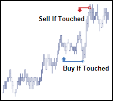

## Table of Contents

## What is a Market-If-Touched (MIT) order?

A Market-If-Touched (MIT) order is a type of order you can place with your broker to buy or sell a security once it reaches a specific price. This price is called the trigger price. When the market price hits or goes beyond this trigger price, the MIT order becomes a market order, which means it will be executed at the next available price.

MIT orders are useful if you want to enter or exit a position at a certain price level without constantly monitoring the market. For example, if you want to buy a stock but only if it drops to a certain price, you can set an MIT order at that price. However, be aware that once the order is triggered, it will be filled at the best available price, which might be different from your trigger price, especially in fast-moving markets.

## How does a Market-If-Touched order differ from a standard market order?

A Market-If-Touched (MIT) order and a standard market order work differently. A standard market order is an instruction to buy or sell a security right away at the current market price. When you place a market order, it gets filled almost immediately at the best available price at that moment.

On the other hand, an MIT order only becomes active when the market price reaches a specific trigger price that you set. Once the price touches or goes past this trigger, the MIT order turns into a market order and gets executed at the next available price. This means you can set an MIT order to buy or sell a stock at a certain price without having to watch the market all the time.

## What are the key components of an MIT order?

An MIT order has a few important parts that you need to know. The first part is the trigger price. This is the specific price you set where you want the order to start working. When the market price hits this trigger price, your MIT order becomes active. The second part is the action, which means whether you want to buy or sell the security once the trigger price is reached.

The third part is the quantity, which is how many shares or units of the security you want to trade. Once the trigger price is hit and your MIT order turns into a market order, it will try to buy or sell the quantity you set at the best available price at that time. Keep in mind that the final price you get might be a little different from your trigger price, especially if the market is moving quickly.

## In what types of markets are MIT orders commonly used?

MIT orders are often used in stock markets. People use them when they want to buy or sell a stock at a specific price without watching the market all day. For example, if you think a stock will go down to a certain price and you want to buy it then, you can set an MIT order. This way, you don't have to keep checking the price all the time. 

They are also used in [forex](/wiki/forex-system) markets. In forex, the prices can move very quickly, and MIT orders can help traders get into or out of a trade at a price they want. If a currency pair reaches a certain level, the MIT order will trigger and execute at the next available price. This can be helpful for people who trade currencies and want to enter or [exit](/wiki/exit-strategy) trades at specific points without constantly watching the market.

## Can you explain the process of setting up an MIT order?

Setting up a Market-If-Touched (MIT) order is pretty easy. First, you need to choose the security you want to trade, like a stock or a currency pair. Then, you decide if you want to buy or sell this security. After that, you set the trigger price, which is the specific price where you want the order to start working. For example, if you want to buy a stock, you might set the trigger price at a level where you think the stock will drop to.

Once you have your trigger price, you need to decide on the quantity, which is how many shares or units you want to trade. When all these details are set, you place the MIT order through your trading platform. If the market price hits or goes past your trigger price, the MIT order turns into a market order and gets executed at the best available price at that moment. This way, you can set up a trade to happen automatically without having to watch the market all the time.

## What are the potential risks associated with using MIT orders?

Using MIT orders comes with some risks you should know about. One big risk is that once your MIT order is triggered, it turns into a market order and gets filled at the next available price. This price might be different from your trigger price, especially if the market is moving fast. So, you might end up buying or selling at a price that's not what you expected. This can happen in both stock and forex markets, where prices can change quickly.

Another risk is that there might not be enough buyers or sellers when your order is triggered. This can lead to what's called slippage, where your order gets filled at a worse price than you wanted. Also, if the market is really busy or if there's a big event happening, your order might not get filled right away, or it might get filled in pieces at different prices. So, it's important to understand these risks and maybe set your trigger price carefully to account for them.

## How does an MIT order execute once the specified price is touched?

When you set up an MIT order, you pick a certain price called the trigger price. This is the price where you want your order to start working. If you want to buy a stock, you might set the trigger price at a level where you think the stock will drop to. When the market price hits or goes past this trigger price, your MIT order turns into a market order. This means it will try to buy or sell the security right away at the best available price at that moment.

Once your MIT order turns into a market order, it will get filled as soon as possible. But, the price you actually get might be a bit different from your trigger price. This can happen if the market is moving fast or if there aren't enough buyers or sellers at that exact moment. So, you might end up buying or selling at a price that's not exactly what you expected. It's important to keep this in mind when you set your trigger price.

## What are the advantages of using an MIT order over other order types?

Using an MIT order has some good points compared to other types of orders. One big advantage is that it lets you set a specific price where you want to buy or sell a security without having to watch the market all the time. This is really helpful if you have a price in mind where you think a stock or currency will reach, and you want to make sure you get in or out at that price. It's like setting an automatic trigger that does the work for you, so you don't have to keep checking the market every minute.

Another advantage is that MIT orders can help you take advantage of quick market moves. If the market price hits your trigger price, your order turns into a market order and gets filled right away. This can be useful in fast-moving markets like stocks or forex, where prices can change quickly. With an MIT order, you can set up a trade to happen automatically at the right moment, which can help you catch good buying or selling opportunities without having to be glued to your screen.

## Can MIT orders be used for both buying and selling securities?

Yes, MIT orders can be used for both buying and selling securities. If you want to buy a stock or currency at a certain price, you can set an MIT order with a trigger price at that level. When the market price hits or goes below your trigger price, your order turns into a market order and gets filled at the best available price at that moment. This way, you can buy the security without having to watch the market all the time.

On the other hand, if you want to sell a stock or currency at a certain price, you can also use an MIT order. You set the trigger price at the level where you want to sell. When the market price hits or goes above your trigger price, your order becomes a market order and gets executed at the next available price. This lets you sell your security automatically at the price you want, without needing to constantly monitor the market.

## How do market conditions affect the effectiveness of an MIT order?

Market conditions can really change how well an MIT order works. If the market is moving fast and there are a lot of trades happening, your MIT order might get filled at a price that's different from what you expected. This is called slippage. It happens because when your order turns into a market order, it gets filled at the best price available at that moment. So, if the market is moving quickly, the price you get might be a bit higher or lower than your trigger price.

Also, if the market is not very busy, there might not be enough buyers or sellers when your order is triggered. This can make it hard for your order to get filled right away, or it might get filled in smaller pieces at different prices. During big news events or when the market is very busy, your MIT order might not work as well because it can take longer to fill or might not fill at all. So, it's important to think about what the market is like when you set your MIT order.

## What are some advanced strategies that incorporate MIT orders?

One advanced strategy using MIT orders is called "scaling in" to a position. Imagine you want to buy a stock but you think it might go down a bit more before it goes up. You can set several MIT orders at different lower prices. This way, if the stock price drops to each of these levels, your orders will trigger one by one. You end up buying more of the stock at lower prices, which can lower your average cost and make your investment more profitable if the stock eventually goes up.

Another strategy is using MIT orders to set up a "stop and reverse" trade. This is common in forex trading. Let's say you're in a trade where you're betting that a currency pair will go up. But if it starts going down instead, you can set an MIT order to sell your current position and buy the opposite one at a certain price. This way, if the market moves against you, your MIT order will trigger, closing your old trade and opening a new one in the opposite direction. It's like automatically switching sides to try and make money from the new trend.

Lastly, MIT orders can be part of a "bracket order" strategy. This is when you set up multiple orders at the same time to manage both your entry and exit points. For example, after you buy a stock, you can set an MIT order to sell it at a higher price if you think it will go up. At the same time, you can set a stop-loss order to sell it at a lower price if it goes down. This way, you have a plan to make a profit or cut your losses without having to watch the market all the time.

## How can traders monitor and adjust MIT orders to optimize their trading strategy?

Traders can keep an eye on their MIT orders by using the tools on their trading platform. Most platforms let you see all your open orders in one place, so you can check if your MIT order is still active or if it has been triggered. It's a good idea to watch the market conditions too. If things change a lot, like if the market gets really busy or if there's big news, you might need to change your trigger price to make sure your order works the way you want it to.

To make your trading strategy better, you can adjust your MIT orders based on what's happening in the market. If you see that the price is moving in a way you didn't expect, you can move your trigger price up or down. This helps you stay flexible and catch the best buying or selling opportunities. Also, you can set up alerts on your trading platform to let you know when your MIT order is close to being triggered, so you can make quick changes if you need to.

## References & Further Reading

[1]: ["Algorithmic Trading: Winning Strategies and Their Rationale"](https://www.wiley.com/en-us/Algorithmic+Trading%3A+Winning+Strategies+and+Their+Rationale-p-9781118460146) by Ernie Chan

[2]: Aldridge, I. (2013). ["High-Frequency Trading: A Practical Guide to Algorithmic Strategies and Trading Systems."](https://www.ahmetbeyefendi.com/wp-content/uploads/2020/07/High-Frequency-Trading-Irene-Aldridge.pdf)

[3]: ["Trading and Exchanges: Market Microstructure for Practitioners"](https://www.amazon.com/Trading-Exchanges-Market-Microstructure-Practitioners/dp/0195144708) by Larry Harris

[4]: Narang, R. K. (2013). ["Inside the Black Box: A Simple Guide to Quantitative and High Frequency Trading."](https://onlinelibrary.wiley.com/doi/book/10.1002/9781118662717)

[5]: ["Flash Boys: A Wall Street Revolt"](https://en.wikipedia.org/wiki/Flash_Boys) by Michael Lewis