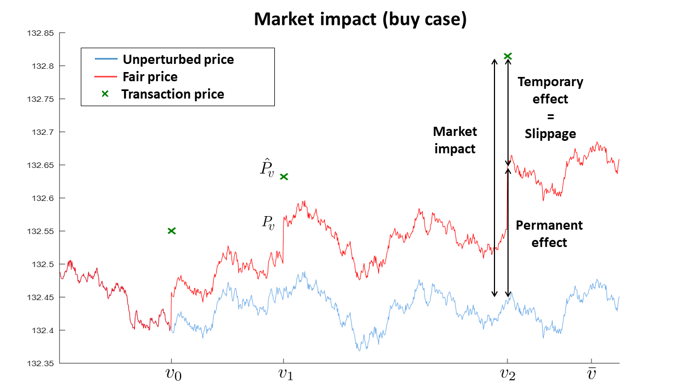

## Table of Contents

## What is market impact modeling?

Market impact modeling is a way to understand how buying or selling a large amount of something, like stocks or commodities, can change its price. When someone wants to buy or sell a lot of an item, they might not be able to do it all at once at the current price. This is because their large order can push the price up if they're buying, or down if they're selling. Market impact models help traders and investors figure out how much the price might change and plan their trades better.

These models use math and data to predict price changes. They look at things like how much of the item is being traded, how quickly the trade is happening, and what the market is doing at that time. By using these models, traders can try to buy or sell their large amounts without causing big price swings. This helps them get a better price and avoid losing money because of the changes they cause in the market.

## Why is market impact modeling important in trading and finance?

Market impact modeling is really important in trading and finance because it helps people who buy and sell a lot of things, like stocks or commodities, to do it in a smart way. When someone wants to trade a big amount, they can't just do it all at once because it might make the price go up or down a lot. By using market impact models, traders can figure out how their big trades might change the price and then plan their trades to make the price change as small as possible. This way, they can get a better price for what they're buying or selling and not lose as much money.

Also, market impact modeling helps traders and investors understand the market better. It shows them how the market might react to big trades and what other people in the market are doing. This information is really useful for making good trading decisions. For example, if a trader knows that selling a lot of a stock might make its price drop a lot, they might choose to sell it slowly over time instead of all at once. This helps them manage their trades better and make more money in the long run.

## What are the basic principles of market impact modeling?

Market impact modeling is based on the idea that when someone wants to buy or sell a lot of something, like stocks or commodities, it can change the price of that thing. The more you want to buy or sell, the bigger the change in price can be. This happens because there are only so many people who want to buy or sell at any given time. If you want to buy a lot, you might have to pay more to get people to sell to you. If you want to sell a lot, you might have to lower your price to find buyers. Market impact models help traders figure out how much the price might change so they can plan their trades better.

These models use math and data to predict how the price will change. They look at things like how much of the item is being traded, how quickly the trade is happening, and what the market is doing at that time. By using these models, traders can try to buy or sell their big amounts without causing big price swings. This helps them get a better price and avoid losing money because of the changes they cause in the market. Market impact modeling is important because it helps traders understand the market better and make smarter trading decisions.

## How does market impact affect trading strategies?

Market impact can really change how traders plan their trades. When someone wants to buy or sell a lot of something, like stocks or commodities, it can make the price go up or down. Traders use market impact models to figure out how much the price might change. This helps them decide the best way to do their trades. For example, if a trader knows that selling a lot of a stock might make its price drop a lot, they might choose to sell it slowly over time instead of all at once. This way, they can get a better price and not lose as much money.

Understanding market impact also helps traders pick the right time to trade. If the market is really busy, a big trade might not change the price as much because there are a lot of other people buying and selling. But if the market is quiet, a big trade can make a big difference. Traders use market impact models to see what the market is doing and plan their trades to make the price change as small as possible. This helps them manage their trades better and make more money in the long run.

## What are the different types of market impact models?

Market impact models come in different types, but two of the main ones are the temporary impact model and the permanent impact model. The temporary impact model says that when you buy or sell a lot of something, it can change the price for a short time. Once the big trade is done, the price goes back to what it was before. This kind of model is good for traders who want to buy or sell a lot quickly and then get out of the market. The permanent impact model says that when you buy or sell a lot, it can change the price for a long time. The price stays different even after the big trade is done. This model is useful for traders who are planning to stay in the market for a longer time.

Another type of market impact model is the volume-weighted average price (VWAP) model. This model looks at how much of something is being traded over time and tries to predict how the price might change based on that. Traders use the VWAP model to plan their trades so they can buy or sell without making the price go up or down too much. This helps them get a better price for their trades. All these models use math and data to help traders understand how their big trades might change the market and plan their trades better.

## How can market impact be measured and quantified?

Market impact can be measured and quantified by looking at how much the price of something changes when a big trade happens. Traders use math and data to figure this out. They look at how much of the item is being traded, how quickly the trade is happening, and what the market is doing at that time. By studying these things, traders can predict how much the price might go up or down because of their big trade. This helps them plan their trades better and get a better price.

One way to measure market impact is by using the volume-weighted average price (VWAP) model. This model looks at the average price of something over time and how much of it is being traded. It helps traders see how their big trade might change the price compared to what the price would have been without their trade. Another way is by using temporary and permanent impact models. The temporary impact model measures how much the price changes for a short time after a big trade, while the permanent impact model measures how much the price changes for a long time. Both models help traders understand and manage the impact of their trades on the market.

## What are the common challenges faced in market impact modeling?

One of the biggest challenges in market impact modeling is getting good data. To predict how the price of something might change, you need a lot of information about how the market works and what other people are doing. But sometimes, it's hard to find all the data you need, or the data might not be very accurate. This can make it tough to make good predictions and plan trades well.

Another challenge is that the market can change a lot. What worked yesterday might not work today because the market is always moving and reacting to new things. This means that market impact models need to be updated all the time to stay useful. It can be hard to keep up with all these changes and make sure the models are still giving good information.

Also, different traders might have different goals and ways of trading. Some might want to buy or sell quickly, while others might want to take their time. Market impact models need to be flexible enough to work for all these different ways of trading. This can be tricky because one model might not fit everyone's needs perfectly.

## How do market microstructure and liquidity influence market impact?

Market microstructure is all about how the market works and how trades happen. It includes things like how orders are placed, how they are matched, and how prices are set. When you want to buy or sell a lot of something, the way the market is set up can make a big difference in how much the price changes. If the market is set up in a way that makes it easy to buy or sell quickly, the price might not change as much. But if it's hard to find someone to trade with, your big trade can push the price up or down a lot. So, understanding the market microstructure helps traders figure out how their big trades might affect the price.

Liquidity is another important thing that influences market impact. Liquidity means how easy it is to buy or sell something without changing the price too much. If the market is very liquid, there are a lot of people buying and selling, and it's easy to find someone to trade with. In a liquid market, a big trade might not change the price as much because there are so many other trades happening. But if the market is not very liquid, there are fewer people trading, and it can be harder to find someone to buy or sell with. In this case, a big trade can make the price go up or down a lot. So, traders need to think about how liquid the market is when they plan their trades to manage the market impact better.

## What advanced techniques are used to improve the accuracy of market impact models?

To make market impact models more accurate, traders use advanced techniques like machine learning and [artificial intelligence](/wiki/ai-artificial-intelligence). These techniques help the models learn from past data and get better at predicting how the price will change. Machine learning can look at a lot of different things at once, like how much of something is being traded, how quickly trades are happening, and what the market is doing. By using all this information, the models can make better guesses about how a big trade might affect the price. This helps traders plan their trades better and get a better price.

Another technique is using high-frequency trading data. This means looking at trades that happen very quickly, sometimes in just a few seconds. By studying this data, traders can see how the market reacts to big trades in real-time. This helps them understand the market better and make their models more accurate. Also, some traders use simulations to test their models. They create fake markets on a computer and see how their big trades would affect the price. This helps them find out if their models are working well and make changes to improve them.

## How does market impact modeling integrate with other financial models?

Market impact modeling works together with other financial models to help traders make better decisions. One important model it works with is the risk management model. This model helps traders understand how much risk they are taking when they buy or sell a lot of something. By using market impact models, traders can see how their big trades might change the price and then use the risk management model to figure out if the risk is worth it. This helps them plan their trades in a way that keeps their risk low and their profits high.

Another model that market impact modeling integrates with is the portfolio optimization model. This model helps traders decide which things to buy or sell to make their portfolio, or collection of investments, as good as possible. Market impact models help traders see how their big trades might change the prices of the things in their portfolio. By using both models together, traders can choose the best times and ways to buy or sell, making their portfolio more profitable. This way, market impact modeling helps traders work smarter and make more money.

## What are the latest research developments in market impact modeling?

The latest research in market impact modeling is focusing a lot on using machine learning and artificial intelligence to make models better. These new techniques help the models learn from past data and predict how the price will change more accurately. For example, researchers are using [deep learning](/wiki/deep-learning) to look at a lot of different things at once, like how much of something is being traded, how quickly trades are happening, and what the market is doing. By using all this information, the models can make better guesses about how a big trade might affect the price. This helps traders plan their trades better and get a better price.

Another big area of research is looking at how market impact models can work better with other financial models. Researchers are trying to figure out how to use market impact models together with risk management models and portfolio optimization models. This helps traders understand how much risk they are taking when they buy or sell a lot of something and choose the best times and ways to trade. By using these models together, traders can make smarter decisions and manage their trades better. This way, market impact modeling can help traders work smarter and make more money.

## How can market impact models be optimized for high-frequency trading environments?

Market impact models can be optimized for high-frequency trading environments by using special techniques that help them work faster and more accurately. High-frequency trading means buying and selling things very quickly, sometimes in just a few seconds. To make market impact models work well in this fast-paced world, traders use machine learning and artificial intelligence. These techniques help the models learn from past data and predict how the price will change in real-time. By using these advanced methods, the models can make better guesses about how a big trade might affect the price, even when trades are happening very quickly.

Another way to optimize market impact models for high-frequency trading is by using high-frequency trading data. This means looking at trades that happen very quickly and seeing how the market reacts to big trades in real-time. By studying this data, traders can understand the market better and make their models more accurate. They can also use simulations to test their models. By creating fake markets on a computer, traders can see how their big trades would affect the price and make changes to improve their models. This helps them plan their trades better and get a better price in a high-frequency trading environment.

## What is market impact?

Market impact refers to the change in a security's price that occurs as a direct consequence of executing a trade. This phenomenon arises when sizable buy or sell orders exert pressure on the market, causing the price of the asset to move. Typically, the price tends to rise with large buying orders and falls with substantial selling orders. Such movements can be particularly significant for institutional traders who frequently deal with large volumes, as these price changes can lead to increased trading costs.

The concept of market impact is fundamentally tied to the principles of supply and demand. When a large buy order is placed, the demand for the asset increases, often pushing the price upward as the market attempts to balance the higher demand with existing supply. Conversely, a substantial sell order increases supply, typically resulting in a downward price pressure as the market seeks equilibrium.

To illustrate, consider the following simplified scenario: if a trader wants to buy a large number of shares, they might have to move through various price levels to fulfill their order, thereby raising the overall purchase price. This adverse movement is known as market impact. In contrast, if selling, the trader's order might have to be broken across multiple price tiers, driving the average selling price lower.

In quantitative terms, the market impact of a trade can be expressed by the formula:

$$
\Delta P = \eta \cdot Q
$$

where $\Delta P$ is the price change, $\eta$ represents the market impact coefficient, and $Q$ stands for the quantity of the trade. The coefficient $\eta$ is influenced by factors such as market liquidity, volatility, and the prevailing market conditions at the time of the trade.

Understanding these dynamics is critical for traders, as managing market impact is essential for minimizing trading costs. By anticipating how the market will react to large buy or sell orders, traders can adjust their strategies to mitigate unfavorable price movements. As such, recognizing market impact is crucial for anyone looking to optimize trading efficiency and maintain profitability in financial markets.

## What is Market Impact Modeling in Algo Trading?

Market impact models serve as vital instruments in anticipating and managing the effects of trades on asset prices. By leveraging these models, traders can develop strategies that not only reduce market impact but also enhance trade execution efficiency. This is particularly crucial for algorithmic traders who focus on high-frequency trading where the timing and [volume](/wiki/volume-trading-strategy) of trades are critically important for cost reduction.

Market impact models typically encompass calculations and simulations that help predict how a particular trade will influence the market. These models analyze various factors, such as order flow, [liquidity](/wiki/liquidity-risk-premium), and historical price movements. By incorporating such data, traders can anticipate potential changes in asset prices and make decisions that minimize adverse effects on trading costs.

A common approach in developing market impact models involves regression analysis, often employing historical trade and [order book](/wiki/order-book-trading-strategies) data. This allows traders to identify patterns and correlations that can be used to predict future price movements. For example, a simple linear model might relate the price shift $\Delta P$ to the size of the trade $Q$ as follows:

$$
\Delta P = \alpha + \beta \times Q
$$

where $\alpha$ and $\beta$ are coefficients derived from historical data. More sophisticated models incorporate non-linear relationships, machine learning algorithms, or stochastic processes to capture complex market dynamics.

Algorithmic traders utilize these models not merely to predict outcomes but to strategize the optimal execution of trades. By understanding the probability and magnitude of likely price movements, they adjust the timing, sequence, and size of their orders to mitigate negative impacts on trade prices. This tactical approach requires continuous model refinement and validation to ensure that predictions align with evolving market conditions.

The advancement of market impact modeling has seen the integration of high-performance computing and [machine learning](/wiki/machine-learning) techniques, enhancing the precision of predictions. Tools such as decision trees, neural networks, and [reinforcement learning](/wiki/reinforcement-learning) [agents](/wiki/agents) offer new avenues for algorithmic traders to refine their strategies.

Understanding the mechanics and applications of market impact models empowers traders to make informed decisions, improving their ability to manage substantial trades in dynamic environments. The effective use of these models can lead to significant reductions in trading expenses, ultimately resulting in enhanced profitability and competitive advantage.

## References & Further Reading

[1]: Kissell, R. (2013). ["The Science of Algorithmic Trading and Portfolio Management"](https://www.sciencedirect.com/book/9780124016897/the-science-of-algorithmic-trading-and-portfolio-management). Academic Press.

[2]: Bouchaud, J. P., Farmer, J. D., & Lillo, F. (2009). ["How Markets Slowly Digest Changes in Supply and Demand."](https://arxiv.org/abs/0809.0822) In *Handbook of Financial Markets: Dynamics and Evolution* (pp. 57-156). North-Holland.

[3]: Tooma, E. (2010). ["Forecasting Volatility in the Financial Markets"](https://www.sciencedirect.com/book/9780750669429/forecasting-volatility-in-the-financial-markets). Academic Press.

[4]: Almgren, R., & Chriss, N. (2000). ["Optimal Execution of Portfolio Transactions"](https://smallake.kr/wp-content/uploads/2016/03/optliq.pdf). *Journal of Risk*, 3(2), 5-39.

[5]: Gatheral, J. (2010). ["No-Dynamic-Arbitrage and Market Impact"](https://www.tandfonline.com/doi/full/10.1080/14697680903373692). *Quantitative Finance*, 10(7), 749-759.

[6]: Hasbrouck, J. (2007). ["Empirical Market Microstructure: The Institutions, Economics, and Econometrics of Securities Trading"](https://academic.oup.com/book/52241). Oxford University Press.