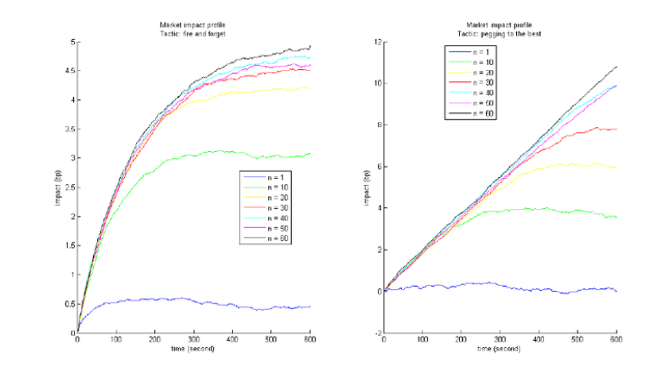

## Table of Contents

## What is a market impact model?

A market impact model is a tool that helps traders and investors understand how buying or selling a large amount of a stock can affect its price. When someone wants to trade a big quantity of shares, their actions can move the market price up or down. The market impact model tries to predict this price movement so traders can make better decisions. It considers factors like the size of the trade, how quickly the trade is done, and the current market conditions.

These models are important because they help traders reduce the costs of their trades. If a trader knows how their actions might affect the price, they can plan their trades more carefully. For example, they might choose to spread out their trades over time to avoid causing a big price change. By using a market impact model, traders can save money and make their trading strategies more effective.

## Why are market impact models important in trading?

Market impact models are important in trading because they help traders understand how their big trades can change a stock's price. When someone buys or sells a lot of shares, it can push the price up or down. A market impact model predicts this change, so traders know what might happen before they make their move. This is really helpful because it lets traders plan their trades better and avoid surprises.

Using these models can save traders a lot of money. If a trader knows that their big trade will move the price a lot, they can choose to break up the trade into smaller parts and do them over time. This way, they can avoid causing a big price jump and keep their trading costs down. By using market impact models, traders can make smarter decisions and improve their overall trading strategy.

## What are the basic components of a market impact model?

A market impact model has a few key parts that help it work well. The first part is the size of the trade. When someone wants to buy or sell a lot of shares, the model looks at how many shares they want to trade. This is important because trading more shares can move the price more. The second part is how fast the trade happens. If a trader does their trade all at once, it can cause a bigger price change than if they do it slowly over time.

The third part of a market impact model is the current market conditions. This includes things like how many people are buying or selling the stock right now and how much the price is moving. The model uses this information to guess how a big trade might affect the price. By putting all these parts together, the model can help traders make better plans and save money on their trades.

## How do market impact models differ from other financial models?

Market impact models are special because they focus on how big trades can change a stock's price. Unlike other financial models that might look at things like a company's earnings or the overall economy, market impact models care about the size of a trade and how fast it happens. They help traders see what might happen if they buy or sell a lot of shares all at once.

Other financial models might predict how a stock will do in the future based on different numbers and trends. For example, a valuation model might use a company's profits to guess what its stock should be worth. But market impact models are different because they are all about the here and now, and how a trader's actions can move the market right away. This makes them very useful for traders who want to plan their big trades carefully.

## What are the most common types of market impact models?

The most common types of market impact models are the linear model and the non-linear model. The linear model is simple and says that the more shares you trade, the more the price will move, and it moves in a straight line. It's easy to use but might not be perfect for every situation. The non-linear model is more complicated and says that the price doesn't always move in a straight line. It can change more or less depending on how big the trade is and how the market is acting.

Another type is the square-root model, which is a bit in between the linear and non-linear models. It says that the price movement is related to the square root of the trade size. This model tries to balance simplicity and accuracy, making it useful for many traders. Each of these models has its own way of looking at how trades affect prices, and traders pick the one that fits their needs best.

## How does a trader use a market impact model to make decisions?

A trader uses a market impact model to figure out how their big trades might change a stock's price. They start by putting the size of their trade into the model. If they want to buy or sell a lot of shares, the model will show them how much the price might go up or down. The trader also tells the model how fast they want to do the trade. If they do it all at once, the price might jump a lot, but if they spread it out over time, the price might not move as much.

With this information, the trader can make a smart plan. They might decide to break up their big trade into smaller pieces and do them slowly to keep the price from moving too much. This can save them money because they won't have to pay as much for the shares. By using the market impact model, the trader can see what might happen and choose the best way to do their trade.

## What are the key assumptions behind market impact models?

Market impact models are based on a few important ideas. One big idea is that the more shares you trade, the more the price will move. This means if you buy or sell a lot of shares, the price will go up or down more than if you trade just a few. Another idea is that how fast you do the trade matters. If you do it all at once, the price might jump a lot, but if you spread it out over time, the price might not move as much.

Another key assumption is that the current market conditions affect how much the price will move. This includes things like how many people are buying or selling the stock right now and how much the price is moving. Market impact models assume that all these things together can help predict what will happen to the price when you make a big trade. By understanding these assumptions, traders can use the models to plan their trades better and save money.

## How can market impact models be validated or tested?

Market impact models can be tested by looking at real trades and seeing if the model's guesses match what actually happens. Traders might use old trade data to see how well the model worked in the past. They can compare the model's predictions with what really happened to the price when big trades were made. If the model's guesses are close to the real results a lot of the time, it means the model is good and can be trusted.

Another way to test market impact models is by trying them out in real-time trading but with small trades first. Traders can make small trades to see how the price moves and compare it to what the model said would happen. This helps them see if the model works well in different market situations. By testing the model in different ways, traders can feel more sure about using it for their big trades and making better decisions.

## What are the limitations of current market impact models?

Market impact models are really helpful, but they have some problems. One big problem is that they can't always guess the market perfectly. The market can change a lot because of things like news or what other traders are doing, and these models might not be able to keep up with all those changes. Also, the models are based on what happened in the past, but the future might not be the same. So, even if a model worked well before, it might not work as well next time.

Another problem is that these models can be hard to use right. They need a lot of information and math to work, and if you don't put in the right numbers or use the model the right way, it might give you bad guesses. Plus, different models might give different answers for the same trade, which can make it hard to know which one to trust. Traders need to be careful and keep checking their models to make sure they are still working well.

## How do advanced market impact models incorporate machine learning?

Advanced market impact models use machine learning to get better at guessing how big trades will change a stock's price. Machine learning lets these models learn from a lot of old trade data. They can find patterns and connections that simple models might miss. For example, a machine learning model might see that the price moves differently on certain days or when the market is acting in a special way. By learning from all this data, the model can make smarter guesses about what will happen when a trader makes a big trade.

These models can also change and get better over time. As new trades happen and the market changes, the model keeps learning and updating itself. This means it can stay useful even when the market is different from before. Traders like using these advanced models because they can give more accurate predictions and help save more money on big trades. But, it's important to remember that even with machine learning, the models are not perfect and the market can still surprise them.

## What recent research has been done to improve market impact models?

Recent research on market impact models has focused on making them more accurate and useful for traders. One big area of study is using machine learning to help these models learn from a lot of old trade data. Researchers are trying to find new ways to teach the models about how the market works and how different things can affect the price. They are also looking at how to make the models change and get better over time as new trades happen and the market changes. This way, the models can keep giving good guesses even when the market is different from before.

Another important part of recent research is trying to understand the market better. Scientists are studying how news, what other traders are doing, and other things can change the market. They want to add this information to the models so they can guess what will happen to the price more accurately. By doing this, they hope to make the models more helpful for traders who need to plan their big trades carefully. Even with all this work, researchers know that the market can still be hard to predict, so they keep trying to make the models better.

## How can market impact models be integrated with other risk management tools?

Market impact models can be used together with other risk management tools to help traders make better decisions. One way to do this is by combining market impact models with tools that look at how risky a trade might be. For example, a trader might use a market impact model to see how much a big trade could change the price of a stock. Then, they can use a risk management tool to figure out if that price change is something they can handle. By using both tools together, traders can plan their trades more carefully and avoid big surprises.

Another way to integrate market impact models with other risk management tools is by using them with tools that help spread out the risk. For example, a trader might use a market impact model to break up a big trade into smaller parts. Then, they can use a risk management tool to decide the best times to do each part of the trade. This can help them avoid big price jumps and keep their trading costs down. By working together, these tools can help traders manage their risks better and make smarter trading choices.

## What is the impact of understanding the market?

Market impact refers to the alteration in an asset's price resulting from the trading activity of that asset. It is an essential consideration for traders, as the execution of large orders can significantly distort market prices. Understanding and quantifying this impact are crucial for optimizing trading strategies, ensuring that market participants can execute trades efficiently while minimizing costs.

The measurement of market impact focuses on the price deviation induced by the execution of sizable trades. Large trades may lead to noticeable price shifts due to an imbalance between the supply and demand equilibriums. When the quantity of an asset being bought or sold is sufficiently large relative to the market's liquidity, it can cause a price move in the direction of the trade, thereby impacting the average execution price. The extent of this impact must be anticipated and managed to ensure economically beneficial trade outcomes.

Several factors contribute to the degree of market impact. First, trade size is a primary determinant; larger trades generally exert more influence on prices than smaller ones. Market conditions also play a significant role, as periods of high [volatility](/wiki/volatility-trading-strategies) or low trading [volume](/wiki/volume-trading-strategy) can magnify the impact of trades. Furthermore, the [liquidity](/wiki/liquidity-risk-premium) of the asset is critical; assets that are less liquid tend to experience more significant price movements in response to the same trade size compared to more liquid assets. Liquidity can be quantitatively assessed using various indicators, such as bid-ask spread, market depth, and [order book](/wiki/order-book-trading-strategies) dynamics.

Quantifying market impact can be approached through mathematical models and statistical techniques. One common expression used to estimate market impact is a power-law model, where the price change $\Delta P$ is proportional to a power $\alpha$ of the trade size $V$:

$$
\Delta P = k \cdot V^{\alpha}
$$

where $k$ is a constant of proportionality. This model reflects the empirical observation that market impact tends to increase with trade size but at a decreasing rate. Understanding and applying these models allow traders to anticipate the cost implications of large trades and incorporate them into their decision-making processes.

## What are the types of market impact models?

Market impact models are integral in evaluating the effects of trading activities on asset prices and are generally divided into two categories: temporary and permanent impact models.

Temporary impact models focus on the immediate changes in an asset's price due to trade execution. These effects are transient and tend to revert once the trade is completed. The rationale behind temporary impacts revolves around the idea that large trades can momentarily create imbalances between supply and demand, causing short-lived price shifts. Mathematically, temporary impact can be represented as a function of the trade size. For instance, a simplified linear model might express the temporary impact $I_t$ as:

$$
I_t = \alpha \times V
$$

where $\alpha$ denotes the market impact coefficient and $V$ represents the trade volume.

On the other hand, permanent impact models assess the enduring change in asset price levels following trade execution. The hypothesis here is that substantial trades might convey new information to the market, leading to a lasting shift in price equilibrium. Permanent impact assumes that the market assimilates the information inherent in the trade, reflecting changes in the collective market perception of the asset's value. A potential formula for permanent impact $I_p$ can also be linear:

$$
I_p = \beta \times V
$$

where $\beta$ is the coefficient signifying the impact per unit volume, capturing the persistent influence on the market.

Understanding the distinction between temporary and permanent impact models is crucial for financial strategies. Temporary impacts suggest that strategic timing and execution can mitigate immediate price distortions. Conversely, permanent impacts present a longer-term strategic consideration—traders and algorithmic systems should account for the sustained shifts in market perception induced by their activities. This bifurcation in market impact modeling assists traders in crafting strategies for cost-effective order executions and optimizing their trading processes.

## What are Popular Market Impact Models?

The Square Root Model and the Almgren-Chriss Model are two prevalent market impact models in [algorithmic trading](/wiki/algorithmic-trading), each offering distinct methodologies for estimating and minimizing trading costs associated with asset trades.

The Square Root Model postulates that the price impact of a trade is proportional to the square root of the volume traded. Mathematically, it is often expressed as:

$$
\Delta P = k \times V^{\frac{1}{2}}
$$

where $\Delta P$ represents the change in price, $V$ is the traded volume, and $k$ is a constant derived from historical data, reflecting market conditions and asset characteristics. This model suggests that larger trades lead to disproportionate increases in price impact, due to limited market liquidity or slower absorption by the market. While providing a relatively simple and efficient estimate of price impact, its reliance on historical data and assumptions regarding constant parameters may limit its accuracy in volatile market environments.

The Almgren-Chriss Model, developed by Robert Almgren and Neil Chriss, is a more comprehensive approach that considers both temporary and permanent impacts of trading activities on market prices. The model is designed to minimize execution costs by balancing the trade-off between market impact and the risk associated with price movements during execution. The objective function in the Almgren-Chriss framework can be expressed as:

$$
\min_{X(t)} \ \mathbb{E}[C(X(t))] + \lambda \times \text{Var}[C(X(t))]
$$

where $X(t)$ represents the execution strategy over time, $\mathbb{E}[C(X(t))]$ denotes the expected cost of execution, $\lambda$ is a parameter reflecting the trader's risk aversion, and $\text{Var}[C(X(t))]$ is the variance of the cost. The model integrates risk and cost into a single framework, enabling traders to optimize their sell or buy schedules eficiently.

A comparative analysis of these models reveals distinct strengths and weaknesses. The Square Root Model offers simplicity and ease of implementation, making it suitable for scenarios with limited computational resources or data availability. However, its static assumptions may undermine its effectiveness in dynamic trading environments. In contrast, the Almgren-Chriss Model provides a more nuanced approach, accommodating varying market conditions and trader preferences, but requires more complex calculations and detailed inputs, potentially restricting its use to entities with advanced capabilities.

Ultimately, the choice between these models depends on the specific trading context, including the trader's objectives, the complexity of the market structure, and available computational resources. Both models, however, underscore the necessity of precise impact estimation in optimizing algorithmic trading strategies.

## References & Further Reading

[1]: Bouchaud, J.P., Farmer, J.D., & Lillo, F. (2009). ["How Markets Slowly Digest Changes in Supply and Demand."](https://arxiv.org/abs/0809.0822) Handbook of Financial Markets: Dynamics and Evolution.

[2]: Almgren, R., & Chriss, N. (2000). ["Optimal Execution of Portfolio Transactions."](https://smallake.kr/wp-content/uploads/2016/03/optliq.pdf) Journal of Risk.

[3]: Gatheral, J. (2010). ["No-Dynamic-Arbitrage and Market Impact."](https://papers.ssrn.com/sol3/papers.cfm?abstract_id=1292353) Quantitative Finance, 10(09).

[4]: Kyle, A.S. (1985). ["Continuous Auctions and Insider Trading."](https://personal.utdallas.edu/~nina.baranchuk/Fin7310/papers/Kyle1985.pdf) Econometrica.

[5]: Cartea, Á., Jaimungal, S., & Penalva, J. (2015). ["Algorithmic and High-Frequency Trading."](https://assets.cambridge.org/97811070/91146/frontmatter/9781107091146_frontmatter.pdf) Cambridge University Press.

[6]: Lopez de Prado, M. (2018). ["Advances in Financial Machine Learning."](https://www.amazon.com/Advances-Financial-Machine-Learning-Marcos/dp/1119482089) Wiley.

[7]: Obizhaeva, A., & Wang, J. (2013). ["Optimal Trading Strategy and Supply/Demand Dynamics."](http://web.mit.edu/wangj/www/pap/ObizhaevaWang13.pdf) Journal of Financial Markets.

[8]: Easley, D., López de Prado, M., & O'Hara, M. (2012). ["Flow Toxicity and Liquidity in a High Frequency World."](https://www.semanticscholar.org/paper/Flow-Toxicity-and-Liquidity-in-a-High-Frequency-Easley-Prado/9369430bd005d194f9332ae7cbd5a57ace5e9ab3) Review of Financial Studies.

[9]: Kissell, R. (2014). ["The Science of Algorithmic Trading and Portfolio Management."](https://www.sciencedirect.com/book/9780124016897/the-science-of-algorithmic-trading-and-portfolio-management) Academic Press.