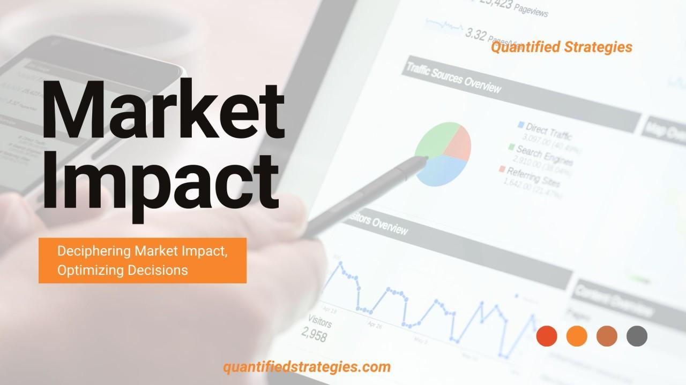

Algorithmic trading has transformed financial markets by employing computers and algorithms to execute trading strategies at speeds and frequencies beyond human capability. This method of trading leverages mathematical models and statistical analysis to determine the optimum timing, price, and quantity for trading assets. The primary goal is to maximize returns, minimize costs, and manage risk efficiently.

A crucial factor to consider in algorithmic trading is market impact, which refers to the change in an asset's price as a direct result of a particular trade or order placement. Understanding market impact is vital as it can significantly alter the expected returns from a trade. This is particularly important for large investors and financial institutions, whose trades can influence market prices due to their substantial size. Market impact, therefore, becomes an implicit cost of trading, affecting the overall profitability of a trading strategy.

Market impact is closely related to market liquidity, which is the ability to buy or sell an asset without causing a significant change in its price. A liquid market, characterized by a high volume of trades and narrow bid-ask spreads, tends to have lower market impact costs. Conversely, in an illiquid market, even small trades can lead to substantial price movements, increasing market impact costs. Therefore, the relationship between market impact and liquidity is pivotal for traders seeking to optimize their trading strategies and minimize associated costs. Understanding this relationship equips traders with the insights needed to devise strategies that consider both the direct and indirect costs of trading, ensuring more effective execution in the financial markets.

## Table of Contents

## Understanding Market Impact in Algorithmic Trading

Market impact refers to the change in an asset's price caused by executing a trade. When a buy order is placed, it can drive the price up, while a sell order can push it down. The size of the order and the liquidity of the asset play crucial roles in determining the extent of the market impact. 

For large investors and financial institutions, market impact is a pivotal consideration. A large trade can move the market unfavorably, significantly affecting the execution price and leading to increased costs. These entities often manage substantial portfolios, meaning that any adverse price movement can have a substantial financial implication. For instance, if an institution decides to sell a significant [volume](/wiki/volume-trading-strategy) of shares, the subsequent price drop can erode the potential revenue from the sale.

Market impact is distinct from other transaction costs like commissions and fees. While traditional transaction costs are predictable and fixed, market impact is dynamic and depends on market conditions and the size of the trade relative to the market's [liquidity](/wiki/liquidity-risk-premium). Commissions and fees are documented costs arising from the process of trading, whereas market impact is the opportunity cost of how the market responds to the execution of trades.

Mitigating market impact often involves strategies like breaking up large orders into smaller ones and executing them over time to blend into the market activity unnoticed, thus reducing the extent of price movement. Advanced [algorithmic trading](/wiki/algorithmic-trading) systems are designed to minimize these impacts by executing trades in a way that reduces visibility and the corresponding market reaction. Understanding and managing market impact is crucial for optimizing trading results and minimizing unforeseen costs.

## Market Impact Costs and Liquidity

Market impact costs are a critical aspect of understanding market liquidity. These costs arise when executing large orders in financial markets, leading to a change in the asset's price. Essentially, market impact is the deviation in the price of a security caused by a trade itself. This deviation can be especially pronounced in less liquid markets, where fewer buyers or sellers exist to absorb transactions without significant price changes.

Market impact costs act as a transaction cost by effectively increasing the price at which an order is executed compared to its original quote. For instance, if a trader wishes to buy a substantial number of shares, the demand might push the asset's price up. Conversely, selling a large quantity could depress the price. The difference between the expected price and the actual execution price is the market impact cost. Traders must account for these costs to ensure the profitability of their trading strategies, particularly when dealing with large trades.

Several [factor](/wiki/factor-investing)s contribute to market slippage and associated costs in trading. Slippage refers to the difference between the expected price of a trade and the price at which the trade is executed. One primary factor influencing slippage is the liquidity of the market. In highly liquid markets, where there are frequent transactions and a large number of market participants, the impact of individual trades is minimized, leading to lower slippage. Conversely, in illiquid markets, even relatively small trades can lead to significant price changes, resulting in higher slippage.

Other contributing factors include trade size, market [volatility](/wiki/volatility-trading-strategies), and the speed of trade execution. Large trade orders are more likely to move the market price, thus increasing slippage. High volatility can also exacerbate slippage, as rapidly changing prices make it difficult to execute trades at the expected price. Additionally, delayed execution can lead to increased slippage, as prices may shift in the interim.

In conclusion, understanding market impact costs is essential for traders aiming to navigate the complexities of market liquidity. By comprehensively analyzing these costs and the factors contributing to market slippage, traders can better strategize to manage their transactions effectively, ensuring cost-efficiency and maintaining trading profitability.

## Measuring Market Impact

Statistical measures of market impact are essential for understanding how trading activities affect asset prices. One of the most influential models in this regard is Kyle's Lambda, introduced by Albert Kyle in 1985. Kyle's Lambda is a measure of price impact per unit of traded volume, representing the market's sensitivity to trading activity. Mathematically, it can be described as:

$$
\lambda = \frac{\Delta P}{V}
$$

where $\Delta P$ is the change in price caused by the trade, and $V$ is the volume of the trade. A higher Lambda indicates a stronger price impact, suggesting that trades significantly alter the price.

Trading volume and turnover are closely related to market liquidity. Trading volume refers to the number of shares or contracts traded in a given period, while turnover is the trading volume relative to the total number of shares available in the market. High trading volumes typically indicate high liquidity, meaning that the market can absorb trades without substantial price changes. Consequently, lower market impact costs generally occur in markets with high liquidity.

Measuring market impact is crucial for trading strategies as it influences decision-making in market entry and [exit](/wiki/exit-strategy). Understanding and predicting market impact allows traders to optimize order execution and reduce transaction costs. For instance, large orders can be split into smaller trades to minimize the impact on market prices, a strategy known as "order slicing".

Implementing such strategies not only helps manage execution risks but also aids in maintaining the desired risk-return profile. High-frequency traders and algorithmic trading systems often incorporate these market impact measures to enhance their models' efficiency and accuracy, ultimately striving for more profitable trading outcomes.

Overall, the accurate measurement of market impact and understanding its relationship with trading volume and liquidity form the cornerstone of effective algorithmic trading strategies. Keeping these elements in check can lead to better resource allocation, improved trading performance, and a more strategic approach to market engagement.

## Challenges for Microcap Traders

Microcap stocks, often defined as companies with a market capitalization between $50 million and $300 million, generally exhibit heightened volatility compared to their larger counterparts. This volatility arises from several intrinsic characteristics, such as lower liquidity, limited public float, and the influence of a few transactions on market price. 

One defining feature of microcap stocks is their limited public float, which refers to the portion of shares available for public trading. Due to fewer available shares, any significant buy or sale order can lead to drastic price movements. For traders, this means that even executing a moderate trade can substantially move the stock's price, thus increasing market impact costs. 

Accompanying the limited float is the issue of low daily trading volume. Microcap stocks typically exhibit lower trading volumes, which poses a challenge for traders attempting to enter or exit positions without affecting the market price. The low transaction volume implies that fewer shares are available at any given price, leading to what is known as market slippage. Slippage occurs when a large trade order cannot be fulfilled at the expected price, resulting in higher costs or incomplete transactions.

Microcap and nanocap stocks are especially susceptible to market impact. Large trades in these stocks can distort market prices not only due to the trade size relative to available liquidity but also because of the heightened reactions these trades may provoke among other market participants. This susceptibility is further compounded by the lower presence of market makers and institutional investors in these stocks, which can sometimes buffer price movements in more liquid securities.

The impact of market impact on microcap trading often discourages institutional investors from participating in this segment, leading to a reliance on retail investors. Consequently, traders must employ sophisticated strategies, such as spreading trades across multiple days or utilizing algorithmic trading to minimize market impact. These strategies are essential to avoid the negative repercussions of their trading activities, ensuring that large orders do not unfavorably skew market prices against them.

## Examples of Market Impact

Market impact refers to the effect that a large trade order can have on the price of an asset. When an investor attempts to buy or sell a large quantity of stock, they can inadvertently move the market price, especially in cases where the market lacks sufficient liquidity. This section will explore an example to illustrate how market impact functions and discuss the roles played by both institutional and professional investors in these scenarios.

### Illustrative Example

Consider a [hedge fund](/wiki/hedge-fund-trading-strategies) that decides to purchase one million shares of a small-cap tech company. Prior to the order, the stock is trading at $10 per share, and the average daily volume is 200,000 shares. Without adequate liquidity, the large buy order could drive the stock price upwards due to increased demand.

1. **Initial Order and Price Movement**: As the fund's purchase begins to execute, prices start to rise due to the increased buying pressure. This immediate shift in price is often referred to as the "temporary impact."
2. **Price Stabilization**: After the order is filled, the stock may stabilize at a higher price due to new demand levels established by the large buy. This can be thought of as the "permanent impact."

### Professional Investors' Response

Professional traders, including market makers and [arbitrage](/wiki/arbitrage)urs, respond to significant order flows in various ways:

- **Market Makers**: They tend to provide liquidity by stepping in to fill portions of the large order. While they earn the spread, their activity can somewhat temper the immediate price impact.
- **Arbitrageurs**: These traders might exploit the temporary mispricing caused by large orders. For instance, they could short the stock if they anticipate the price might revert once the initial purchase concludes.

### Impact on Institutional vs. Professional Investors

- **Institutional Investors**: For institutions like the aforementioned hedge fund, the key concern is the price that they receive for their trade. A higher execution price due to market impact results in increased transaction costs, reducing returns.

- **Professional Investors**: These investors capitalize on market inefficiencies. The actions of institutional investors create opportunities for arbitrage and spread capture, enabling professionals to profit from the induced volatility and price movements.

In conclusion, understanding market impact is crucial for both institutional and professional investors. The former must navigate the challenge of executing large trades without unduly influencing prices, while the latter seek to leverage these movements for potential gains. Managing market impact effectively can therefore be a significant determinant of investment performance.

## Strategies to Manage Market Impact

In algorithmic trading, managing market impact is crucial to executing large trades efficiently without significantly affecting the asset prices. Several strategies can help mitigate these effects.

One effective approach is pacing trades and staying under daily turnover thresholds. This involves executing trades incrementally over time rather than in a single transaction. By spreading out the trade, a trader can avoid causing sharp price movements that reveal their intent and subsequently increase market impact. Adopting this method requires an understanding of the asset's liquidity profile and historical volatility, enabling the trader to determine an optimal pace that minimizes disruption while achieving desired trading objectives.

Algorithmic trading strategies play a pivotal role in managing and predicting market impact. Algorithms can be designed to execute trades based on historical data and real-time market conditions, adapting dynamically to minimize impact. Popular algorithms, such as VWAP (Volume Weighted Average Price) and TWAP (Time Weighted Average Price), are employed to ensure that trades are conducted at prices consistent with the average over a specified period, reducing the possibility of executing all trades at sub-optimal prices that heighten market impact.

For instance, an algorithm can identify patterns in [order book](/wiki/order-book-trading-strategies) dynamics and liquidity shifts, leveraging complex models like [machine learning](/wiki/machine-learning) and statistical analytics. Traders can backtest these strategies to refine their effectiveness under different market scenarios, iterating upon the algorithm to adapt to new market conditions and maintain a minimal market impact.

By employing these strategies, traders can effectively navigate the complexities of executing large trades while minimizing their influence on market prices, thereby preserving asset value and maximizing returns.

## Conclusion

Market impact is a crucial factor in algorithmic trading, as it directly affects asset prices and the profitability of trades. When a trader places a large order, especially in markets with limited liquidity, the price can move unfavorably, and this is what we refer to as market impact. Understanding and managing this market impact is essential for large investors and financial institutions to execute trades efficiently and cost-effectively.

In algorithmic trading, market impact must be managed to avoid excessive costs and ensure favorable trade execution. This involves strategic trade scheduling and the use of sophisticated trading algorithms that can minimize the effect of large orders on the market. Techniques such as breaking large orders into smaller ones and trading incrementally can help reduce this impact.

Looking forward, the landscape of market impact analysis continues to evolve with technological and analytical advancements. Machine learning and [artificial intelligence](/wiki/ai-artificial-intelligence) are playing an increasingly prominent role in predicting market behavior and developing more efficient trading strategies. These technologies offer the potential to refine models of market impact and improve the ability to forecast the price movements caused by trades.

Furthermore, as data availability and processing power increase, traders can develop more accurate models to predict and mitigate market impact in real-time. This capability enhances the adaptability and effectiveness of trading strategies, making it easier to maintain profitability in diverse market conditions.

In summary, effectively managing market impact is vital in algorithmic trading. With continued advancements in technology and analytical methods, traders can look forward to more precise tools and strategies to handle this aspect of trading, which should ultimately lead to more efficient and profitable trading practices.

## References & Further Reading

[1]: Kyle, A. S. (1985). ["Continuous Auctions and Insider Trading."](https://personal.utdallas.edu/~nina.baranchuk/Fin7310/papers/Kyle1985.pdf) Econometrica, 53(6), 1315-1335.

[2]: Lopez de Prado, M. (2018). ["Advances in Financial Machine Learning."](https://www.amazon.com/Advances-Financial-Machine-Learning-Marcos/dp/1119482089) Wiley.

[3]: Chan, E. P. (2013). ["Algorithmic Trading: Winning Strategies and Their Rationale."](https://github.com/ftvision/quant_trading_echan_book) Wiley.

[4]: Bouchaud, J. P., Farmer, J. D., & Lillo, F. (2009). ["How Markets Slowly Digest Changes in Supply and Demand."](https://arxiv.org/abs/0809.0822) In Handbook of Financial Markets: Dynamics and Evolution (pp. 57-160).

[5]: Hasbrouck, J. (2007). ["Empirical Market Microstructure: The Institutions, Economics, and Econometrics of Securities Trading."](https://academic.oup.com/book/52241) Oxford University Press.