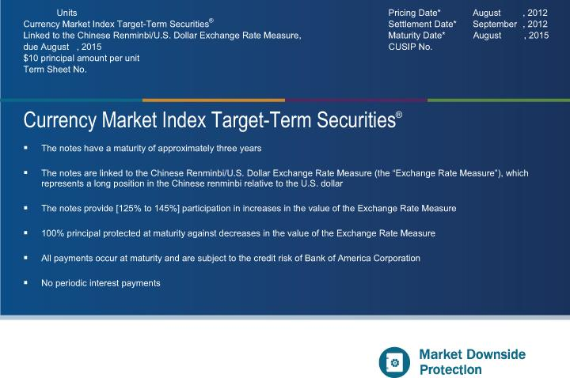

## Table of Contents

## What are Market Index Target-Term Securities (MITTS)?

Market Index Target-Term Securities (MITTS) are a type of investment product that combines features of bonds and stocks. They are designed to provide investors with a way to earn returns based on the performance of a specific market index, like the S&P 500, over a set period of time. When you buy MITTS, you are essentially buying a promise from the issuer, usually a bank or financial institution, that they will pay you a return based on how well the chosen index does during the term of the security.

The main attraction of MITTS is that they offer a potential for higher returns compared to traditional fixed-income investments like bonds, while also providing some level of protection against market downturns. At the end of the term, which can range from a few years to a decade, you will receive a payment that is linked to the performance of the index. If the index has gone up, you could earn more than you would with a regular bond. However, if the index has gone down, you might still get your initial investment back, depending on the specific terms of the MITTS. This makes them an interesting option for investors looking to balance risk and reward.

## How do MITTS differ from traditional securities?

MITTS are different from traditional securities like stocks and bonds because they mix features from both. When you buy a stock, you own a piece of a company and your returns depend on how well that company does. With a bond, you lend money to a company or government and get paid back with interest. But MITTS are linked to how a whole market index, like the S&P 500, performs over a set time. This means your returns are based on the overall market, not just one company.

Another big difference is that MITTS often come with some protection against market drops. If you buy a stock and the company does badly, you could lose a lot of money. With MITTS, even if the market goes down, you might still get your initial investment back at the end of the term, depending on the specific terms of the MITTS. This makes them a bit safer than stocks but with the chance for higher returns than bonds, which is why some investors like them.

## What is the basic structure of a MITTS product?

A MITTS product is a type of investment that combines elements of both bonds and stocks. When you buy a MITTS, you are essentially buying a promise from a bank or financial institution. This promise says that they will pay you back at the end of a set period, usually a few years to a decade, based on how well a specific market index, like the S&P 500, has performed during that time.

The basic structure of a MITTS includes a principal amount, which is the money you invest, and a term, which is how long the investment lasts. At the end of the term, you get paid based on the performance of the index. If the index has gone up, you could earn more than you would with a regular bond. If the index has gone down, you might still get your initial investment back, depending on the specific terms of the MITTS. This makes MITTS a unique investment because it offers the potential for higher returns with some protection against market downturns.

## How are returns calculated in MITTS?

Returns in MITTS are based on how well a specific market index, like the S&P 500, does over the time you own the MITTS. If the index goes up during the term, your return will be a part of that increase. For example, if the index goes up by 20% and the MITTS says you get 80% of that increase, you would earn a 16% return on your initial investment. 

If the index stays the same or goes down, you might still get your initial investment back at the end of the term, depending on the terms of the MITTS. This means you won't lose money if the market goes down, which is different from owning stocks where you could lose a lot if the company does badly. So, MITTS give you a chance to earn more if the market goes up, with some protection if it goes down.

## What are the common indices used as benchmarks for MITTS?

The most common index used for MITTS is the S&P 500. This index tracks the performance of 500 large companies in the United States. When you invest in MITTS linked to the S&P 500, your returns depend on how well these companies do together over the term of your investment.

Another popular index for MITTS is the Dow Jones Industrial Average. This index looks at 30 big companies in the U.S. and is often used to get a quick idea of how the stock market is doing. If you choose MITTS based on the Dow Jones, your money grows or stays the same based on how these 30 companies perform.

Sometimes, MITTS are also linked to other indices like the NASDAQ-100, which focuses on technology and internet companies. Each of these indices gives you a different way to invest in the market, depending on what you think will do well in the future.

## What are the risks associated with investing in MITTS?

Investing in MITTS can be risky because your returns depend on how a market index performs. If the index does really well, you can make more money than with a regular bond. But if the index doesn't go up much or even goes down, you might only get your initial investment back, which means you won't earn any extra money. This means you could miss out on higher returns if you had invested in stocks directly and they did well.

Another risk is that MITTS are usually not as easy to sell before the term ends. If you need your money back before the term is up, you might have to sell the MITTS for less than you paid for them. This makes them less liquid than stocks, where you can usually sell them quickly if you need to. Also, the terms of MITTS can be complicated, and it's important to understand them fully before you invest. If you don't, you might be surprised by how much you get back at the end.

## How can MITTS be used in a diversified investment portfolio?

MITTS can be a good addition to a diversified investment portfolio because they offer a mix of safety and potential for higher returns. When you invest in MITTS, you are not putting all your money into one company like with stocks. Instead, your returns are based on how a whole market index, like the S&P 500, does over time. This spreads out the risk because if one company in the index does badly, it won't hurt your investment as much as it would if you owned that company's stock directly. Plus, MITTS often give you some protection against market drops, so you might still get your initial investment back even if the market goes down.

Adding MITTS to your portfolio can also help balance out the risk from other investments. For example, if you have a lot of stocks that could lose value if the market goes down, MITTS can help protect some of your money because they might give you your initial investment back. This way, you can still try to earn more money from the market going up, but you have a safety net if things go the other way. It's like having a bit of a cushion in your investment strategy, making it easier to handle ups and downs in the market.

## What are the tax implications of investing in MITTS?

When you invest in MITTS, you need to think about taxes. The returns you get from MITTS are usually treated as ordinary income for tax purposes. This means if you earn money from your MITTS at the end of the term, you'll pay taxes on that money at your regular income tax rate, which could be higher than the tax rate for long-term capital gains you might get from stocks.

Another thing to know is that if you sell your MITTS before the term ends, you might have to pay capital gains tax. If you sell them for more than you paid, you'll pay tax on the profit. If you sell them for less, you might be able to use that loss to lower your taxes on other gains. It's a good idea to talk to a tax advisor to understand how MITTS will affect your taxes because it can get a bit tricky.

## How do market conditions affect the performance of MITTS?

Market conditions play a big role in how well MITTS perform. If the market goes up a lot during the term of your MITTS, you could earn more money than you would with a regular bond. This is because MITTS are linked to how a market index, like the S&P 500, does. So, if the index does well, your MITTS will do well too. But, if the market stays the same or goes down, you might only get your initial investment back at the end of the term. This means you won't earn any extra money, but you also won't lose your initial investment.

Even though MITTS give you some protection against market drops, they still depend on the market. If the market is very unpredictable or goes through a big downturn, it can affect how much you get back from your MITTS. For example, if the market goes down a lot right before your term ends, you might not get as much extra money as you hoped. So, it's important to think about what the market might do when you decide to invest in MITTS.

## What are some historical examples of MITTS and their outcomes?

One example of MITTS is the S&P 500 MITTS issued by Merrill Lynch in 1997. These MITTS were linked to the performance of the S&P 500 over a 5-year term. If the S&P 500 went up during those 5 years, investors would get their initial investment back plus a part of the increase. In this case, the S&P 500 did go up, and investors got their money back plus extra. This was a good outcome because they made more money than they would have with a regular bond.

Another example is the Dow Jones Industrial Average MITTS issued by Morgan Stanley in 2000. These MITTS were linked to the Dow Jones over a 10-year term. Unfortunately, the early 2000s saw a big drop in the stock market, including the Dow Jones. At the end of the 10 years, the Dow Jones had not gone up much from where it started. So, investors got their initial investment back but didn't earn any extra money. This showed how MITTS can protect your initial investment but might not give you extra returns if the market doesn't do well.

## How do issuers of MITTS manage their exposure to the underlying index?

Issuers of MITTS, like banks or financial institutions, manage their exposure to the underlying index by using financial tools called derivatives. These tools let them bet on how the index will do without actually owning all the stocks in the index. For example, they might use options or futures contracts. If the index goes up, the issuer might have to pay more to the investors, but they can make money from the derivatives to cover this cost. If the index goes down, the derivatives can help them avoid losing too much money.

This strategy helps the issuers limit their risk. They don't have to worry as much about the market going up or down because the derivatives act like a safety net. By using these tools, issuers can promise to pay back the initial investment to MITTS holders even if the market does badly. This makes MITTS more attractive to investors who want some protection against market drops.

## What advanced strategies can be employed to optimize returns from MITTS?

To optimize returns from MITTS, one strategy is to carefully time your investment based on market predictions. If you think the market will go up a lot during the term of the MITTS, it might be a good time to buy them. You can look at economic reports, news, and trends to guess where the market might be headed. Another part of this strategy is to diversify your MITTS investments across different indices. For example, you could invest in MITTS linked to the S&P 500 and also in MITTS linked to the NASDAQ-100. This way, if one index doesn't do well, the other might make up for it, helping you get better overall returns.

Another advanced strategy is to use MITTS as part of a larger investment plan that includes other types of investments. For example, you might buy stocks that you think will do well and also invest in MITTS for some protection against market drops. This way, you can try to earn more money from the stocks while using MITTS to balance out the risk. It's also important to understand the terms of the MITTS fully. Some MITTS might offer a higher percentage of the index's increase, but they might also have more risk. By choosing the right MITTS and combining them with other investments, you can work towards getting the best possible returns while managing your risk.

## References & Further Reading

[1]: ["Principal Protected Notes"](https://www.investopedia.com/terms/p/principalprotectednote.asp) - FINRA

[2]: Lopez de Prado, M. (2018). ["Advances in Financial Machine Learning."](https://www.amazon.com/Advances-Financial-Machine-Learning-Marcos/dp/1119482089) Wiley.

[3]: Chan, E. P. (2009). ["Quantitative Trading: How to Build Your Own Algorithmic Trading Business."](https://github.com/ftvision/quant_trading_echan_book) Wiley.

[4]: Jansen, S. (2020). ["Machine Learning for Algorithmic Trading: Predictive models to extract signals from market and alternative data for systematic trading strategies with Python, 2nd Edition."](https://www.amazon.com/Machine-Learning-Algorithmic-Trading-alternative/dp/1839217715) Packt Publishing.

[5]: Aronson, D. R. (2006). ["Evidence-Based Technical Analysis: Applying the Scientific Method and Statistical Inference to Trading Signals."](https://www.amazon.com/Evidence-Based-Technical-Analysis-Scientific-Statistical/dp/0470008741) Wiley.