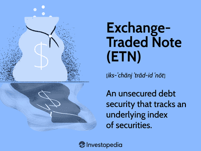

The financial landscape has drastically transformed with advancements in trading and investment tools. Among these advancements, Market Index Target-Term Securities (MITTS) and algorithmic trading have emerged prominently, catering to investors seeking optimal strategies. MITTS are engineered to provide a unique investment opportunity that combines protection of the principal with potential equity growth. These innovative securities are particularly attractive in volatile markets, owing to their linkage with stock market indices while safeguarding the initial investment. Simultaneously, algorithmic trading has revolutionized the execution of trades. Utilizing complex algorithms allows for rapid execution with enhanced precision, optimizing returns and managing risks effectively.

Through this article, we aim to explore the operational mechanics of MITTS, highlighting their advantages and limitations, and examine their synergy with algorithmic trading strategies. By integrating both, investors are offered a balanced risk-return profile, leveraging technological advancements to capitalize on market fluctuations. As financial markets continue to evolve, understanding and utilizing instruments like MITTS within algorithmic frameworks becomes increasingly crucial.



## Table of Contents

## Understanding Market Index Target-Term Securities (MITTS)

Market Index Target-Term Securities (MITTS) are financial instruments providing investors with equity exposure while ensuring the protection of their initial investments. These instruments fall under the category of principal-protected notes, which are structured to offer investors the ability to participate in potential stock market gains while being shielded from declines below their original investment amount.

Introduced by Merrill Lynch, MITTS are designed to mitigate the risks associated with direct equity investments. They achieve this by linking their returns to the performance of a particular stock market index. The mechanism works by promising investors the return of their principal at maturity, irrespective of how the underlying index performs during the investment period. Consequently, the structure of MITTS appeals particularly to risk-averse investors who wish to gain some exposure to the stock market without risking their entire capital.

The inherent capital protection feature of MITTS operates as follows: regardless of market downturns, investors are assured they will receive, at the very least, the amount they initially invested. This assurance typically comes by investing a portion of the initial funds in zero-coupon bonds that mature to the principal amount. The remaining portion can then be used to purchase index-linked options which can appreciate if the stock market index performs favorably.

For example, consider an investor who puts $1,000 in a MITTS that matures in five years. Suppose, over these years, the stock market index linked to the MITTS experiences a decline or stagnation. In such cases, the investor will still receive $1,000 back at maturity, effectively safeguarding their capital. If the index performs well, the investor may also receive returns, albeit typically with a ceiling on the maximum gain.

In summary, MITTS provide a structured way for investors to gain limited exposure to stock market indices while ensuring that their initial capital is protected. This blend of security and potential incremental gains makes them an attractive option for those who prefer minimized risk over the possibility of higher, yet unsecured, returns.

## How MITTS Function

Market Index Target-Term Securities, popularly known as MITTS, function by linking returns to the performance of a particular stock market index, thereby offering a structured investment pathway. These financial instruments are designed to provide returns that are directly proportional to the movement of the underlying index. When the index performs well, the returns on MITTS increase, and conversely, if the index underperforms, the potential returns are minimized.

One of the core characteristics of MITTS is principal protection. This feature ensures that investors receive their original investment amount back at the maturity of the security, regardless of how the linked index performed during the investment period. This principal protection distinguishes MITTS from other equity-based investments, which can lose value.

Despite the protective features of MITTS, a significant drawback is their limited [liquidity](/wiki/liquidity-risk-premium). Investors are typically unable to redeem or sell these securities before maturity without incurring penalties, which can restrict access to capital. This aspect of MITTS means that they are better suited for investors who can commit to the entire investment term, allowing them to benefit from the principal protection upon maturity.

By tying the investment returns to an index, MITTS enable investors to partake in potential equity gains while minimizing the risk associated with direct equity investments. However, the constraints on liquidity require careful consideration. This characteristic structure of MITTS makes them a suitable choice for risk-averse investors seeking exposure to equities with a safety net provided by capital protection at maturity.

## Algorithmic Trading and Financial Instruments

Algorithmic trading uses sophisticated computer algorithms to facilitate and expedite trading activities within financial markets. These algorithms are designed to execute trades at high speed and with great precision, thereby enhancing the efficacy of investment strategies. With the advent of technology, [algorithmic trading](/wiki/algorithmic-trading) has revolutionized the manner in which financial assets are traded, providing a competitive edge by minimizing human intervention and the potential for error.

One of the critical strengths of algorithmic trading is its ability to integrate various types of financial instruments into a comprehensive trading strategy, including Market Index Target-Term Securities (MITTS). MITTS, which are principal-protected notes linked to market indices, present an opportunity for algorithms to optimize by adjusting holdings based on the performance of the underlying indices.

Algorithmic systems can analyze massive datasets in real-time, identifying trends and executing orders based on predefined conditions. This capability is particularly beneficial in volatile markets where rapid changes require swift responses. Algorithms can be programmed to incorporate MITTS in a manner that balances risk and potential return. For instance, an algorithm might increase or decrease exposure to MITTS based on specific index movements, optimizing portfolio performance while ensuring capital preservation due to the nature of MITTS.

Consider a simple Python script that uses historical index data to adjust MITTS allocation:

```python
import numpy as np
import pandas as pd

# Load historical index data
index_data = pd.read_csv('index_data.csv')

# Compute index returns
index_data['Returns'] = index_data['IndexPrice'].pct_change()

# Define strategy parameters
threshold = 0.05  # 5% threshold for rebalancing

# Track MITTS allocation
mitts_allocation = []

# Algorithm to adjust MITTS position
for return_ in index_data['Returns']:
    if return_ > threshold:
        # Increase MITTS allocation
        mitts_allocation.append(min(1.0, mitts_allocation[-1] + 0.1))
    elif return_ < -threshold:
        # Decrease MITTS allocation
        mitts_allocation.append(max(0.0, mitts_allocation[-1] - 0.1))
    else:
        # Maintain current allocation
        mitts_allocation.append(mitts_allocation[-1])

index_data['MITTS Allocation'] = mitts_allocation
```

This script illustrates how an algorithm can automatically adjust MITTS allocation based on market conditions, thereby maximizing returns while managing risks.

In summary, algorithmic trading and MITTS can be effectively combined to optimize investment strategies within volatile financial environments. This integration allows traders to leverage both the stability of MITTS and the efficiency of algorithmic execution, providing a robust framework for enhancing returns without compromising risk management.

## Advantages of Integrating MITTS with Algorithmic Trading

Integrating Market Index Target-Term Securities (MITTS) with algorithmic trading offers several strategic advantages, particularly for risk-averse investors. MITTS, by design, provide a principal protection feature that ensures the initial investment is secure at maturity, regardless of market fluctuations. This inherent stability makes them a reliable component in any investment portfolio focusing on risk management.

Algorithmic trading, characterized by the use of complex algorithms for fast and efficient trade executions, can further enhance the potential returns of MITTS. These algorithms are capable of analyzing vast amounts of market data in real-time, enabling them to capitalize on short-term fluctuations in index values. By dynamically adjusting investment positions based on market indices to which MITTS are linked, algorithmic trading can optimize the returns from these financial instruments.

One of the significant advantages of this integration is the ability of algorithms to systematically leverage index movements. For example, an algorithm might be programmed to increase exposure to MITTS when market indicators suggest a likely upward trend, thereby maximizing potential gains. Conversely, the same algorithm could reduce exposure when predictions are unfavorable, thereby protecting the potential gains embedded in MITTS' equity-linked return mechanism. Python can be used to write such algorithms, utilizing libraries and tools for data analysis and trading operations. For example:

```python
import pandas as pd
import numpy as np

# Hypothetical price data for demonstration
market_data = pd.DataFrame({
    'Index': [1000, 1020, 1015, 1030, 1040],
    'Signal': [1, 0, -1, 1, -1]  # Trading signals: 1 for buy, -1 for sell, 0 for hold
})

# Example strategy: Buy when 'Signal' is 1, sell when -1
investment_value = 10000  # Initial investment
for index, row in market_data.iterrows():
    if row['Signal'] == 1:
        investment_value *= 1 + np.random.uniform(0.01, 0.05)  # Simulate index gain
    elif row['Signal'] == -1:
        investment_value *= 1 + np.random.uniform(-0.05, -0.01)  # Simulate index loss

print(f"Final investment value: {investment_value}")
```

By combining the stability of MITTS with algorithmic trading, investors can benefit from the efficiencies and precision of automated trading. These efficiencies arise from the reduced reaction times and minimized human emotional biases in decision-making, enhancing the overall performance of an investment portfolio. Moreover, the ability to execute trades based on pre-defined strategies helps in mitigating risks associated with human judgment errors while ensuring adherence to disciplined investing frameworks. Consequently, risk-averse investors are presented with a balanced investment approach that maximizes potential returns while maintaining a safety net through principal protection.

## Potential Drawbacks and Considerations

Market Index Target-Term Securities (MITTS) offer several attractive features, such as capital protection and equity exposure. However, they come with certain drawbacks and considerations that investors should be aware of. One of the most significant limitations is their potential return, which tends to be lower compared to direct equity investments. This is primarily because MITTS are structured products that offer protection against loss of principal but cap potential returns by not paying dividends or offering full participation in stock market gains.

Moreover, MITTS typically have limited liquidity. Investors often cannot redeem these securities before their maturity date without incurring penalties or facing unfavorable market conditions, making them less flexible than other financial instruments like stocks or mutual funds. This illiquidity can be a concern for those who might need to access funds quickly or wish to rebalance their portfolio in response to market changes.

Another essential consideration when investing in MITTS is the potential tax implications. As with many investment products, the returns from MITTS are subject to taxation, which can significantly impact the net gains realized by investors. Depending on the jurisdiction, the interest income or gains from these securities might be taxed at different rates compared to dividends or capital gains from equities.

Investors should also consider MITTS' underlying complexity and the associated risks. The performance of a MITTS is tied to a particular stock market index, which means that understanding the intricacies of the index's performance and other factors affecting it is crucial. Changes in interest rates, index [volatility](/wiki/volatility-trading-strategies), and the issuer's creditworthiness can all impact the security's valuation and potential returns.

Thus, while MITTS provide a unique opportunity for risk-averse investors to benefit from equity market performance with principal protection, these advantages must be weighed against their limitations. A thorough understanding of the product, its tax implications, and liquidity constraints is essential for making informed investment decisions.

## Conclusion

Market Index Target-Term Securities (MITTS) serve an essential function in investment strategies, particularly for risk-averse investors seeking diversification. By offering principal protection while providing exposure to equity markets, MITTS allow investors to participate in potential market upswings without risking their initial capital. This protection is especially appealing in uncertain or volatile market conditions.

Integrating MITTS with algorithmic trading further enhances their utility. Algorithmic trading strategies can optimize the timing and execution of trades with precision, potentially increasing the returns associated with MITTS. The use of algorithms enables investors to respond swiftly to market movements, leveraging data-driven insights to adjust their portfolios effectively. This blend of stability and advanced technology offers a sophisticated approach to risk management and profit maximization.

As financial markets continue to evolve towards greater complexity and speed, the importance of combining financial instruments like MITTS with state-of-the-art trading techniques cannot be understated. Investors and financial managers who utilize these tools position themselves at the forefront of modern investment practices. This synergy between traditional financial products and cutting-edge algorithmic strategies is poised to play a critical role in future-proofing investment portfolios against both market volatility and competitive pressures.

## References & Further Reading

[1]: ["Principal Protected Notes"](https://www.investopedia.com/terms/p/principalprotectednote.asp) - FINRA

[2]: Lopez de Prado, M. (2018). ["Advances in Financial Machine Learning."](https://www.amazon.com/Advances-Financial-Machine-Learning-Marcos/dp/1119482089) Wiley.

[3]: Chan, E. P. (2009). ["Quantitative Trading: How to Build Your Own Algorithmic Trading Business."](https://github.com/ftvision/quant_trading_echan_book) Wiley.

[4]: Jansen, S. (2020). ["Machine Learning for Algorithmic Trading: Predictive models to extract signals from market and alternative data for systematic trading strategies with Python, 2nd Edition."](https://www.amazon.com/Machine-Learning-Algorithmic-Trading-alternative/dp/1839217715) Packt Publishing.

[5]: Aronson, D. R. (2006). ["Evidence-Based Technical Analysis: Applying the Scientific Method and Statistical Inference to Trading Signals."](https://www.amazon.com/Evidence-Based-Technical-Analysis-Scientific-Statistical/dp/0470008741) Wiley.