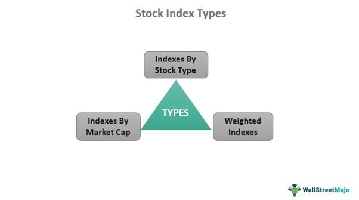

Market indices are foundational tools in finance, acting as essential benchmarks for investors and traders. These indices encapsulate market trends, playing a crucial role in both index trading and crafting investment strategies. By providing a composite view of market movements, indices enable market participants to assess the performance of specific sectors and the broader market. This evaluation not only aids investors in making informed decisions but also allows them to compare the performance of individual investments against the overall market or sector trends.

This piece explores three key components that are vital in the finance industry: market indices, financial markets indexing, and algorithmic trading. By examining each element's function and significance, we can understand how they collectively shape contemporary trading practices. Market indices synthesize data to present a comprehensive picture of financial markets, allowing participants to track and evaluate market dynamics efficiently.



Financial markets indexing refers to compiling an index from a defined group of stocks, mirroring a particular segment's performance within the market. This method facilitates investment strategies that benefit from diversification, offering an approach that often includes lower management fees than other investment vehicles.

Algorithmic trading, on the other hand, incorporates technology to streamline trading processes. It employs pre-programmed trading instructions based on specific variables such as timing, price, and volume. This practice has gained popularity due to its speed and efficiency, making it a preferred choice for many traders.

Understanding these components is essential for anyone aiming to successfully engage in financial markets. The integration of market indices and algorithmic trading exemplifies modern trading's efficiency and sophistication, providing opportunities for improved investment outcomes. As technology and financial practices continue to evolve, mastering these concepts will be increasingly important for investors looking to navigate and capitalize on future financial trends.

## Table of Contents

## What is a Market Index?

Market indices serve as fundamental tools in assessing the performance of financial markets. These indices are structured collections of stocks that provide a quantitative representation of the market or market segment. By aggregating the stock prices of multiple companies into a single value, market indices enable investors to gauge the overall market trend and health. Prominent examples of market indices include the S&P 500, Dow Jones Industrial Average, and NASDAQ Composite.

The S&P 500, a widely referenced index, comprises 500 of the largest publicly traded companies in the United States, selected primarily based on market capitalization. It offers a broad view of the U.S. equities market, capturing a substantial portion of its total market value. Similarly, the Dow Jones Industrial Average (DJIA) is an index composed of 30 significant blue-chip companies. Unlike the S&P 500, the DJIA is price-weighted, meaning that stocks with higher prices have a greater impact on the index's level. In contrast, the NASDAQ Composite is heavily weighted toward technology stocks and includes thousands of companies listed on the NASDAQ stock exchange.

Indices help investors monitor and compare the performance across different market sectors. By examining changes in these indices, investors can gain insights into sector-specific trends or the broader market's direction. This comparative ability is crucial for assessing individual investment performance against a standard benchmark.

Market indices often employ a market capitalization-weighted methodology in their construction. This approach means that companies with larger market capitalizations have a more significant influence on the index's movements. The formula for calculating a market capitalization-weighted index is:

$$
\text{Index Level} = \frac{\sum (\text{Price of Stock} \times \text{Number of Shares})}{\text{Divisor}}
$$

The divisor is a proprietary figure that the index provider adjusts to maintain consistency in the index level, such as during stock splits or component changes.

Each market index possesses unique inclusion criteria that determine the stocks eligible for membership. These criteria may involve considerations related to company size, industry classification, and [liquidity](/wiki/liquidity-risk-premium), ensuring the index reliably reflects the intended market segment.

The role of market indices in investment strategies is significant. They act as benchmarks for portfolio performance evaluation and are essential in the creation of index funds and exchange-traded funds (ETFs), which aim to replicate the performance of specific indices. By offering a diversified and passive investment approach, indices reduce unsystematic risk and highlight the power of market trends in portfolio construction and management.

## Financial Markets Indexing

Indexing in financial markets involves constructing an index from a carefully selected set of stocks to provide a comprehensive measure of a particular market segment's performance. This methodical selection process ensures that the index reflects the representative securities of the market it aims to track. Indices like the S&P 500 or the Dow Jones Industrial Average are benchmarks that offer insights into market trends and help investors gauge the performance of different economic sectors or industries.

Index funds are investment vehicles designed to replicate the performance of specific indices by holding either all or a representative selection of the stocks included in those indices. For instance, an S&P 500 index fund seeks to mirror the performance of the S&P 500 by holding the 500 constituent stocks or a varied selection that effectively replicates the index's movements. This approach provides investors with diversification benefits, as they gain exposure to a wide range of companies and industries within a single investment.

One of the main advantages of financial markets indexing is the cost efficiency it offers compared to actively managed funds. Index funds typically incur lower management fees since they follow a passive investment strategy that involves minimal buying and selling of securities. This cost-effectiveness is a significant draw for investors, especially when compounded over time.

Indexing has gained popularity due to its simplicity and historical performance. Unlike actively managed funds, which require managers to strategically select and time investments, index funds straightforwardly track the indices they are based on. This transparency, combined with the potential for consistent returns aligned with market movements, makes indexing an attractive strategy for long-term investors.

As investing strategies continue to evolve, the principles of indexing remain robust, offering a reliable foundation for both individual and institutional investors seeking broad market exposure with lower costs. The growth of exchange-traded funds (ETFs), which often follow index-based methodologies, further underscores the widespread adoption and relevance of financial market indexing in today's investment landscape.

## The Rise of Algorithmic Trading

Algorithmic trading, commonly referred to as algo trading, employs automated and pre-programmed trading instructions to [carry](/wiki/carry-trading) out transactions in financial markets. These algorithms are often designed based on a multitude of variables, including timing, price, and [volume](/wiki/volume-trading-strategy), facilitating the execution of trades with minimal human intervention. This level of automation enables traders to capitalize on market opportunities with remarkable speed and precision, minimizing the risk of human error and emotion-driven decisions.

The intrinsic advantage of [algorithmic trading](/wiki/algorithmic-trading) lies in its speed and efficiency, which have rendered it the preferred choice for a diverse group of market participants, including institutional investors and retail traders. The algorithms are capable of scanning multiple markets and exchanges at an extraordinary pace, identifying favorable conditions far quicker than any manual approach. As such, algo trading can efficiently exploit even the smallest market inefficiencies, which may be fleeting and imperceptible under conventional trading methods.

Algorithmic trading encompasses a wide spectrum of strategies, ranging from simple techniques such as moving averages to intricate mathematical models. At a basic level, a moving average strategy may buy or sell a security when its price crosses a moving average line. This can be represented as:

```python
def moving_average_strategy(prices, window_size):
    moving_averages = []
    for i in range(len(prices) - window_size + 1):
        window = prices[i:i + window_size]
        moving_averages.append(sum(window) / window_size)
    return moving_averages

# Example usage
prices = [101, 102, 100, 98, 97, 105, 110]
window_size = 3
print(moving_average_strategy(prices, window_size))
```

More complex strategies may involve stochastic models or [machine learning](/wiki/machine-learning) algorithms, which predict market movements by analyzing historical data patterns. Such models can adapt to evolving market conditions by adjusting their parameters, offering dynamic and flexible trading solutions.

The expansion of algorithmic trading mirrors broader trends of automation and technological advancement within the financial sector. Over recent decades, financial markets have witnessed significant transformations driven by technological innovations, facilitating the rise of high-frequency trading and enabling market participants to conduct millions of trades within fractions of a second. This technological evolution continues to push the boundaries of trading capabilities, creating an ever-increasing demand for more sophisticated algorithms to maintain and enhance competitive advantage in the market. 

As algorithmic trading becomes more widespread, it not only reshapes the landscape of trading strategies but also underscores the increasing integration of technology in finance. This progression reflects a broader market trend towards leveraging automation to optimize trading processes, improve liquidity, and reduce costs. As technology continues to evolve, the capabilities and applications of algorithmic trading are expected to expand, further solidifying its role as a cornerstone of modern financial markets.

## Integration of Market Indexing and Algorithmic Trading

The integration of market indexing and algorithmic trading presents significant benefits for investors by combining the strategic insights of market indices with the efficiency and precision of automated trading systems. Algorithmic trading, often relying on complex mathematical models and high-frequency trading technologies, executes index trading strategies with enhanced accuracy, delivering potential for increased profitability. 

The automated nature of algorithmic trading allows for seamless portfolio adjustments based on index rebalancing, which is crucial for maintaining alignment with targeted benchmarks. This ensures that an investor's portfolio composition consistently reflects the underlying index, optimizing alignment without the need for constant manual monitoring. 

High-frequency trading ([HFT](/wiki/high-frequency-trading-strategies)) capabilities inherent in algorithmic systems enable rapid responses to market dynamics, capitalizing on short-term price discrepancies and fleeting opportunities. For example, an algorithm might exploit [arbitrage](/wiki/arbitrage) opportunities across different market segments or liquidity pools that align with an index's composition. This is achieved by executing buy and sell orders within milliseconds, minimizing market impact and transaction costs. 

Consider a simple moving average convergence divergence (MACD) algorithm as a basic example of an automated trading strategy. In Python, such a strategy could be implemented using the pandas library to calculate moving averages on stock prices that comprise a specific index:

```python
import pandas as pd

# Example stock price data
# 'data_for_index' would be your data source containing indexed stocks prices over time
data_for_index = pd.read_csv('index_stock_prices.csv')
data_for_index['SMA_12'] = data_for_index['Close'].rolling(12).mean()
data_for_index['SMA_26'] = data_for_index['Close'].rolling(26).mean()

# Generate signals based on moving averages
data_for_index['Signal'] = 0
data_for_index.loc[data_for_index['SMA_12'] > data_for_index['SMA_26'], 'Signal'] = 1
data_for_index.loc[data_for_index['SMA_12'] < data_for_index['SMA_26'], 'Signal'] = -1
```

In this code snippet, buy and sell signals are generated based on the crossover of moving averages derived from index-related stock prices. This kind of strategy can be used as a building block for more sophisticated trading systems within the context of index-based investments.

The synergy between market indexing and algorithmic trading exemplifies modern investment efficiency, marrying the broad market exposure and strategic insight provided by indices with the precision and agility of technology-driven trading. This integration allows investors to effectively manage risk, ensure consistent market alignment, and potentially enhance returns while navigating complex financial landscapes.

## Benefits and Challenges

Combining market indices with algorithmic trading offers notable benefits, including enhanced trading speeds and reduced transaction costs. Algorithmic trading excels at executing high-frequency transactions, allowing investors to capitalize on fleeting market inefficiencies. By automating trades, investors can systematically track and replicate market indices with precision, maintaining alignment with market trends with minimal manual intervention. This approach enables investors to gain exposure to a broad market segment while optimizing performance through algorithmic precision.

Despite these advantages, integrating market indices with algorithmic trading presents challenges. One significant issue is the complexity of developing effective trading algorithms. Crafting algorithms capable of accurately interpreting market data and making profitable decisions requires substantial expertise and technological resources. Additionally, the systems are susceptible to market anomalies, such as sudden price movements or unexpected liquidity shifts, which can disrupt algorithmic strategies and lead to substantial losses.

Another layer of complexity arises from regulatory scrutiny surrounding algorithmic trading practices. Regulators are increasingly focusing on ensuring that algorithmic trading does not lead to unfair market manipulation or systemic risk. As such, compliance with regulations can be resource-intensive, impacting how algorithms are developed and implemented. Traders and institutions need to navigate a regulatory environment that is continually evolving, occasionally necessitating changes to previously established trading strategies.

For those who are well-informed and equipped with the necessary tools and understanding, the advantages of combining market indices with algorithmic trading often outweigh the potential risks. Navigating the associated challenges can enhance overall investment outcomes, providing an edge in today's rapidly advancing financial markets.

## Future Trends in Indexing and Algo Trading

The future trajectory of market indexing and algorithmic trading is poised to be significantly influenced by both technological advancements and evolving regulatory environments. Artificial intelligence (AI) and machine learning are positioned to play a central role in the enhancement of trading algorithms. These technologies can analyze vast amounts of data rapidly, identifying patterns and making predictions with unprecedented accuracy. As algorithms become more sophisticated, they are expected to execute trades with better timing and precision, leading to potentially higher returns for investors.

Sustainable and [ESG](/wiki/esg-investing) (Environmental, Social, and Governance)-focused indices are anticipated to gain [momentum](/wiki/momentum) in the indexing sector. This growth is a response to increasing investor demand for sustainable investments, driven by heightened awareness of climate change and social responsibility. These indices prioritize companies that meet specific ESG criteria, offering investors a way to align their portfolios with their values while potentially benefiting from long-term sustainability trends. As regulatory frameworks evolve to encourage transparency and governance, ESG criteria will likely become more integral to index construction.

The integration of real-time data processing and the emergence of quantum computing have the potential to transform trading efficiency. Real-time data processing allows algorithms to react immediately to market changes, capturing fleeting opportunities more effectively. Quantum computing, although still in its nascent stages, holds the promise of exponentially increasing computational power. This capability could significantly reduce the time required to solve complex mathematical models used in trading strategies, unlocking new possibilities for algorithmic innovation and speed.

Investors need to stay informed about these developing trends to tap into new market opportunities effectively. By understanding and leveraging emerging technologies and aligning with evolving regulatory standards, investors can enhance their strategic positioning. As the financial landscape continues to evolve, the successful integration of these trends will be crucial for navigating the future of market indexing and algorithmic trading.

## Conclusion

Market indices and algorithmic trading are vital elements within today's financial markets. They provide investors with crucial frameworks to evaluate and execute investment strategies. Market indices offer benchmarks for performance assessments, serving as a barometer for different sectors of the market. They enable investors to track trends and make informed comparisons across various securities and asset classes.

Algorithmic trading enhances this process by leveraging technology to execute trades with precision and speed. By using pre-defined criteria and automated systems, it reduces human error and allows for rapid response to market fluctuations. The integration of these two components creates a synergistic relationship that enhances efficiency and profitability within trading practices.

As technology continues to advance, particularly in areas like [artificial intelligence](/wiki/ai-artificial-intelligence) and machine learning, the sophistication and capability of algorithmic trading are expected to grow. These advancements will likely deepen the integration of market indexing and algorithmic trading, resulting in more refined and adaptive investment strategies.

Investors who adopt these innovations can potentially achieve superior market outcomes. The precision offered by algorithms, combined with the comprehensive view provided by indices, allows for optimized portfolio management and risk mitigation. Consequently, staying informed about technological and methodological developments in these areas will be crucial for investors. This knowledge not only helps them capitalize on emerging opportunities but also ensures they remain competitive in an ever-evolving financial landscape. Understanding and adapting to these dynamics is essential for navigating the future of finance effectively.

## References & Further Reading

[1]: ["Advances in Financial Machine Learning"](https://www.amazon.com/Advances-Financial-Machine-Learning-Marcos/dp/1119482089) by Marcos Lopez de Prado

[2]: ["Evidence-Based Technical Analysis: Applying the Scientific Method and Statistical Inference to Trading Signals"](https://www.amazon.com/Evidence-Based-Technical-Analysis-Scientific-Statistical/dp/0470008741) by David Aronson

[3]: ["Machine Learning for Algorithmic Trading"](https://github.com/stefan-jansen/machine-learning-for-trading) by Stefan Jansen

[4]: ["Quantitative Trading: How to Build Your Own Algorithmic Trading Business"](https://www.amazon.com/Quantitative-Trading-Build-Algorithmic-Business/dp/1119800064) by Ernest P. Chan

[5]: Council, W. [Sustainable Stock Exchanges Initiative](https://sseinitiative.org/) - A comprehensive initiative exploring ESG issues and sustainable investments in global stock markets. 

[6]: MSCI. ["Global Investing with MSCI Indices"](https://www.msci.com/indexes/index/990100) - Insightful information on global indices, including ESG-focused indices, provided by MSCI, one of the prominent players in the index market.