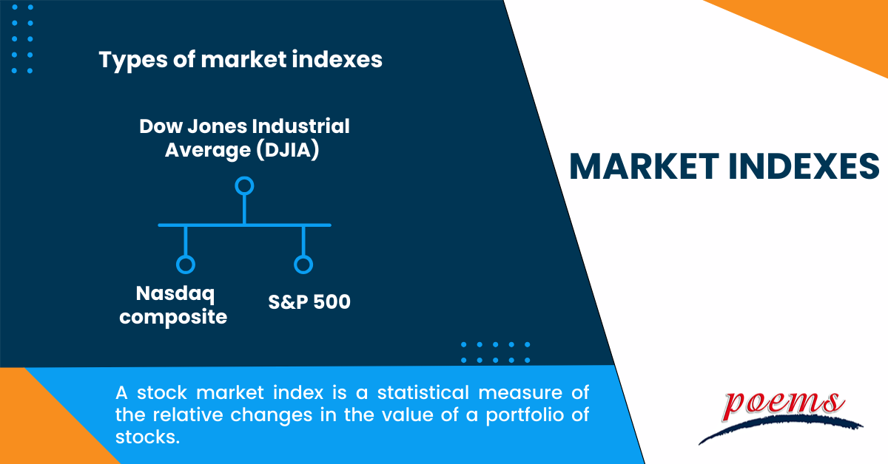

## Table of Contents

## What is a market index?

A market index is a way to measure the performance of a group of stocks or other investments. It's like a scoreboard that shows how well a specific part of the market is doing. For example, the S&P 500 is an index that tracks the performance of 500 large companies in the United States. When people talk about how the stock market is doing, they often refer to these indexes.

Indexes are important because they give investors a quick way to see if the market is going up or down. They can also be used to compare the performance of different investments. For instance, if you want to know if your own investments are doing well, you can compare them to a market index. This helps you understand if your investments are beating the market or not.

## What is the primary function of a market index?

The main job of a market index is to show how a group of investments is doing. It's like a report card for a bunch of stocks or other things you can invest in. By looking at an index, you can see if the overall market, or a specific part of it, is going up or down. This helps investors get a quick idea of what's happening in the market without having to check each investment one by one.

Indexes are also useful for comparing how well your own investments are doing. If you want to know if your choices are good, you can see how they stack up against a market index. For example, if your investments are doing better than the index, that's a good sign. If they're doing worse, it might be time to rethink your strategy. This way, indexes help people make smarter decisions about where to put their money.

## How are market indexes calculated?

Market indexes are calculated by taking the values of all the stocks or other investments in the index and putting them together in a special way. There are different ways to do this, but one common method is to use a weighted average. This means that some stocks in the index are more important than others. For example, in the S&P 500, bigger companies have a bigger say in how the index moves. The value of each stock is multiplied by how important it is, and then all these numbers are added up to get the total value of the index.

Another way to calculate an index is by using a price-weighted method, like the Dow Jones Industrial Average. In this method, the price of each stock matters more than the size of the company. Stocks with higher prices have a bigger effect on the index. To find the index value, you add up all the stock prices and divide by a special number called the divisor. This divisor changes over time to make sure the index stays accurate even when companies are added or removed, or when stocks split.

Both methods help give a clear picture of how the market is doing, but they can show slightly different things because they weigh the stocks differently. The choice of method depends on what the index is trying to show and who is using it.

## What are the different types of market indexes?

There are different types of market indexes, and each one tells us something different about the market. One type is a broad market index, like the S&P 500 or the Dow Jones Industrial Average. These indexes show how the whole market or a big part of it is doing. They include a lot of different companies from different industries, so they give a good overall picture. Another type is a sector index, which focuses on just one part of the market, like technology or healthcare. These indexes help us see how a specific industry is doing, which can be useful if you're interested in investing in that area.

Another kind of index is a style index, which groups stocks based on things like their size or how fast they're growing. For example, the Russell 2000 is an index of small companies, while the Nasdaq Composite includes a lot of tech companies that are growing quickly. Style indexes help investors who want to focus on certain kinds of stocks. There are also global indexes, like the MSCI World Index, which show how markets are doing in different countries around the world. These can be helpful if you want to invest in other countries or see how the global economy is doing.

All these different types of indexes help investors in different ways. They give us a quick way to check on the market and compare our own investments. Whether you're looking at the big picture with a broad market index, focusing on a specific industry with a sector index, or interested in certain kinds of stocks with a style index, there's an index out there that can help you make smarter investment choices.

## Can you explain the difference between a price-weighted and a market capitalization-weighted index?

A price-weighted index is one where the stocks with higher prices have a bigger impact on the index. For example, if one stock in the index costs $100 and another costs $10, the $100 stock will affect the index more, even if the $10 stock is from a bigger company. The Dow Jones Industrial Average is a famous price-weighted index. To calculate it, you add up the prices of all the stocks and then divide by a special number called the divisor. This divisor changes over time to make sure the index stays accurate, even when stocks split or companies are added or removed.

On the other hand, a market capitalization-weighted index, or cap-weighted index, looks at the size of the companies instead of just their stock prices. In this type of index, bigger companies have a bigger say in how the index moves. The S&P 500 is a well-known cap-weighted index. To calculate it, you multiply each stock's price by the number of shares the company has, which gives you its market cap. Then, you add up all these market caps and figure out what percentage each stock is of the total. This percentage is used to weight the stocks in the index. So, if a company has a big market cap, its stock price changes will have a bigger effect on the index.

Both types of indexes help us understand how the market is doing, but they do it in different ways. A price-weighted index can be simpler to calculate but might not give a full picture of the market because it focuses on stock prices. A market capitalization-weighted index gives a more complete view because it takes into account the size of the companies, but it can be more complicated to calculate. Depending on what you want to know about the market, one type of index might be more useful than the other.

## What are some common examples of market indexes?

Some well-known market indexes include the S&P 500, the Dow Jones Industrial Average, and the Nasdaq Composite. The S&P 500 is an index that tracks 500 of the biggest companies in the United States. It's a good way to see how the overall market is doing because it includes companies from many different industries. The Dow Jones Industrial Average, or the Dow, is another important index. It follows 30 large companies and is often used as a quick check on the market's health. The Nasdaq Composite is different because it focuses on technology and internet companies, so it's a good way to see how that part of the market is doing.

There are also indexes that focus on smaller parts of the market. The Russell 2000, for example, tracks 2,000 small companies. It's useful if you want to know how smaller businesses are doing. Another example is the MSCI World Index, which looks at companies from around the world, not just in the U.S. This can help you understand how the global market is doing. Each of these indexes gives us a different view of the market, helping investors make better decisions based on what they're interested in.

## How do market indexes help in understanding economic trends?

Market indexes help us understand economic trends by showing how groups of stocks or other investments are doing over time. When an index like the S&P 500 goes up, it usually means the economy is doing well because more people are buying stocks and companies are making more money. On the other hand, if the index goes down, it might mean people are worried about the economy and are selling their stocks. By looking at these changes, we can get a sense of whether the economy is growing or shrinking.

Indexes also help us see trends in specific parts of the economy. For example, if the Nasdaq Composite, which focuses on tech companies, is doing really well, it might mean that technology is a growing part of the economy. Or if the Russell 2000, which tracks small companies, is going up, it could show that smaller businesses are doing better. By watching different indexes, we can understand which parts of the economy are strong and which ones might need help.

## What role do market indexes play in investment strategies?

Market indexes help investors make smart choices by showing how different parts of the market are doing. They give a quick snapshot of whether the market is going up or down. For example, if an investor sees that the S&P 500 is doing well, they might feel more confident about putting money into the stock market. On the other hand, if the index is going down, they might decide to wait or look for safer investments. Indexes also help investors compare their own investments to the market. If their investments are doing better than the index, they know they're making good choices. If not, they might need to change their strategy.

Indexes are also important for creating investment strategies like passive investing. This is when investors try to match the performance of an index instead of [picking](/wiki/asset-class-picking) individual stocks. They might buy a fund that tracks the S&P 500, for example. This way, they don't have to spend a lot of time picking stocks, and they can still benefit from the overall growth of the market. Another use of indexes is for setting benchmarks. Investors often use indexes to see if their portfolio is doing better or worse than the market. This helps them decide if they need to adjust their investments to meet their goals.

## How can investors use market indexes to diversify their portfolios?

Investors can use market indexes to diversify their portfolios by investing in index funds or exchange-traded funds (ETFs) that track different indexes. For example, if an investor wants to spread their money across many different types of companies, they might buy a fund that follows the S&P 500. This way, they own a little bit of 500 big companies from different industries, which helps reduce the risk of losing money if one company or industry does badly. By using indexes, investors can easily add variety to their portfolios without having to pick individual stocks.

Another way to diversify using market indexes is to invest in different kinds of indexes. For example, an investor might put some money into a fund that tracks the Russell 2000, which follows small companies, and some into a fund that tracks the MSCI World Index, which includes companies from around the world. This way, they're not just investing in big U.S. companies but also in smaller companies and companies in other countries. By spreading their investments across different indexes, investors can protect themselves from big losses in any one part of the market.

## What are the limitations and criticisms of market indexes?

Market indexes have some problems that people talk about. One big issue is that they might not show the whole picture of the market. For example, the S&P 500 only includes 500 big companies, so it might miss out on what's happening with smaller companies or other parts of the economy. Also, indexes like the Dow Jones Industrial Average can be affected a lot by just a few stocks because it's price-weighted. This means if one stock with a high price goes up or down a lot, it can change the whole index, even if most other stocks are doing something different.

Another criticism is that market indexes can be slow to change. When a company gets added or removed from an index, it can take a while, and this might not keep up with what's really happening in the market. For example, if a new tech company is doing really well but isn't in the index yet, the index won't show how important that company is. Also, some people say that indexes can make investors too focused on the big picture and not pay enough attention to individual stocks or other investments that might be better for them. So, while indexes are helpful, they're not perfect and should be used along with other ways of looking at the market.

## How do global market indexes differ from national ones?

Global market indexes and national market indexes are different because they look at different parts of the world. A national market index, like the S&P 500, focuses only on companies in one country, usually the United States. It helps people see how the stock market in that country is doing. On the other hand, a global market index, like the MSCI World Index, includes companies from many different countries. This gives investors a bigger picture of what's happening in the world economy, not just in one place.

Both types of indexes are important, but they tell us different things. A national index can show how well a specific country's economy is doing. If the index goes up, it might mean that country's businesses are doing well. A global index, though, can show trends that affect many countries at once. For example, if there's a big event like a global economic crisis, a global index will show how it's affecting the world. By looking at both kinds of indexes, investors can get a better understanding of the market and make smarter choices about where to put their money.

## What advanced metrics are used to evaluate the performance of market indexes?

Advanced metrics help investors get a deeper look at how well market indexes are doing. One common metric is the Sharpe Ratio, which measures how much return an index gives for the amount of risk it takes. A higher Sharpe Ratio means the index is doing a good job of giving returns without taking too much risk. Another useful metric is the Sortino Ratio, which is similar to the Sharpe Ratio but focuses only on the bad kind of risk, or the risk of losing money. This can be more helpful for investors who are worried about big drops in the market.

Another important metric is tracking error, which shows how closely an index fund or [ETF](/wiki/etf-trading-strategies) follows its index. A smaller tracking error means the fund is doing a good job of matching the index's performance. Beta is also a key metric, showing how much an index moves compared to the overall market. If an index has a beta of 1, it moves the same as the market. A beta higher than 1 means the index moves more than the market, and a beta less than 1 means it moves less. By looking at these metrics, investors can better understand how their investments are doing and make smarter choices.

## What is a Market Index?

Market indices serve as fundamental tools in assessing the performance of financial markets. These indices are structured collections of stocks that provide a quantitative representation of the market or market segment. By aggregating the stock prices of multiple companies into a single value, market indices enable investors to gauge the overall market trend and health. Prominent examples of market indices include the S&P 500, Dow Jones Industrial Average, and NASDAQ Composite.

The S&P 500, a widely referenced index, comprises 500 of the largest publicly traded companies in the United States, selected primarily based on market capitalization. It offers a broad view of the U.S. equities market, capturing a substantial portion of its total market value. Similarly, the Dow Jones Industrial Average (DJIA) is an index composed of 30 significant blue-chip companies. Unlike the S&P 500, the DJIA is price-weighted, meaning that stocks with higher prices have a greater impact on the index's level. In contrast, the NASDAQ Composite is heavily weighted toward technology stocks and includes thousands of companies listed on the NASDAQ stock exchange.

Indices help investors monitor and compare the performance across different market sectors. By examining changes in these indices, investors can gain insights into sector-specific trends or the broader market's direction. This comparative ability is crucial for assessing individual investment performance against a standard benchmark.

Market indices often employ a market capitalization-weighted methodology in their construction. This approach means that companies with larger market capitalizations have a more significant influence on the index's movements. The formula for calculating a market capitalization-weighted index is:

$$
\text{Index Level} = \frac{\sum (\text{Price of Stock} \times \text{Number of Shares})}{\text{Divisor}}
$$

The divisor is a proprietary figure that the index provider adjusts to maintain consistency in the index level, such as during stock splits or component changes.

Each market index possesses unique inclusion criteria that determine the stocks eligible for membership. These criteria may involve considerations related to company size, industry classification, and [liquidity](/wiki/liquidity-risk-premium), ensuring the index reliably reflects the intended market segment.

The role of market indices in investment strategies is significant. They act as benchmarks for portfolio performance evaluation and are essential in the creation of index funds and exchange-traded funds (ETFs), which aim to replicate the performance of specific indices. By offering a diversified and passive investment approach, indices reduce unsystematic risk and highlight the power of market trends in portfolio construction and management.

## References & Further Reading

[1]: ["Advances in Financial Machine Learning"](https://www.amazon.com/Advances-Financial-Machine-Learning-Marcos/dp/1119482089) by Marcos Lopez de Prado

[2]: ["Evidence-Based Technical Analysis: Applying the Scientific Method and Statistical Inference to Trading Signals"](https://www.amazon.com/Evidence-Based-Technical-Analysis-Scientific-Statistical/dp/0470008741) by David Aronson

[3]: ["Machine Learning for Algorithmic Trading"](https://github.com/stefan-jansen/machine-learning-for-trading) by Stefan Jansen

[4]: ["Quantitative Trading: How to Build Your Own Algorithmic Trading Business"](https://www.amazon.com/Quantitative-Trading-Build-Algorithmic-Business/dp/1119800064) by Ernest P. Chan

[5]: Council, W. [Sustainable Stock Exchanges Initiative](https://sseinitiative.org/) - A comprehensive initiative exploring ESG issues and sustainable investments in global stock markets. 

[6]: MSCI. ["Global Investing with MSCI Indices"](https://www.msci.com/indexes/index/990100) - Insightful information on global indices, including ESG-focused indices, provided by MSCI, one of the prominent players in the index market.