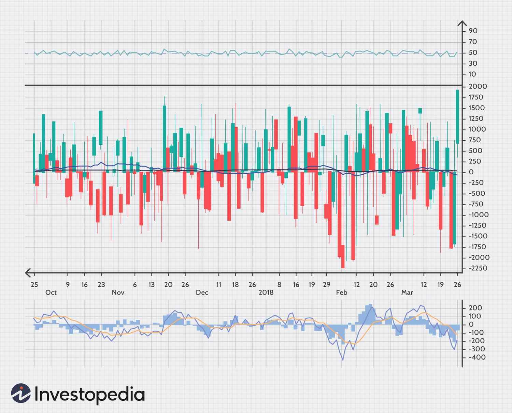

## Table of Contents

## What are market indicators?

Market indicators are tools that help people understand how the stock market or economy is doing. They give information about things like stock prices, how much people are buying and selling, and how the economy is growing. By looking at these indicators, investors and businesses can make better decisions about where to put their money or how to plan for the future.

There are many different types of market indicators. Some common ones include the stock market index, which shows how a group of stocks is performing, and economic indicators like unemployment rates and inflation. These indicators can tell us if the economy is doing well or if it might be heading into a tough time. By keeping an eye on these indicators, people can get a sense of what might happen next in the market or economy.

## What are the different types of market indicators?

Market indicators come in different types, and they help us understand what's happening in the stock market and the economy. One type is called a stock market index. This is like a big scoreboard that shows how a group of stocks is doing. For example, the Dow Jones Industrial Average and the S&P 500 are popular stock market indexes. They give us a quick look at whether the stock market is going up or down. Another type is called a technical indicator. These are tools that traders use to predict where stock prices might go next. They look at things like how fast prices are changing and how many people are buying or selling.

Economic indicators are another important type of market indicator. These tell us about the health of the whole economy, not just the stock market. Some common economic indicators are the unemployment rate, which shows how many people are out of work, and the inflation rate, which shows how much prices are going up. There are also indicators like Gross Domestic Product (GDP), which measures how much the economy is growing. By looking at these indicators, we can get a sense of whether the economy is doing well or if it might be heading into a tough time.

Sentiment indicators are also used to understand the market. These indicators measure how people feel about the market or the economy. For example, the Consumer Confidence Index shows how optimistic people are about their financial future. If people feel good, they might spend more money, which can help the economy grow. On the other hand, if people are worried, they might save their money instead of spending it. By keeping an eye on sentiment indicators, we can get a sense of what might happen next in the market or economy.

## How do market indicators help in analyzing the stock market?

Market indicators are like tools that help people understand what's going on in the stock market. They show us things like how stock prices are moving, how many people are buying and selling, and even how people feel about the market. By looking at these indicators, investors can make smarter choices about which stocks to buy or sell. For example, if a stock market index like the S&P 500 is going up, it might mean that the overall market is doing well, and it could be a good time to invest. On the other hand, if the index is going down, it might be a sign that the market is struggling, and it might be better to wait before making any big moves.

Economic indicators are another type of market indicator that can help us understand the stock market. These indicators tell us about the health of the whole economy, which can affect how stocks perform. For instance, if the unemployment rate is low and people are [earning](/wiki/earning-announcement) more money, they might spend more, which can help companies make more profits and boost their stock prices. On the flip side, if inflation is high and people are worried about their money, they might spend less, which can hurt companies and cause stock prices to drop. By keeping an eye on these economic indicators, investors can get a better sense of what might happen in the stock market and plan their investments accordingly.

## What is the difference between leading and lagging indicators?

Leading indicators are like early warning signals. They give us clues about what might happen in the economy or stock market before it actually happens. For example, if people are buying more houses, it could be a sign that the economy is about to grow because people feel confident about their future. Another leading indicator is how many new orders factories are getting. If factories are getting lots of new orders, it means businesses think they'll be able to sell more stuff soon. By watching these leading indicators, investors can try to get ahead of the game and make smart moves before everyone else.

Lagging indicators, on the other hand, tell us what has already happened in the economy or stock market. They're like looking in the rearview mirror. For instance, the unemployment rate is a lagging indicator because it goes down after the economy has already started to get better. Another example is the inflation rate, which shows how much prices have gone up over time. These indicators are useful because they help us understand the past and confirm if our guesses about the economy were right. But they don't help us predict the future as well as leading indicators do.

## Can you explain the concept of moving averages and their use as market indicators?

Moving averages are a type of market indicator that help people understand how stock prices are changing over time. They work by taking the average price of a stock over a certain number of days and plotting it on a chart. For example, a 50-day moving average would show the average price of a stock over the last 50 days. This helps smooth out the ups and downs of daily price changes, making it easier to see the overall trend. There are different types of moving averages, like the simple moving average (SMA) and the exponential moving average (EMA), but they all do the same basic thing: show the average price over time.

People use moving averages to make decisions about buying and selling stocks. If a stock's price is above its moving average, it might mean the stock is doing well and could keep going up. On the other hand, if the price is below the moving average, it might be a sign that the stock is struggling and could go down even more. Traders often look at where the short-term moving average (like a 50-day average) crosses the long-term moving average (like a 200-day average). If the short-term average goes above the long-term average, it's called a "golden cross" and can be a good sign to buy. If it goes below, it's called a "death cross" and might be a signal to sell. By using moving averages, investors can get a clearer picture of what's happening in the market and make better choices.

## How do volume indicators work and what insights can they provide?

Volume indicators help us understand how many people are buying and selling a stock. They show the total number of shares traded during a certain time, like a day or a week. When lots of people are trading a stock, we say the volume is high. When not many people are trading, the volume is low. By looking at volume, we can see if there's a lot of interest in a stock or if people are not paying much attention to it.

Volume indicators can give us important clues about what might happen next with a stock. If the price of a stock goes up and the volume is high, it might mean that many people believe the stock will keep going up, so it's a strong signal. On the other hand, if the price goes up but the volume is low, it might mean that not many people are buying, so the price might not keep going up for long. Volume can also help us spot when a stock might be about to change direction. If a stock's price has been going down but suddenly the volume gets very high, it could be a sign that the stock is about to start going up again. By watching volume, we can get a better idea of what's really happening with a stock.

## What are some popular momentum indicators and how are they applied?

Momentum indicators help us see how fast a stock's price is changing. They tell us if a stock is moving quickly or slowly, which can give us clues about what might happen next. Some popular momentum indicators are the Relative Strength Index (RSI), the Moving Average Convergence Divergence (MACD), and the Stochastic Oscillator. These indicators look at the stock's price over time and compare it to its past prices to see if it's gaining or losing momentum.

The Relative Strength Index, or RSI, measures how fast a stock's price is going up or down on a scale from 0 to 100. If the RSI is over 70, it means the stock might be overbought and could go down soon. If it's under 30, the stock might be oversold and could go up. The MACD shows the difference between two moving averages of a stock's price. When the MACD line crosses above the signal line, it's a sign that the stock might keep going up. When it crosses below, it might be time to sell. The Stochastic Oscillator compares a stock's closing price to its price range over a certain time. If it's above 80, the stock might be overbought, and if it's below 20, it might be oversold.

By using these momentum indicators, investors can get a better sense of whether a stock's price is likely to keep moving in the same direction or if it might change soon. They help us make smarter decisions about when to buy or sell a stock based on how fast its price is changing.

## How can volatility indicators be used to assess market risk?

Volatility indicators help us understand how much a stock's price might go up or down. They show us if a stock is calm or if it's jumping around a lot. One popular [volatility](/wiki/volatility-trading-strategies) indicator is the Average True Range (ATR). It measures how much a stock's price moves over a certain time, like 14 days. If the ATR is high, it means the stock's price is moving a lot, so it might be riskier to invest in. If the ATR is low, the stock's price isn't moving much, so it might be less risky.

Another important volatility indicator is the Bollinger Bands. They show us a stock's price along with two lines that are usually set two standard deviations away from a moving average. When the price moves close to the upper band, it might mean the stock is getting too expensive and could go down soon. When it's near the lower band, the stock might be getting too cheap and could go up. By looking at these indicators, investors can get a better idea of how risky a stock might be and make smarter choices about when to buy or sell.

## What role do sentiment indicators play in market analysis?

Sentiment indicators help us understand how people feel about the stock market or the economy. They show if people are feeling happy and confident or worried and scared. For example, the Consumer Confidence Index tells us how people feel about their financial future. If people feel good, they might spend more money, which can help the economy grow. On the other hand, if people are worried, they might save their money instead of spending it. By looking at sentiment indicators, investors can get a sense of what might happen next in the market or economy.

Sentiment indicators can also help investors make better choices about buying and selling stocks. If a sentiment indicator shows that people are very optimistic, it might be a good time to invest because the market could go up. But if the indicator shows that people are very pessimistic, it might be better to wait or even sell some stocks because the market could go down. By keeping an eye on how people feel, investors can use sentiment indicators to predict what might happen and make smarter decisions.

## How do economic indicators influence market trends and investment decisions?

Economic indicators give us important information about how the whole economy is doing. They tell us things like how many people have jobs, how much prices are going up, and how fast the economy is growing. When these indicators are good, like when lots of people have jobs and prices aren't going up too fast, it can make investors feel confident. They might think the economy is doing well, so they decide to buy more stocks. On the other hand, if economic indicators are bad, like if many people are out of work or prices are going up a lot, investors might feel worried. They might decide to sell their stocks or wait to invest until things get better.

These economic indicators can really change what happens in the stock market. For example, if a report comes out saying that the economy grew a lot last quarter, stock prices might go up because people are happy about the news. But if a report says that more people lost their jobs, stock prices might go down because people are worried about the future. By keeping an eye on these indicators, investors can try to guess what might happen next in the market and make smart choices about when to buy or sell their stocks.

## What advanced techniques can be used to combine multiple market indicators for more accurate predictions?

Combining multiple market indicators can help investors make more accurate predictions about the stock market. One way to do this is by using a method called technical analysis, where investors look at different indicators like moving averages, volume, and momentum to see if they all point in the same direction. For example, if the stock's price is above its moving average, the volume is high, and the RSI shows the stock is not overbought, it might be a good time to buy. By looking at several indicators together, investors can get a clearer picture of what might happen next and feel more confident in their decisions.

Another advanced technique is using a system called [algorithmic trading](/wiki/algorithmic-trading), where computers use a set of rules to decide when to buy or sell stocks based on multiple indicators. These rules can include things like how the stock's price compares to its moving averages, the level of volume, and sentiment indicators. The computer can quickly analyze all this information and make trades much faster than a person could. This can help investors take advantage of small changes in the market and make more accurate predictions about where stock prices are headed.

## How can one evaluate the effectiveness of different market indicators in various market conditions?

To evaluate how well different market indicators work in different market situations, you need to look at their performance over time. This means checking how often the indicators gave correct signals about what would happen next in the market. For example, if a moving average crossover often predicted when a stock's price would go up, it would be considered effective. You can also compare the results of using one indicator versus another. If the Relative Strength Index (RSI) gives better signals than the Moving Average Convergence Divergence (MACD) during a bull market, then the RSI might be more useful in those conditions. By keeping track of these results, you can see which indicators work best in different situations.

Another way to evaluate market indicators is by testing them in different market conditions like bull markets, bear markets, and times when the market is not moving much. In a bull market, where prices are going up, some indicators like momentum indicators might work better because they can catch the upward trend. In a bear market, where prices are going down, indicators that show when a stock is oversold might be more helpful. By using historical data, you can see how well each indicator performed in past market conditions. This helps you understand which indicators to trust more in the future, depending on what the market is doing at the time.

## Is Financial Analysis a Critical Element?

Financial analysis is a cornerstone of investment decision-making, encompassing the evaluation of businesses, projects, budgets, and finance-related transactions to gauge their performance and suitability. This process is pivotal as it provides investors with a structured approach to determining potential investment value and risks. Two primary methodologies within financial analysis are [fundamental analysis](/wiki/fundamental-analysis) and technical analysis, each offering unique insights and approaches to investment.

**Fundamental Analysis**

Fundamental analysis involves studying financial statements, industry trends, and economic conditions to assess an asset's intrinsic value. The goal is to determine whether a security is overvalued or undervalued by the market. This involves a detailed examination of factors such as revenue, earnings, growth prospects, management, and competitive advantages. Key components of fundamental analysis include:

1. **Financial Statements**: Analysts scrutinize balance sheets, income statements, and cash flow statements to gather insights into a company's financial health. Metrics such as Price-to-Earnings (P/E) ratio, Return on Equity (ROE), and EBITDA are commonly used to evaluate performance.

2. **Economic Indicators**: Analysts consider broader economic factors—such as GDP growth rates, unemployment rates, and inflation trends—that could impact a company's performance or sector health.

3. **Industry Analysis**: Understanding industry dynamics, including competition, market demand, and technological disruptions, helps assess a company’s potential to operate successfully in its environment.

Fundamental analysis is a long-term strategy, often used by value investors to find companies with solid growth prospects or those trading below their intrinsic value.

**Technical Analysis**

Conversely, technical analysis focuses on statistical trends derived from historical market data, primarily price and [volume](/wiki/volume-trading-strategy). This approach does not consider the intrinsic value of an asset but instead examines patterns to predict future price movements. Key aspects include:

1. **Price Patterns**: Analysts identify chart patterns such as head and shoulders, triangles, and flags that may indicate potential reversals or continuations in price trends.

2. **Indicators and Oscillators**: Tools like Moving Averages, Relative Strength Index (RSI), and Bollinger Bands are used to analyze trends and momentum. For instance, a simple moving average (SMA) is calculated as:
$$
   \text{SMA} = \frac{\sum_{i=1}^{n} P_i}{n}

$$

   where $P_i$ is the price at day $i$, and $n$ is the number of days.

3. **Support and Resistance Levels**: Analysts identify price levels at which an asset tends to stop and reverse, providing signals for entry or exit points.

Technical analysis is typically favored by traders who aim for short-term gains, exploiting market inefficiencies.

**Integrating Both Approaches**

Investors may benefit from combining both fundamental and technical analysis to form a comprehensive investment strategy. Fundamental analysis provides the foundation for understanding an asset's value, while technical analysis offers timing strategies to optimize entry and [exit](/wiki/exit-strategy) points. This hybrid approach can mitigate risks associated with either method when used in isolation. Financial analysis tools, therefore, play an essential role in crafting informed, balanced, and successful investment decisions.

## How can we interpret market movements using market indicators?

Market indicators are vital quantitative tools employed to forecast stock market trends, offering investors a lens through which they can interpret market movements. Understanding these indicators is crucial for devising effective trading and investment strategies.

**Market Breadth**

Market Breadth is a measure of the overall market's health. It reflects the volume of stocks advancing relative to those declining. The premise is that broad market movements tend to reflect the underlying health of the majority of stocks. A common method to calculate market breadth is through the Advance/Decline (A/D) line.

The Advance/Decline Line is calculated as follows:

$$
\text{A/D Line} = \sum (\text{Number of Advancing Stocks} - \text{Number of Declining Stocks})
$$

A rising A/D line indicates more stocks are advancing, suggesting a bullish market trend, while a falling line suggests a bearish trend.

**Market Sentiment**

Market Sentiment reflects the overall attitude of investors towards the market. It is often seen as a contrarian indicator, meaning that extreme bullish or bearish sentiments can signal a market reversal. Popular sentiment indicators include the CBOE Volatility Index (VIX) and put/call ratios. Investors use these indicators to gauge whether the market is reaching an emotional extreme, thereby identifying potential reversals.

**Advance-Decline Line**

The Advance-Decline Line, as discussed, is not only a component of market breadth but also a standalone indicator. It provides insights into the cumulative daily difference between advancing and declining stocks. The line helps investors understand whether a broad range of stocks is participating in a market movement, which can either confirm or contradict the direction of major indices.

**Guiding Trading and Investment Strategies**

These market indicators play an instrumental role in guiding trading and investment strategies. By analyzing the A/D line, for instance, investors can confirm the strength of market trends. If major indices are rallying but the A/D line is declining, it may signal a lack of broad market participation and a potential market top.

Market Sentiment indicators allow traders to capitalize on extreme investor emotions. For example, if the VIX reaches excessively high levels, indicating fear, it might present a buying opportunity as the market may be nearing a bottom.

By integrating these indicators into their analysis, investors can better interpret the nuances of market dynamics and enhance their strategic decision-making processes.

## What are the popular technical indicators used in algo trading?

Technical indicators are essential for identifying trends, [momentum](/wiki/momentum), and potential trading opportunities in algorithmic trading. Among these, Moving Averages and the Relative Strength Index (RSI) are two of the most extensively utilized indicators.

### Moving Averages

Moving Averages are used to smooth price data, creating a trend-following indicator. They help traders identify the direction of a trend and potential reversal points. The two most common types of Moving Averages are:

- **Simple Moving Average (SMA):** Calculated by summing up the prices over a specific period and dividing by the number of periods. The formula for an n-day SMA is:
$$
  \text{SMA}_n = \frac{P_1 + P_2 + \ldots + P_n}{n}

$$

  where $P$ represents price over n periods.

- **Exponential Moving Average (EMA):** Gives more weight to recent prices, making it more responsive to new information than the SMA. It is calculated using:
$$
  \text{EMA}_t = \alpha \cdot P_t + (1-\alpha) \cdot \text{EMA}_{t-1}

$$

  where $\alpha = \frac{2}{n+1}$, $P_t$ is the current price, and $\text{EMA}_{t-1}$ is the EMA of the previous day.

Moving Averages can signal buying or selling opportunities. For example, when the short-term MA crosses above a long-term MA, it might indicate a buying opportunity, known as a "Golden Cross." Conversely, a "Death Cross" occurs when the short-term MA crosses below the long-term MA, potentially signaling a sell.

### Relative Strength Index (RSI)

The Relative Strength Index is a momentum oscillator that measures the speed and change of price movements. RSI values range from 0 to 100, and it is used to identify overbought or oversold conditions in a market. The standard calculation for a 14-day RSI is:

1. Calculate the average gain and average loss over the last 14 periods.
2. Compute the Relative Strength (RS): $\text{RS} = \frac{\text{Average Gain}}{\text{Average Loss}}$.
3. Calculate the RSI: 
$$
   \text{RSI} = 100 - \left(\frac{100}{1 + \text{RS}}\right)

$$

An RSI above 70 typically indicates that a security may be overbought, suggesting a potential sell opportunity, while an RSI below 30 indicates an oversold condition and suggests a buy opportunity.

### Application in Algorithmic Trading

In algorithmic trading, these indicators can be integrated into strategies using programming languages such as Python. Here is an example of how one might calculate and plot a moving average crossover strategy using Python's `pandas` and `matplotlib` libraries:

```python
import pandas as pd
import matplotlib.pyplot as plt

# Load data into DataFrame
data = pd.read_csv('market_data.csv', index_col='Date', parse_dates=True)

# Calculate Moving Averages
data['SMA_50'] = data['Close'].rolling(window=50).mean()
data['SMA_200'] = data['Close'].rolling(window=200).mean()

# Plotting
plt.figure(figsize=(14,7))
plt.plot(data['Close'], label='Price')
plt.plot(data['SMA_50'], label='50-Day SMA', color='orange')
plt.plot(data['SMA_200'], label='200-Day SMA', color='purple')
plt.title('Moving Average Crossover')
plt.legend()
plt.show()
```

This script calculates the 50-day and 200-day SMAs for a given dataset, helping to identify crossover points that might signal trading opportunities.

In summary, Moving Averages and RSI are vital technical indicators in algo trading. By providing insights into trends and market conditions, they assist traders in making informed decisions. Understanding and utilizing these indicators can significantly enhance an algorithmic trading strategy.

## References & Further Reading

[1]: Bergstra, J., Bardenet, R., Bengio, Y., & Kégl, B. (2011). ["Algorithms for Hyper-Parameter Optimization."](https://dl.acm.org/doi/10.5555/2986459.2986743) Advances in Neural Information Processing Systems 24.

[2]: ["Advances in Financial Machine Learning"](https://www.amazon.com/Advances-Financial-Machine-Learning-Marcos/dp/1119482089) by Marcos Lopez de Prado

[3]: ["Evidence-Based Technical Analysis: Applying the Scientific Method and Statistical Inference to Trading Signals"](https://www.amazon.com/Evidence-Based-Technical-Analysis-Scientific-Statistical/dp/0470008741) by David Aronson

[4]: ["Machine Learning for Algorithmic Trading"](https://github.com/stefan-jansen/machine-learning-for-trading) by Stefan Jansen

[5]: ["Quantitative Trading: How to Build Your Own Algorithmic Trading Business"](https://www.amazon.com/Quantitative-Trading-Build-Algorithmic-Business/dp/1119800064) by Ernest P. Chan