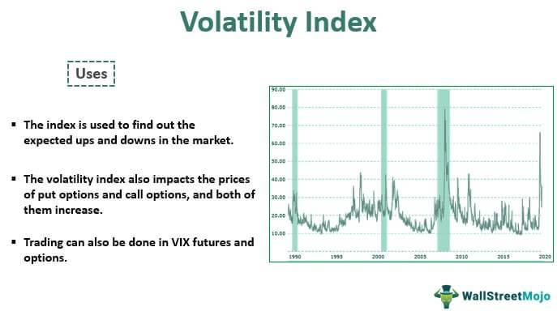

The financial markets are constantly influenced by various indicators that reflect economic and market conditions. Investors and traders seek to navigate these markets by analyzing factors that affect price movements and volatility. Volatility, often perceived as a measure of risk, is a key element in understanding market dynamics. It signifies the extent of fluctuations in the price of assets and can be influenced by numerous factors, such as economic data releases, geopolitical events, and changes in market sentiment.

Economic indicators provide essential information about the overall health and direction of an economy. Metrics such as Gross Domestic Product (GDP), unemployment rates, and inflation figures serve as barometers for economic activity and can substantially impact market expectations and investor behavior. Similarly, market indicators specifically designed to gauge volatility, including the Volatility Index (VIX), play a crucial role in assessing the current state of the markets and potential future movements.



Algorithmic trading, which relies on sophisticated computer algorithms to execute trades, has grown increasingly prevalent in recent years. These algorithms can process large datasets and execute orders at speeds impossible for human traders. In volatile markets, algorithmic strategies become particularly relevant, as they are able to quickly adapt to changing conditions and capitalize on short-term trends and anomalies.

Understanding the interplay of volatility, economic indicators, market metrics, and algorithmic trading is pivotal for traders and investors. By gaining insights into these elements, market participants can better position themselves to make informed decisions, manage risks effectively, and exploit opportunities in turbulent market environments.

## Table of Contents

## Understanding Market Volatility

Volatility refers to the degree of variation in the price of financial instruments over time. It is a statistical measure that quantifies the dispersion of returns for a given security or market index. In simple terms, volatility illustrates how much the price of an asset or market index fluctuates over a specific period.

In financial markets, volatility is synonymous with risk. It represents the uncertainty associated with the magnitude of changes in a security's value over time. High volatility indicates that the price of a security can change dramatically over a short time period in either direction, while low volatility suggests that the price does not fluctuate as dramatically and tends to be more stable. This characteristic makes volatility a critical component of risk management and investment strategy.

Investors and traders often use different methods to measure [volatility](/wiki/volatility-trading-strategies). One common approach is using the standard deviation of returns, which provides a numerical representation of the [dispersion](/wiki/dispersion-trading) of return data. A higher standard deviation indicates a higher volatility or risk.

Mathematically, volatility can be represented as:

$$
\sigma = \sqrt{\frac{\sum (R_i - \bar{R})^2}{N}}
$$

where:
- $\sigma$ is the standard deviation (volatility),
- $R_i$ is the return for period $i$,
- $\bar{R}$ is the average return,
- $N$ is the number of data points.

High volatility in markets can present both opportunities and risks for traders and investors. For traders, particularly those engaged in [day trading](/wiki/day-trading-spy) or similar strategies, high volatility opens up opportunities to profit from rapid price changes. Within short time frames, traders can leverage high volatility to achieve significant gains, assuming they accurately predict market movements. However, the same conditions pose considerable risks, as the potential for losses is equally amplified.

For long-term investors, high volatility might cause concern as it introduces greater uncertainty regarding the asset's future value. However, some investors perceive market volatility as a chance to buy undervalued stocks or enter positions at attractive price levels.

Ultimately, understanding market volatility is crucial for both traders and investors as they navigate the inherent risks and opportunities within dynamic markets. By incorporating volatility into their strategies and risk assessments, market participants can make more informed decisions that align with their investment goals and risk tolerance.

## Key Economic Indicators

Economic indicators are pivotal in understanding and evaluating market conditions, acting as signals that reflect the broader health of an economy. Among the most critical indicators are Gross Domestic Product (GDP), unemployment rates, and inflation figures. 

**Gross Domestic Product (GDP):** GDP represents the total monetary value of all finished goods and services produced within a country's borders in a specific time period. It is a comprehensive measure of a nation’s overall economic activity and an indicator of its economic health. A rising GDP often suggests a growing economy, potentially leading to bullish market sentiments, whereas a falling GDP might indicate economic contraction and bearish market conditions. The formula to calculate GDP can be expressed as:

$$
GDP = C + I + G + (X - M)
$$

where $C$ is consumption, $I$ is investment, $G$ is government spending, and $(X - M)$ is net exports (exports minus imports).

**Unemployment Rates:** This indicator measures the percentage of the total workforce that is unemployed and actively seeking employment. High unemployment rates suggest economic distress, which can increase market volatility as investors anticipate potential decreases in consumer spending and business earnings. Conversely, low unemployment rates often correlate with economic growth and stability, which can result in reduced market volatility.

**Inflation Figures:** Inflation refers to the rate at which the general level of prices for goods and services is rising, leading to a decrease in purchasing power. Moderate inflation is normal in a growing economy; however, high inflation can erode purchasing power and savings, potentially increasing market volatility as investors adjust their portfolios to hedge against inflation risks. The Consumer Price Index (CPI) and the Producer Price Index (PPI) are commonly used to measure inflation.

Traders and investors closely monitor these economic indicators to anticipate potential market movements and to adjust their strategies. For example, unexpected changes in GDP or inflation figures can lead to rapid adjustments in financial markets as participants recalibrate their expectations. By understanding these indicators, market participants can make more informed decisions, helping them to mitigate risks and capitalize on opportunities in fluctuating market environments.

## Market Indicators Reflecting Volatility

Several market indicators are utilized to assess and interpret volatility, providing valuable insights for traders and investors. Among these, the Volatility Index (VIX), Average True Range (ATR), and Bollinger Bands® are prominently recognized for their effectiveness in evaluating market conditions.

The **VIX**, also known as the fear index, calculates market expectations of near-term volatility based on S&P 500 Index options. Specifically, it measures the market's expectation of 30-day forward-looking volatility, deriving its value from the price of options. High VIX values typically indicate increased anticipation of volatility in the market, which often correlates with heightened investor uncertainty or fear. Conversely, a low VIX value suggests a period of tranquility, with lower expected volatility. As a barometer of market risk, the VIX is an essential tool for assessing investor sentiment and market dynamics.

The **Average True Range (ATR)** is another critical indicator that assists in gauging market volatility. Developed by J. Welles Wilder, Jr., it calculates the average range over a specified period, typically using the data from the high, low, and close prices of previous trading days. The ATR formula is:

$$
\text{ATR} = \frac{\sum_{i=1}^{n} \text{TR}_i}{n}
$$

where TR (True Range) is the greatest of the current high minus the current low, the absolute value of the current high minus the previous close, and the absolute value of the current low minus the previous close. The ATR is particularly beneficial for determining the degree of price movement and the likelihood of price breakouts or trend reversals.

**Bollinger Bands®**, introduced by John Bollinger, consist of a set of trendlines plotted typically two standard deviations away from a simple moving average (SMA) of a security's price, which can be adjusted based on user preferences. The bands expand and contract in response to market volatility; when the bands widen, it indicates increased volatility, while narrowing bands indicate decreased volatility. Bollinger Bands® provide traders with a visual representation of volatility within different market conditions and can signal potential entry or exit points when prices touch the bands' extremes.

Collectively, these indicators empower traders by not only enhancing their understanding of current market volatility but also by aiding in the identification of trading opportunities. Each indicator offers unique insights, and when used in conjunction with one another, they provide a robust framework for managing risks and optimizing trading strategies.

## Algo Trading in Volatile Markets

Algorithmic trading utilizes sophisticated computer algorithms to execute trades with high speed and precision. These algorithms are designed to analyze large datasets, identify signals, and make trading decisions with minimal human intervention. In the context of volatile markets, [algorithmic trading](/wiki/algorithmic-trading) strategies such as [trend following](/wiki/trend-following) and mean reversion are particularly advantageous.

Trend following strategies involve identifying and adhering to the direction of significant price movements. Algorithms programmed with trend following logic can quickly recognize patterns and execute trades that align with the prevailing market trend. This method leverages the [momentum](/wiki/momentum) of price movements, allowing traders to capitalize on sustained market directions.

Conversely, mean reversion strategies are predicated on the hypothesis that asset prices will return to their historical averages over time. In volatile markets, pronounced price swings often present opportunities for mean reversion, as prices that deviate significantly from their norms tend to revert. Algorithms utilizing mean reversion principles continually assess price deviations, enabling the execution of trades that exploit these reversion opportunities.

To enhance decision-making, these algorithms integrate a variety of technical indicators. Commonly used indicators such as Moving Averages (MA), Relative Strength Index (RSI), and Moving Average Convergence Divergence (MACD) inform algorithms about current market conditions, aiding in the identification of potential trading opportunities. For example, an algorithm might incorporate the RSI to determine overbought or oversold conditions, thus timing entry and [exit](/wiki/exit-strategy) points more effectively.

In Python, a simple example of a mean reversion strategy using the RSI might involve:

```python
import talib
import numpy as np

# Assuming 'close_prices' is a NumPy array of historical closing prices for an asset
rsi_period = 14
rsi = talib.RSI(close_prices, timeperiod=rsi_period)

for i in range(rsi_period, len(rsi)):
    if rsi[i] > 70:        # Overbought condition
        print("Sell signal at price: ", close_prices[i])
    elif rsi[i] < 30:      # Oversold condition
        print("Buy signal at price: ", close_prices[i])
```

Algorithmic trading in volatile markets also benefits from leveraging high-frequency trading ([HFT](/wiki/high-frequency-trading-strategies)) techniques, which allow for the rapid execution of a large number of trades over short time frames. This is particularly advantageous in volatile markets where price movements can be swift and significant.

In summary, algorithmic trading strategies such as trend following and mean reversion utilize technical indicators to respond effectively to fluctuating market conditions. By integrating these strategies into their systems, traders can improve execution speed, optimize trade outcomes, and effectively manage risks associated with market volatility.

## Volatility-Based Trading Strategies

Trend following strategies focus on identifying and aligning with significant price movements in one direction. These strategies are built on the notion that once a price establishes a trend, it is likely to continue in that direction for a certain period. Traders use various technical indicators to spot and confirm these trends, such as moving averages and the Average Directional Index (ADX). Moving averages, particularly the exponential moving average (EMA), help smooth out price data, giving traders a clearer view of the market trend. The ADX, with its ability to quantify trend strength, allows traders to distinguish between strong and weak trends, guiding them in making informed trading decisions.

Mean reversion strategies, on the other hand, rely on the principle that asset prices and historical returns will eventually revert to their long-term mean or average. This strategy capitalizes on the statistical identification of overbought or oversold conditions, often using indicators like the Relative Strength Index (RSI) or Bollinger Bands. The RSI helps identify potential reversal points by indicating when an asset might be oversold (when RSI is below 30) or overbought (when RSI is above 70). Bollinger Bands utilize standard deviation around a moving average to signal price deviations and potential reversion points.

Volatility-based indicators are crucial for developing strategies responsive to market fluctuations. Tools such as the Average True Range (ATR) and Bollinger Bands are instrumental. ATR measures market volatility by calculating the average range between the highest and lowest prices over a given period, providing traders with insights into market momentum. Python can be used to calculate ATR, for example:

```python
import pandas as pd

def calculate_atr(data, period=14):
    data['High-Low'] = data['High'] - data['Low']
    data['High-Close'] = abs(data['High'] - data['Close'].shift())
    data['Low-Close'] = abs(data['Low'] - data['Close'].shift())
    tr = data[['High-Low', 'High-Close', 'Low-Close']].max(axis=1)
    atr = tr.rolling(window=period).mean()
    return atr

# Example usage:
# data = pd.DataFrame({'High': ..., 'Low': ..., 'Close': ...})
# atr_values = calculate_atr(data)
```

Bollinger Bands are another essential tool, enabling traders to visualize overbought or oversold conditions through their upper and lower bands, which are standard deviations away from a moving average. When asset prices touch or breach these bands, it signals potential opportunities for entering or exiting trades based on the anticipated price reversion.

By integrating these volatility-based tools and indicators, traders can construct and refine their strategies to better navigate the complexities of market volatility and enhance their chances of making profitable trades.

## Conclusion

Market volatility, economic indicators, and algorithmic trading form the foundation of modern financial markets, each playing a pivotal role in influencing trading activities and outcomes. Recognizing the dynamics among these elements is crucial for enhancing trading performance and managing risk effectively.

Market volatility represents the degree to which the price of a financial instrument fluctuates over time. This inherent feature of financial markets reflects both opportunity and risk. Identifying and responding to volatility can lead to profitable trading opportunities, while simultaneously requiring robust risk management strategies to mitigate potential losses.

Economic indicators, such as gross domestic product (GDP), unemployment rates, and inflation figures, offer insights into the health and trajectory of an economy. These indicators heavily influence market volatility by shaping investor expectations and driving market sentiment. Traders who adopt a deep understanding of these economic signals can better anticipate market trends and adjust their strategies to align with evolving conditions.

Algorithmic trading leverages computational algorithms to execute trades, often at speeds and efficiencies that surpass human capabilities. In volatile markets, algorithmic strategies, such as trend following and mean reversion, can be highly effective. Algorithms utilize technical indicators and adapt to changing market conditions to exploit trading opportunities that would be difficult for manual trading to capture.

By integrating knowledge of market volatility, economic indicators, and algorithmic trading, investors and traders can enhance their ability to navigate complex market landscapes. Embracing technological advancements in trading, such as [machine learning](/wiki/machine-learning) and [artificial intelligence](/wiki/ai-artificial-intelligence), further augments their capacity to devise sophisticated strategies and refine risk management practices.

In conclusion, a comprehensive understanding and strategic engagement with these components can substantially improve trading outcomes. Investors and traders are encouraged to continually adapt to market changes and leverage technologies that offer a competitive edge in the dynamic environment of financial markets.

## References & Further Reading

[1]: Hull, J. C. (2015). ["Options, Futures, and Other Derivatives."](https://edisciplinas.usp.br/pluginfile.php/5278790/mod_resource/content/1/Hull%20J.C.-Options%2C%20Futures%20and%20Other%20Derivatives_9th%20edition.pdf) Pearson.

[2]: Lopez de Prado, M. (2018). ["Advances in Financial Machine Learning."](https://www.amazon.com/Advances-Financial-Machine-Learning-Marcos/dp/1119482089) Wiley.

[3]: Chan, E. P. (2009). ["Quantitative Trading: How to Build Your Own Algorithmic Trading Business."](https://github.com/ftvision/quant_trading_echan_book) Wiley.

[4]: Bollinger, J. (2001). ["Bollinger on Bollinger Bands."](https://www.amazon.com/Bollinger-Bands-John/dp/0071373683) McGraw-Hill.

[5]: Jansen, S. (2020). ["Machine Learning for Algorithmic Trading."](https://github.com/stefan-jansen/machine-learning-for-trading) Packt Publishing.

[6]: Aronson, D. R. (2006). ["Evidence-Based Technical Analysis: Applying the Scientific Method and Statistical Inference to Trading Signals."](https://www.amazon.com/Evidence-Based-Technical-Analysis-Scientific-Statistical/dp/0470008741) Wiley.

[7]: Schwert, G. W. (1989). ["Why Does Stock Market Volatility Change Over Time?"](https://onlinelibrary.wiley.com/doi/full/10.1111/j.1540-6261.1989.tb02647.x) The Journal of Finance, 44(5), 1115-1153.