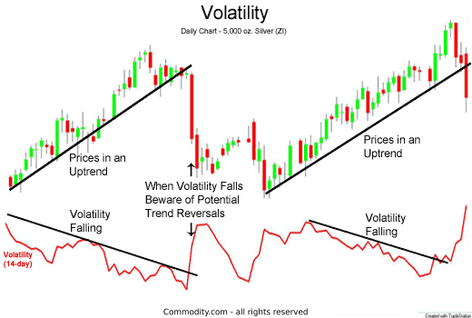

## Table of Contents

## What is market volatility and why is it important?

Market volatility refers to how much and how quickly the prices of stocks or other financial assets change over time. It's like the ups and downs you see in a roller coaster. When the market is volatile, prices can go up and down a lot in a short time. When it's not volatile, prices change more slowly and steadily.

Understanding market volatility is important because it affects how people invest their money. If you know the market is likely to be volatile, you might choose safer investments to avoid big losses. On the other hand, if you're okay with taking risks, you might see volatility as a chance to make more money. Knowing about volatility helps investors make smarter choices and manage their money better.

## What are market indicators and how do they relate to volatility?

Market indicators are tools that help people understand what's happening in the stock market. They give us clues about whether the market might go up or down. Some common market indicators include the stock market index, like the S&P 500, which shows how a group of stocks is doing overall. Other indicators might look at things like how many stocks are being bought and sold, or how much fear or greed people are feeling about the market.

These indicators are closely tied to market volatility. When market indicators show big changes or swings, it often means the market is volatile. For example, if the S&P 500 goes up and down a lot in a short time, that's a sign of high volatility. On the other hand, if the indicators show steady, small changes, the market is likely less volatile. By watching these indicators, investors can get a sense of how risky the market might be and make better decisions about when to buy or sell.

## Can you explain the VIX index and its role in measuring market volatility?

The VIX index, often called the "fear index," is a tool that measures how much people expect the stock market to move around in the next 30 days. It's like a thermometer for the market's nervousness. The VIX looks at the prices of options, which are contracts that let people buy or sell stocks at certain prices in the future. If these option prices go up, it means people are willing to pay more to protect themselves from big swings in the market, so the VIX goes up too.

When the VIX is high, it means people think the market will be very volatile soon. This could be because of big news or events that might shake things up. On the other hand, when the VIX is low, it means people expect the market to be calm and not change much. Investors watch the VIX to help them decide if they should be careful or if it's a good time to take risks with their money.

## What are some common volatility indicators used by traders and investors?

Traders and investors use several common volatility indicators to help them understand how much the market might move. One popular indicator is the Average True Range (ATR), which shows how much a stock's price has moved over a certain time. A higher ATR means the stock has been more volatile, and a lower ATR means it's been less volatile. Another common indicator is Bollinger Bands, which are lines drawn above and below a stock's price. When the bands are far apart, it means the stock is more volatile, and when they're close together, it means the stock is less volatile.

Another useful indicator is the Standard Deviation, which measures how much a stock's price varies from its average price. If the standard deviation is high, the stock is more volatile, and if it's low, the stock is less volatile. The VIX index, also known as the "fear index," is another key volatility indicator. It shows how much people expect the stock market to move in the next 30 days. A high VIX means people expect more volatility, and a low VIX means they expect less.

These indicators help traders and investors make better decisions about when to buy or sell stocks. By keeping an eye on these volatility measures, they can understand the market's mood and adjust their strategies accordingly. Whether it's using ATR to see how much a stock has moved recently, Bollinger Bands to see if a stock is getting more or less volatile, or the VIX to gauge overall market nervousness, these tools are essential for anyone trying to navigate the ups and downs of the stock market.

## How does the Bollinger Bands indicator help in assessing market volatility?

Bollinger Bands are a great tool for figuring out how much a stock's price might move around. They are made up of three lines: a middle line which is the average price of the stock over a certain time, and two outer lines that show how much the price can go up or down from that average. The space between these lines changes based on how much the stock's price has been moving. If the stock's price has been jumping around a lot, the bands will be far apart, showing that the stock is more volatile. If the price has been pretty steady, the bands will be closer together, showing less volatility.

Traders and investors use Bollinger Bands to see when a stock might be about to make a big move. When the bands are far apart, it means the stock has been volatile and might keep moving a lot. When the bands are close together, it means the stock has been calm, but it might be getting ready for a big move soon. By watching how the bands change, people can get a good idea of whether the market is likely to be calm or wild, and they can make smarter choices about when to buy or sell their stocks.

## What is the Average True Range (ATR) and how is it used to gauge volatility?

The Average True Range (ATR) is a tool that helps people see how much a stock's price has been moving around. It's like a measure of how jumpy or calm a stock has been over a certain time. The ATR looks at the biggest difference between a stock's high and low prices each day, and then takes an average of those differences over a set number of days, usually 14. If the ATR number is big, it means the stock has been moving a lot, so it's more volatile. If the ATR number is small, it means the stock hasn't been moving much, so it's less volatile.

Traders and investors use the ATR to understand how risky a stock might be. If they see a high ATR, they know the stock could keep moving a lot, so they might be more careful or look for chances to make money from those big moves. If they see a low ATR, they might think the stock is safer, but they also know that a big move could be coming soon. By watching the ATR, people can make better choices about when to buy or sell stocks, based on how much they're okay with the stock's price jumping around.

## How can the Relative Volatility Index (RVI) assist in understanding market movements?

The Relative Volatility Index (RVI) is a tool that helps people see if a stock might go up or down soon. It looks at how much a stock's price has been moving around compared to its average price over a certain time, usually 14 days. If the RVI is high, it means the stock has been moving a lot and might keep going up. If the RVI is low, it means the stock hasn't been moving much and might start going down.

Traders and investors use the RVI to make better guesses about what a stock will do next. By watching the RVI, they can see when a stock is getting ready to make a big move. If the RVI starts going up when the stock's price is going up too, it's a good sign that the stock might keep going up. But if the RVI starts going down while the stock's price is still going up, it might be a warning that the stock's price could start going down soon. This helps people decide when to buy or sell a stock based on how much it's been moving around.

## What role does the CBOE Skew Index play in predicting extreme market movements?

The CBOE Skew Index, often just called the Skew Index, is a tool that helps people see if the stock market might have a big, sudden move soon. It looks at how much people are willing to pay for options that protect them from really big price drops. If the Skew Index is high, it means people are worried about the market having a big, scary drop. They're buying more protection because they're scared of losing a lot of money fast.

Traders and investors use the Skew Index to get ready for big market moves. If the Skew Index is high, they might decide to be more careful with their money or buy more protection for their investments. By watching the Skew Index, they can try to guess when the market might have a big, wild swing and make smarter choices about what to do with their money.

## How do implied volatility and historical volatility differ, and why does it matter?

Implied volatility and historical volatility are two ways to measure how much a stock's price might move around. Implied volatility is what people think will happen in the future. It's like a guess about how much a stock's price might jump around based on what people are willing to pay for options right now. If people are willing to pay a lot for options, it means they think the stock's price might move a lot, so the implied volatility is high. Historical volatility, on the other hand, looks at what has already happened. It measures how much a stock's price has actually moved around in the past. If a stock's price has been jumping around a lot, the historical volatility is high.

It matters because these two types of volatility help people make different kinds of decisions. Implied volatility can tell you what the market thinks might happen soon, so it's useful for planning what to do next. If the implied volatility is high, you might want to be careful or buy protection for your investments. Historical volatility helps you understand how risky a stock has been in the past, which can help you decide if you want to invest in it. By looking at both, you get a fuller picture of a stock's behavior and can make smarter choices about buying or selling.

## Can you discuss the impact of macroeconomic announcements on market volatility indicators?

Macroeconomic announcements, like news about jobs, inflation, or interest rates, can shake up the stock market and make it more jumpy. When big news comes out, it can change what people think about the economy and make them want to buy or sell stocks quickly. This sudden change in buying and selling can make the market more volatile. For example, if a report shows that more people are out of work than expected, people might get worried and sell their stocks, causing the market to drop and become more volatile.

Market volatility indicators, like the VIX or the Average True Range, can show how much the market is reacting to these big announcements. If the VIX goes up after a big news release, it means people are expecting the market to move around a lot because of the news. This helps traders and investors see how nervous the market is and decide if they should be careful or take advantage of the big moves. By watching these indicators, people can get a better idea of how the market might act after important economic news comes out.

## What advanced statistical models are used to forecast volatility, and how effective are they?

Advanced statistical models like the GARCH (Generalized Autoregressive Conditional Heteroskedasticity) model and the Stochastic Volatility (SV) model are used to forecast how much the market might move around. These models look at past data to see patterns in how prices have changed before. They then use those patterns to make guesses about what might happen next. The GARCH model is good at figuring out how today's volatility might affect tomorrow's volatility. The SV model, on the other hand, thinks that volatility changes over time in a way that's hard to predict but can still be guessed at with the right math.

These models can be pretty helpful, but they're not perfect. They do a good job at catching the general ups and downs of the market, but they can miss big, sudden moves that come from unexpected news or events. Traders and investors use these models to help them plan, but they also need to keep an eye on other things, like economic reports and news, to get the full picture. So while these models give a good starting point for understanding what might happen, they work best when used along with other tools and a bit of common sense.

## How can a deep understanding of volatility indicators enhance portfolio management strategies?

A deep understanding of volatility indicators can really help people manage their money better. By knowing how much the market might move around, investors can pick the right times to buy or sell stocks. For example, if the VIX is high, it means the market might be jumpy, so someone might choose to buy safer investments or wait for a better time to buy stocks. On the other hand, if the VIX is low, it might be a good time to take more risks and buy stocks that could go up a lot. By using tools like the Average True Range or Bollinger Bands, investors can see how much a stock has been moving and decide if it's too risky or just right for their portfolio.

Understanding volatility also helps people protect their money. If someone knows the market might be about to get wild, they can use options to buy insurance for their investments. This can stop them from losing too much money if the market suddenly drops. Plus, by looking at both implied and historical volatility, investors can get a full picture of what might happen next. This helps them make smarter choices about when to hold onto their stocks and when to sell them. In the end, knowing about volatility helps people keep their money safe and grow it over time.

## What is Understanding Market Volatility?

Volatility refers to the degree of variation in the price of financial instruments over time. It is a statistical measure that quantifies the dispersion of returns for a given security or market index. In simple terms, volatility illustrates how much the price of an asset or market index fluctuates over a specific period.

In financial markets, volatility is synonymous with risk. It represents the uncertainty associated with the magnitude of changes in a security's value over time. High volatility indicates that the price of a security can change dramatically over a short time period in either direction, while low volatility suggests that the price does not fluctuate as dramatically and tends to be more stable. This characteristic makes volatility a critical component of risk management and investment strategy.

Investors and traders often use different methods to measure [volatility](/wiki/volatility-trading-strategies). One common approach is using the standard deviation of returns, which provides a numerical representation of the [dispersion](/wiki/dispersion-trading) of return data. A higher standard deviation indicates a higher volatility or risk.

Mathematically, volatility can be represented as:

$$
\sigma = \sqrt{\frac{\sum (R_i - \bar{R})^2}{N}}
$$

where:
- $\sigma$ is the standard deviation (volatility),
- $R_i$ is the return for period $i$,
- $\bar{R}$ is the average return,
- $N$ is the number of data points.

High volatility in markets can present both opportunities and risks for traders and investors. For traders, particularly those engaged in [day trading](/wiki/day-trading-spy) or similar strategies, high volatility opens up opportunities to profit from rapid price changes. Within short time frames, traders can leverage high volatility to achieve significant gains, assuming they accurately predict market movements. However, the same conditions pose considerable risks, as the potential for losses is equally amplified.

For long-term investors, high volatility might cause concern as it introduces greater uncertainty regarding the asset's future value. However, some investors perceive market volatility as a chance to buy undervalued stocks or enter positions at attractive price levels.

Ultimately, understanding market volatility is crucial for both traders and investors as they navigate the inherent risks and opportunities within dynamic markets. By incorporating volatility into their strategies and risk assessments, market participants can make more informed decisions that align with their investment goals and risk tolerance.

## What are the key economic indicators?

Economic indicators are pivotal in understanding and evaluating market conditions, acting as signals that reflect the broader health of an economy. Among the most critical indicators are Gross Domestic Product (GDP), unemployment rates, and inflation figures. 

**Gross Domestic Product (GDP):** GDP represents the total monetary value of all finished goods and services produced within a country's borders in a specific time period. It is a comprehensive measure of a nation’s overall economic activity and an indicator of its economic health. A rising GDP often suggests a growing economy, potentially leading to bullish market sentiments, whereas a falling GDP might indicate economic contraction and bearish market conditions. The formula to calculate GDP can be expressed as:

$$
GDP = C + I + G + (X - M)
$$

where $C$ is consumption, $I$ is investment, $G$ is government spending, and $(X - M)$ is net exports (exports minus imports).

**Unemployment Rates:** This indicator measures the percentage of the total workforce that is unemployed and actively seeking employment. High unemployment rates suggest economic distress, which can increase market volatility as investors anticipate potential decreases in consumer spending and business earnings. Conversely, low unemployment rates often correlate with economic growth and stability, which can result in reduced market volatility.

**Inflation Figures:** Inflation refers to the rate at which the general level of prices for goods and services is rising, leading to a decrease in purchasing power. Moderate inflation is normal in a growing economy; however, high inflation can erode purchasing power and savings, potentially increasing market volatility as investors adjust their portfolios to hedge against inflation risks. The Consumer Price Index (CPI) and the Producer Price Index (PPI) are commonly used to measure inflation.

Traders and investors closely monitor these economic indicators to anticipate potential market movements and to adjust their strategies. For example, unexpected changes in GDP or inflation figures can lead to rapid adjustments in financial markets as participants recalibrate their expectations. By understanding these indicators, market participants can make more informed decisions, helping them to mitigate risks and capitalize on opportunities in fluctuating market environments.

## Do Market Indicators Reflect Volatility?

Several market indicators are utilized to assess and interpret volatility, providing valuable insights for traders and investors. Among these, the Volatility Index (VIX), Average True Range (ATR), and Bollinger Bands® are prominently recognized for their effectiveness in evaluating market conditions.

The **VIX**, also known as the fear index, calculates market expectations of near-term volatility based on S&P 500 Index options. Specifically, it measures the market's expectation of 30-day forward-looking volatility, deriving its value from the price of options. High VIX values typically indicate increased anticipation of volatility in the market, which often correlates with heightened investor uncertainty or fear. Conversely, a low VIX value suggests a period of tranquility, with lower expected volatility. As a barometer of market risk, the VIX is an essential tool for assessing investor sentiment and market dynamics.

The **Average True Range (ATR)** is another critical indicator that assists in gauging market volatility. Developed by J. Welles Wilder, Jr., it calculates the average range over a specified period, typically using the data from the high, low, and close prices of previous trading days. The ATR formula is:

$$
\text{ATR} = \frac{\sum_{i=1}^{n} \text{TR}_i}{n}
$$

where TR (True Range) is the greatest of the current high minus the current low, the absolute value of the current high minus the previous close, and the absolute value of the current low minus the previous close. The ATR is particularly beneficial for determining the degree of price movement and the likelihood of price breakouts or trend reversals.

**Bollinger Bands®**, introduced by John Bollinger, consist of a set of trendlines plotted typically two standard deviations away from a simple moving average (SMA) of a security's price, which can be adjusted based on user preferences. The bands expand and contract in response to market volatility; when the bands widen, it indicates increased volatility, while narrowing bands indicate decreased volatility. Bollinger Bands® provide traders with a visual representation of volatility within different market conditions and can signal potential entry or exit points when prices touch the bands' extremes.

Collectively, these indicators empower traders by not only enhancing their understanding of current market volatility but also by aiding in the identification of trading opportunities. Each indicator offers unique insights, and when used in conjunction with one another, they provide a robust framework for managing risks and optimizing trading strategies.

## References & Further Reading

[1]: Hull, J. C. (2015). ["Options, Futures, and Other Derivatives."](https://edisciplinas.usp.br/pluginfile.php/5278790/mod_resource/content/1/Hull%20J.C.-Options%2C%20Futures%20and%20Other%20Derivatives_9th%20edition.pdf) Pearson.

[2]: Lopez de Prado, M. (2018). ["Advances in Financial Machine Learning."](https://www.amazon.com/Advances-Financial-Machine-Learning-Marcos/dp/1119482089) Wiley.

[3]: Chan, E. P. (2009). ["Quantitative Trading: How to Build Your Own Algorithmic Trading Business."](https://github.com/ftvision/quant_trading_echan_book) Wiley.

[4]: Bollinger, J. (2001). ["Bollinger on Bollinger Bands."](https://www.amazon.com/Bollinger-Bands-John/dp/0071373683) McGraw-Hill.

[5]: Jansen, S. (2020). ["Machine Learning for Algorithmic Trading."](https://github.com/stefan-jansen/machine-learning-for-trading) Packt Publishing.

[6]: Aronson, D. R. (2006). ["Evidence-Based Technical Analysis: Applying the Scientific Method and Statistical Inference to Trading Signals."](https://www.amazon.com/Evidence-Based-Technical-Analysis-Scientific-Statistical/dp/0470008741) Wiley.

[7]: Schwert, G. W. (1989). ["Why Does Stock Market Volatility Change Over Time?"](https://onlinelibrary.wiley.com/doi/full/10.1111/j.1540-6261.1989.tb02647.x) The Journal of Finance, 44(5), 1115-1153.