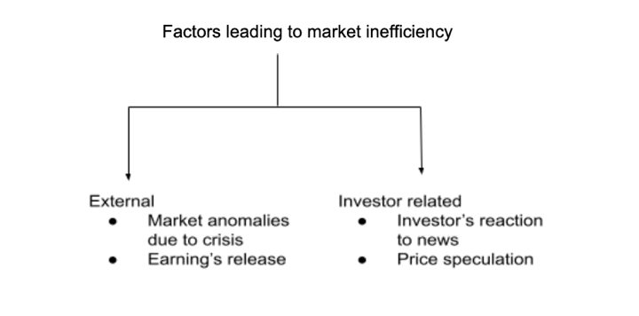

## Table of Contents

## What is market inefficiency?

Market inefficiency happens when the prices of things in a market do not correctly show their true value. This can happen for many reasons, like when people do not have all the information they need, or when some people can affect prices in ways that are not fair. When markets are inefficient, it means that some people might pay too much or too little for things, and it can be hard to know if you are getting a good deal.

One common example of market inefficiency is in the stock market. Sometimes, the price of a stock might go up or down based on rumors or incomplete information, rather than the actual value of the company. This can lead to people buying or selling stocks at the wrong times. Another example is in housing markets, where the price of a house might be too high because there are not enough houses available, even if the house itself is not worth that much. In both cases, market inefficiency can lead to unfair situations and missed opportunities for people trying to make smart choices.

## How does market inefficiency differ from market efficiency?

Market efficiency means that the prices of things in a market correctly show their true value. This happens when everyone has all the information they need and can make good choices. When markets are efficient, it's easier for people to buy and sell things at fair prices. For example, if a company is doing well, its stock price will go up because everyone knows about it and wants to buy the stock.

On the other hand, market inefficiency is when prices do not match the true value of things. This can happen because some people do not have all the information, or because some people can unfairly affect prices. When markets are inefficient, it can be hard for people to know if they are getting a good deal. For instance, if a house is overpriced because there are not enough houses for sale, people might end up paying too much.

In summary, market efficiency helps people make fair and smart choices, while market inefficiency can lead to unfair situations and missed opportunities. Understanding these differences can help people navigate markets better and make better decisions.

## What are the common causes of market inefficiencies?

Market inefficiencies often happen because people do not have all the information they need to make good choices. For example, if you want to buy a stock, but you don't know that the company is having problems, you might pay too much for it. This lack of information can cause prices to be wrong, leading to market inefficiencies. Another reason is when some people can unfairly affect prices. For instance, if a big investor buys a lot of a certain stock, they might make the price go up even if the company is not doing well. This can trick other people into thinking the stock is worth more than it really is.

Another cause of market inefficiencies is when there are not enough buyers or sellers in a market. If there are only a few houses for sale in a neighborhood, the prices might go up a lot, even if the houses are not that nice. This happens because people who want to buy a house have to compete, and they might end up paying more than the house is really worth. Also, rules and regulations can sometimes make markets inefficient. For example, if the government puts strict rules on how much a company can charge for a product, the price might not match what people are willing to pay, leading to inefficiencies.

## Can you explain the concept of arbitrage in relation to market inefficiency?

Arbitrage is a way to make money from market inefficiencies. It happens when someone buys something in one place where it's cheaper and then sells it in another place where it's more expensive. For example, if a toy is cheaper in one store than another, someone could buy the toy from the cheaper store and sell it at the more expensive store, making a profit. This works because the price of the toy is different in the two places, which is a sign of market inefficiency.

When people do arbitrage, they help make markets more efficient. By buying where prices are low and selling where prices are high, they help even out the prices. Over time, this can make the price of the toy the same in both stores. So, arbitrage is not just a way to make money; it also helps fix market inefficiencies by making prices more fair and accurate.

## How do information asymmetries contribute to market inefficiencies?

Information asymmetries happen when some people know more than others. This can cause market inefficiencies because not everyone has the same information to make good choices. For example, if a car seller knows that a car has problems but the buyer does not, the buyer might pay too much for the car. This is unfair and makes the market less efficient because the price of the car does not match its true value.

When people do not have all the information, they might make bad decisions. This can lead to prices that are too high or too low. For instance, if investors do not know that a company is doing badly, they might keep buying its stock, pushing the price up. But if the truth comes out later, the price might drop suddenly, hurting those who bought the stock at the higher price. Information asymmetries make it hard for everyone to trust the market and can cause big problems.

## What role do transaction costs play in creating market inefficiencies?

Transaction costs are the fees and expenses you pay when you buy or sell something. These costs can make markets less efficient because they add extra money to the price of things. For example, if you want to buy a stock, you might have to pay a fee to the broker. This fee makes the stock more expensive for you, even if the stock's real value hasn't changed. When transaction costs are high, people might decide not to buy or sell as much, which can keep prices from matching the true value of things.

High transaction costs can also stop people from fixing market inefficiencies. If someone sees a chance to make money by buying something cheap and selling it for more, they might not do it if the costs of buying and selling are too high. This means that prices stay wrong for longer, making the market less efficient. In simple terms, transaction costs can make it harder for markets to work well by adding extra expenses that change how people act.

## How can behavioral finance explain market inefficiencies?

Behavioral finance looks at how people's feelings and mistakes can make markets inefficient. People often make choices based on what they feel instead of what the facts say. For example, if everyone gets excited about a new product, they might buy its stock even if the company is not doing well. This can make the stock price go up too high, which is not fair to the true value of the company. Behavioral finance says that these kinds of feelings can cause prices to be wrong, leading to market inefficiencies.

Another way behavioral finance explains market inefficiencies is by showing how people can make the same mistakes over and over. For instance, people might sell their stocks when the market goes down because they are scared, even if it's a good time to buy. This can make prices drop even more than they should. By understanding how people's behavior affects markets, we can see why prices sometimes do not match the real value of things, causing inefficiencies.

## What are some real-world examples of market inefficiencies?

One real-world example of market inefficiency is in the stock market. Sometimes, the price of a stock can go up a lot because people hear rumors or get excited about a company, even if the company is not doing well. This happened with the company GameStop in 2021. A lot of people started buying its stock because they saw others doing it on social media. The price went up a lot, but it did not match the true value of the company. This shows how feelings and rumors can make prices wrong, causing market inefficiencies.

Another example is in the housing market. In some cities, there are not enough houses for everyone who wants to buy one. This can make the prices of houses go up a lot, even if the houses are not that nice. For instance, in places like San Francisco, the price of a small house can be very high because so many people want to live there. This is not fair because the price does not match what the house is really worth. It shows how having too few houses can lead to market inefficiencies.

## How do market inefficiencies impact investment strategies?

Market inefficiencies can change how people make investment choices. When prices do not show the true value of things, smart investors might look for ways to take advantage of this. For example, if a stock is priced too low because not everyone knows how well the company is doing, an investor might buy it, hoping to sell it later when the price goes up to match the company's true value. This strategy is called value investing, and it relies on finding market inefficiencies to make money.

On the other hand, market inefficiencies can also make investing riskier. If prices are based on feelings or rumors instead of facts, it can be hard to know if you are making a good choice. For instance, if everyone gets excited about a new tech company and its stock price goes up a lot, you might be tempted to buy it. But if the excitement goes away and the price drops, you could lose money. This is why some investors try to avoid market inefficiencies by sticking to strategies like buying a mix of different stocks to spread out the risk.

## What tools or methods can investors use to identify market inefficiencies?

Investors can use different tools and methods to find market inefficiencies. One way is to do a lot of research and look at the numbers behind a company. This means checking things like how much money the company is making and how much it owes. By comparing these numbers to the stock price, investors can see if the price is too high or too low. Another tool is to use special computer programs that look at lots of data quickly. These programs can find patterns or unusual prices that might show a market inefficiency.

Another method is to pay attention to what other people are doing and saying. If a lot of people are excited about a stock because of rumors, but the numbers do not match the excitement, that could be a sign of inefficiency. Talking to other investors and reading news can help find these situations. Also, some investors use something called technical analysis. This means looking at charts of past prices to guess where prices might go next. If the charts show that a price is going to change a lot, that could be a chance to take advantage of a market inefficiency.

## How have regulatory changes aimed to address market inefficiencies?

Governments and other groups have made rules to try to fix market inefficiencies. One way they do this is by making sure everyone has the same information. For example, companies have to tell the public about important things that could change their stock price. This helps stop some people from knowing more than others, which can lead to unfair prices. Another way is by watching big investors to make sure they do not do things that make prices go up or down in bad ways. By keeping an eye on them, rules can help keep the market fair.

Rules also try to make it easier and cheaper for people to buy and sell things. For instance, some places have lowered the fees people have to pay when they trade stocks. This can help more people join the market and make prices match the true value of things better. But making rules to fix market inefficiencies can be hard because markets are always changing. Sometimes, new rules might even create new problems, so it's important to keep watching and changing the rules to make sure they are helping the market work better.

## What are the latest academic theories or models explaining market inefficiencies?

One of the latest academic theories explaining market inefficiencies is the Adaptive Market Hypothesis (AMH). This theory says that markets are not always efficient because people's behavior changes over time. Instead of always making the best choices, people learn from their past experiences and adapt. This can lead to market inefficiencies because what worked in the past might not work now. For example, if everyone used to buy stocks based on certain news, but now they do something different, the old way of thinking can make prices wrong. The AMH helps explain why markets can be hard to predict and why prices sometimes do not match the true value of things.

Another recent model is the Noise Trader Model. This model focuses on how some people, called noise traders, make choices based on feelings or rumors instead of facts. These noise traders can push prices away from what they should be, causing market inefficiencies. For instance, if a lot of noise traders start buying a stock because they heard a rumor, the price might go up even if the company is not doing well. This model shows how the actions of a few people can affect the whole market and make it less efficient. By understanding these theories, we can see why markets sometimes do not work as well as they should.

## What is the conclusion?

Market inefficiencies present both challenges and opportunities for algorithmic traders aiming to optimize strategies and portfolios. Despite the complexities associated with these inefficiencies, such as execution risks and rapidly adjusting markets, they offer a unique landscape for generating returns. By effectively understanding and exploiting these deviations from fair pricing, traders can enhance their potential for improved returns and secure a competitive advantage. 

The strategic implementation of algorithms allows traders to exploit price anomalies, information inefficiencies, and market structure issues with precision and speed that surpass human capabilities. Advanced analytical techniques, such as machine learning and [artificial intelligence](/wiki/ai-artificial-intelligence), contribute significantly to identifying these inefficiencies. The equation for potential profit ($P$) derived from an inefficiency could be modeled as follows:

$$

P = (P_{\text{sell}} - P_{\text{buy}}) \times Q - C 
$$

Where:
- $P_{\text{sell}}$ is the selling price.
- $P_{\text{buy}}$ is the buying price.
- $Q$ is the quantity transacted.
- $C$ represents transaction and market impact costs.

Continued advancements in technology and data analysis are crucial in enhancing the detection and exploitation of these market inefficiencies. The integration of big data, high-frequency trading systems, and real-time analytics will enable market participants to refine their algorithms and models, allowing for faster, more accurate predictions and executions. These improvements will further enhance the ability of traders to detect and profit from fleeting inefficiencies, making them an instrumental [factor](/wiki/factor-investing) in driving investment returns and maintaining a competitive edge in the financial markets.

## References & Further Reading

[1]: Bergstra, J., Bardenet, R., Bengio, Y., & Kégl, B. (2011). ["Algorithms for Hyper-Parameter Optimization."](https://proceedings.neurips.cc/paper/2011/file/86e8f7ab32cfd12577bc2619bc635690-Paper.pdf) Advances in Neural Information Processing Systems 24.

[2]: ["Advances in Financial Machine Learning"](https://www.amazon.com/Advances-Financial-Machine-Learning-Marcos/dp/1119482089) by Marcos Lopez de Prado

[3]: ["Evidence-Based Technical Analysis: Applying the Scientific Method and Statistical Inference to Trading Signals"](https://www.amazon.com/Evidence-Based-Technical-Analysis-Scientific-Statistical/dp/0470008741) by David Aronson

[4]: ["Machine Learning for Algorithmic Trading"](https://github.com/stefan-jansen/machine-learning-for-trading) by Stefan Jansen

[5]: ["Quantitative Trading: How to Build Your Own Algorithmic Trading Business"](https://books.google.com/books/about/Quantitative_Trading.html?id=j70yEAAAQBAJ) by Ernest P. Chan