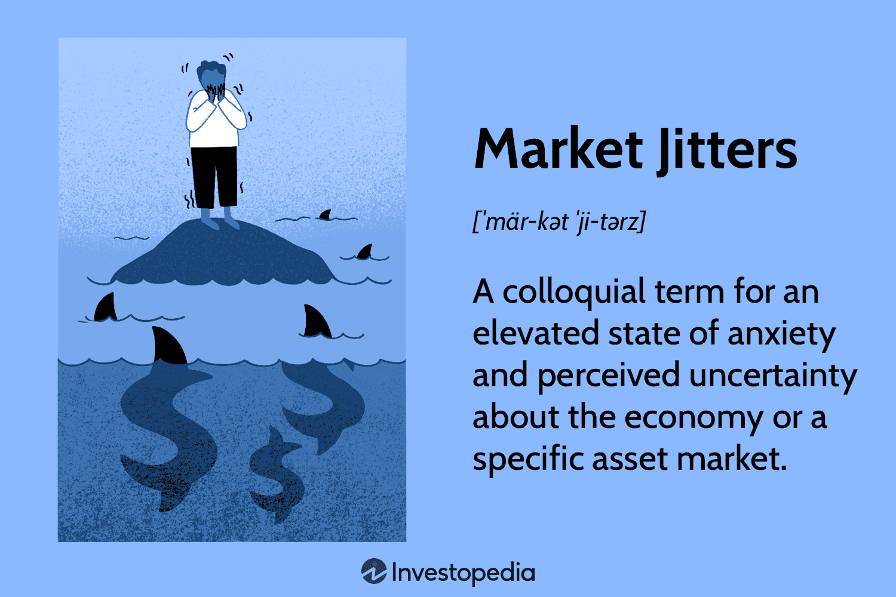

## Table of Contents

## What are market jitters?

Market jitters refer to a state of uncertainty and nervousness among investors and traders in the financial markets. When people talk about market jitters, they mean that people are worried and unsure about what will happen next with the economy or specific investments. This can happen because of many reasons, like bad news about the economy, political changes, or unexpected events like natural disasters. When investors feel jittery, they might start selling their investments, which can lead to a drop in stock prices and increased volatility in the market.

These jitters can spread quickly because the financial markets are connected all over the world. For example, if there is bad news in one country, it can affect markets in other countries too. People might start to panic and make quick decisions based on fear rather than careful thinking. This can make the situation worse and lead to more ups and downs in the market. Understanding market jitters is important for investors because it helps them make better decisions and not just react to the fear and uncertainty around them.

## What causes market jitters?

Market jitters are often caused by unexpected news or events that make investors feel uncertain about the future. This can include things like economic reports that show the economy is not doing well, like higher unemployment rates or lower growth. Political events, such as elections or new laws, can also make investors nervous because they might change how businesses work or affect the economy. Sometimes, natural disasters or global health crises can cause market jitters because they can disrupt businesses and supply chains, making it hard for companies to make money.

Another reason for market jitters is when big investors, like banks or hedge funds, start selling a lot of their investments quickly. This can happen if they think the market is going to go down, and it can make other investors worried too. When many people start selling at the same time, it can cause prices to drop fast, which adds to the nervousness. Also, rumors and speculation can spread quickly, especially with social media, and this can make investors feel even more jittery because they are not sure what is true and what is not.

## How do market jitters affect stock prices?

Market jitters make stock prices go up and down a lot. When investors feel nervous and unsure about what will happen next, they might start selling their stocks. This can cause the prices of stocks to drop because there are more people wanting to sell than buy. If many people are selling at the same time, it can make the prices fall even faster. This can create a cycle where more people get scared and sell, making the prices go down even more.

On the other hand, sometimes market jitters can make some stock prices go up. If investors think that certain companies will do well even during uncertain times, they might buy more of those stocks. This can push the prices of those stocks higher. But overall, market jitters usually mean more ups and downs in stock prices, and it can be a stressful time for people who own stocks.

## Can market jitters lead to economic downturns?

Market jitters can indeed lead to economic downturns. When investors get nervous and start selling their stocks, it can make stock prices go down a lot. If this keeps happening, businesses might find it harder to get money they need to grow or even keep running. When businesses struggle, they might have to cut back on spending or even lay off workers. This can slow down the whole economy because people have less money to spend, and businesses make less money too.

Sometimes, market jitters can also make people lose confidence in the economy. When people feel unsure, they might stop spending money on big things like houses or cars. They might also save more money instead of spending it. This can make the economy slow down even more because businesses rely on people spending money. If the market jitters last a long time, it can turn into a bigger problem and lead to a full-blown economic downturn.

## What are some historical examples of market jitters?

One big example of market jitters happened in 2008 during the global financial crisis. It started when people found out that many banks had made risky loans that were not going to be paid back. This made everyone very nervous, and they started selling their stocks. The prices of stocks went down a lot, and many big banks and companies had big problems. This led to a big economic downturn that affected the whole world.

Another time market jitters happened was in March 2020 when the COVID-19 pandemic started. People were scared because they did not know how bad the virus would be. Many businesses had to close, and people were told to stay home. This made everyone worry about the economy, and they started selling their stocks. The stock market went down a lot in a short time. Governments and central banks had to do a lot to help calm things down and stop the economy from getting worse.

In 1987, there was also a big event called "Black Monday." On October 19, 1987, the stock market in the United States dropped a lot in just one day. This was because of many things, like people using computers to trade stocks quickly and worries about the economy. The drop made everyone very nervous, and it took a long time for the market to get better.

## How do investors typically react to market jitters?

When investors feel market jitters, they often get scared and start selling their stocks. They might do this because they are worried that the prices will go down even more. When a lot of people sell at the same time, it can make the stock market drop fast. Some investors might sell all their stocks quickly, while others might sell a little bit at a time, hoping to buy them back when things calm down. This can make the market feel even more shaky because everyone is trying to sell and not many people are buying.

But not all investors react the same way. Some investors see market jitters as a chance to buy stocks at lower prices. They might think that the nervousness will not last and that the market will go back up. These investors might buy more stocks when others are selling, hoping to make money later when the prices go up again. This can help calm the market a bit because there are still some people buying, even when many others are selling.

## What psychological factors contribute to market jitters?

Market jitters often come from people feeling scared and unsure about what will happen next. When investors hear bad news or see big changes, they might start to worry. This worry can make them feel like they need to do something fast, like selling their stocks, to protect their money. When a lot of people feel this way at the same time, it can make the whole market feel nervous and shaky. It's like when one person starts to panic, it can spread to others, making everyone feel more anxious.

Another big part of market jitters is how people think about risk. When things seem uncertain, investors might think that the risks are bigger than they really are. This can make them act more out of fear than careful thinking. Sometimes, just hearing other people talk about their worries can make an investor feel more nervous, even if there's no new bad news. This can lead to a cycle where fear keeps growing, and it can be hard to calm things down until something good happens to make people feel better.

## How can individual investors protect their portfolios during periods of market jitters?

Individual investors can protect their portfolios during periods of market jitters by staying calm and not making quick decisions based on fear. It's important to remember that markets go up and down all the time, and trying to time the market perfectly is very hard. Instead of selling everything when things get shaky, investors can think about their long-term goals. If they believe in the companies they own, holding onto their stocks might be a good idea. Also, having a plan for what to do during tough times can help. This plan might include setting aside some money in safe investments like bonds or cash, so they don't have to sell stocks when prices are low.

Another way to protect a portfolio is by spreading out investments, which is called diversification. By owning different types of investments, like stocks, bonds, and maybe even some real estate, investors can lower their risk. If one part of the market is doing badly, other parts might be doing okay. This can help balance out the ups and downs. It's also a good idea to keep learning about the market and not just follow what everyone else is doing. Talking to a financial advisor can give investors more ideas on how to keep their money safe during times when the market feels jittery.

## What role do media and news play in exacerbating market jitters?

Media and news can make market jitters worse by spreading news fast and sometimes making things seem scarier than they are. When people hear about bad news or big changes in the economy, they might get worried. If the news keeps talking about these problems a lot, it can make more people feel nervous. This can lead to more investors selling their stocks because they are scared, which can make the market drop even more. The media can also focus on stories that make people feel like the situation is out of control, which adds to the nervousness.

Sometimes, the way the news is reported can make things seem worse than they really are. If the news uses big, scary words or shows a lot of people panicking, it can make viewers and readers feel like they need to do something fast. This can cause more people to sell their investments, which makes the market more shaky. It's important for people to check different news sources and not just react to one scary headline. By staying calm and looking at the bigger picture, investors can make better choices even when the news is making them feel jittery.

## How do market jitters influence market volatility?

Market jitters make the market go up and down a lot more than usual. When investors get scared and unsure about what will happen next, they might start selling their stocks. This can make stock prices drop fast because there are more people wanting to sell than buy. When a lot of people are selling at the same time, it can make the market feel very shaky. This is what we call market [volatility](/wiki/volatility-trading-strategies), and it can make it hard for people to know what to do with their money.

On the other hand, market jitters can also make some stock prices go up. If some investors think that certain companies will do well even during uncertain times, they might buy more of those stocks. This can push the prices of those stocks higher. But overall, when the market is jittery, it usually means more ups and downs in stock prices. This can be a stressful time for people who own stocks, and it can make the market feel like a roller coaster.

## What are the long-term effects of market jitters on investor behavior?

Market jitters can change how investors act over a long time. When people see the market go up and down a lot because of jitters, they might start to be more careful with their money. They might decide to put their money in safer places, like bonds or savings accounts, instead of stocks. This can make them miss out on chances to make more money when the market gets better. Also, if investors lose money during a time of market jitters, they might be scared to invest again for a long time. They might wait until they feel sure the market is safe before they start buying stocks again.

Over time, market jitters can also make investors learn to be more patient. They might start to see that the market goes through ups and downs all the time, and it's better to think about the long run instead of trying to guess what will happen next. This can help them stick to their plans and not sell their investments just because things get shaky. But if market jitters happen a lot, it can make investors feel tired and unsure about the market. They might start to trust the market less and be less likely to take risks, which can change how they invest for many years.

## How can financial institutions and policymakers mitigate the impact of market jitters?

Financial institutions and policymakers can help calm market jitters by doing things like lowering interest rates or giving money to banks. When interest rates go down, it can be cheaper for people and businesses to borrow money. This can help them spend and invest more, which can make the economy feel better. Banks can also get money from the government to help them keep lending money to people and businesses, even when the market is shaky. This can stop the market from getting worse and help it calm down.

Policymakers can also talk to people and explain what they are doing to fix things. When people hear from leaders that they are working on the problem, it can make them feel less scared. This can stop them from selling their stocks and making the market more jittery. By being clear and honest, policymakers can help build trust and make investors feel more sure about the future. This can make the market less shaky over time.

## References & Further Reading

[1]: Bergstra, J., Bardenet, R., Bengio, Y., & Kégl, B. (2011). ["Algorithms for Hyper-Parameter Optimization."](https://papers.nips.cc/paper/4443-algorithms-for-hyper-parameter-optimization) Advances in Neural Information Processing Systems 24.

[2]: ["Advances in Financial Machine Learning"](https://www.amazon.com/Advances-Financial-Machine-Learning-Marcos/dp/1119482089) by Marcos Lopez de Prado

[3]: ["Evidence-Based Technical Analysis: Applying the Scientific Method and Statistical Inference to Trading Signals"](https://www.amazon.com/Evidence-Based-Technical-Analysis-Scientific-Statistical/dp/0470008741) by David Aronson

[4]: ["Machine Learning for Algorithmic Trading"](https://github.com/stefan-jansen/machine-learning-for-trading) by Stefan Jansen

[5]: ["Quantitative Trading: How to Build Your Own Algorithmic Trading Business"](https://www.amazon.com/Quantitative-Trading-Build-Algorithmic-Business/dp/1119800064) by Ernest P. Chan