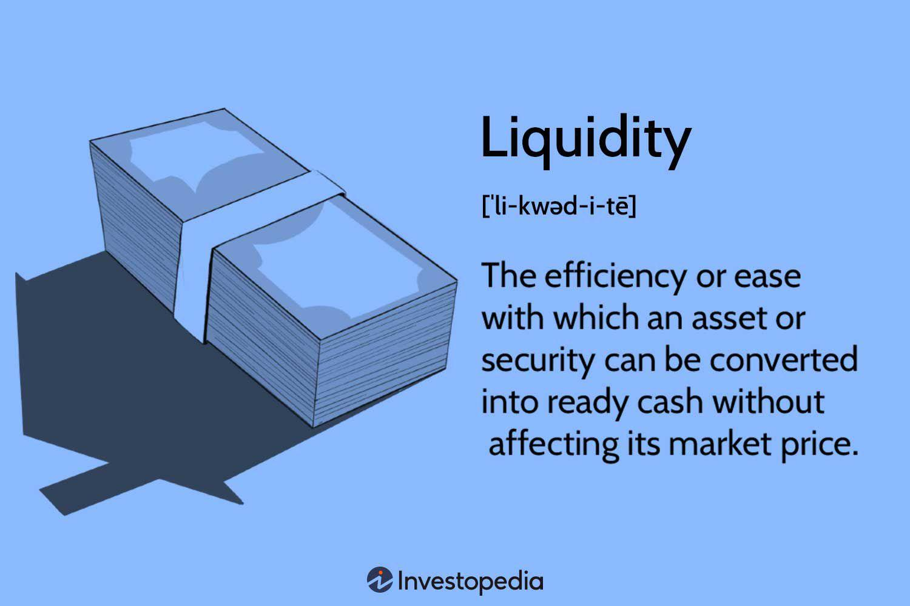

## Table of Contents

## What is market liquidity?

Market liquidity refers to how easily you can buy or sell something in a market without affecting its price too much. Imagine you want to sell your old bike. If there are many people who want to buy bikes just like yours, you can sell it quickly and at a good price. That's a liquid market. But if nobody wants to buy bikes, you might have to wait a long time or lower your price a lot. That's an illiquid market.

Liquidity is important because it affects how smoothly a market works. In a liquid market, it's easier for people to trade because there are always buyers and sellers ready to make a deal. This helps keep prices stable and makes it easier for people to get in and out of investments. In an illiquid market, trading can be harder and prices can change a lot because there are fewer people trading. This can make it riskier for people who want to buy or sell.

## Why is market liquidity important for investors?

Market liquidity is important for investors because it makes it easier for them to buy and sell investments quickly and at fair prices. When a market is liquid, there are lots of buyers and sellers, so investors can get in and out of their investments without waiting too long or losing much money. This is helpful because it means investors can react fast to changes in the market or their own needs. If they need money, they can sell their investments easily. If they see a good opportunity, they can buy into it without delay.

On the other hand, if a market is not liquid, it can be hard for investors to sell their investments when they want to. They might have to wait a long time or sell at a lower price than they hoped for. This can be risky because it might force them to keep their money tied up in an investment they no longer want, or they might lose money if they have to sell at a bad time. So, knowing about market liquidity helps investors make better choices about where to put their money and when to buy or sell.

## How is market liquidity measured?

Market liquidity is measured by looking at how easy it is to buy or sell something without changing its price too much. One way to measure it is by looking at the trading volume, which is the number of shares or contracts traded in a day. If lots of shares are traded, it usually means the market is liquid because there are many buyers and sellers. Another way is to look at the bid-ask spread, which is the difference between the highest price someone is willing to pay (the bid) and the lowest price someone is willing to sell at (the ask). A small bid-ask spread means the market is liquid because it's easy to buy and sell at prices that are close to each other.

Another measure of market liquidity is the market depth, which shows how many buy and sell orders are waiting at different price levels. If there are lots of orders at many different prices, it means the market can handle big trades without the price moving too much. Lastly, the time it takes to complete a trade can also tell you about liquidity. If trades happen quickly, it's a sign of a liquid market. All these measures help investors understand how easy it will be to buy or sell their investments.

## What factors affect market liquidity?

Market liquidity can be affected by many things. One big factor is the number of buyers and sellers in the market. If there are lots of people wanting to buy and sell, it's easier to make trades quickly and at good prices. This makes the market more liquid. Another factor is how much information people have about what they are buying or selling. If everyone knows a lot about the market, they are more likely to trade, which can make the market more liquid. But if there's not much information, people might be scared to trade, which can make the market less liquid.

Another thing that affects market liquidity is how easy it is to trade. This includes things like the rules and costs of trading. If it's easy and cheap to trade, more people will do it, which makes the market more liquid. But if trading is hard or expensive, fewer people will trade, making the market less liquid. Economic conditions also play a role. In good economic times, people feel more confident and are more likely to trade, which can improve liquidity. But in bad times, people might be scared to trade, which can make the market less liquid.

## Can you explain the difference between a liquid and an illiquid market?

A liquid market is like a busy marketplace where it's easy to buy and sell things. Imagine you're at a big farmers' market where lots of people are buying and selling fruits and vegetables. You can quickly sell your apples because there are many buyers who want them, and you can buy tomatoes easily because there are many sellers. The prices don't change much because there are so many people trading. In a liquid market, you can get in and out of your investments without waiting or losing much money.

An illiquid market is like a small, quiet store where it's hard to find buyers or sellers. Imagine you're trying to sell a rare painting in a small town where not many people know about art. You might have to wait a long time to find someone who wants to buy it, and you might have to lower your price a lot. It's also hard to buy things because there are few sellers. In an illiquid market, trading can be slow and prices can change a lot because there are fewer people trading. This can make it risky and harder for people to buy or sell what they want.

## How does market liquidity impact transaction costs?

Market liquidity affects how much it costs to buy or sell things. In a liquid market, there are lots of people wanting to buy and sell, so it's easier to make a trade. This means you don't have to wait long or lower your price much to find someone to trade with. Because of this, the costs of making a trade, like the difference between what someone is willing to pay and what someone is willing to sell for, are usually small. This makes it cheaper for people to buy and sell in a liquid market.

In an illiquid market, there are fewer people wanting to buy and sell, so it's harder to make a trade. You might have to wait a long time or lower your price a lot to find someone to trade with. This makes the costs of making a trade higher because the difference between what someone is willing to pay and what someone is willing to sell for can be big. So, in an illiquid market, it can be more expensive for people to buy and sell.

## What are the signs of high liquidity in a market?

High liquidity in a market means it's easy to buy and sell things without changing the price too much. You can tell a market has high liquidity when you see lots of people trading. This is like seeing a busy street market where everyone is buying and selling quickly. When there are many buyers and sellers, you can make a trade fast and at a good price. This is because there's always someone ready to buy what you're selling or sell what you want to buy.

Another sign of high liquidity is when the difference between what someone is willing to pay and what someone is willing to sell for is small. This difference is called the bid-ask spread. In a liquid market, this spread is tiny because there are so many people trading. Also, if you look at the market and see that there are lots of orders waiting at different price levels, that's a good sign of high liquidity. It means the market can handle big trades without the price moving too much.

## How do market makers contribute to liquidity?

Market makers are like helpers in the market who make it easier for people to buy and sell things. They do this by always being ready to buy or sell certain things, like stocks or bonds. When you want to sell something, market makers are there to buy it from you. When you want to buy something, they are there to sell it to you. This means you don't have to wait to find someone else who wants to trade with you. Because market makers are always ready to trade, it makes the market more liquid. It's like having a friend at a yard sale who is always ready to buy or sell things, so you can trade quickly and easily.

Market makers also help keep the prices stable. They do this by setting a small difference between what they are willing to buy something for and what they are willing to sell it for. This difference is called the bid-ask spread. When the spread is small, it means it's cheaper for people to trade. Market makers make money from this small difference, but they also help the market by making sure there are always people ready to trade. This makes the market more liquid because it's easier for everyone to buy and sell things without big changes in price.

## What role does market liquidity play in financial stability?

Market liquidity is really important for keeping the financial system stable. When markets are liquid, it means people can easily buy and sell things like stocks or bonds without big changes in price. This helps keep the market calm because everyone can get in and out of their investments when they need to. If people can't sell their investments quickly, they might panic and sell at lower prices, which can make the market go down a lot. So, having good liquidity helps stop big crashes and keeps the financial system working smoothly.

But if markets are not liquid, it can cause problems. When it's hard to buy or sell things, people might get worried and stop trading. This can make the market even less liquid and cause prices to change a lot. If this happens, it can lead to a financial crisis because people can't get their money out of investments when they need it. So, market liquidity is like the oil that keeps the financial system running smoothly, and without it, things can get stuck and cause big problems.

## How can changes in market liquidity affect asset prices?

Changes in market liquidity can make asset prices go up or down. When a market is very liquid, it means lots of people are buying and selling, so it's easy to trade things like stocks or bonds. This usually keeps prices stable because there are always buyers and sellers. But if liquidity goes down, it can be hard to sell things quickly. People might have to lower their prices a lot to find someone to buy, which can make the price of the asset go down.

On the other hand, if liquidity suddenly goes up, it can push prices higher. More people wanting to buy can create a rush, making prices go up because everyone wants to get in on the action. This can happen when good news comes out or when the economy is doing well. So, changes in how easy it is to buy and sell can have a big impact on what things are worth in the market.

## What strategies can traders use to manage liquidity risk?

Traders can manage liquidity risk by being careful about what they buy and sell. They should look at how easy it is to trade something before they buy it. If it's hard to sell, they might want to stay away from it or only buy a little bit. They can also keep some of their money in things that are easy to sell, like big company stocks or government bonds. This way, if they need money fast, they can sell these things quickly without losing much.

Another way traders can handle liquidity risk is by watching the market closely. They should pay attention to how many people are buying and selling and how quickly trades are happening. If they see that it's getting harder to trade, they might want to sell some of their investments before it gets worse. They can also use tools like stop-loss orders, which automatically sell their investments if the price goes down too much. This can help them get out of a trade before the market becomes too hard to trade in.

## How do regulatory policies influence market liquidity?

Regulatory policies can have a big impact on how easy it is to buy and sell things in a market. When the rules make it easier and cheaper to trade, more people are likely to do it. This can make the market more liquid because there are more buyers and sellers. For example, if the government lowers the fees for trading stocks, more people might start trading, which can help keep the market active and liquid. On the other hand, if the rules make trading harder or more expensive, fewer people might want to trade, which can make the market less liquid. For instance, if new rules require more paperwork or higher fees, it might scare some people away from trading.

Sometimes, regulatory policies can also affect how much information people have about the market. If the rules make companies share more information about their business, people might feel more confident about trading. This can make the market more liquid because people are more willing to buy and sell when they know more about what they are trading. But if the rules don't require much information, people might be scared to trade because they don't know enough. This can make the market less liquid because people are less likely to buy and sell when they are unsure. So, the rules set by regulators can play a big role in how liquid a market is.

## What is Understanding Market Liquidity?

Market [liquidity](/wiki/liquidity-risk-premium) is a crucial [factor](/wiki/factor-investing) that allows financial markets to function smoothly, serving as a conduit through which transactions occur rapidly and with minimal impact on asset prices. The balancing act between the speed of completing a transaction and the resultant price fluctuation highlights the essence of market liquidity.

Liquid markets are characterized by a high [volume](/wiki/volume-trading-strategy) of trade, low transaction costs, and minimal price impact when executing large orders. These markets allow assets to be bought or sold quickly at prices close to the prevailing market rates. For example, stocks of major companies like Apple or Microsoft are considered highly liquid due to their large market capitalizations and frequent trading activity. Consequently, investors can execute trades rapidly without a significant discount or premium on the asset price.

Conversely, illiquid markets feature lower trading volumes and higher transaction costs, often necessitating substantial price cuts to execute larger trades. For instance, real estate or niche collectibles, such as rare art, are typically much less liquid. Transactions in these markets can face delays and might require sellers to reduce prices significantly to attract buyers, resulting in a potential loss on the liquidity spread.

$$
\text{Liquidity\ Spread} = \frac{\text{Selling\ Price} - \text{Market\ Price}}{\text{Market\ Price}} \times 100
$$

Understanding the characteristics of liquidity is vital for making informed trading decisions. Traders and investors continually assess market conditions to determine the liquidity of different assets, enabling them to optimize their strategies and manage risk effectively. Knowing when and where liquidity is available can dramatically affect transaction costs and overall market efficiency, underscoring the importance of liquidity in financial markets.

## What is the impact of liquidity on asset values and returns?

Liquidity significantly influences asset values and expected returns in financial markets, forming a key component in the pricing and risk assessment of investments. Assets with low liquidity often offer higher expected returns as compensation for the additional risk investors incur. This phenomenon is underpinned by both theoretical frameworks and empirical studies.

From a theoretical perspective, the liquidity premium is a central concept. The liquidity premium compensates investors for the difficulty of quickly selling an asset without affecting its price. In mathematical terms, the expected return ($E(R)$) of an asset can be considered as a sum of the risk-free rate ($R_f$), the systematic risk premium ($\beta(E(R_m) - R_f)$), and the liquidity premium ($\lambda$):

$$
E(R) = R_f + \beta(E(R_m) - R_f) + \lambda
$$

Here, $\lambda$ signifies the additional return demanded by investors for holding a less liquid asset, which enhances the overall expected return to mitigate the perceived liquidity risk.

Empirical evidence provides substantial support for these theoretical constructs. Numerous studies illustrate that assets with lower liquidity often trade at a discount, as reduced immediacy in transactions necessitates higher returns to attract buyers. For instance, illiquid stocks, characterized by low trading volumes and wide bid-ask spreads, typically exhibit greater return potential than their more liquid counterparts. This aligns with the Amihud and Mendelson (1986) liquidity-adjusted capital asset pricing model (CAPM), which posits that higher transaction costs and lower liquidity correlate with higher expected returns.

Investors also display a tendency to demand premium returns for assets facing liquidity constraints. During periods of market stress or liquidity shortages, this demand intensifies. For example, in a financial crisis, investors often reassess the liquidity risk and adjust their required returns upwards, resulting in increased liquidity premiums. This relationship highlights the dynamic interplay between market liquidity conditions and investor behavior.

Overall, understanding the impact of liquidity on asset values and returns is crucial for both investors and traders. It aids in constructing portfolios that balance liquidity risks with return objectives. As financial markets become more sophisticated, recognizing the nuances of liquidity remains fundamental to navigating investment decisions effectively.

## References & Further Reading

[1]: Amihud, Y., & Mendelson, H. (1986). ["Asset Pricing and the Bid-Ask Spread."](https://www.sciencedirect.com/science/article/pii/0304405X86900656) Journal of Financial Economics.

[2]: Cartea, A., Jaimungal, S., & Penalva, J. (2015). ["Algorithmic and High-Frequency Trading."](https://assets.cambridge.org/97811070/91146/frontmatter/9781107091146_frontmatter.pdf) Cambridge University Press.

[3]: O'Hara, M. (1995). ["Market Microstructure Theory."](https://www.semanticscholar.org/paper/Market-Microstructure-Theory-O'Hara/2bd0833b023f3270a2a6bf301e86b8e02e2f28ed) Blackwell.

[4]: Degryse, H., Jong, F. de, & Lefebvre, J. (2017). ["Algorithmic Trading and its Impact on Liquidity."](https://pure.uvt.nl/ws/portalfiles/portal/10411151/Degreyse_Economist_Legal_insider_trading.pdf) Journal of Economic Surveys.

[5]: Hasbrouck, J. (2007). ["Empirical Market Microstructure: The Institutions, Economics, and Econometrics of Securities Trading."](https://academic.oup.com/book/52241) Oxford University Press.