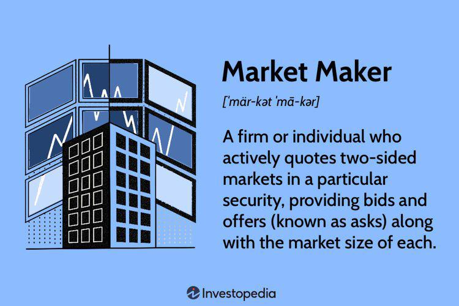

Financial markets are intricate systems characterized by the dynamic interplay of numerous factors. Among these, liquidity and the presence of market makers are vital for ensuring seamless operations and market stability. Liquidity, in this context, refers to the ease with which assets can be bought or sold in the market without causing significant price movements. A liquid market is one where executed trades occur swiftly and with minimal impact on asset prices, thereby reducing market volatility and facilitating efficient price discovery.

Market making plays an essential role in maintaining this liquidity. It involves the continuous quoting of buy and sell prices for various financial instruments, such as stocks, bonds, or derivatives. By doing so, market makers bridge the gap between buyers and sellers, ensuring that trades can be executed promptly and efficiently. They profit from the spread between the buying (bid) price and the selling (ask) price, and in turn, contribute to reducing price volatility by balancing supply and demand.

The evolution of technology, particularly in the form of algorithmic trading, has revolutionized market making over the past few decades. Algorithmic trading involves the use of complex computer algorithms to automate trading decisions and execute trades at high speeds. This technological advancement enhances market efficiency by providing continuous liquidity and tighter bid-ask spreads, making the markets more accessible and appealing to a broader range of participants.

This article examines the intricate mechanisms of market making, the critical role of liquidity providers, and how technological advancements like algorithmic trading are reshaping modern financial markets. The exploration aims to provide a comprehensive understanding of how these components interact to maintain the integrity and stability of global financial systems.

## Table of Contents

## Understanding Market Makers and Their Role

Market makers play a crucial role in financial markets by providing liquidity and facilitating smoother trading operations. They continuously maintain buy (bid) and sell (ask) orders for various securities, ensuring that market participants can readily buy or sell assets without significant price disruption. This liquidity provision reduces transaction costs and enhances the efficiency and stability of financial markets.

Market makers profit from the bid-ask spread, which is the difference between the price at which they are willing to buy (bid) and sell (ask) an asset. By maintaining a consistent presence in the market, they help narrow these spreads over time, contributing to a more efficient price discovery process and reducing price volatility.

There are various types of market makers, each with specific roles and operational mechanisms. Designated Market Makers (DMMs) are obligated to ensure market [liquidity](/wiki/liquidity-risk-premium) for particular securities. Their responsibilities typically include maintaining a consistent presence in the market and quoting bid and ask prices for these securities, even during market downturns. DMMs often operate on a contractual basis, particularly on exchanges like the New York Stock Exchange (NYSE), where they play a fundamental role in maintaining orderly market conditions.

Electronic Market Makers, on the other hand, leverage advanced technology and [algorithmic trading](/wiki/algorithmic-trading) systems to operate across multiple markets and asset classes seamlessly. These market makers use sophisticated software to analyze market data and update their quotes rapidly, ensuring they remain competitive and profitable. Electronic market makers are prevalent in decentralized markets such as [forex](/wiki/forex-system) and over-the-counter (OTC) derivatives, where their ability to provide liquidity across fragmented markets is invaluable.

The operational framework for market makers involves managing risks associated with holding inventory of financial instruments. They must constantly assess and adjust their positions to mitigate risks such as price movements against their holdings, known as inventory risk. Sophisticated techniques like delta-hedging are employed to manage these risks effectively.

In summary, market makers are indispensable to financial markets, serving to enhance liquidity, minimize transaction costs, and stabilize market prices. Through their activities, they ensure that financial markets remain attractive to a broad array of participants, from individual traders to large institutional investors.

## The Importance of Liquidity Providers

Liquidity providers are fundamental to the efficient functioning of financial markets, facilitating seamless transactions by ensuring the availability of buy and sell orders for various assets. Their primary role is to enhance the market's ability to accommodate trades without causing significant fluctuations in price, thus promoting a stable trading environment. 

In financial markets, liquidity refers to the ease with which assets can be bought or sold without causing a substantial price impact. Liquidity providers, by offering a continuous stream of orders, enable traders to execute transactions promptly and at competitive prices. This function is particularly critical during periods of heightened market activity when the potential for price [volatility](/wiki/volatility-trading-strategies) increases.

The impact of liquidity providers is evident across multiple markets, including stocks, foreign exchange (forex), and derivatives. In the stock market, for example, liquidity providers like market makers are responsible for continuously quoting buy (bid) and sell (ask) prices, thereby narrowing the bid-ask spread. This activity not only improves the market’s price efficiency but also attracts more participants, fostering a deeper market with better price discovery processes.

In the forex market, liquidity providers, which often include major financial institutions and specialized trading firms, ensure that currency pairs remain highly liquid. This enables international businesses to hedge currency risks and investors to diversify their portfolios without encountering significant resistance in executing trades.

Similarly, in derivatives markets, liquidity providers play a crucial role, especially considering the complex nature of derivative instruments. They ensure that contracts such as futures and options are readily tradable, thus allowing market participants to hedge positions, speculate on price movements, and engage in strategic asset allocation.

Liquidity provision is also vital for price discovery, which is the process through which the market determines the price of an asset. By maintaining an active presence in the market, liquidity providers help reflect the true value of assets based on supply and demand dynamics. This accuracy in pricing is essential for the efficient allocation of resources and informed decision-making by investors.

The stability of financial markets heavily depends on the presence of robust liquidity. Liquidity providers mitigate the risks associated with sudden price swings by absorbing order imbalances and providing a counterbalance during periods of high demand or supply. This stabilizing effect is crucial not only for individual markets but also for the broader financial system, as it helps prevent the cascading effects of volatility that can lead to systemic risks.

In conclusion, liquidity providers are indispensable to modern financial markets, ensuring that assets can be traded swiftly and at fair prices. Their contribution to market liquidity, price discovery, and stability cannot be overstated, as it underpins the confidence with which market participants operate and invest. As markets continue to evolve, the role of liquidity providers will remain pivotal in maintaining the integrity and efficiency of financial systems globally.

## Algorithmic Trading in Modern Markets

Algorithmic trading is a method of executing orders using automated pre-programmed trading instructions. The primary advantage of algorithmic trading is its ability to rapidly execute large volumes of transactions with minimal manual intervention. This high-speed execution is made possible through sophisticated mathematical models and enhanced computing power.

One of the principal benefits of algorithmic trading is the enhancement of market efficiency. By automating the trading process, algorithmic trading provides continuous liquidity to the market. This constant availability of buy and sell orders helps to narrow the bid-ask spreads, which is the difference between the prices quoted for an immediate sale (bid) and an immediate purchase (ask). A narrower spread generally indicates a more liquid market, reducing the transaction costs for traders.

However, the rapid and automated nature of algorithmic trading raises concerns about market volatility. The ability of algorithms to react almost instantaneously to market changes can exacerbate financial instability, especially if multiple algorithms respond in the same way simultaneously. This phenomenon was notably observed during the Flash Crash of 2010, where the U.S. stock market saw a rapid, severe drop followed by a swift recovery within minutes. A key concern is the potential for rapid withdrawal of liquidity, a situation where algorithms pull out of the market en masse, leaving it temporarily illiquid and unstable.

To mitigate such risks, various techniques, including advanced [machine learning](/wiki/machine-learning) models, are being explored. These include algorithms that can predict price movements and adjust their trading behavior dynamically, potentially smoothing out abrupt withdrawal incidents. Furthermore, implementing constraints and circuit breakers, which temporarily halt trading in response to significant price changes, are regulatory measures that can help contain the volatility introduced by algorithmic trading.

Overall, while algorithmic trading has decisively enhanced market efficiency, it also demands constant vigilance and innovation to manage its inherent volatility risks effectively.

## Market Making Strategies

Market making strategies are essential for ensuring liquidity and stability within financial markets. These strategies predominantly involve [earning](/wiki/earning-announcement) profits from the bid-ask spread and engaging in [volume](/wiki/volume-trading-strategy)-based trading.

**Spread-Based Profits**

Market makers quote both buying (bid) and selling (ask) prices for a security. The difference between these prices, known as the bid-ask spread, provides market makers with a profit margin. By frequently updating these quotes based on market conditions and order flows, market makers can secure consistent, albeit usually small, profits per transaction. Accumulating these profits over numerous transactions can lead to significant earnings.

**Volume-Based Trading**

Volume-based trading involves strategies that capitalize on large volumes of trades rather than focusing solely on the bid-ask spread. This approach allows market makers to benefit from economies of scale, optimizing execution efficiency and reducing transaction costs. By maintaining substantial liquidity and rapidly filling large orders, they enhance their profitability while contributing positively to market dynamics.

**Sophisticated Risk Management**

Effective risk management underpins successful [market making](/wiki/market-making) strategies. A critical aspect of this is maintaining a delta-neutral position. Delta neutrality involves balancing a portfolio such that its value is not significantly affected by small movements in the underlying asset's price. This is achieved by dynamically adjusting the positions in options or futures contracts to offset potential risks associated with price fluctuations. 

Mathematically, delta ($\Delta$) measures the sensitivity of the option's price to a $1 change in the price of the underlying asset. A delta-neutral strategy ensures the sum of all deltas in a portfolio is zero:

$$
\sum_{i=1}^{n} \Delta_i \cdot Q_i = 0
$$

where $\Delta_i$ is the delta of each individual asset, and $Q_i$ represents the quantity of assets.

**Technological Tools**

Market making relies heavily on advanced technological tools for swift analysis and execution. These tools range from high-speed algorithms capable of conducting complex analyses and executing trades in milliseconds, to sophisticated data analytics platforms for real-time market assessment. Machine learning models are increasingly employed to predict market movements and optimize quoting strategies. By leveraging these technologies, market makers can respond efficiently to market conditions and maintain competitive advantages in execution speed and precision.

In summary, market making strategies are built on the pillars of spread and volume-based profits, sophisticated risk management, and cutting-edge technological tools. These strategies enable market makers to provide liquidity, reduce transaction costs, and enhance market efficiency.

## Impact of High-Frequency Trading

High-frequency trading ([HFT](/wiki/high-frequency-trading-strategies)) represents a significant segment of the trading volume in contemporary financial markets. This trading method, characterized by its use of complex algorithms and high-speed data networks, executes a large number of orders at extremely rapid speeds. HFT primarily aims to capitalize on minute intra-day price fluctuations. Its technological advancements have led to a substantial increase in liquidity as these trading activities contribute to higher market turnover and tighter bid-ask spreads.

Despite these advantages, HFT is not without criticisms and potential risks. One notable concern is its ability to exacerbate market volatility, particularly during times of economic stress or unforeseen events. The rapid pace and volume of trades characteristic of HFT can result in severe market disruptions if liquidity is withdrawn quickly. This was starkly illustrated during the Flash Crash of May 6, 2010, a monumental event where the Dow Jones Industrial Average plunged around 1,000 points within minutes before swiftly recovering. This phenomenon highlighted the fragility and potential for destabilization that high-frequency trading could introduce to financial systems when algorithms interact in unexpected ways, thereby impacting market depth.

The consequences of such events underscore the need for robust risk management protocols within HFT practices. The complexities of their algorithms mean that any miscalculation or flaw can propagate rapidly through the market, amplifying volatility. This necessitates continuous monitoring of algorithm performance and the development of strategies to promptly suspend trading activity during irregular market conditions.

In summary, while high-frequency trading offers liquidity benefits and efficiencies in markets through quick executions and minimized spreads, it also emphasizes the dual-edged nature of technological advancements in trading. The potential for market disruption, as evidenced by historical incidents like the Flash Crash, necessitates ongoing scrutiny and regulatory measures to balance these risks with the benefits HFT provides to the financial ecosystem.

## Regulatory Considerations and Challenges

Market makers play a pivotal role in maintaining liquidity and ensuring orderly markets. However, due to their influential position, they are subject to stringent regulations aimed at preserving market integrity and protecting investors. Regulatory frameworks encompass numerous areas to address potential risks and controversies associated with market making.

One of the prominent challenges faced by market makers is managing inventory risk. Market makers are required to hold inventories of the securities in which they make markets. Fluctuations in market prices can result in significant profits or losses, making effective inventory management critical. Market makers must continuously evaluate market conditions and adjust their trading strategies to mitigate potential risks. This requires sophisticated risk management techniques and tools to predict market movements and hedge against adverse price changes.

Another key challenge involves adapting to rapidly changing market environments. Financial markets are highly dynamic, and external factors such as macroeconomic events, regulatory updates, or technological advancements can drastically alter market conditions. Market makers need to be agile and responsive, implementing strategies that allow them to adjust their pricing models and trading practices swiftly to maintain competitiveness and compliance.

Controversies surrounding market makers often focus on practices like front-running and the fairness of high-frequency trading (HFT). Front-running, where a market maker might trade an asset based on advance knowledge of a client order, undermines market integrity. Regulations prohibit such practices, but ensuring compliance remains a challenge. 

High-frequency trading, a subset of algorithmic trading, has raised questions about market fairness. HFT can provide liquidity and reduce spreads, but its ability to execute trades in milliseconds can disadvantage traditional market participants. There is ongoing debate over whether HFT contributes to market volatility, with critics arguing that it can lead to rapid liquidity withdrawal during periods of volatility, potentially exacerbating market disturbances. The Flash Crash of 2010 serves as a notable example, where HFT is believed to have played a role in the sudden disappearance of liquidity.

Regulatory bodies, such as the U.S. Securities and Exchange Commission (SEC) and the European Securities and Markets Authority (ESMA), have implemented measures to address these issues. These include imposing circuit breakers to prevent extreme volatile movements, mandating transparency in algorithmic trading strategies, and enforcing stringent reporting and compliance requirements. Such regulations aim to balance the benefits of market making and algorithmic trading with the need for market stability and fairness.

In conclusion, while market makers contribute significantly to the liquidity and efficiency of financial markets, they must navigate a complex regulatory landscape. The challenges of managing inventory risk and adapting to changing market conditions, along with controversies regarding practices such as front-running and the fairness of HFT, underscore the importance of robust regulatory frameworks to ensure market integrity and protect participants.

## The Future of Market Making

The landscape of market making is on the brink of a significant transformation, driven by advancements in technology and automation. Algorithmic trading, which utilizes complex algorithms to make rapid buy and sell decisions, now dominates the majority of market making activities. This modernization has increased the speed, efficiency, and accuracy with which market makers can operate, enabling them to react swiftly to market changes and maintain optimal liquidity levels.

Technological advancements, particularly in [artificial intelligence](/wiki/ai-artificial-intelligence) (AI) and machine learning, are substantially impacting future market making practices. AI models can analyze vast datasets to identify patterns and predict market movements with precision, making them invaluable tools for market makers. These models enable traders to develop strategies that are adaptive to real-time market dynamics, optimizing spreads and minimizing risk exposure.

One of the pioneering advancements on the horizon is quantum computing, which could potentially revolutionize trading efficiency. Quantum computers, with their ability to process and analyze massive amounts of data at unprecedented speeds, could solve complex problems that classical computers struggle with. This capability might enhance the ability of market makers to manage risks and optimize trade execution. Although practical quantum computing in financial trading is still in its infancy and faces several technical challenges, its prospects for redefining trading strategies are promising.

With increased automation, the human role in market making is shifting from executing trades to designing and supervising trading algorithms. Traders focus more on the development of robust risk management systems and the integration of new technologies to maintain an edge in a competitive environment.

As the industry progresses, collaboration between technology experts and financial professionals grows more crucial. Market makers must continue to innovate and adopt new technologies to sustain their essential role in providing market liquidity, price discovery, and stability amidst the swiftly evolving financial landscape.

## Conclusion

Market making remains a cornerstone of financial markets, providing the essential liquidity that enables seamless buying and selling of securities. An understanding of the role played by market makers, in conjunction with algorithmic trading, is crucial for making informed trading decisions. Market makers, by quoting continuous buy and sell prices, help stabilize markets and ensure that trades can occur promptly, with minimal impact on asset prices. 

Algorithmic trading has revolutionized market making, offering enhanced speed and precision in executing trades. Algorithms have enabled market makers to manage a higher volume of transactions, achieving a deeper liquidity pool and maintaining narrower bid-ask spreads. This heightened efficiency is beneficial for all market participants, leading to minimized transaction costs and improved pricing accuracy.

Technological evolution continues to shape market making, redefining its dynamics. Innovations such as artificial intelligence and machine learning provide insights into complex market patterns, aiding market makers in optimizing their strategies. Emerging technologies, including quantum computing, hold the potential to further elevate trading efficiency by offering faster data processing and analytics capabilities. These advancements are poised to further refine the algorithms used in trading, ensuring more robust and stable financial markets.

Overall, the synergy between market making and algorithmic trading exemplifies the ongoing evolution of financial markets towards enhanced efficiency, stability, and resilience. As technology advances, market participants must keep abreast of these developments to capitalize on new opportunities and navigate the complexities of modern trading landscapes effectively.

## References & Further Reading

[1]: Malkiel, B. G. (2019). "[A Random Walk Down Wall Street: The Time-Tested Strategy for Successful Investing](https://yourknowledgedigest.org/wp-content/uploads/2020/04/a-random-walk-down-wall-street.pdf)." W. W. Norton & Company.

[2]: Hull, J. C. (2014). "[Options, Futures, and Other Derivatives](https://www.amazon.com/Options-Futures-Other-Derivatives-9th/dp/0133456315)." Pearson Education.

[3]: Narang, R. K. (2009). "[Inside the Black Box: The Simple Truth About Quantitative Trading](https://onlinelibrary.wiley.com/doi/book/10.1002/9781118267738)." Wiley Finance.

[4]: Aldridge, I. (2013). "[High-Frequency Trading: A Practical Guide to Algorithmic Strategies and Trading Systems](https://www.wiley.com/en-us/High+Frequency+Trading%3A+A+Practical+Guide+to+Algorithmic+Strategies+and+Trading+Systems%2C+2nd+Edition-p-9781118343500)." Wiley.

[5]: O'Hara, M. (1995). "[Market Microstructure Theory](https://openlibrary.org/books/OL1103097M/Market_microstructure_theory)." Blackwell Publishers.

[6]: Hasbrouck, J. (2007). "[Empirical Market Microstructure: The Institutions, Economics, and Econometrics of Securities Trading](https://academic.oup.com/book/52241)." Oxford University Press.

[7]: Cartea, Á., Jaimungal, S., & Penalva, J. (2015). "[Algorithmic and High-Frequency Trading](https://assets.cambridge.org/97811070/91146/frontmatter/9781107091146_frontmatter.pdf)." Cambridge University Press.

[8]: Bouchaud, J. P., Farmer, J. D., & Lillo, F. (2009). "[How Markets Slowly Digest Changes in Supply and Demand](https://arxiv.org/abs/0809.0822)." In Handbook of Financial Markets: Dynamics and Evolution. Academic Press.