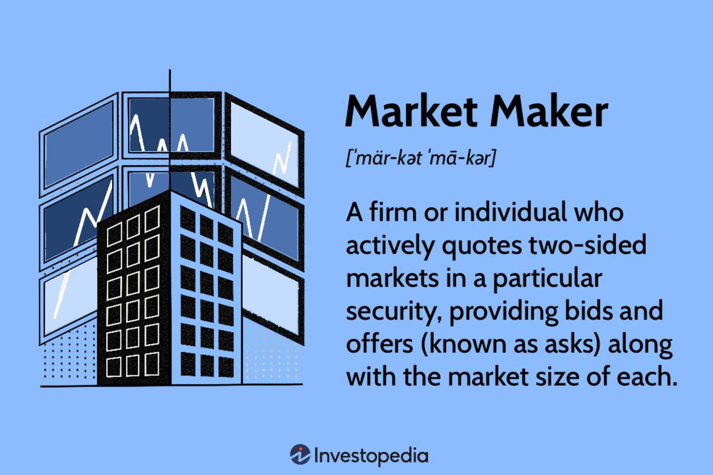

## Table of Contents

## What is a market maker?

A market maker is a person or a company that helps to buy and sell things in a market. They make sure that there are always people who want to buy and people who want to sell. This helps keep the market running smoothly. For example, in a stock market, a market maker makes sure there are always prices for stocks, so people can trade them easily.

Market makers make money by buying things at a lower price and selling them at a higher price. The difference between these two prices is called the "bid-ask spread." This is their profit. They take a risk because the price of what they are buying and selling can change quickly. But they help keep the market stable and make it easier for everyone to trade.

## What is the primary role of a market maker in financial markets?

The primary role of a market maker in financial markets is to ensure that there is always someone willing to buy or sell a security, like a stock or bond. This means that if you want to sell your stock, the market maker will buy it from you, and if you want to buy a stock, they will sell it to you. By doing this, market makers help keep the market liquid, which means it's easy for people to trade whenever they want.

Market makers make money by buying securities at a lower price and selling them at a higher price. The difference between these two prices is called the "bid-ask spread," and that's their profit. They take on risk because the prices of securities can change quickly, but their role is crucial because they help keep the market stable and make it easier for everyone to trade.

## How does a market maker facilitate trading?

A market maker helps trading by always being ready to buy or sell securities, like stocks or bonds. Imagine you want to sell your stock. If no one wants to buy it right away, you might have to wait a long time. But with a market maker, they will buy your stock from you. This makes it easy and quick for you to sell. On the other hand, if you want to buy a stock, the market maker will sell it to you. They keep the market moving by always being there to trade with you.

Market makers make money by buying things at a lower price and selling them at a higher price. The difference between these two prices is called the "bid-ask spread," and that's how they earn their profit. It's a bit risky for them because the prices can change quickly, but they help keep the market stable. By always being ready to trade, they make sure that people can buy and sell securities easily and quickly, which is important for a healthy market.

## What are the typical responsibilities of a market maker?

A market maker's main job is to keep the market working smoothly by always being ready to buy or sell securities like stocks or bonds. If someone wants to sell their stock, the market maker will buy it from them, making sure they don't have to wait too long. On the other hand, if someone wants to buy a stock, the market maker will sell it to them. This helps keep the market liquid, meaning people can trade easily and quickly.

Market makers make money by buying securities at a lower price and selling them at a higher price. The difference between these two prices is called the "bid-ask spread," and that's how they earn their profit. It can be risky for them because prices can change quickly, but they play a crucial role in keeping the market stable. By always being ready to trade, they make sure that the market stays active and people can buy and sell what they need without trouble.

## How does a market maker generate revenue?

A market maker makes money by buying things at a lower price and selling them at a higher price. This difference between the buying price and the selling price is called the "bid-ask spread." For example, if a market maker buys a stock for $10 and sells it for $10.05, the 5 cents difference is their profit. This is how they earn money every time they help someone buy or sell a stock.

It's a bit risky for market makers because the prices of stocks can change quickly. If the price goes down after they buy it, they might lose money. But because they do this many times a day, they can still make a profit overall. Their job is important because they help keep the market running smoothly by always being ready to trade, which makes it easier for everyone else to buy and sell stocks.

## What is the bid-ask spread and how does it relate to a market maker's revenue?

The bid-ask spread is the difference between the highest price someone is willing to pay for a stock (the bid) and the lowest price someone is willing to sell it for (the ask). For example, if the highest bid for a stock is $10 and the lowest ask is $10.05, the bid-ask spread is 5 cents. This spread is important because it's how market makers make money. They buy stocks at the lower bid price and sell them at the higher ask price, pocketing the difference as profit.

Market makers help keep the market running smoothly by always being ready to buy or sell stocks. When someone wants to sell their stock, the market maker will buy it from them at the bid price. When someone wants to buy a stock, the market maker will sell it to them at the ask price. Every time they do this, they earn the bid-ask spread. Even though the price of stocks can change quickly and it can be risky, market makers can make a lot of trades in a day, so they can still make a good profit overall.

## Can you explain the concept of liquidity provision by market makers?

Liquidity provision by market makers means they help make sure there are always people who want to buy and sell stocks or other things in the market. When you want to sell your stock, you might not find someone right away who wants to buy it. But a market maker will buy it from you, so you don't have to wait. This makes it easier and quicker for everyone to trade. They do the same thing when you want to buy a stock; they will sell it to you. By always being ready to trade, market makers keep the market moving smoothly.

Market makers make money from the difference between the price they buy a stock for and the price they sell it for. This difference is called the "bid-ask spread." For example, if they buy a stock for $10 and sell it for $10.05, they make 5 cents on that trade. Even though the price of stocks can change quickly and it can be risky, market makers do a lot of trades every day. This helps them make a profit overall. Their job is important because they help keep the market active and make sure people can buy and sell what they need without trouble.

## What are the risks faced by market makers and how do they manage them?

Market makers face several risks in their job. One big risk is that the price of the stocks they buy can go down before they sell them. This means they might lose money if they have to sell the stock for less than what they paid for it. Another risk is that they might not be able to find someone to buy the stocks they hold, which can tie up their money and make it hard to do other trades. Also, if the market is very busy and prices change a lot, it can be hard for market makers to keep up and make sure they are making a profit.

To manage these risks, market makers use different strategies. They often spread out their risks by trading many different stocks instead of focusing on just a few. This way, if they lose money on one stock, they might make money on another. They also use technology to help them keep track of prices and make quick decisions. Market makers might also set limits on how much they are willing to lose on any one trade, so they don't lose too much money if things go wrong. By being careful and using these strategies, market makers can keep doing their important job of keeping the market running smoothly.

## How do market makers impact market efficiency and price discovery?

Market makers help make the market more efficient by making it easier for people to buy and sell stocks quickly. They do this by always being ready to buy or sell stocks, which means you don't have to wait a long time to make a trade. This helps keep the market moving smoothly. When the market is efficient, it means that people can trade without big delays, and the prices of stocks stay fair because there's always someone ready to trade.

Market makers also help with price discovery, which is how the market figures out what a stock is worth. They do this by setting the bid and ask prices for stocks. The bid price is what they're willing to pay to buy a stock, and the ask price is what they want to sell it for. By always putting out these prices, market makers help show what people think a stock is worth at any moment. This helps everyone in the market understand the true value of stocks and make better trading decisions.

## What are the regulatory requirements for market makers?

Market makers have to follow rules set by government agencies like the Securities and Exchange Commission (SEC) in the United States. These rules make sure that market makers do their job fairly and don't cheat. For example, they have to show the prices they are willing to buy and sell stocks at, so everyone knows what's going on. They also have to keep enough money or assets to cover their trades, so they can pay people if they need to.

Another important rule is that market makers can't use inside information, which is secret information that could affect stock prices. They have to make their trades based on what everyone else knows. If they break these rules, they can get in big trouble, like fines or even being banned from working in the market. These regulations help keep the market fair and make sure that market makers help the market work well for everyone.

## How do technological advancements influence the operations of market makers?

Technological advancements have made a big difference in how market makers do their job. They use computers and special software to keep track of stock prices and make trades very quickly. This helps them react to changes in the market faster than before. For example, they can use algorithms to decide when to buy or sell stocks based on lots of information. This makes their work more efficient and helps them manage the risks of price changes better.

Also, technology has made it easier for market makers to handle more trades at the same time. They can use electronic trading platforms to connect with lots of buyers and sellers around the world. This means they can provide more [liquidity](/wiki/liquidity-risk-premium) to the market and help keep prices stable. But it also means they have to keep up with new technology and stay competitive, which can be challenging. Overall, technology has helped market makers do their job better and keep the market running smoothly.

## What are the differences between traditional market makers and electronic market makers?

Traditional market makers and electronic market makers both help keep the market running smoothly, but they do it in different ways. Traditional market makers are usually people or firms that work on trading floors or over the phone. They use their experience and knowledge to decide when to buy and sell stocks. They also talk directly with other traders and clients, which can help build relationships and trust. Traditional market makers might be better at understanding the big picture of the market because they can see and feel the energy on the trading floor.

Electronic market makers, on the other hand, use computers and special software to do their job. They can make trades much faster and handle more trades at the same time than traditional market makers. They use algorithms to decide when to buy or sell stocks based on lots of data. This makes their work more efficient and helps them react quickly to changes in the market. However, they might miss out on the personal touch and the big-picture understanding that traditional market makers can have. Both types of market makers are important and help keep the market liquid and stable, but they do it in different ways.

## References & Further Reading

[1]: ["Advances in Financial Machine Learning"](https://www.amazon.com/Advances-Financial-Machine-Learning-Marcos/dp/1119482089) by Marcos Lopez de Prado

[2]: ["Quantitative Trading: How to Build Your Own Algorithmic Trading Business"](https://www.amazon.com/Quantitative-Trading-Build-Algorithmic-Business/dp/0470284889) by Ernest P. Chan

[3]: ["Market Microstructure and Its Applications"](https://www.sciencedirect.com/topics/economics-econometrics-and-finance/market-microstructure) by Hui Liu, Dongyoung Kim, and Thomas McInish 

[4]: Hasbrouck, Joel. (2007). ["Empirical Market Microstructure: The Institutions, Economics, and Econometrics of Securities Trading."](https://academic.oup.com/book/52241) Oxford University Press.

[5]: Harris, Larry. (2003). ["Trading and Exchanges: Market Microstructure for Practitioners."](https://academic.oup.com/book/52292) Oxford University Press.

[6]: Aldridge, Irene. (2013). ["High-Frequency Trading: A Practical Guide to Algorithmic Strategies and Trading Systems."](https://www.amazon.com/High-Frequency-Trading-Practical-Algorithmic-Strategies/dp/1118343506) Wiley Finance Series.

[7]: Mackintosh, Phil. (2020). ["The Role of Market Makers: Key Players in the Financial Ecosystem."](https://www.nasdaq.com/market-makers) Nasdaq.

[8]: ["Financial Markets and Trading: An Introduction to Market Microstructure and Trading Strategies"](https://www.wiley.com/en-us/Financial+Markets+and+Trading%3A+An+Introduction+to+Market+Microstructure+and+Trading+Strategies-p-9780470924129) by Anatoly B. Schmidt