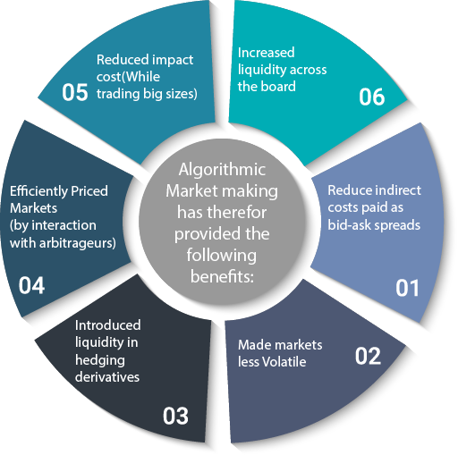

In today's fast-paced financial markets, technology plays a crucial role in trading. The advent of market maker finance and algorithmic trading has brought significant transformations to the exchange of financial assets. These strategies have revolutionized how trades are conducted by enhancing liquidity, speed, and accuracy, thus altering the traditional landscape of financial transactions.

Market maker finance involves specific financial entities that assume the role of liquidity providers. By offering continuous buy and sell quotes, market makers ensure more stable and efficient transactions. This ongoing process contributes significantly to market stability and efficiency, making market makers pivotal players in the financial ecosystem. Their operational model is typically centered around profiting from the bid-ask spread—the difference between the buying and selling price—along with other strategic methods.

Algorithmic trading, commonly known as algo trading, involves using computer programs to automate the trading process. These algorithms can execute trades at a speed and frequency that far surpass human capabilities. The integration of algorithms into trading operations has transformed modern financial markets, introducing a level of automation and precision previously unattainable. Furthermore, algorithmic trading encompasses a variety of strategies, each designed to capitalize on certain market conditions, while significantly reducing human error and boosting market efficiency.

This article explores how these two key financial concepts—market maker finance and algorithmic trading—interact and integrate. The interplay between market maker operations and algo trading technology has given rise to innovative strategies and efficiencies. Nonetheless, this technological fusion also presents challenges that market participants must navigate, including managing the complexities of algorithm design and adhering to evolving regulations.

By examining the mechanics, advantages, and challenges associated with market maker finance and algo trading, this article aims to provide a comprehensive understanding of these essential components of today's financial markets.

## Table of Contents

## Understanding Market Maker Finance

Market maker finance consists of liquidity providers that play an integral role in the smooth functioning of financial markets. These entities, known as market makers, are essential for ensuring stability and efficiency by continuously offering buy and sell quotes for various financial instruments. This continuous quoting means market makers are always ready to buy or sell at their specified prices, allowing other market participants to execute trades without significant delay.

The primary responsibility of market makers is to provide [liquidity](/wiki/liquidity-risk-premium), reducing the transaction cost for traders and minimizing the bid-ask spread— the difference between the price at which a market maker is willing to buy (bid) and sell (ask) a security. By doing so, market makers facilitate a more fluid market environment, minimizing price [volatility](/wiki/volatility-trading-strategies) and enhancing market depth.

Market makers often profit through the bid-ask spread. When they buy a security at the bid price and sell it at the higher ask price, they capture the spread as profit. This process requires maintaining a delicate balance of buying and selling activities. Moreover, market makers employ a variety of strategies to optimize their operations and manage risks. These strategies often include hedging positions and dynamically adjusting quotes based on market conditions and anticipated price changes.

In addition to profiting from the spread, market makers may benefit from receiving rebates or incentives from exchanges for providing liquidity. Such incentives are designed to encourage market makers to quote tighter spreads and keep markets more competitive. However, this role also requires holding inventory of various securities, which introduces the risk of adverse price movements. Effective risk management techniques are critical to offset potential losses associated with holding assets over time.

Market makers are often pivotal during periods of market stress or low liquidity, as their active participation can mitigate sharp price swings and ensure continuous availability of trading opportunities. Consequently, their operations contribute to overall market stability and are a fundamental aspect of a healthy, functioning marketplace.

## The Rise of Algorithmic Trading

Algorithmic trading, commonly referred to as algo trading, involves the use of computer algorithms to automate the process of executing trades in financial markets. These algorithms are designed to perform extensive market analysis, implement trading strategies, and execute orders at speeds and frequencies that are beyond the capability of human traders. The primary goal is to capitalize on market inefficiencies in terms of timing, leverage rapid transaction execution, and efficiently manage a higher [volume](/wiki/volume-trading-strategy) of trades.

One of the most significant transformations brought by algo trading in modern finance is its ability to handle and process large volumes of data in real time. Algorithms can analyze multiple market indicators and execute trades in microseconds, allowing traders to react almost instantaneously to market changes. This has led to an increase in market liquidity and narrower bid-ask spreads, which are beneficial to all market participants.

There are several types of [algorithmic trading](/wiki/algorithmic-trading) strategies employed in financial markets today. These include:

1. **Market Making:** Algorithms dynamically adjust bid and ask orders to profit from the spread and provide liquidity to the market.

2. **Arbitrage:** Algorithms identify and exploit price discrepancies of the same asset across different markets to make risk-free profits.

3. **Trend Following:** These strategies use technical indicators to recognize and exploit market trends. For example, moving averages can signal trading patterns.

4. **Statistical Arbitrage:** This involves using statistical methods to trade based on the expected mean reversion of price pairs or baskets of securities.

5. **Execution-Based Strategies:** These aim to execute large orders without affecting the market price, using tactics such as Time Weighted Average Price (TWAP) or Volume Weighted Average Price (VWAP).

The advantages of algo trading extend beyond speed and efficiency. By reducing the reliance on human intervention, it minimizes the likelihood of errors due to emotional or psychological factors. Algorithms operate based on pre-defined instructions and sophisticated data analysis, which can improve the accuracy of market predictions and enhance decision-making processes. Consequently, this leads to increased market efficiency and more consistent trading outcomes.

The deployment of algorithms in trading has led to significant advancements in financial markets. It has democratized trading by providing participants with tools to execute complex strategies with precision. While initially the domain of large financial institutions, advancements in technology and accessibility have enabled a broader range of market participants to benefit from algorithmic trading. As technology continues to advance, so too will the sophistication and prevalence of algo trading, shaping the future landscape of financial markets.

## Integrating Algo Trading into Market Maker Finance

Market makers have increasingly integrated algorithmic trading technology into their operations to optimize trading strategies and minimize risks. This integration has become essential due to the high demands for speed and precision in today's financial markets.

Algo trading technology allows market makers to automate the decision-making processes required to place buy and sell orders rapidly. Algorithms analyze vast datasets to identify trading opportunities that match predetermined criteria, ensuring market makers can maintain liquidity and manage significant transaction volumes efficiently. By automating these processes, market makers can react to market changes within milliseconds, an advantage that is critical for maintaining competitiveness in high-speed trading environments.

High-frequency trading ([HFT](/wiki/high-frequency-trading-strategies)) algorithms significantly impact market makers by enabling them to execute trades at an unparalleled speed and frequency. These algorithms are designed to exploit even the smallest price discrepancies, generating profits from minute variations between buying and selling prices. The capability of HFT to process numerous transactions in a fraction of a second enhances a market maker's ability to provide continuous and competitive bid-ask spreads.

The synergy between algo trading and market maker operations is evident in their shared objective: achieving market liquidity and stability. By employing sophisticated algorithms, market makers can handle large volumes of transactions without significant human intervention, thereby reducing the likelihood of human error and ensuring consistent market participation.

However, implementing complex algorithmic systems presents several challenges. Developing reliable algorithms requires significant expertise in both financial markets and programming. These algorithms must be rigorously tested to ensure they function correctly under various market conditions, which adds complexity to the design and implementation phases. Moreover, the rapid nature of algorithmic trading necessitates robust risk management strategies to prevent unintended market impacts, such as flash crashes, which can occur due to faulty algorithms or unexpected market conditions.

Furthermore, regulatory challenges pose additional constraints. Market makers must ensure compliance with evolving regulations that govern algorithmic trading practices. These regulations are designed to safeguard market integrity and reduce systemic risk, necessitating that market makers continually adapt their strategies to align with new rules.

In conclusion, the integration of algorithmic trading into market maker finance has transformed the trading landscape, enabling market makers to sustain liquidity and manage extensive transaction volumes with enhanced efficiency and speed. Overcoming the challenges associated with complex algorithms and regulatory compliance is crucial for market makers to fully leverage the advantages of this technology.

## Benefits of Algo Trading for Market Makers

Algorithmic trading, or algo trading, presents significant benefits for market makers by enhancing decision-making capabilities and reducing transaction costs. This advanced trading strategy relies on sophisticated computer algorithms to execute orders at high speeds, facilitating tighter bid-ask spreads and resulting in higher trading volumes. Tighter spreads occur because algorithms allow for rapid adjustments to buy and sell quotes, enhancing liquidity and minimizing the cost of entry and [exit](/wiki/exit-strategy) from market positions.

Furthermore, algorithms play a critical role in market prediction and price discovery. By analyzing vast amounts of market data in real time, these algorithms can identify trends and patterns that are not immediately visible to human traders. This capability supports market makers in making informed predictions about future price movements, thus optimizing their inventory and risk management strategies. 

Consider, for example, the notable case of Citadel Securities. The firm employs sophisticated algorithms to manage enormous volumes of trades with precision, resulting in lowered transaction costs and improved profitability. This successful integration illustrates how advanced technical methodologies can provide a competitive edge in high-frequency trading environments.

The broader impact of algorithm-driven market makers on market dynamics is substantial. By enabling more efficient and accurate pricing, these algorithms contribute to overall market efficiency. They ensure that market prices reflect available information more accurately and quickly, facilitating fairer and more transparent trading conditions. In addition, the increased efficiency and liquidity provided by algo trading help stabilize markets by diminishing volatility and enhancing resilience during periods of high stress or rapid market changes.

In conclusion, the integration of algorithmic trading in [market making](/wiki/market-making) is a transformative advancement that offers numerous benefits. From cost reductions and enhanced predictive capabilities to broader market efficiency and stability, the advantages of algorithmic solutions are profoundly reshaping the landscape of modern financial trading.

## Challenges and Risks in Market Maker Algo Trading

Market maker algo trading encompasses a blend of sophisticated strategies and challenges that require careful navigation. The design of reliable and effective trading algorithms presents complexity due to the dynamic nature of financial markets. These algorithms must swiftly analyze data, predict market movements, and execute orders with precision. The successful operation of trading algorithms demands a robust infrastructure that can manage high-volume transactions without latency issues. Furthermore, the algorithms must be adaptive to account for changing market conditions, which often require continuous updates and testing.

Technical challenges in algorithmic market making include ensuring the resilience of trading systems against unexpected market behavior. High-frequency trading (HFT) systems, for instance, require precise timing and discernment to avoid adverse outcomes such as slippage, where a trade executes at a less favorable price due to rapid market movements. Additionally, the technological infrastructure must ensure redundancy and fault tolerance to prevent system failures that could lead to significant financial losses.

Regulatory challenges are prominent, as financial authorities aim to maintain market integrity and stability. Regulators impose rules that demand transparency, such as the requirement to disclose trading algorithms' logic or data used for decision-making. Compliance with such regulations requires market makers to implement rigorous monitoring and reporting systems. Moreover, global markets function under diverse regulatory frameworks, which necessitates that algorithmic strategies comply with the specific rules of each jurisdiction where they operate.

One significant risk associated with algorithmic trading is the potential for flash crashes. These are rapid declines in market prices followed by an equally swift recovery, often triggered by erroneous algorithms or cascading automated trades. Such incidents underscore the importance of implementing safeguards like circuit breakers, which halt trading in case of extreme volatility. Market makers utilize kill switches to automatically stop trading activities when anomalies are detected, minimizing the risk of unintended market impacts.

To mitigate risks while remaining competitive, market makers invest in advanced risk management systems that incorporate real-time analytics for early identification of potential threats. Machine learning and [artificial intelligence](/wiki/ai-artificial-intelligence) play critical roles in enhancing these systems by providing predictive analytics and anomaly detection, which refine trading strategies and mitigate risks.

The regulatory landscape for algorithmic trading continues to evolve, with increased scrutiny from financial authorities. Initiatives aim to ensure that trading algorithms are fair, transparent, and do not contribute to market abuse. Regulations such as the Markets in Financial Instruments Directive II (MiFID II) in the European Union exemplify efforts to enhance the transparency and integrity of trading activities. Market makers must stay informed of regulatory changes and adopt compliance strategies that align with new legislation, balancing innovation with adherence to financial laws. 

Overall, the success of market maker algo trading depends on the integration of cutting-edge technology with strong governance frameworks and diligent risk management practices. Market makers who effectively address these challenges are better positioned to thrive in the increasingly complex and competitive financial landscape.

## Future Trends in Market Maker Finance and Algo Trading

Emerging technologies such as artificial intelligence (AI) and [machine learning](/wiki/machine-learning) are poised to significantly transform market maker algorithms. These technologies can process and analyze vast amounts of data at unprecedented speeds, enabling market makers to anticipate market trends and execute trades more effectively. For instance, machine learning algorithms can identify complex patterns in trading data, allowing market makers to optimize their strategies and improve their liquidity provision. AI-driven algorithms can adapt to changing market conditions, making them particularly valuable in volatile markets.

The regulatory landscape surrounding algorithmic trading strategies is also evolving. Increased scrutiny from regulatory bodies is prompting the development of more robust compliance frameworks. Market makers must now ensure their algorithms are not only effective but also transparent and compliant with existing and future regulations. Changes aimed at reducing systemic risk may include stricter requirements for algorithm testing and more comprehensive reporting obligations. These regulations are likely to influence the design and implementation of market maker algorithms.

Transparency and systemic risk reduction are becoming key trends in financial markets. As markets move towards greater transparency, there is an increased demand for algorithms that are not only efficient but also understandable and accountable. This shift requires market makers to refine their strategies and improve risk management practices. Algorithms designed with transparency in mind can contribute to a more stable financial system by facilitating clearer communication and understanding of market behaviors.

Predictions about the future of market maker finance with technology integration suggest continued innovation and adaptation. The integration of advanced technologies promises to enhance market efficiency and resilience. Market makers who leverage these advancements are likely to gain a competitive edge, achieving more precise pricing and improved execution speeds. Innovations such as quantum computing, although still in nascent stages, hold potential for further optimizing trading algorithms.

In conclusion, the long-term outlook for market maker finance and algorithmic trading is promising but complex. While technology enables more sophisticated and efficient trading strategies, it also introduces new challenges in terms of regulation and risk management. Success in this evolving landscape will require a balance between embracing innovation and maintaining robust oversight. Continuous exploration and adaptation of emerging technologies will be crucial for market makers aiming to stay competitive and compliant in the future financial ecosystem.

## Conclusion

Market maker finance and algorithmic trading have significantly transformed financial markets by enhancing liquidity and optimizing trade execution. These concepts reshaped the landscape by increasing the efficiency and stability of markets, ultimately benefiting both individual and institutional investors. Market makers, through their role in providing liquidity, ensure that buyers and sellers can execute trades at any time, thus preventing large price swings and maintaining orderly markets. Algorithmic trading, on the other hand, has revolutionized the speed and precision with which trades are executed, enabling the handling of massive data volumes and complex calculations that far exceed human capabilities.

The pivotal role of technology in advancing trading strategies cannot be overstated. Innovations such as high-frequency trading (HFT) and sophisticated algorithms have allowed traders to execute large numbers of trades at reduced costs and with greater precision, consequently enhancing market efficiency. Furthermore, the integration of artificial intelligence and machine learning into trading systems promises even deeper insights and predictive capabilities, positioning market players to anticipate market movements effectively.

However, the rapid advancement in trading technologies comes with challenges, particularly in risk management. The complexity of designing robust algorithms that can function reliably under diverse market conditions is a primary concern. Ensuring that innovation does not outpace the ability to manage associated risks is crucial. Unintended consequences, such as flash crashes, highlight the potential vulnerabilities in automated trading systems, necessitating comprehensive risk mitigation strategies and regulatory oversight.

To maintain a competitive edge, continued exploration and adaptation of trading technologies are vital. As markets evolve, so too must the tools and strategies employed by market participants. This dynamism encourages innovation but also requires vigilance to manage new risks effectively. Participants in the financial markets are encouraged to stay informed of ongoing developments in market making and algorithmic trading. Keeping abreast of technological and regulatory changes will equip them to navigate the future of financial trading with confidence, balancing the pursuit of technological advancement with prudent risk management.

## References & Further Reading

[1]: ["Advances in Financial Machine Learning"](https://www.amazon.com/Advances-Financial-Machine-Learning-Marcos/dp/1119482089) by Marcos Lopez de Prado

[2]: ["Quantitative Trading: How to Build Your Own Algorithmic Trading Business"](https://www.amazon.com/Quantitative-Trading-Build-Algorithmic-Business/dp/0470284889) by Ernest P. Chan

[3]: ["Market Microstructure and Its Applications"](https://www.sciencedirect.com/topics/economics-econometrics-and-finance/market-microstructure) by Hui Liu, Dongyoung Kim, and Thomas McInish 

[4]: Hasbrouck, Joel. (2007). ["Empirical Market Microstructure: The Institutions, Economics, and Econometrics of Securities Trading."](https://academic.oup.com/book/52241) Oxford University Press.

[5]: Harris, Larry. (2003). ["Trading and Exchanges: Market Microstructure for Practitioners."](https://academic.oup.com/book/52292) Oxford University Press.

[6]: Aldridge, Irene. (2013). ["High-Frequency Trading: A Practical Guide to Algorithmic Strategies and Trading Systems."](https://www.amazon.com/High-Frequency-Trading-Practical-Algorithmic-Strategies/dp/1118343506) Wiley Finance Series.

[7]: Mackintosh, Phil. (2020). ["The Role of Market Makers: Key Players in the Financial Ecosystem."](https://www.nasdaq.com/market-makers) Nasdaq.

[8]: ["Financial Markets and Trading: An Introduction to Market Microstructure and Trading Strategies"](https://www.wiley.com/en-us/Financial+Markets+and+Trading%3A+An+Introduction+to+Market+Microstructure+and+Trading+Strategies-p-9780470924129) by Anatoly B. Schmidt