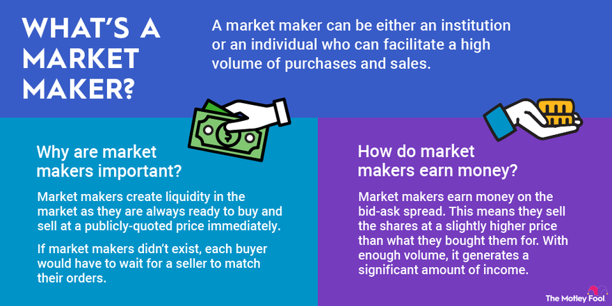

## Table of Contents

## What is a market maker?

A market maker is a person or a company that helps to buy and sell things in a market. They make sure there are always prices available for people who want to trade. For example, if you want to buy or sell a stock, the market maker will be there to help you do that by giving you a price.

Market makers are important because they keep the market running smoothly. They do this by always being ready to buy or sell, which helps to keep the market stable. They make money from the difference between the price they buy at and the price they sell at, which is called the "bid-ask spread."

## What is the market maker spread?

The market maker spread, also known as the bid-ask spread, is the difference between the price at which a market maker is willing to buy something and the price at which they are willing to sell it. For example, if a market maker is willing to buy a stock for $10 and sell it for $10.05, the spread is $0.05. This spread is how market makers make money, as they buy low and sell high.

The size of the spread can depend on many things, like how easy it is to buy or sell the thing being traded, how much of it is available, and how much people want it. If something is very popular and easy to trade, the spread might be small. But if it's hard to trade or not many people want it, the spread might be bigger. The spread is important because it affects the cost of trading and can show how easy or hard it is to trade something in the market.

## How is the market maker spread calculated?

The market maker spread is calculated by finding the difference between two prices: the bid price and the ask price. The bid price is what the market maker is willing to pay to buy something, and the ask price is what they want to sell it for. To find the spread, you just subtract the bid price from the ask price. For example, if the bid price is $50 and the ask price is $50.10, the spread is $0.10.

The spread can change depending on different things like how easy it is to trade something, how much of it is available, and how much people want it. If something is very popular and easy to trade, the spread might be small because there are a lot of people buying and selling. But if it's hard to trade or not many people want it, the spread might be bigger because it's riskier for the market maker. The spread is important because it tells you how much it costs to trade something and can show how easy or hard it is to trade in the market.

## Why is the market maker spread important for traders?

The market maker spread is important for traders because it tells them how much it will cost to buy or sell something. When a trader wants to buy something, they have to pay the ask price, which is higher than the bid price. When they want to sell, they get the bid price, which is lower than the ask price. The difference between these two prices is the spread, and it's like a fee that traders have to pay every time they trade. A smaller spread means it's cheaper to trade, and a bigger spread means it's more expensive.

The spread also gives traders information about how easy or hard it is to trade something. If the spread is small, it means there are a lot of people buying and selling, and it's easy to trade. If the spread is big, it means fewer people are trading, and it might be harder or riskier. Traders use this information to decide if they want to trade something or not. A big spread might make them think twice because it could mean they will lose more money just to make a trade.

## What factors influence the size of the market maker spread?

The size of the market maker spread can change because of many things. One big thing is how easy it is to buy or sell something. If lots of people want to buy and sell, the spread will be small because it's easy for the market maker to find someone to trade with. But if not many people want to trade, the spread will be bigger because it's harder for the market maker to find someone, and it's riskier for them.

Another thing that affects the spread is how much of something is available. If there's a lot of something, the spread will be smaller because there's no rush to buy or sell. But if there's not much of it, the spread can be bigger because people might be in a hurry to trade, and the market maker can charge more. Also, how much people want something matters. If something is really popular, the spread might be smaller because lots of people are trading it. But if it's not popular, the spread can be bigger because fewer people want to trade it.

## How does the market maker spread affect liquidity?

The market maker spread is important for how easy it is to trade something, which we call [liquidity](/wiki/liquidity-risk-premium). When the spread is small, it means it's easy to buy and sell because there are lots of people trading. This makes the market more liquid because you can quickly find someone to trade with. A small spread encourages more people to trade because it's cheaper, which makes the market even more liquid.

On the other hand, if the spread is big, it means it's harder to trade. A big spread can scare people away because it costs more to buy or sell. When fewer people want to trade, the market becomes less liquid. This makes it harder for people to find someone to trade with, and it can make the market slower and less active. So, the size of the market maker spread can really change how easy or hard it is to trade in the market.

## Can you provide a simple example of a market maker spread in action?

Let's say you want to buy a toy car. You go to a store where a market maker, like a toy shop owner, is selling toy cars. The market maker says they will buy toy cars from people for $5 each, which is the bid price. They also say they will sell toy cars to people for $5.50 each, which is the ask price. The difference between the bid price and the ask price is the market maker spread, which in this case is $0.50.

If you decide to buy the toy car, you have to pay the ask price of $5.50. If later you want to sell the toy car back to the market maker, they will only give you the bid price of $5. The market maker makes money from the spread because they buy low at $5 and sell high at $5.50. This spread also shows how easy it is to buy and sell toy cars at the store. If lots of people are buying and selling toy cars, the spread might be smaller, making it easier and cheaper to trade.

## What is the relationship between market maker spread and bid-ask spread?

The market maker spread and the bid-ask spread are the same thing. They both mean the difference between the price a market maker will pay to buy something, called the bid price, and the price they will sell it for, called the ask price. For example, if a market maker is willing to buy a toy for $10 and sell it for $10.50, the spread is $0.50.

This spread is important because it shows how much it costs to trade and how easy it is to buy or sell something. A smaller spread means it's cheaper to trade and there are lots of people buying and selling, making the market more active. A bigger spread means it's more expensive to trade and fewer people might be trading, which can make the market slower.

## How do market makers profit from the spread?

Market makers make money from the difference between the price they buy something for and the price they sell it for. This difference is called the spread. For example, if a market maker buys a toy for $10 and sells it for $10.50, they make a profit of $0.50 on each toy they trade. This profit comes from the spread, and it's how market makers earn their money.

The spread is important because it helps market makers cover their costs and make a profit. They need to buy things at a lower price and sell them at a higher price to make money. The size of the spread can change depending on how easy it is to trade something and how many people want to buy or sell it. If lots of people are trading, the spread might be small, but market makers can still make money because they trade a lot. If fewer people are trading, the spread might be bigger, which helps market makers make money even if they trade less often.

## What strategies can traders use to minimize the impact of the market maker spread?

Traders can use a few strategies to minimize the impact of the market maker spread. One way is to trade things that have a small spread. If the difference between the buy price and the sell price is small, it costs less to trade. Traders can look for things that are popular and easy to trade because these usually have smaller spreads. Another way is to use limit orders instead of market orders. With a limit order, traders can set the price they want to buy or sell at, which can help them get a better deal and save money on the spread.

Another strategy is to trade during times when the market is very active. When lots of people are buying and selling, the spread usually gets smaller because it's easier for market makers to find someone to trade with. Traders can also try to trade bigger amounts at once. When they trade more, they might be able to get a better price from the market maker, which can help lower the cost of the spread. By using these strategies, traders can save money and make their trades more profitable.

## How does the market maker spread vary across different financial instruments?

The market maker spread can be different for different things you can trade, like stocks, bonds, or currencies. For example, if lots of people want to buy and sell a certain stock, the spread for that stock will be small. This is because it's easy for the market maker to find someone to trade with, so they don't need to charge as much. But if not many people want to trade a certain bond, the spread for that bond might be bigger. This is because it's harder for the market maker to find someone to trade with, so they need to charge more to cover their risk.

The type of financial instrument also matters. Stocks of big, well-known companies usually have smaller spreads because lots of people trade them. On the other hand, things like small company stocks or less common bonds might have bigger spreads because fewer people trade them. Also, things that are traded a lot during the day, like currencies, often have smaller spreads because the market is always busy. But things that are traded less often, like some types of futures, might have bigger spreads because the market is slower.

## What are the regulatory considerations regarding market maker spreads?

Regulators care about market maker spreads because they want to make sure the market is fair and works well for everyone. They set rules to make sure that market makers don't make the spread too big, which would make it expensive for people to trade. For example, they might check if the spreads are too big compared to what they should be, and if they find this, they can make the market makers change their prices. This helps keep trading costs low and makes the market more active and fair for all traders.

Regulators also want to make sure that market makers are doing their job properly. They have rules that say market makers must always be ready to buy and sell things, which helps keep the market running smoothly. If market makers don't follow these rules, they can get in trouble. By watching the spreads and making sure market makers follow the rules, regulators help keep the market safe and fair for everyone who wants to trade.

## What is the Market-Maker Spread Explained?

The market-maker spread is a critical component of financial markets, particularly in the dynamics of trading and liquidity provision. At its core, the market-maker spread represents the bid-ask spread—the disparity between the price at which a market maker is willing to purchase an asset (the bid price) and the price at which they are willing to sell it (the ask price). This spread is a primary source of profit for market makers and serves as a mechanism for risk management.

In financial transactions, the bid-ask spread is fundamental as it captures the negotiation range between buyers and sellers. The highest price a buyer is willing to pay for a security is known as the bid, while the lowest price a seller is willing to accept constitutes the ask. The spread, therefore, is the difference: 

$$
\text{Spread} = \text{Ask Price} - \text{Bid Price}
$$

The magnitude of this spread is influenced by various market conditions, including the liquidity of the security and prevailing [volatility](/wiki/volatility-trading-strategies) levels. In highly liquid markets, where securities are frequently traded, and there is substantial competition among market makers, spreads tend to be tight. This implies lower transaction costs for traders and generally more favorable conditions for executing trades.

Conversely, wide spreads are indicative of higher risks and lower liquidity. Such conditions may arise in less frequently traded securities or during periods of significant market volatility. Wider spreads increase the cost of trading, reflecting the additional risk that market makers bear.

For traders, understanding and analyzing market-maker spreads are vital for assessing current market conditions. A narrow spread usually signals a stable and liquid market, while a broad spread can indicate potential instability or lower trading activity. By monitoring these spreads, traders can make more informed decisions, optimizing their strategies and execution timing.

The bid-ask spread is not just a mechanism for profit for market makers but also a critical indicator of the underlying health and efficiency of the trading environment. As such, it plays a crucial role in the overall functioning of financial markets, impacting everything from trade execution to strategic planning.

## References & Further Reading

[1]: Khandani, A. E., & Lo, A. W. (2007). ["What Happened to the Quants in August 2007?"](https://www.nber.org/papers/w14465) Journal of Investment Management, 5(4), 5-54.

[2]: Hasbrouck, J. (2007). ["Empirical Market Microstructure: The Institutions, Economics, and Econometrics of Securities Trading."](https://academic.oup.com/book/52241) Oxford University Press.

[3]: Harris, L. (2003). ["Trading and Exchanges: Market Microstructure for Practitioners."](https://www.amazon.com/Trading-Exchanges-Market-Microstructure-Practitioners/dp/0195144708) Oxford University Press.

[4]: Aldridge, I. (2013). ["High-Frequency Trading: A Practical Guide to Algorithmic Strategies and Trading Systems."](https://www.amazon.com/High-Frequency-Trading-Practical-Algorithmic-Strategies/dp/1118343506) Wiley.

[5]: Gomber, P., Arndt, B., Lutat, M., & Uhle, T. (2011). ["High-frequency trading."](https://papers.ssrn.com/sol3/papers.cfm?abstract_id=1858626) Wirtschaftsinformatik, 53(2), 95-103.