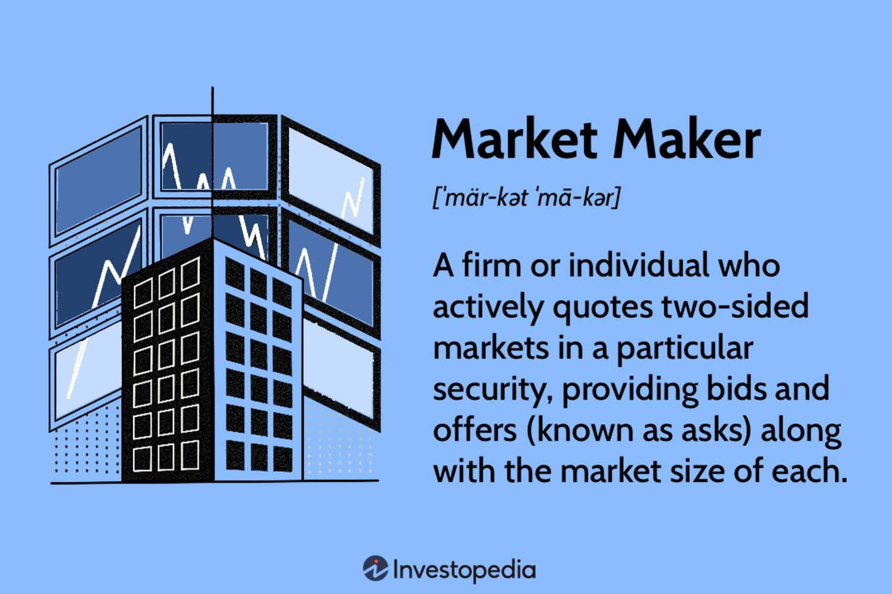

## Table of Contents

## What is a market maker?

A market maker is a person or a company that helps to buy and sell things in a market. They make sure there are always people who want to buy and people who want to sell. This helps keep the market working smoothly. For example, in the stock market, a market maker might buy stocks from someone who wants to sell and then sell those stocks to someone who wants to buy.

Market makers make money by charging a small fee, called a spread, which is the difference between the price they buy at and the price they sell at. This fee is their profit. They take on some risk because they might buy something and then not be able to sell it right away. But they are important because they help make sure that the market stays active and that people can always trade when they want to.

## How do market makers function in financial markets?

In financial markets, market makers play a key role by always being ready to buy or sell certain financial products, like stocks or bonds. They provide what's called liquidity, which means they make it easier for people to trade. Imagine you want to sell your stock quickly. Without a market maker, you might have to wait until someone wants to buy it. But with a market maker, you can sell it to them right away, and they will try to sell it to someone else later.

Market makers earn money through the difference between the price they buy at and the price they sell at, known as the spread. For example, if a market maker buys a stock for $10 and then sells it for $10.05, the $0.05 difference is their profit. This job can be risky because they might buy something and then the price could go down before they sell it. But their presence helps keep the market stable and active, making it easier for everyone to trade.

## What is the role of a market maker in ensuring liquidity?

Market makers help keep the market liquid by always being ready to buy or sell. Liquidity means there are always buyers and sellers in the market. When you want to sell something, like a stock, you don't have to wait for someone who wants to buy it. You can sell it to the market maker right away. This makes trading easier and faster for everyone.

By doing this, market makers make sure the market keeps moving smoothly. They take on the risk of holding onto stocks or other things until they can sell them. But this risk helps keep the market active. Because of market makers, people can trade whenever they want, which is good for the whole market.

## Can you explain the difference between a market maker and a broker?

A market maker and a broker have different jobs in the financial world. A market maker's job is to always be ready to buy or sell stocks or other financial products. They help keep the market running smoothly by making sure there are always people willing to trade. Market makers make money from the difference between the price they buy at and the price they sell at, which is called the spread.

On the other hand, a broker's job is to help people buy and sell things in the market. When you want to buy or sell a stock, you can go to a broker, and they will do the trade for you. Brokers usually charge a fee for their services, which can be a flat fee or a percentage of the trade. Unlike market makers, brokers don't have to keep the market liquid; they just help you make your trades.

So, while market makers focus on keeping the market active and liquid, brokers focus on helping individual people and companies make their trades. Both are important for the market to work well, but they do different things.

## What are the typical responsibilities of a market maker?

A market maker's main job is to keep the market running smoothly by always being ready to buy or sell stocks or other financial products. They do this by setting a price at which they will buy and a higher price at which they will sell. This helps make sure there are always people willing to trade, which is important for the market to work well. Market makers make money from the difference between these two prices, called the spread. They take on some risk because they might buy something and then the price could go down before they sell it.

Another responsibility of a market maker is to help keep the market fair and orderly. They do this by following rules set by the market or the government. For example, they have to make sure their prices are fair and they can't do things that would trick people. By doing their job well, market makers help make sure that everyone can trade easily and that the market stays active and healthy.

## How do market makers earn their profits?

Market makers earn their profits by buying and selling financial products like stocks. They set two prices: one price at which they will buy, called the bid price, and a higher price at which they will sell, called the ask price. The difference between these two prices is called the spread. When someone wants to sell a stock, the market maker buys it at the bid price. Then, when someone else wants to buy that stock, the market maker sells it at the ask price. The spread is the market maker's profit.

For example, if a market maker buys a stock for $10 and then sells it for $10.05, the $0.05 difference is their profit. This job can be risky because the market maker might buy a stock and then the price could go down before they sell it. But by always being ready to buy and sell, market makers help keep the market active and liquid, which is good for everyone. Their profits come from the small fees they make on each trade, and these fees add up over time.

## What are the risks faced by market makers?

Market makers face a few big risks. One main risk is called inventory risk. This means they might buy stocks or other things and then the price could go down before they can sell them. If the price goes down a lot, they could lose money. Another risk is called operational risk. This means something could go wrong with their computers or systems, and they might not be able to trade when they need to. This could cause them to lose money or miss out on making money.

Another risk is market risk. This is when the whole market goes up or down a lot, and it can be hard for market makers to make money. If the market is very unpredictable, it's harder for them to set good prices for buying and selling. There's also something called counterparty risk, which means the people they are trading with might not pay them back. This could happen if someone they traded with goes bankrupt. All these risks make the job of a market maker challenging, but they are important for keeping the market running smoothly.

## How does market making impact the bid-ask spread?

Market makers help set the bid-ask spread in the market. The bid-ask spread is the difference between the price at which they will buy something, called the bid price, and the price at which they will sell it, called the ask price. Market makers make money from this spread, so they try to keep it as small as they can while still making a profit. If the spread is too big, people might not want to trade with them, so they have to find a balance.

The presence of market makers can make the bid-ask spread smaller. When there are more market makers in the market, they compete with each other. This competition can make the spread smaller because each market maker wants to offer the best prices to get more trades. A smaller spread is good for everyone because it means people can buy and sell things more cheaply. So, market makers help keep the market working well by making the bid-ask spread smaller through their competition.

## What regulations govern market makers and their activities?

Market makers have to follow rules set by the government and the market they work in. These rules are there to make sure the market is fair and that everyone plays by the same rules. For example, in the United States, the Securities and Exchange Commission (SEC) makes rules for market makers. They have to make sure their prices are fair and they can't do things that would trick people. They also have to report what they are doing so that the government can check if they are following the rules.

Another important set of rules comes from the stock exchanges themselves, like the New York Stock Exchange (NYSE) or NASDAQ. These exchanges have their own rules that market makers must follow. For example, they might have to always be ready to buy and sell certain stocks, even if the market is moving a lot. These rules help make sure that the market stays active and that people can trade whenever they want. By following these rules, market makers help keep the market running smoothly and fairly for everyone.

## How has technology influenced the role of market makers?

Technology has changed the way market makers work a lot. Before, market makers had to be in a physical place, like a trading floor, to buy and sell stocks. Now, with computers and the internet, they can do their job from anywhere. This makes it easier for them to keep track of prices and trade quickly. They use special computer programs called algorithms to help them decide when to buy and sell. These programs can look at a lot of information very fast and make trades in seconds.

Technology also makes the market more competitive. There are now more market makers because it's easier to start the job with the right technology. This competition can make the prices better for everyone. But it also means that market makers have to be very fast and smart to make money. They have to keep up with new technology and find ways to use it to their advantage. So, while technology has made some parts of their job easier, it has also made it more challenging in other ways.

## What is the difference between designated market makers and supplemental liquidity providers?

Designated market makers (DMMs) are special market makers that have a big job in the stock market. They work for specific stocks and have to be ready to buy or sell those stocks at any time. DMMs are important because they help keep the market stable and make sure there are always people to trade with. They are usually part of a big company and have to follow strict rules set by the stock exchange. This helps make sure the market is fair and that everyone can trade easily.

Supplemental [liquidity](/wiki/liquidity-risk-premium) providers (SLPs) are different. They are not tied to specific stocks like DMMs. Instead, they help add more trading activity to the market by buying and selling lots of different stocks. SLPs are usually smaller companies or individual traders who want to make money by trading. They don't have the same strict rules as DMMs, but they still help make the market more active and liquid. Both DMMs and SLPs are important for keeping the market working well, but they do it in different ways.

## How do market makers adapt to high-frequency trading environments?

Market makers have had to change a lot because of high-frequency trading. High-frequency trading means using very fast computers to buy and sell things in the market very quickly. Market makers now use special computer programs called algorithms to help them make trades faster. These programs can look at a lot of information in a short time and decide when to buy or sell. This helps market makers keep up with the fast pace of the market and make sure they can always buy and sell stocks when people want to trade.

Even though high-frequency trading makes things faster and more competitive, it also makes the job of market makers harder. They have to spend a lot of money on technology to stay fast enough. Market makers also have to find new ways to make money because the small fees they make from each trade can get smaller when everyone is trading so quickly. But by using technology well, market makers can still do their job of keeping the market active and making sure there are always people to trade with.

## What are the common market making challenges?

Market makers play a pivotal role in maintaining liquidity and stability, yet they confront a range of challenges that can significantly impact their operations. Key among these challenges are managing market [volatility](/wiki/volatility-trading-strategies) and inventory risk, both of which require sophisticated strategies and tools.

Market volatility presents a substantial challenge for market makers. Volatility can lead to irregular price movements, thereby impacting liquidity. To manage this, market makers employ dynamic price adjustment strategies and utilize circuit breakers during high-volatility periods. Circuit breakers temporarily halt trading when prices move beyond predefined thresholds, allowing time for markets to stabilize. This strategy is particularly effective in preventing panic-selling and reducing price swings, thereby maintaining orderly trading.

Inventory risk, another significant challenge, arises from holding asset positions that may fluctuate in value. To mitigate inventory risk, market makers regularly rebalance their portfolios to maintain a desired risk profile. They often use delta-neutral strategies to hedge against adverse price movements. A delta-neutral position ensures that the portfolio's value remains relatively stable regardless of market movements. This is achieved by balancing positive and negative deltas, which measure the sensitivity of an option's price to changes in the price of the underlying asset.

The formula for calculating delta is expressed as:

$$
\Delta = \frac{\partial V}{\partial S}
$$

where $\Delta$ represents the delta, $V$ is the option's price, and $S$ is the underlying asset's price. By keeping the cumulative delta close to zero, market makers can protect themselves from large directional movements in the market.

Concentration risk poses further challenges for market makers. This risk arises when a significant portion of the market maker's holdings or trading [volume](/wiki/volume-trading-strategy) is concentrated in a few positions. Excessive concentration can result in substantial losses if there are adverse movements in specific assets. To mitigate this, market makers must employ real-time monitoring systems that track their exposure levels. Implementing strict position limits ensures that no single position can account for an outsized impact on the portfolio. 

In practice, modern technology facilitates real-time tracking of key metrics, allowing market makers to respond promptly to changing market conditions. Leveraging both automated and manual interventions, market makers can effectively navigate the complex landscape of financial markets, balancing risks while continuing to provide essential liquidity to market participants.

## References & Further Reading

[1]: Easley, D., López de Prado, M. M., & O'Hara, M. (2012). ["The Volume Clock: Insights into the High-Frequency Paradigm."](https://papers.ssrn.com/sol3/papers.cfm?abstract_id=2034858) Review of Financial Studies.

[2]: Avellaneda, M., & Stoikov, S. (2008). ["High-frequency trading in a limit order book."](https://people.orie.cornell.edu/sfs33/LimitOrderBook.pdf) Quantitative Finance.

[3]: Harris, L. (2003). ["Trading and Exchanges: Market Microstructure for Practitioners."](https://academic.oup.com/book/52292) Oxford University Press.

[4]: Gomber, P., Arndt, B., Lutat, M., & Uhle, T. (2011). ["High-Frequency Trading."](https://papers.ssrn.com/sol3/papers.cfm?abstract_id=1858626) In Encyclopedia of Financial Globalization.

[5]: Mackintosh, P. J., & Cochrane, D. (2018). ["Machine Learning and AI in Financial Markets: A Guide to Contemporary Practice."](https://psycnet.apa.org/record/1997-38751-009) Risk Books.

[6]: Madigan, B. K. (2007). ["Market Microstructure: How Exchanges Work."](https://www.sciencedirect.com/science/article/pii/S1544612324011164) Wiley.

[7]: ["Advances in Financial Machine Learning"](https://www.amazon.com/Advances-Financial-Machine-Learning-Marcos/dp/1119482089) by Marcos Lopez de Prado.