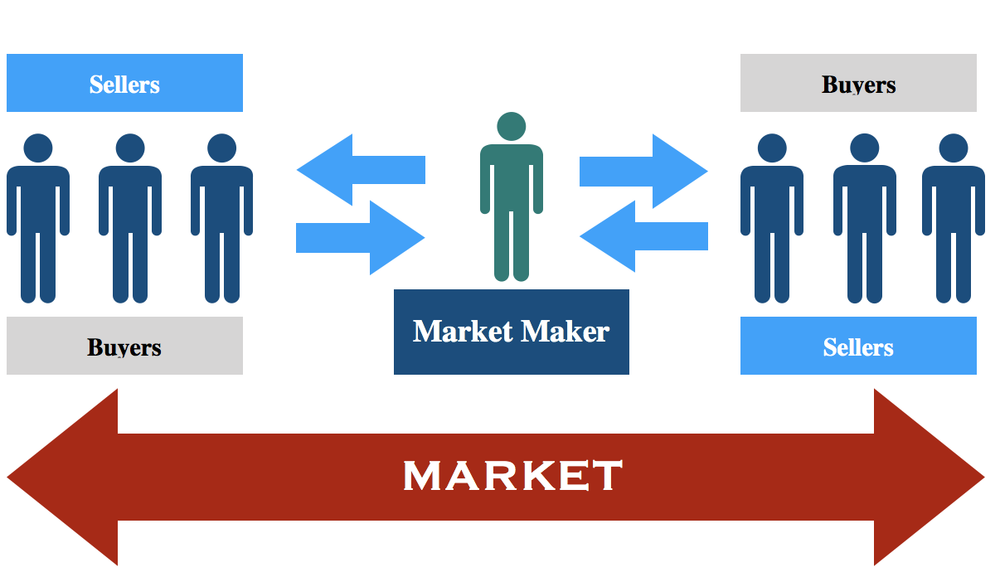

Market makers play a vital role in maintaining liquidity and ensuring stability within financial markets through their continuous provision of buy and sell quotes. This function is indispensable, especially with the widespread adoption of algorithmic trading, which requires a fluid and responsive market environment. Market makers operate across diverse financial markets, including stocks, options, and cryptocurrencies, where they are crucial in facilitating trade execution and stabilizing prices.

By understanding the operations of market makers, traders and investors can make better-informed decisions, gaining insight into factors that influence market mechanics. Market makers generate profits primarily through the bid-ask spread, which represents the difference between the prices they are willing to buy at and sell. Their role extends beyond profit-making; they are architects of market liquidity and contributors to price discovery processes.

Technology plays an integral role in market maker operations. Sophisticated algorithms and real-time data processing are pivotal in executing trades and managing risk. With market conditions changing rapidly, market makers employ advanced risk management strategies to maintain balanced inventories and mitigate potential losses. These strategies include hedging techniques designed to reduce exposure to market volatility.

Market makers face several challenges, such as navigating periods of high volatility and fulfilling regulatory compliance obligations. Market volatility can impact liquidity provision and widen bid-ask spreads, while regulatory compliance demands adherence to standards set by entities such as the SEC and FINRA. Despite these challenges, future trends indicate that technological advancements, particularly in artificial intelligence and machine learning, are poised to transform market making. These technologies promise to enhance trading speed, improve data processing volumes, and increase the accuracy of trading algorithms.

This article covers several primary concepts related to market making, including their business model, core strategies, essential tools, challenges, and regulatory obligations. Understanding these elements provides a comprehensive view of how market makers function and their impact on the financial market landscape.

## Table of Contents

## Understanding Market Makers and Their Role in Trading

Market makers serve as pivotal intermediaries within financial markets. Their primary function is to ensure that buy and sell orders can be executed promptly, thereby maintaining market liquidity and price stability, even during periods of volatility.

One of the critical roles of market makers is setting bid-ask spreads. The bid price is the maximum price a buyer is willing to pay, while the ask price is the minimum a seller is willing to accept. The difference between these two prices is known as the spread, which serves as a profit margin for market makers. By quoting both bid and ask prices, market makers facilitate continuous trading, effectively narrowing the spread and enhancing market depth.

The business model of a market maker hinges significantly on the bid-ask spread. This spread constitutes the primary revenue source, enabling market makers to profit from each transaction executed between the buy and sell sides. Additionally, market makers might also earn through trading fees for handling large volumes of trades and interest income on positions that are held overnight or longer.

Risk management is paramount in the operations of market makers. They employ various practices to balance their inventory and hedge against potential market movements. Inventory balancing involves adjusting positions to mitigate the risk of holding excessive securities that might depreciate. Hedging techniques, such as utilizing derivative instruments, allow market makers to protect themselves against adverse price changes, ensuring a more stable revenue stream regardless of market conditions.

Technology plays a crucial role in market maker operations, particularly in trade execution and risk assessment. Advanced [algorithmic trading](/wiki/algorithmic-trading) systems enable market makers to react swiftly to market changes, ensuring that they can maintain optimal bid-ask spreads and adjust them as necessary to manage risk effectively. These systems can process vast amounts of data at high speeds, facilitating real-time decision-making and the continuous adjustment of orders.

In summary, market makers are essential for providing [liquidity](/wiki/liquidity-risk-premium), narrowing bid-ask spreads, and stabilizing prices within financial markets. Their revenue stems from spreads, trading fees, and interest income, all managed through sophisticated risk management and technological tools that allow for efficient trade executions.

## Core Market Making Strategies

Market makers employ a diverse array of strategies to optimize their profitability and ensure efficient market operations, primarily through providing liquidity and stabilizing prices. One of the fundamental techniques involves the manipulation of bid-ask spreads, where profits are generated from the difference between purchase and selling prices. The size of these spreads is often influenced by market [volatility](/wiki/volatility-trading-strategies) and the level of competition among market participants. In periods of high volatility, spreads may widen to compensate for increased risk and potential price fluctuations. Conversely, in stable conditions, spreads tend to narrow as competition intensifies, driving market makers to offer more competitive prices.

Volume-based trading strategies are another cornerstone for market makers, designed to exploit large transaction quantities. By facilitating substantial trade volumes, market makers benefit from economies of scale, reducing per-unit transaction costs and enhancing profit margins. This approach not only aids in achieving profitability but also contributes significantly to market liquidity, as market makers are ready to buy or sell large amounts of securities, thus reducing transaction delays for other traders.

To mitigate risks inherent in [market making](/wiki/market-making), sophisticated risk control measures are employed, such as delta-neutral positioning and real-time monitoring. Delta-neutral strategies involve managing the portfolio to ensure that the overall delta — a measure of sensitivity to price changes in the underlying asset — is kept close to zero. This is typically achieved through dynamic hedging, wherein the market maker holds positions in both underlying assets and derivatives in such a way that gains in one position offset losses in another. Real-time monitoring systems are crucial as they allow market makers to continuously assess and adjust their positions to maintain delta neutrality and manage risk effectively.

Position limits and hedging strategies are integral to risk management within market making. Position limits involve setting maximum exposure levels to prevent significant losses from unexpected market movements, thereby ensuring that the market maker does not take on more risk than it can handle. Hedging strategies, including the use of options and other derivatives, play a pivotal role in protecting against adverse price movements and stabilizing returns.

Stress testing further complements these strategies by simulating extreme market conditions to evaluate the robustness of current risk management frameworks. Through stress tests, market makers can identify potential vulnerabilities and develop contingency plans to address them, ensuring resilience in the face of market shocks.

In summary, the strategic application of bid-ask spread manipulation, [volume](/wiki/volume-trading-strategy)-based trading, and comprehensive risk management techniques enables market makers to thrive in dynamic financial markets. These strategies not only generate profits but also contribute to maintaining market efficiency and liquidity.

## Essential Tools for Market Making

Market making requires the utilization of specialized tools and technologies that enhance efficiency and precision in trading activities. These tools are integral in enabling market makers to provide liquidity and manage risk effectively within financial markets.

Order book analysis tools are vital for monitoring market depth and prices. They allow market makers to evaluate the liquidity of a financial instrument by displaying the current buy and sell orders at different price levels. This analysis helps in identifying supply and demand conditions, enabling market makers to optimize their pricing strategies. A well-informed [order book](/wiki/order-book-trading-strategies) analysis ensures that market makers can adjust their positions rapidly in response to order flow and market events.

Risk management platforms are essential for real-time position tracking and inventory rebalancing. These platforms facilitate the management of exposures by allowing market makers to monitor their positions continuously and adjust them in accordance with market movements and predetermined risk limits. Effective inventory rebalancing techniques ensure that market makers maintain a balanced portfolio that minimizes risk while maximizing potential returns. By utilizing algorithms and automated systems, these platforms support decision-making processes for both strategic and tactical adjustments.

Key metrics tracked by market makers include bid-ask spreads, position sizes, and exposure levels. Bid-ask spreads are the difference between the prices quoted for an immediate buy and sell; they serve as a primary source of revenue. Monitoring position sizes is critical in assessing market exposure and ensuring compliance with regulatory requirements and internal risk limits. Exposure levels measure the degree of risk associated with particular positions, which requires constant assessment to prevent significant losses.

Performance monitoring tools play a crucial role by measuring profits and losses with second-by-second precision. Such tools provide an analytical view of trading performance, allowing market makers to evaluate strategy effectiveness and make necessary adjustments promptly. By capturing real-time data, these tools help in identifying profitable opportunities and recognizing patterns or anomalies that could indicate market changes.

In conclusion, the deployment of these essential tools and technologies equips market makers with the capabilities to assess market conditions, manage risks, and enhance their operational efficiency, ultimately contributing to their success in maintaining liquidity and stability in financial markets.

## Common Market Making Challenges

Market makers play a pivotal role in maintaining liquidity and stability, yet they confront a range of challenges that can significantly impact their operations. Key among these challenges are managing market volatility and inventory risk, both of which require sophisticated strategies and tools.

Market volatility presents a substantial challenge for market makers. Volatility can lead to irregular price movements, thereby impacting liquidity. To manage this, market makers employ dynamic price adjustment strategies and utilize circuit breakers during high-volatility periods. Circuit breakers temporarily halt trading when prices move beyond predefined thresholds, allowing time for markets to stabilize. This strategy is particularly effective in preventing panic-selling and reducing price swings, thereby maintaining orderly trading.

Inventory risk, another significant challenge, arises from holding asset positions that may fluctuate in value. To mitigate inventory risk, market makers regularly rebalance their portfolios to maintain a desired risk profile. They often use delta-neutral strategies to hedge against adverse price movements. A delta-neutral position ensures that the portfolio's value remains relatively stable regardless of market movements. This is achieved by balancing positive and negative deltas, which measure the sensitivity of an option's price to changes in the price of the underlying asset.

The formula for calculating delta is expressed as:

$$
\Delta = \frac{\partial V}{\partial S}
$$

where $\Delta$ represents the delta, $V$ is the option's price, and $S$ is the underlying asset's price. By keeping the cumulative delta close to zero, market makers can protect themselves from large directional movements in the market.

Concentration risk poses further challenges for market makers. This risk arises when a significant portion of the market maker's holdings or trading volume is concentrated in a few positions. Excessive concentration can result in substantial losses if there are adverse movements in specific assets. To mitigate this, market makers must employ real-time monitoring systems that track their exposure levels. Implementing strict position limits ensures that no single position can account for an outsized impact on the portfolio. 

In practice, modern technology facilitates real-time tracking of key metrics, allowing market makers to respond promptly to changing market conditions. Leveraging both automated and manual interventions, market makers can effectively navigate the complex landscape of financial markets, balancing risks while continuing to provide essential liquidity to market participants.

## Market Making Across Different Asset Classes

Market making varies significantly across different asset classes, such as stocks, exchange-traded funds (ETFs), and cryptocurrencies. Each asset class presents unique characteristics that influence the strategies and challenges faced by market makers.

In stock markets, market makers play a crucial role by continuously quoting bid and ask prices, thereby ensuring liquidity and facilitating orderly trading. They must manage inventory risk carefully, as they often hold significant positions. One key strategy in stock market making is maintaining tight bid-ask spreads to attract both buyers and sellers, thus increasing trading volume and potential profit opportunities through increased participation.

Exchange-traded funds (ETFs) require a more complex market-making approach due to their creation and redemption processes. [ETF](/wiki/etf-trading-strategies) market makers must possess a deep understanding of the underlying assets and the associated index. They are responsible for maintaining efficient pricing by arbitraging differences between the ETF price and its net asset value (NAV). This involves creating or redeeming ETF shares based on investor demand, which can be further complicated by changes in the liquidity of the constituent assets.

Cryptocurrency market making introduces additional challenges and strategies due to the volatility and unique structure of digital assets. Market makers frequently employ cross-exchange [arbitrage](/wiki/arbitrage), taking advantage of price discrepancies for the same asset across different exchanges. The rapid and fluctuating nature of transaction fees in cryptocurrencies also demands adaptive pricing models to ensure profitability amidst changing costs.

Key metrics used in market making include average spreads and settlement times. Average spreads provide insight into market efficiency and liquidity, with tighter spreads indicating a more competitive market environment. Settlement times vary significantly across asset types, with traditional stock markets typically adhering to T+2 settlement cycles, while cryptocurrencies may offer quick settlement times due to blockchain transparency.

Overall, effective market making across these diverse asset classes requires a combination of strategic pricing, risk management, and a profound understanding of the underlying assets to navigate the distinct challenges posed by each market.

## Regulatory Framework and Compliance

The regulatory framework governing market makers is crucial for ensuring fair and transparent financial markets. In the United States, the Securities and Exchange Commission (SEC) and the Financial Industry Regulatory Authority (FINRA) are the primary bodies overseeing market making activities. These organizations establish rules and guidelines that market makers must comply with, ensuring market integrity and investor protection.

Market makers are required to register with the SEC and obtain the necessary licenses to operate. This registration process involves stringent checks and confirmations to assess the firm's capability to fulfill its market making responsibilities. Market makers must also adhere to specific trading rules designed to govern their interactions within markets, such as adhering to bid-ask spread obligations and ensuring a minimum level of liquidity is always available.

Risk management standards are mandated to prevent practices that could harm market stability. Market makers must maintain detailed records of their trading activities and submit regular reports to regulatory bodies, ensuring transparency. These reporting obligations allow for continuous monitoring and analysis, which helps regulatory bodies manage systemic risks and preemptively address any potential issues.

Countering market manipulation is another significant aspect of the regulatory framework. Market makers must implement strategies to detect and prevent manipulative activities such as spoofing or wash trading. By maintaining strict compliance and surveillance systems, market makers contribute to a fair trading environment. The enforcement of strict penalties and sanctions on any violation of market conduct standards further aids in maintaining transparency within the financial system.

Through structured regulations and clear compliance mandates, the regulatory bodies aim to foster a balanced market environment where market makers can operate efficiently while safeguarding investor interests and market stability.

## Future Trends in Market Making

Technological advancements have significantly influenced the operational landscape of market making. One of the most impactful developments is the integration of algorithmic trading and [artificial intelligence](/wiki/ai-artificial-intelligence) (AI), which have transformed market making processes by enhancing efficiency and precision. Algorithms are used to automatically analyze market conditions, execute trades, and adjust positions, allowing market makers to provide liquidity more effectively.

AI and [machine learning](/wiki/machine-learning) (ML) enable market makers to process vast amounts of data swiftly, identifying patterns and anomalies that might affect trading strategies. These technologies contribute to more accurate market predictions and optimized decision-making. Quantum computing, though still in its nascent stages within financial markets, holds the potential to revolutionize market making. It offers unprecedented processing power, enabling the analysis of complex market conditions and the development of more sophisticated trading algorithms.

Technological impact on market making is measurable through metrics such as trading speed, data processing volume, and algorithmic accuracy. Trading speed, often articulated in microseconds, is crucial for maintaining competitive advantage. Enhanced trading speed enables market makers to respond almost instantaneously to market changes, thus optimizing liquidity provision. Data processing volume is another critical metric, reflecting the ability of systems to handle and analyze large datasets in real-time, contributing to more informed strategy developments. Algorithmic accuracy, meanwhile, ensures precision in execution and adjustment of trades, directly influencing profitability and market stability.

Future trends in market making include increased automation and efficiency improvements facilitated by technology. Automating repetitive tasks allows human traders to focus on strategy and oversight. Moreover, trading algorithms are continuously evolving, becoming smarter and more adaptable. This evolution supports robust risk management, minimizing exposure to market volatility. As AI and ML technology becomes more sophisticated, it is expected that market making will see further enhancements in adaptive algorithms capable of learning from yet more extensive datasets, contributing immensely to the dynamism and efficiency of financial markets.

Collectively, these advancements suggest a promising future for market making, with emerging technologies playing a pivotal role in shaping methods and outcomes. As market conditions and technologies continue to advance, the industry can anticipate increasingly refined operations, improved risk management, and consistent liquidity provision, thereby cementing technology's integral role in market making.

## Conclusion

Market makers are indispensable in ensuring liquidity and stability within financial markets. By continuously providing buy and sell quotes, they facilitate seamless trading, allowing transactions to occur smoothly and helping to prevent large price swings. This consistent activity underlines their pivotal role in maintaining market equilibrium, particularly in times of heightened volatility.

The successful integration of technology, risk management, and regulatory compliance forms the backbone of effective market making. Advanced technologies, such as high-frequency trading algorithms, enable market makers to process large volumes of trades with remarkable speed and precision. This technological advantage not only optimizes trade execution but also enhances the accuracy of pricing models. Risk management practices, such as real-time monitoring and sophisticated hedging strategies, allow market makers to maintain balanced inventories and mitigate potential losses. Additionally, adherence to regulatory frameworks ensures transparency and integrity, reinforcing trust in financial markets.

For traders and investors, a comprehensive understanding of market making is essential for informed decision-making. Knowledge of market maker operations, including how they manage inventory and set bid-ask spreads, can offer insights into market mechanics and potential impacts on asset prices. This understanding enables market participants to anticipate market movements and develop more effective trading strategies.

The landscape of market making is evolving rapidly, driven by advancements in artificial intelligence and machine learning. These technologies hold the potential to further enhance market making efficiency through improved predictive analytics and automated decision-making processes. As these technologies continue to advance, market makers will likely experience increased trading speeds and a greater capacity for data processing, leading to more refined trading strategies.

The future of market making appears promising, with AI and machine learning poised to drive further innovation and efficiency in the sector. As market mechanisms become increasingly automated and sophisticated, market makers will play an even more critical role in facilitating liquidity and stability, ensuring the continued smooth functioning of global financial markets.

## Frequently Asked Questions

### Frequently Asked Questions

**What roles do market makers play in financial markets?**  
Market makers serve as essential intermediaries providing liquidity by continuously quoting buy (bid) and sell (ask) prices. This activity ensures that traders can execute their orders promptly, thus enhancing market efficiency and reducing price volatility.

**How do market makers generate revenue?**  
Market makers earn profits primarily through the bid-ask spread—the difference between the buying and selling price of an asset. Additional revenue streams include trading fees charged for transactions and interest income from leveraging positions.

**What are the key tools used by market makers?**  
Market makers utilize sophisticated algorithms and tools for trade execution, risk assessment, and inventory management. These tools include order book analysis platforms and risk management systems that facilitate real-time tracking of market conditions and position sizes.

**What risks do market makers face, and how are these challenges managed?**  
Market makers encounter risks such as market volatility, inventory risk, and concentration risk. To manage these challenges, they employ strategies like delta-neutral positioning to offset directional risk, set strict position limits, and use circuit breakers to stabilize trading during high-volatility periods. Regular portfolio rebalancing also aids in maintaining optimal inventory levels.

**How do market makers adhere to regulatory compliance?**  
Market makers must comply with stringent regulations set by governing bodies like the SEC and FINRA. This includes registration and licensing, adherence to trading rules, and meeting mandated risk management standards. They are also obligated to ensure market transparency and integrity through robust reporting mechanisms.

**What is the future outlook for market making in financial markets?**  
Technological advancements such as AI, machine learning, and quantum computing are poised to transform market making by enhancing trading speed, accuracy, and data processing capabilities. Future trends indicate a shift towards increased automation and more sophisticated risk management practices, ultimately improving market efficiency and stability.

**How should one understand market makers' adaptations to different asset classes and their importance during market volatility?**  
Market makers tailor their strategies to accommodate the specific characteristics of different asset classes, such as stocks, ETFs, and cryptocurrencies. For instance, in stock markets, they might engage in ETF creation and redemption, whereas, in [cryptocurrency](/wiki/cryptocurrency) markets, they might focus on cross-exchange arbitrage. During periods of market volatility, their role becomes even more critical as they stabilize prices and maintain liquidity, ensuring smooth market operations.

## References & Further Reading

[1]: Easley, D., López de Prado, M. M., & O'Hara, M. (2012). ["The Volume Clock: Insights into the High-Frequency Paradigm."](https://papers.ssrn.com/sol3/papers.cfm?abstract_id=2034858) Review of Financial Studies.

[2]: Avellaneda, M., & Stoikov, S. (2008). ["High-frequency trading in a limit order book."](https://people.orie.cornell.edu/sfs33/LimitOrderBook.pdf) Quantitative Finance.

[3]: Harris, L. (2003). ["Trading and Exchanges: Market Microstructure for Practitioners."](https://academic.oup.com/book/52292) Oxford University Press.

[4]: Gomber, P., Arndt, B., Lutat, M., & Uhle, T. (2011). ["High-Frequency Trading."](https://papers.ssrn.com/sol3/papers.cfm?abstract_id=1858626) In Encyclopedia of Financial Globalization.

[5]: Mackintosh, P. J., & Cochrane, D. (2018). ["Machine Learning and AI in Financial Markets: A Guide to Contemporary Practice."](https://psycnet.apa.org/record/1997-38751-009) Risk Books.

[6]: Madigan, B. K. (2007). ["Market Microstructure: How Exchanges Work."](https://www.sciencedirect.com/science/article/pii/S1544612324011164) Wiley.

[7]: ["Advances in Financial Machine Learning"](https://www.amazon.com/Advances-Financial-Machine-Learning-Marcos/dp/1119482089) by Marcos Lopez de Prado.