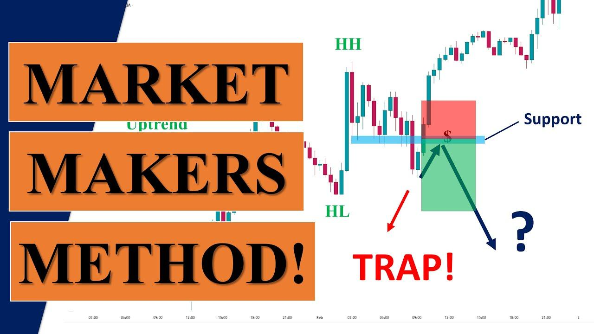

## Table of Contents

## What is market making and why is it important in financial markets?

Market making is when a person or a company, called a market maker, helps to buy and sell things in a market. They do this by always being ready to buy or sell certain items, like stocks or bonds, at a set price. This helps make sure that people who want to trade can do so easily and quickly. Market makers make money by selling things for a slightly higher price than they buy them.

Market making is important in financial markets because it helps keep the market working smoothly. Without market makers, it might be hard for people to find someone to trade with, and this could slow down or stop trading. By always being ready to trade, market makers help make sure that there is always someone to buy or sell, which makes the market more stable and easier to use for everyone.

## What are the basic principles of market making?

Market making is based on a few simple ideas. First, market makers always have to be ready to buy or sell. This means they need to keep a list of prices at which they are willing to trade. When someone wants to buy, the market maker sells to them, and when someone wants to sell, the market maker buys from them. This helps keep the market moving because there's always someone to trade with.

Second, market makers make money by buying low and selling high. They set two prices: a lower price at which they will buy, called the bid, and a higher price at which they will sell, called the ask. The difference between these two prices is called the spread, and it's how market makers earn their profit. They need to balance making the spread big enough to make money, but not so big that it scares people away from trading.

Lastly, market makers need to manage risk. Since they are always buying and selling, they can end up holding a lot of the item they are trading. If the price of that item goes down, they could lose money. To avoid this, market makers use different strategies to keep their risk low. They might trade in other markets or use special financial tools to protect themselves. This way, they can keep providing a stable market for others to trade in.

## How does a market maker profit from their activities?

A market maker makes money by buying things at a lower price and selling them at a higher price. This difference between the buying price and the selling price is called the spread. For example, if a market maker buys a stock for $10 and then sells it for $10.05, they make a profit of 5 cents on that trade. By doing this many times throughout the day, these small profits can add up to a big amount.

Market makers also have to be careful because they can lose money if the price of what they are trading goes down. To make sure they don't lose too much, they use different ways to manage their risk. They might trade in other markets or use special financial tools to protect themselves. By balancing the profits from the spread with managing their risk, market makers can keep making money while helping the market stay stable.

## What are the common market making strategies for beginners?

For beginners, one common [market making](/wiki/market-making) strategy is to focus on a small number of stocks or assets. By choosing a few items to trade, beginners can learn about these assets and understand how their prices move. They can then set their bid and ask prices carefully, making sure the spread is big enough to make money but small enough to attract traders. As they gain more experience, they can slowly add more stocks or assets to their list.

Another strategy is to use technology to help with trading. Many beginners use trading software that can automatically set and adjust bid and ask prices. This software can help them keep up with fast-changing markets and make sure they are always ready to buy or sell. It also helps them manage their risk by keeping track of how much of each asset they are holding and adjusting their prices to avoid big losses.

Lastly, beginners can learn from more experienced market makers. They can watch how others set their prices and handle different market situations. Joining online communities or forums where market makers share tips and strategies can be really helpful. By learning from others and slowly building their skills, beginners can become better at market making and make more money over time.

## What are the risks associated with market making and how can they be managed?

Market making comes with a few risks that beginners should know about. One big risk is that the price of the things you are trading can go down. If you are holding a lot of something and its price drops, you could lose money. Another risk is that the market can be very fast and hard to keep up with. If you can't set your prices quickly enough, you might miss out on trades or make bad trades. Lastly, there's the risk of not having enough money to keep trading. If you use up all your money buying things, you won't be able to keep making the market.

To manage these risks, market makers can use a few simple strategies. First, they can use special financial tools called hedges to protect themselves from big price drops. These tools can help limit how much money they might lose. Second, they can use technology to help them keep up with the fast market. Trading software can automatically set and adjust prices, making it easier to stay in the game. Finally, market makers need to be careful with their money. They should only use a small part of their money to buy things, so they always have enough to keep trading. By using these strategies, market makers can lower their risks and keep making money.

## How do market makers use technology and algorithms in their strategies?

Market makers use technology and algorithms to help them trade better and faster. They use special software that can set and change their buying and selling prices automatically. This helps them keep up with the fast-changing market and make sure they are always ready to buy or sell. The software can also help them keep track of how much of each thing they are holding, so they know when to adjust their prices to avoid big losses.

Algorithms are like smart math formulas that the software uses to make decisions. These algorithms can look at lots of information, like how prices are moving or how many people are trading, and then decide the best prices to buy and sell at. By using these algorithms, market makers can make better choices and make more money. They can also use the algorithms to manage their risks, like by setting up special tools to protect them from big price drops.

## What is the difference between traditional and electronic market making?

Traditional market making happens in person or over the phone. Market makers stand on the trading floor of a stock exchange, like the New York Stock Exchange, and they shout out prices to buy and sell stocks. They use hand signals and talk directly to other traders to make deals. This way of market making can be slow and it depends a lot on the market maker's experience and quick thinking. It's also harder to handle a lot of trades at the same time because everything is done manually.

Electronic market making, on the other hand, uses computers and the internet. Market makers use special software to set their buying and selling prices automatically. They can trade from anywhere in the world, not just on the trading floor. This makes trading much faster and easier because computers can handle a lot of trades quickly. Electronic market making also uses algorithms, which are smart math formulas, to help decide the best prices and manage risks. This way, market makers can make more trades and make more money, but they also need to understand how to use the technology well.

## How do market makers adapt their strategies to different market conditions?

Market makers change their strategies based on how the market is acting. If the market is calm and prices are not moving much, they might set a smaller difference between their buying and selling prices. This smaller difference, called the spread, can attract more people to trade with them. But if the market is wild and prices are jumping around a lot, market makers might make the spread bigger to protect themselves from losing money. They need to be careful because if the spread is too big, people might not want to trade with them.

When the market is really busy and there are a lot of trades happening, market makers use their computers and special math formulas to keep up. These tools help them quickly change their prices to match what is happening in the market. If the market is slow and not many people are trading, market makers might need to be more patient and wait for good chances to make trades. They also might use special financial tools to protect themselves from big price changes, no matter what the market is doing.

## What advanced techniques can be used to optimize market making strategies?

To make market making better, market makers can use something called [machine learning](/wiki/machine-learning). This is a type of smart computer program that can learn from past trades and figure out the best prices to buy and sell. By using machine learning, market makers can make their buying and selling prices even better and make more money. They can also use it to understand how the market is acting and change their strategies to fit different situations. This helps them stay ahead of other traders and keep making profits no matter what the market is doing.

Another way to improve market making is by using high-frequency trading. This means using very fast computers to make a lot of trades in a short time. High-frequency trading can help market makers take advantage of tiny changes in prices and make small profits on each trade. These small profits can add up to a lot of money if they do it many times. But it's important for market makers to have good technology and be ready to handle the risks that come with trading so fast. By using these advanced techniques, market makers can make their strategies better and keep making money in different market conditions.

## How do regulatory environments affect market making strategies?

Regulatory environments can change how market makers do their job. Rules set by governments and financial groups can tell market makers what they can and can't do. For example, some rules might say how big the difference between buying and selling prices can be. Other rules might make market makers show their prices to everyone. These rules can make it harder for market makers to make money, so they have to change their strategies to follow the rules and still make a profit.

Market makers also have to think about how rules can affect the risks they take. Some rules might make them hold onto more of what they are trading, which can be risky if prices go down. Other rules might make them use special tools to protect themselves from big losses. By understanding the rules and changing their strategies, market makers can keep trading safely and make money even when the rules change.

## What are some case studies of successful market making strategies?

One famous case of successful market making is Citadel Securities. They use smart computer programs and a lot of data to set their buying and selling prices. Citadel Securities trades a lot of stocks and other things, and they make a lot of money by making the difference between their buying and selling prices just right. They also use special tools to protect themselves from big losses, which helps them keep making money even when the market is wild. By being good at using technology and understanding the market, Citadel Securities has become one of the biggest and most successful market makers.

Another good example is Jane Street. They are known for using a type of smart computer program called machine learning to make their trading better. Jane Street trades a lot of different things, like stocks and bonds, and they use their computer programs to figure out the best prices to buy and sell. They also trade very fast, which helps them make small profits on a lot of trades. By being quick and smart with their technology, Jane Street has been able to make a lot of money and be successful in the market making business.

## What future trends are expected to influence market making strategies?

In the future, market making strategies will be influenced a lot by new technology. One big trend is the use of [artificial intelligence](/wiki/ai-artificial-intelligence) (AI) and machine learning. These smart computer programs can learn from past trades and make better decisions about buying and selling prices. They can also help market makers understand how the market is acting and change their strategies to fit different situations. By using AI and machine learning, market makers can make more money and stay ahead of other traders.

Another trend that will affect market making is the growth of electronic trading. More and more trades are happening online, and this makes the market faster and more connected. Market makers will need to use fast computers and special software to keep up with the quick changes in the market. They will also need to be good at managing risks because the fast market can be risky. By using the right technology and being careful, market makers can keep making money even as the market changes.

## References & Further Reading

[1]: Avellaneda, M., & Stoikov, S. (2008). ["High-frequency trading in a limit order book."](https://people.orie.cornell.edu/sfs33/LimitOrderBook.pdf) Quantitative Finance.

[2]: Narang, R. K. (2013). ["Inside the Black Box: A Simple Guide to Quantitative and High-Frequency Trading."](https://onlinelibrary.wiley.com/doi/book/10.1002/9781118662717) Wiley.

[3]: Cartea, Á., Jaimungal, S., & Penalva, J. (2015). ["Algorithmic and High-Frequency Trading."](https://assets.cambridge.org/97811070/91146/frontmatter/9781107091146_frontmatter.pdf) Cambridge University Press.

[4]: Lopez de Prado, M. (2018). ["Advances in Financial Machine Learning."](https://www.amazon.com/Advances-Financial-Machine-Learning-Marcos/dp/1119482089) Wiley.

[5]: Hasbrouck, J. (2007). ["Empirical Market Microstructure: The Institutions, Economics, and Econometrics of Securities Trading."](https://academic.oup.com/book/52241) Oxford University Press.