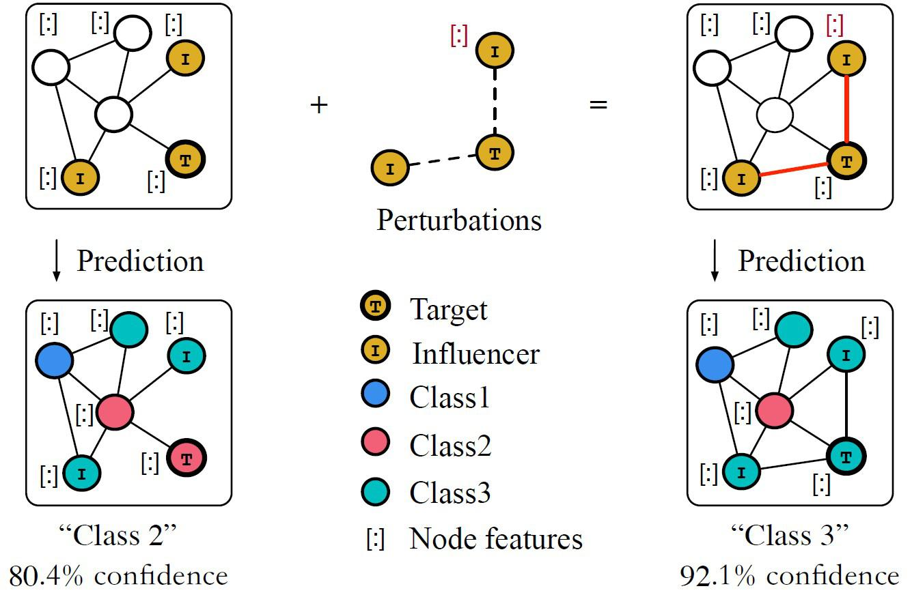

Market-making is a fundamental component of financial markets, serving as a mechanism to enhance liquidity and facilitate the smooth functioning of trade. Market-makers operate by providing continuous bid and ask prices for financial instruments, thus enabling buyers and sellers to execute trades at nearly any given moment. By offering to buy and sell securities, market-makers assume the risk of holding assets and in return, earn profits from the bid-ask spread. This liquidity provision is crucial as it reduces trading costs and aids in the price discovery process, ensuring market efficiency.

Algorithmic trading represents a transformative advancement in the execution of market-making strategies. It involves the use of computer algorithms to automatically make trading decisions, submit orders, and manage those orders after submission. The integration of algorithmic trading in market-making allows for rapid execution, precise calibration of trading strategies, and the incorporation of complex models that can analyze vast amounts of market data in real-time. Such technological advancement has led to increased efficiency in market-making operations and has been instrumental in handling the high-frequency demands of modern financial markets.



Adversarial learning, a concept borrowed from machine learning, especially from the domain of adversarial models, and reinforcement learning, offers innovative approaches to developing robust market-making strategies. This involves training models in a competitive framework where adversaries, often modeled as competing algorithms or artificial agents, attempt to outsmart each other. This constant challenge environment cultivates strategies that can adapt to unpredictable market movements and counteract manipulative trading practices or unforeseen market events.

This article aims to elucidate the intersection of traditional market-making with these cutting-edge concepts in finance and technology. Readers will gain insights into the fundamental principles of market-making, explore how algorithmic trading has revolutionized this field, and learn how adversarial learning within reinforcement learning frameworks can innovate market-making strategies.

## Table of Contents

## Understanding Market-Making

Market-making is a crucial function in financial markets, serving as a facilitator of liquidity and price stability. A market-maker is typically a financial intermediary that stands ready to buy and sell a particular financial instrument on a regular and continuous basis at publicly quoted prices. By providing this service, market-makers reduce transaction costs and ensure that investors can execute their trades easily, thus enhancing market efficiency.

Market-makers operate by maintaining an inventory of the financial instruments in which they make markets. Their primary objective is to profit from the bid-ask spread, which is the difference between the price at which they are willing to buy (bid) and the price at which they are willing to sell (ask). This spread serves as compensation for the risks they bear, including holding inventory and dealing with potentially volatile price movements. Market-makers employ various strategies to manage their inventory and risks, such as hedging and adjusting quoted prices based on current market conditions.

Despite the benefits they provide, traditional market-makers face several challenges in their operations. One major issue is adverse selection, where traders with superior information about market conditions may exploit market-makers by transacting with them at unfavorable prices. To mitigate this risk, market-makers need to continuously update their pricing models and strategies, often relying on indicators of trading [volume](/wiki/volume-trading-strategy), [volatility](/wiki/volatility-trading-strategies), and other market signals.

Furthermore, traditional market-making is resource-intensive, requiring substantial capital to maintain inventory and sophisticated technology to manage trades effectively. Additionally, in fast-moving markets, changes in market sentiment or sudden economic events can lead to rapid price fluctuations, posing further risks to market-makers who must quickly adapt to maintain their spreads and manage inventory.

In recent years, with the advent of sophisticated technologies, market-making has increasingly become automated, allowing for greater speed and efficiency in trade execution. Regardless of technological advancements, the fundamental role of market-making as a provider of [liquidity](/wiki/liquidity-risk-premium) and market stability remains indispensable in ensuring the smooth functioning of financial markets.

## Algorithmic Trading in Market-Making

Algorithmic trading, a cornerstone of modern financial markets, utilizes complex algorithms to automate trading decisions with minimal human intervention. In the specific context of market-making, [algorithmic trading](/wiki/algorithmic-trading) offers numerous benefits such as increased efficiency, reduced transaction costs, and enhanced liquidity. By deploying sophisticated algorithms, market-makers can manage large volumes of trades quickly, maintaining market stability and providing liquidity even in volatile conditions.

Algorithmic market-making strategies typically rely on advanced statistical models and computational techniques. Some prevalent strategies include:

1. **Primary Market-Making**: This involves placing simultaneous buy and sell orders at slightly differing prices to profit from the price spread. Algorithms continuously adjust these orders based on market conditions to minimize risk and maximize returns.

2. **Arbitrage**: Algorithms detect price discrepancies across different trading venues or financial instruments and execute trades to exploit these inefficiencies. High-frequency trading systems often implement arbitrage strategies to capitalize on fleeting opportunities.

3. **Statistical Arbitrage**: This strategy employs statistical models to identify price relationships between assets, predicting mean reversions or divergences. Algorithms monitor these relationships, executing trades when deviations from historical norms are detected.

4. **Mean Reversion**: Mean reversion strategies assume that asset prices will return to their historical mean over time. Algorithms are designed to identify and capitalize on short-term deviations from the mean, buying when prices are below average and selling when above.

5. **Momentum Trading**: Conversely to mean reversion, momentum trading strategies focus on assets demonstrating upward or downward trends. Algorithms identify momentum in an asset's price movement and align trades to capitalize on the continuation of these trends.

Successful implementations demonstrate the effectiveness of algorithmic trading in market-making. High-frequency trading firms, such as Virtu Financial and Jump Trading, exemplify successful practitioners. These firms apply algorithmic strategies to efficiently provide liquidity, profiting from bid-ask spreads across diverse markets.

Algorithmic market-makers also leverage [machine learning](/wiki/machine-learning) to enhance decision-making. By incorporating predictive models that consider current and historical market data, algorithms can dynamically adjust to evolving market conditions. Machine learning techniques help optimize trade execution, mitigate risk, and improve overall trading performance.

Through the integration of advanced algorithmic strategies, market-makers enhance their ability to provide liquidity, ensure tighter spreads, and offer competitive pricing. These developments contribute to improved market quality and stability, delivering benefits not only to market participants but to the financial system as a whole.

## Adversarial Reinforcement Learning

Reinforcement learning (RL) is a type of machine learning where an agent learns to make decisions by interacting with an environment. The agent aims to maximize cumulative rewards by selecting appropriate actions based on observations from the environment. The basic principles of [reinforcement learning](/wiki/reinforcement-learning) involve states, actions, rewards, and policies. The environment is typically modeled as a Markov Decision Process (MDP) characterized by a set of states $S$, a set of available actions $A$, a reward function $R(s, a)$, and a state transition probability $P(s'|s, a)$.

An RL agent follows a policy $\pi(s)$ that maps states to actions and seeks to maximize the total expected reward, calculated as the sum of discounted future rewards, represented by the return $G_t = \sum_{k=0}^{\infty} \gamma^k R_{t+k+1}$, where $\gamma$ is the discount [factor](/wiki/factor-investing) between 0 and 1. The RL process is inherently exploratory as the agent needs to explore different actions to realize which actions yield the highest rewards.

Adversarial reinforcement learning is a variant where an adversary is introduced to challenge the agent, thereby creating a more robust and generalized learning environment. Unlike traditional reinforcement learning, where the agent and environment operate in a potentially static framework, adversarial reinforcement learning introduces dynamic and evolving challenges. The adversary's role can include modifying the environment or reward signals to test the agent's adaptability.

The fundamental difference between traditional and adversarial reinforcement learning lies in the adversary's presence, which actively learns to create scenarios that test the agent's weaknesses. Instead of a singular focus on maximizing rewards, adversarial reinforcement learning emphasizes resilience and adaptability under uncertainty and variability presented by potential adversarial conditions.

A notable application of adversarial reinforcement learning in market-making involves developing strategies that are more resilient to market shocks and adversarial behaviors. Market-making strategies must not only be efficient under normal conditions but also robust against market adversities. By employing adversarial learning, [agents](/wiki/agents) can simulate a wide range of challenging scenarios that might be encountered in live trading, such as sudden price swings or liquidity droughts. This simulation helps the agent to derive more robust strategies that are less vulnerable to exploitation and adverse market dynamics.

For instance, an adversary could simulate sudden volatility spikes or revert trading patterns to evaluate whether the market-making strategy maintains profitability or fails under pressure. Through this iterative process, market-making strategies can evolve to anticipate and counteract strategically disruptive behaviors.

In practice, adversarial reinforcement learning in market-making can be implemented using neural networks where both the agent and adversary networks learn in tandem. The learning objective shifts from merely profit maximization to ensuring that these strategies are less susceptible to adverse conditions, thereby ensuring consistent performance over a wide range of market scenarios. Such approaches could involve training GAN-like structures or using actor-critic methods with adversarial components.

In conclusion, adversarial reinforcement learning offers financial markets a powerful tool to develop more sophisticated market-making algorithms capable of handling adversities effectively. As markets become increasingly complex and dynamic, such advanced methodologies help traders design systems that are not only optimal but also robust, ensuring more stable financial systems.

## Implementation of Adversarial Learning in Market-Making

The implementation of adversarial learning in market-making involves creating sophisticated models where a reinforcement learning agent learns optimal trading strategies in the presence of adversarial conditions. Adversarial learning enhances the robustness of trading algorithms by simulating realistic and challenging market scenarios. 

In practice, adversarial reinforcement learning in market-making typically involves two agents: the market-making agent and the adversarial agent. The market-making agent aims to maximize its profit by quoting bid and ask prices, maintaining liquidity, and minimizing inventory risk. The adversarial agent, on the other hand, attempts to exploit weaknesses in the market-making strategy, thereby forcing the market-making agent to adapt and improve.

A successful implementation starts with defining the market environment. This environment is usually represented as a Markov Decision Process (MDP), characterized by states, actions, and rewards. The state may include factors such as the current market price, the spread between bid and ask prices, and the inventory held by the market maker. The actions involve setting the bid and ask prices, and the reward function typically combines profit and risk measures.

The adversarial agent strategically disrupts the market-making process, either by attempting to predict and counteract trades or by creating artificial volatility within the market states. This approach forces the market-making agent to refine its pricing strategies to remain effective under varying conditions.

Case studies have demonstrated the effectiveness of adversarial learning in market-making. For instance, researchers implemented adversarial learning frameworks where the adversarial agent mimicked unpredictable market conditions, such as rapid price fluctuations or sudden liquidity shifts. The results showed that the market-making agent, trained in such adversarial environments, exhibited improved resilience and adaptability to real-world scenarios compared to agents that were not exposed to adversarial conditions.

To evaluate the performance of adversarial learning in market-making strategies, several metrics are considered:

1. **Profitability**: Evaluating the cumulative returns generated by the market-making agent. It measures the ability of the strategy to generate profits over time.

2. **Risk Management**: This involves assessing metrics such as the Sharpe ratio, which balances returns against risk, and the maximum drawdown, which measures the largest loss from a peak value.

3. **Liquidity Provision**: Measuring the average spread and the volume of trades executed, indicating the agent's effectiveness in maintaining market liquidity.

4. **Robustness to Adversarial Attacks**: Analyzing the market-maker's performance under the adversary's most challenging scenarios, evaluating how well the strategy adapts to different market conditions.

Implementation in Python can be structured using reinforcement learning libraries such as TensorFlow or PyTorch. Below is a simplified example of a setup for adversarial learning using a reinforcement learning algorithm:

```python
import numpy as np
import tensorflow as tf
from tensorflow.keras import layers

# Environment setup
class MarketEnv:
    def __init__(self):
        # Define state space, action space, etc.
        pass

    def reset(self):
        # Reset the environment
        pass

    def step(self, action):
        # Execute an action, return new state, reward, done
        pass

# Market-making agent
class MarketMakerAgent:
    def __init__(self):
        # Define model architecture
        pass

    def choose_action(self, state):
        # Choose the best action based on current state
        pass

# Adversarial agent
class AdversarialAgent:
    def __init__(self):
        # Define adversarial strategy
        pass

    def disrupt(self, env):
        # Generate adversarial conditions
        pass

# Training loop
def train_agents():
    env = MarketEnv()
    market_maker = MarketMakerAgent()
    adversary = AdversarialAgent()

    for episode in range(1000):
        state = env.reset()
        done = False
        while not done:
            action = market_maker.choose_action(state)
            adversary.disrupt(env)
            next_state, reward, done = env.step(action)
            # Update market maker strategy based on reward
            state = next_state

if __name__ == "__main__":
    train_agents()
```

This framework can be expanded by customizing the adversarial strategies, utilizing complex reward structures, and integrating real-world data for heightened realism. Through continuous interaction, both agents evolve, resulting in more robust and effective market-making strategies.

## Benefits and Challenges

Adversarial learning in market-making offers several notable benefits. One significant advantage is its ability to enhance the robustness of trading strategies. Through constant interaction with adversaries—models designed to challenge and expose weaknesses—market-making algorithms refine their decision-making processes, thereby improving their adaptability to unpredictable market conditions. This process enables the identification and rectification of strategic vulnerabilities, ultimately leading to more stable trading algorithms.

Another benefit is the improved efficiency in liquidity provision. Adversarial learning helps optimize the bid-ask spread by continuously training the market-making models to minimize transaction costs and maximize profit margins. The adaptive nature of adversarial learning allows algorithms to quickly respond to market changes, thereby improving the overall liquidity and smooth functioning of financial markets.

Despite these benefits, adversarial learning in market-making also presents several challenges. A key concern is the complexity involved in training adversarial models. The process requires significant computational resources and expertise in machine learning, which can pose barriers to entry for smaller market participants. Additionally, the presence of adversarial agents can introduce unpredictability in the learning process, potentially leading to suboptimal trading strategies if not properly managed.

Another challenge is the risk of overfitting, as adversarial learning models might become too specialized in countering specific adversaries, thus reducing their generalization capabilities in real-world scenarios. This can result in strategies that perform well in simulated environments but fail when exposed to diverse market conditions.

Comparing traditional market-making strategies to those based on adversarial learning, the latter offers enhanced flexibility and adaptability. Traditional strategies often rely on static rules and historical data, which may be less effective in rapidly changing markets. In contrast, adversarial learning facilitates a dynamic approach, allowing models to continuously evolve through exposure to strategic challenges, leading to more resilient and responsive market-making algorithms.

Nevertheless, implementing adversarial learning-based strategies requires careful consideration of potential drawbacks and risks. Key to successful adoption is the ongoing evaluation of strategy performance using robust metrics that consider both profitability and stability. By balancing these considerations, market makers can harness the potential of adversarial learning to achieve competitive advantages in financial markets.

## Conclusion

In summary, the article has explored various facets of market-making with a particular focus on the innovative application of adversarial learning in reinforcing market-making strategies. Market-making, a fundamental component of financial markets, ensures liquidity and efficient price discovery by continuously quoting buy and sell prices. The advent of algorithmic trading has revolutionized market-making by enabling more efficient and sophisticated trading strategies.

Adversarial reinforcement learning, by introducing competitive environments and adaptive agents, presents an opportunity to refine market-making strategies further. This approach allows for the development of robust strategies capable of adapting to dynamic market conditions and potentially unforeseen events, enhancing both the stability and reliability of financial markets. Implementing these strategies involves extensive computational resources and sophisticated evaluation metrics to assess performance and manage risk.

Looking to the future, adversarial learning holds substantial promise for the development of more effective market-making strategies that can dynamically adjust to market challenges. The integration of such technologies in financial systems may contribute to more resilient markets. However, these advancements also introduce complexities regarding algorithmic transparency and market fairness, which need careful consideration by market participants and regulators.

For traders and financial markets, the implications of adversarial learning are profound. Traders equipped with these advanced strategies may gain a significant competitive edge, while markets in general may benefit from improved liquidity and efficiency. Nonetheless, as the complexity of these algorithms increases, so does the need for stringent oversight mechanisms to ensure fair and stable markets. As the technology continues to evolve, its successful integration into current financial systems will depend on ongoing research, collaboration among stakeholders, and the establishment of regulatory frameworks that can accommodate these advancements.

## References & Further Reading

[1]: Biais, B., Foucault, T., & Moinas, S. (2015). ["Equilibrium High-Frequency Trading"](https://www.sciencedirect.com/science/article/abs/pii/S0304405X15000288). The Review of Economic Studies, 82(2), 973-1013.

[2]: Cartea, Á., Jaimungal, S., & Penalva, J. (2015). ["Algorithmic and High-Frequency Trading."](https://assets.cambridge.org/97811070/91146/frontmatter/9781107091146_frontmatter.pdf) Cambridge University Press.

[3]: Gomber, P., Arndt, B., Lutat, M., & Uhle, T. (2011). ["High-Frequency Trading."](https://papers.ssrn.com/sol3/papers.cfm?abstract_id=1858626) Business & Information Systems Engineering, 3(2), 123-126.

[4]: Goodfellow, I., Pouget-Abadie, J., Mirza, M., Xu, B., Warde-Farley, D., Ozair, S., ... & Bengio, Y. (2014). ["Generative Adversarial Nets."](https://arxiv.org/abs/1406.2661) Advances in Neural Information Processing Systems.

[5]: Lopez de Prado, M. (2018). ["Advances in Financial Machine Learning."](https://www.amazon.com/Advances-Financial-Machine-Learning-Marcos/dp/1119482089) Wiley.

[6]: Mnih, V., Kavukcuoglu, K., Silver, D., Rusu, A. A., Veness, J., Bellemare, M. G., ... & Hassabis, D. (2015). ["Human-level control through deep reinforcement learning."](https://www.nature.com/articles/nature14236) Nature, 518(7540), 529-533.

[7]: Huang, W., Liu, Q., Geman, H., & Wang, Y. (2019). ["Market making in continuous time: Its strategy and risk."](https://pubmed.ncbi.nlm.nih.gov/30886092/) Journal of Financial Markets, 43, 29-49.